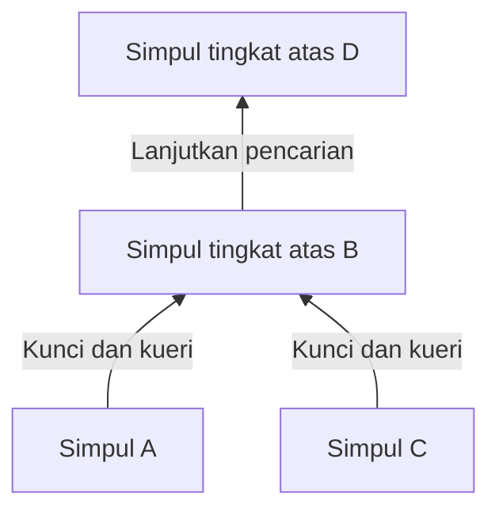
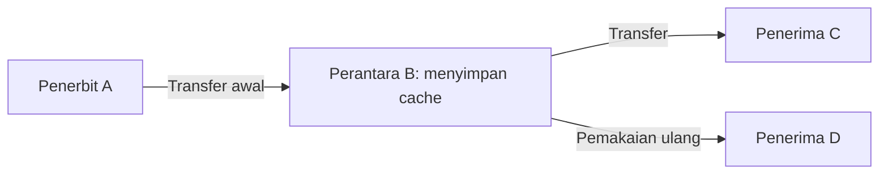

## 1. Masalah yang ingin dipecahkan Winny

Kita ingin membagikan berkas besar kepada banyak orang, tetapi pengirim awal memiliki kapasitas unggah terbatas. Kita juga ingin menghindari server pencarian pusat dan membuat penerbit pertama sulit dikenali. Menyatukan ketiga tujuan itulah yang membuat Winny menarik secara teknis.

Winny adalah program berbagi berkas P2P buatan Isamu Kaneko. Versi uji pertamanya dirilis pada 6 Mei 2002. Dalam **peer-to-peer**, komputer peserta menyediakan data sekaligus menerimanya. Setiap peserta disebut peer atau simpul. [Putusan Mahkamah Agung Jepang, terjemahan Inggris di WIPO Lex][court]

P2P saja tidak menentukan cara pencarian atau tingkat anonimitas. Kita perlu memisahkan **menemukan simpul, mencari berkas, dan memindahkan isinya**. Diagram dan angka berikut adalah model konseptual, bukan rekaman komunikasi suatu versi tertentu.

## 2. Tanpa server pusat, tetapi tetap perlu titik awal

Dalam distribusi web biasa, pengguna menghubungi server yang ditentukan. CDN dapat menyebarkan pengiriman; di sini kita memakai satu sumber sebagai pembanding sederhana. Dalam P2P, penerima dapat menjadi penyedia berikutnya.

Winny tidak membutuhkan server pencarian pusat yang menampung seluruh katalog. Namun, simpul baru tetap harus mengetahui alamat awal untuk dihubungi. Informasi simpul awal memungkinkan terbentuknya koneksi pertama. Tanpa katalog pusat bukan berarti tanpa informasi awal atau infrastruktur Internet. [Materi teknis JPNIC][jpnic]

Koneksi logis ini membentuk **jaringan overlay**, seperti rute bus di atas jaringan jalan. Setiap simpul bertukar informasi dengan sebagian tetangga, bukan terhubung langsung ke seluruh peserta.

Jalur alternatif dapat menjaga komunikasi saat tetangga keluar. Namun, peserta yang sering masuk dan keluar membuat informasi koneksi kedaluwarsa. Desentralisasi tidak menjamin semua berkas ditemukan atau semua gangguan dapat diatasi.

## 3. Pisahkan entri kecil dari berkas besar

Perpustakaan tidak membawa semua buku untuk setiap pencarian. Kita memeriksa katalog, lalu meminta buku yang diinginkan. Winny juga memisahkan metadata pencarian dari isi berkas.

| Unsur | Fungsi | Perbedaan penting |
|---|---|---|
| Kunci | Informasi katalog: nama, ukuran, hash, alamat pengambilan | Bukan kunci dekripsi dalam konteks ini |
| Isi/cache | Menyimpan dan mengirim isi berkas terenkripsi | Pemilik cache belum tentu penerbit awal |
| Hash | Membantu mengenali dan membandingkan berkas | Bukan tanda tangan yang membuktikan pembuat atau keamanan |

Laporan ceramah Kaneko menjelaskan pemisahan ini dan penyimpanan isi di simpul perantara. [Laporan GLOCOM][glocom]

Dua berkas bernama `lecture.zip` belum tentu sama isinya. Pengenal yang terkait dengan isi membantu membedakannya, tetapi berkas berbahaya juga memiliki hash. Cocok dengan katalog berbeda dari aman untuk dijalankan.

## 4. Hierarki dan pengelompokan memusatkan pencarian

Bertanya kepada semua orang setiap saat akan menambah lalu lintas seiring pertumbuhan jaringan. Winny membangun hierarki berdasarkan kecepatan koneksi: kunci dan pencarian terutama mengarah ke tingkat atas. **Pengelompokan berdasarkan minat** menghubungkan simpul dengan kata kunci serupa agar pencarian lebih efisien. [JPNIC][jpnic]

Ini hanya skema arah. Tingkat atas bukan arah utara atau server tetap milik suatu perusahaan. Koneksi cepat tetap terbatas, dan pekerjaan yang terkumpul di atas dapat menimbulkan beban.

Pengelompokan dapat dibayangkan sebagai upaya mempermudah pencarian informasi musik di dekat peserta yang tertarik pada musik. Kemiripan kata kunci bukan penilaian AI atas kebenaran atau mutu isi.

**Menggambarkan Winny sebagai DHT yang meneruskan permintaan ke simpul dengan hash terdekat itu menyesatkan.** Tabel hash terdistribusi membagi tanggung jawab atas ruang kunci kepada simpul; itu rancangan yang berbeda. Penggunaan hash untuk mengenali berkas tidak otomatis menjadikan jaringan sebuah DHT. Identitas katalog dan jalur pencariannya harus dibedakan.

## 5. Perantara dan cache menambah penyedia

Setelah menemukan kandidat, isi berkas perlu diambil. Jalur metadata tidak harus sama dengan jalur data. Winny memiliki mekanisme ketika simpul mengubah alamat pengambilan pada kunci, menerima permintaan, mengambil data dari sumber sebelumnya, lalu meneruskan dan menyimpannya. Cache dapat melayani permintaan berikutnya. [JPNIC][jpnic]

D memakai salinan B, bukan menerima langsung dari A. Beban A berkurang, dan pengirim langsung ke D berbeda dari penerbit awal. Ini tidak berarti semua unduhan melewati jumlah perantara yang sama.

### Mengirim 100 MB kepada 100 orang

Misalkan ukuran berkas $F$ dan jumlah penerima $n$. Jika satu sumber mengirim salinan lengkap kepada setiap orang, volume unggahnya adalah:

$$
V_0 = nF
$$

Untuk $F=100\,\mathrm{MB}$ dan $n=100$, hasilnya 10.000 MB. Bandingkan dengan kondisi ideal ketika sumber mengirim satu salinan dan pemilik cache melakukan 99 pengiriman lainnya.

| Asumsi distribusi | Unggahan sumber | Unggahan peserta lain |
|---|---:|---:|
| Sumber langsung mengirim kepada semua 100 penerima | 10.000 MB | 0 MB |
| Satu salinan awal, lalu 99 distribusi ulang | 100 MB | 9.900 MB |

**Yang hilang adalah pemusatan beban pada sumber, bukan lalu lintas untuk memberi setiap orang salinan.** Perantara, pengiriman ulang, dan pencarian dapat menambah lalu lintas total. Ini bukan hasil pengukuran Winny atau janji kecepatan seratus kali lipat.

Jika $u_i$ adalah laju unggah masing-masing dari $k$ penyedia dan $d$ kapasitas unduh penerima, dengan asumsi pengambilan paralel batas konseptual laju efektif $r$ adalah:

$$
r \leq \min\left(d,\sum_{i=1}^{k}u_i\right)
$$

Kemacetan, kecepatan penyimpanan, dan data yang dimiliki tiap penyedia juga berpengaruh. Sepuluh penyedia yang berbagi satu koneksi lambat tidak melipatgandakan kecepatannya sepuluh kali. Berkas populer bisa mendapat banyak salinan; berkas langka dapat hilang dari jangkauan saat satu-satunya pemilik terputus.

## 6. Enkripsi bukan berarti tidak terlihat

Winny menggabungkan enkripsi, perantara, dan cache untuk menyamarkan penerbit. Empat sifat berikut perlu dipisahkan.

| Sifat | Pertanyaan | Pertimbangan lain |
|---|---|---|
| Kerahasiaan | Bisakah pengamat membaca isi? | Algoritme, implementasi, pengelolaan kunci |
| Anonimitas | Bisakah kegiatan dikaitkan dengan seseorang? | Tetangga, waktu, volume lalu lintas |
| Keaslian | Apakah data berasal dari pembuat yang disebutkan? | Tanda tangan atau sumber tepercaya |
| Keamanan perangkat | Bisakah membuka berkas merusak komputer? | Izin eksekusi dan pertahanan terhadap malware |

Komunikasi IP langsung memerlukan alamat tujuan. Enkripsi tidak menghapus keberadaan koneksi atau seluruh informasi titik ujungnya. Melihat unggahan cache tidak cukup untuk menetapkan penerbit awal, tetapi pengamatan pada beberapa tempat dan waktu dapat digabungkan.

Klaim anonimitas memerlukan model ancaman: siapa bisa melihat apa? Mengamati satu tetangga berbeda dari memantau banyak koneksi. Karena itu, “sepenuhnya anonim” atau “secara prinsip mustahil dilacak” tidak tepat.

## 7. Kebocoran: pisahkan pembobolan dan distribusi ulang

Kebocoran terkait Winny dapat dipahami dalam dua tahap: malware atau sebab lain membuka data pribadi komputer, kemudian jaringan menyalinnya. IPA meneliti penanganan insiden nyata. [Laporan IPA][ipa]

Rangkaian penjelasan yang umum adalah **menjalankan berkas mencurigakan → malware mengumpulkan dan menerbitkan informasi → simpul lain mengambilnya → cache menyebarkannya lagi**. Menjalankan Winny tidak berarti seluruh disk pasti dipublikasikan. Perilaku malware dan distribusi P2P perlu dibedakan.

Menghapus berkas asal belum tentu menghapus salinan di komputer lain. Bila malware membaca data yang belum terenkripsi di perangkat terinfeksi, tidak perlu memecahkan enkripsi. Enkripsi jalur komunikasi saja tidak menutup celah tersebut.

Data apa yang dibagikan? Bisakah pengguna memeriksanya? Seberapa jauh dampak pembobolan? Bisakah publikasi tak sengaja ditarik? Kemudahan penggunaan dan kendali sama pentingnya dengan efisiensi.

## 8. Pisahkan sejarah dan putusan dari penilaian teknis

| Waktu | Peristiwa |
|---|---|
| Mei 2002 | Versi uji pertama dirilis |
| Mei 2003 | Versi uji Winny 2, dengan tujuan membangun forum P2P |
| 2004 | Kaneko ditangkap atas dugaan membantu pelanggaran hak cipta |
| 19 Desember 2011 | Mahkamah Agung menolak upaya hukum penuntut, sehingga putusan bebas menjadi final |

Forum Winny 2 adalah aplikasi di atas distribusi data. Pengelompokan pencarian bukan forum itu sendiri. Distribusi tidak menjamin keaslian kiriman, keberlangsungan selamanya, atau ketahanan terhadap semua penghapusan. [GLOCOM][glocom]

Perkara tersebut mempertanyakan apakah penyediaan perangkat lunak merupakan bantuan pidana terhadap pelanggaran pengguna dalam keadaan kasus itu. Mahkamah Agung tidak menyatakan pengembang bertanggung jawab secara pidana dalam perkara tersebut. Putusan itu tidak melegalkan semua berbagi berkas atau memberi kekebalan umum kepada pengembang. [Putusan][court]

## 9. Pertanyaan rancangan yang ditinggalkan Winny

“Inovatif, jadi aman” dan “pernah menimbulkan kerugian, jadi distribusi tak bernilai” sama-sama terlalu sederhana. Pencarian, pengiriman, privasi, dan kendali adalah tujuan berbeda.

Memisahkan metadata dari isi, memakai ulang salinan, dan menghubungkan minat serupa memanfaatkan sumber daya. Namun, makin banyak salinan makin sulit menariknya; makin banyak perantara mengubah latensi dan titik pengamatan. Manfaat dan biaya berasal dari mekanisme yang sama.

Ajukan lima pertanyaan juga pada sistem modern: **Bagaimana simpul pertama ditemukan? Di mana pencarian dilakukan? Siapa mengirim isi? Apa yang disembunyikan dari siapa? Siapa tetap mengendalikan setelah publikasi?** Winny menyediakan contoh konkret untuk memeriksanya secara terpisah.

## Sumber

- [JPNIC: dasar P2P dan operasi jaringan, Internet Week 2006, khususnya hlm. 9–15 (bahasa Jepang)][jpnic]
- [GLOCOM: laporan ceramah Kaneko tentang teknologi Winny, 2006 (bahasa Jepang)][glocom]
- [IPA: penanganan kebocoran melalui Winny, 2007 (bahasa Jepang)][ipa]
- [WIPO Lex: Mahkamah Agung, 2009 (A) 1900, 19 Desember 2011 (terjemahan Inggris)][court]

[jpnic]: https://www.nic.ad.jp/ja/materials/iw/2006/proceedings/T3-1.pdf
[glocom]: https://www.glocom.ac.jp/wp-content/uploads/2020/10/chijo106_042-053.pdf
[ipa]: https://www.ipa.go.jp/archive/files/000011527.pdf
[court]: https://www.wipo.int/wipolex/en/text/584277

