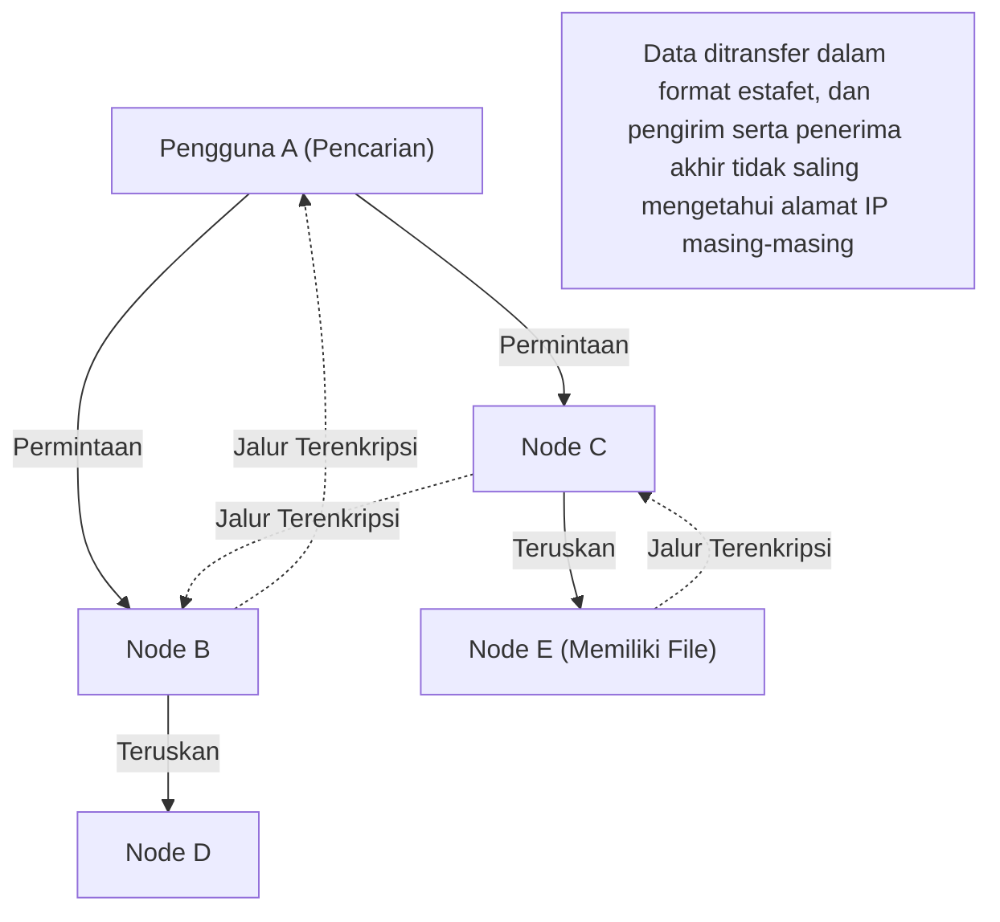

## 1. Apa itu "Winny" yang Menyapu Awal Tahun 2000-an?

Pada tahun 2002, sebuah perangkat lunak dipublikasikan di papan unduhan papan buletin elektronik raksasa "2channel" oleh seorang programmer anonim yang menyebut dirinya "47". Itu adalah "**Winny**".

Winny adalah "perangkat lunak berbagi file" yang memungkinkan pengguna di internet untuk bertukar file secara langsung. Winny membanggakan anonimitas yang tinggi dan efisiensi transfer yang luar biasa, yang membedakannya dari sistem yang ada, dan dengan cepat mendapatkan jutaan pengguna.
Namun, karena anonimitasnya yang tinggi, itu menjadi sarang pelanggaran undang-undang hak cipta, dan lebih jauh lagi, berkembang menjadi masalah sosial yang besar karena sering terjadinya kebocoran informasi rahasia yang disebabkan oleh virus. Pada tahun 2004, pengembangnya, Isamu Kaneko (Mr. 47), ditangkap atas dugaan membantu dan bersekongkol dalam pelanggaran undang-undang hak cipta, memicu tragedi yang akan terus diingat dalam sejarah TI Jepang.

Artikel ini memberikan penjelasan mendalam dari perspektif ilmu komputer murni mengenai inovasi "teknologi jaringan P2P (Peer-to-Peer) mutakhir" yang ada di dalam Winny, yang jarang dibahas karena tersembunyi di balik aspek sosial seperti masalah hak cipta.

## 2. Apa itu P2P (Peer-to-Peer)?

Untuk memahami teknologi Winny, pertama-tama kita perlu mengetahui struktur dasar dari jaringan.

### Tipe Klien-Server (Tipe Konvensional)
Sebagian besar internet yang biasa kita gunakan, seperti situs web dan YouTube, menggunakan metode ini.
Terdapat "server" yang kuat di pusat, dan sejumlah besar "klien" (PC dan smartphone kita) meminta data dari server. Meskipun strukturnya sederhana dan mudah dikelola, kelemahannya adalah server dapat tumbang jika akses terkonsentrasi, dan biaya yang sangat besar dikenakan pada administrator server.

### Tipe P2P (Peer-to-Peer)
Ini adalah metode di mana tidak ada server pusat, dan setiap PC (peer) yang berpartisipasi dalam jaringan berkomunikasi secara langsung satu sama lain dengan pijakan yang sama dan saling menyediakan data.
Ini memiliki sifat yang kuat di mana semakin banyak peserta yang ada, maka kapasitas pemrosesan dan bandwidth dari seluruh sistem akan semakin meningkat.

## 3. Inovasi Winny: P2P Murni dan Arsitektur Freenet

Pada saat itu, perangkat lunak berbagi file di luar negeri (seperti Napster) menggunakan metode "P2P hibrida" di mana "pertukaran file itu sendiri dilakukan antar pengguna (P2P), tetapi server pencarian untuk mengetahui siapa yang memiliki file apa terletak di pusat". Ini memiliki kelemahan bahwa jika server pusat dihentikan, maka seluruh jaringan akan mati.

Sebaliknya, Winny mewujudkan "**P2P murni**" yang tidak memiliki server pusat sama sekali.
Model jaringan Winny didasarkan pada arsitektur yang disebut "Freenet", yang dikembangkan untuk mencapai anonimitas yang tinggi, dengan peningkatan yang sangat baik dari Kaneko sendiri.

### Perutean Terdistribusi Otonom Berdasarkan Kunci
Dalam jaringan Winny, setiap file diberikan "kunci" berdasarkan nilai hash yang unik (seperti sidik jari dari file tersebut), dan setiap node (PC pengguna) juga diberikan "ID node" berdasarkan angka acak.

Saat melakukan pencarian, daripada menentukan alamat IP tertentu, pengguna meneruskan permintaan "Siapa node yang memiliki informasi yang dekat dengan kunci ini?" ke node tetangga seperti sebuah permainan estafet.
Karena setiap node mentransfer dari informasinya sendiri ke "node yang lebih dekat dengan permintaan", seluruh jaringan berfungsi secara mandiri sebagai semacam "database terdistribusi raksasa", dan memasukkan algoritma matematis untuk mencapai file target secara efisien.

## 4. Metode "Cache Relay" yang Menciptakan Anonimitas Utama

Alasan terbesar mengapa Winny memukau para insinyur pada saat itu adalah mekanisme **anonimitas** yang kuat.

Dalam P2P biasa, saat mengunduh file, pengirim (seed) dan penerima (pengunduh) berkomunikasi dengan menghubungkan alamat IP secara langsung, sehingga mudah untuk mengidentifikasi siapa yang mengirim file kepada siapa.
Namun, Winny mengadopsi mekanisme "**estafet file dan cache otomatis**".

1. **Jalur transfer terenkripsi**: File tidak dikirim secara langsung, melainkan ditransfer (di-estafetkan) melalui beberapa node yang tidak terkait di tengah-tengah, dan semua komunikasi pada jalur tersebut dienkripsi.
2. **Penyebaran pemegang melalui cache otomatis**: Ini adalah poin utamanya. Sebagian dari file yang sedang ditransfer secara otomatis disimpan sebagai "cache terenkripsi" di HDD dari node yang tidak terkait yang berfungsi sebagai titik relai.
3. **Penyembunyian pengirim**: Dengan cara ini, bahkan jika sebuah node ditemukan mengirimkan sebuah file, secara prinsip tidak mungkin untuk membedakan pada sistem apakah orang tersebut adalah "penerbit file asli" atau hanya "orang yang tidak terkait yang dipaksa menjadi titik relai".

Kejeniusan Kaneko terletak pada kenyataan bahwa ia mampu menghubungkan peningkatan beban jaringan karena "transfer estafet untuk anonimisasi" dengan efisiensi dengan cara "mendistribusikan cache ke seluruh jaringan sehingga file yang lebih populer dapat diunduh lebih cepat dari node terdekat (efek seperti CDN)".

## 5. Clustering: Penyertaan Fungsi BBS (Papan Buletin)

Mulai dari Winny2, tidak hanya berbagi file tetapi juga fungsi "papan buletin" diimplementasikan di jaringan P2P.
Ini adalah papan buletin terdistribusi yang benar-benar tidak dapat disensor dan tidak memerlukan server pusat 2channel.

Di sini, "teknologi clustering" berdasarkan minat dan ketertarikan pengguna diadopsi. Kelompok node yang tertarik dengan anime, kelompok node yang tertarik dengan musik, dll., topologi jaringan (bentuk koneksi) secara dinamis berubah dengan mempelajari perilaku pengguna, dan individu yang memiliki pemikiran yang sama akan secara otomatis ditempatkan berdekatan satu sama lain.
Hasilnya, ia menyadari penyebaran informasi yang sangat efisien tanpa mencari ke seluruh jaringan raksasa secara sia-sia. Algoritma clustering yang canggih ini memiliki pandangan ke depan yang mengarah pada sistem rekomendasi AI modern dan teknologi pemrosesan terdistribusi.

## 6. Cahaya dan Bayangan: Evolusi Teknologi dan Gesekan Sosial

Konsep teknologi yang ada di dalam Winny, seperti "desentralisasi yang sepenuhnya", "penyembunyian komunikasi melalui enkripsi", dan "perutean efisien terdistribusi otonom", adalah hal yang sangat mutakhir yang secara langsung mengarah pada ide "**blockchain**" seperti Bitcoin yang muncul kemudian, dan web terdistribusi (Web3) seperti IPFS.

Jika Isamu Kaneko tidak ditangkap dan bakatnya yang luar biasa ini diarahkan pada pengembangan infrastruktur yang legal, serta sistem terdistribusi yang akan menjadi standar dunia lahir dari Jepang, mungkin peta hegemoni internet saat ini akan sedikit berbeda.

Teknologi itu sendiri tidak memiliki kebaikan maupun kejahatan. Namun, ketika teknologi tersebut terlalu kuat dan melampaui kerangka hukum masyarakat, gesekan yang kuat pun terjadi. Sejarah Winny menghadapkan kita pada pertanyaan berat yang masih relevan hingga saat ini: inovasi dan tanggung jawab sosial, serta bagaimana kita harus melindungi dan mendidik para insinyur.
