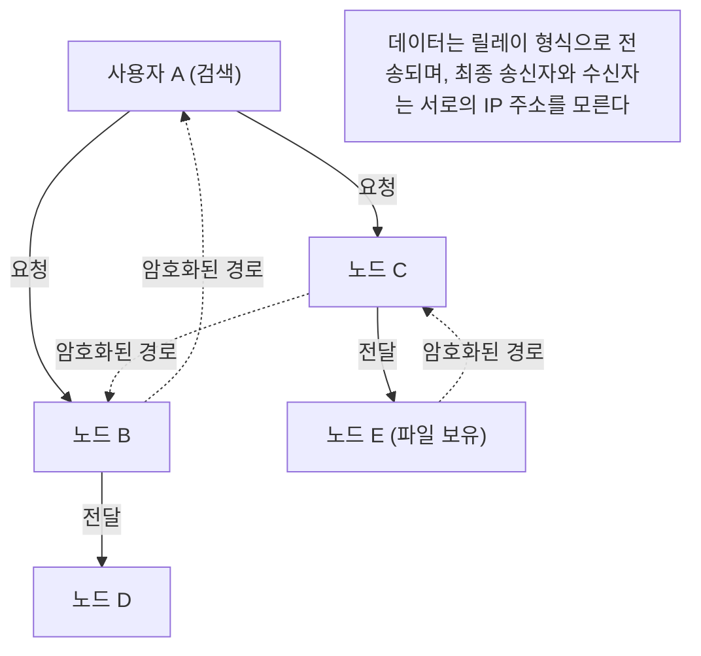

## 1. 2000년대 초반을 휩쓴 'Winny'란

2002년, 거대 전자 게시판 '2채널'의 다운로드 게시판에 '47씨'라고 자칭하는 익명의 프로그래머에 의해 하나의 소프트웨어가 공개되었습니다. 그것이 바로 ' **Winny(위니)** '입니다.

Winny는 인터넷상의 사용자끼리 직접 파일을 주고받을 수 있는 '파일 공유 소프트웨어'였습니다. 기존 시스템과는 확연히 다른 높은 익명성과 압도적인 전송 효율을 자랑하며, 순식간에 수백만 명의 사용자를 확보했습니다.
하지만 그 높은 익명성 때문에 저작권법 위반의 온상이 되었고, 게다가 바이러스에 의한 기밀 정보 유출 사건이 다발하면서 큰 사회 문제로 발전했습니다. 2004년에는 개발자인 가네코 이사무(47씨)가 저작권법 위반 방조 혐의로 체포되는 등 일본 IT 역사에 남을 비극의 도화선이 되었습니다.

본 기사에서는 저작권 문제 등 사회적 측면에 가려져 잘 이야기되지 않는, Winny가 내포하고 있던 '당시 세계 최첨단의 P2P(Peer-to-Peer) 네트워크 기술'의 혁신성에 대해 순수한 컴퓨터 사이언스 관점에서 깊이 있게 해설합니다.

## 2. P2P(피어 투 피어)란 무엇인가?

Winny의 기술을 이해하기 위해서는 먼저 네트워크의 기본 구조를 알아야 합니다.

### 클라이언트-서버형 (기존형)
웹사이트나 YouTube 등 우리가 평소 이용하는 인터넷의 대부분이 이 방식입니다.
중앙에 강력한 '서버'가 존재하고, 다수의 '클라이언트(우리의 PC나 스마트폰)'가 서버에 데이터를 요청합니다. 구조가 단순하고 관리하기 쉬운 반면, 접속이 집중되면 서버가 다운되거나 서버 관리자에게 막대한 비용이 든다는 약점이 있습니다.

### P2P형 (Peer-to-Peer)
중앙 서버가 존재하지 않고, 네트워크에 참여하고 있는 개별 PC(피어)가 서로 동등한 입장에서 직접 통신하며 데이터를 주고받는 방식입니다.
참여자가 늘어날수록 시스템 전체의 처리 능력이나 대역폭이 스케일 업된다는 강인한 성질을 가지고 있습니다.

## 3. Winny의 혁신성: 퓨어 P2P와 Freenet 아키텍처

당시 해외의 파일 공유 소프트웨어(Napster 등)는 '파일 교환 자체는 사용자끼리(P2P) 하지만, 누가 어떤 파일을 가지고 있는지 검색하는 서버는 중앙에 존재한다'는 '하이브리드 P2P' 방식이었습니다. 이는 중앙 서버가 정지되면 네트워크 전체가 사멸한다는 약점이 있었습니다.

이에 반해, Winny는 중앙 서버를 전혀 가지지 않는 ' **퓨어 P2P(순수 P2P)** '를 실현하고 있었습니다.
Winny의 네트워크 모델은 높은 익명성을 실현하기 위해 개발된 'Freenet(프리넷)'이라는 아키텍처를 기반으로, 가네코 씨 독자적인 극히 우수한 개량이 가해진 것이었습니다.

### 키(Key)에 기반한 자율 분산 라우팅
Winny의 네트워크에서는 파일에 고유한 해시값(파일의 지문 같은 것)에 기반한 '키'가 할당되고, 개별 노드(사용자의 PC)에도 난수에 기반한 '노드 ID'가 할당됩니다.

검색을 수행할 때, 사용자는 특정 IP 주소를 지정하는 것이 아니라 "이 키에 가까운 정보를 가진 노드는 누구인가?"라는 요청을 양동이 릴레이처럼 이웃 노드에게 전달해 나갑니다.
각 노드는 자신이 가진 정보 중에서 '요청에 더 가까운 노드'로 전송하기 때문에, 네트워크 전체가 일종의 '거대한 분산 데이터베이스'로서 자율적으로 기능하며, 효율적으로 목적하는 파일에 도달하는 수학적 알고리즘이 내장되어 있었습니다.

## 4. 궁극의 익명성을 낳은 '캐시 릴레이' 방식

Winny가 당시 기술자들을 경탄하게 만든 가장 큰 이유는 그 견고한 **익명성** 메커니즘입니다.

일반적인 P2P에서는 파일을 다운로드할 때 송신자(시드)와 수신자(다운로더)가 직접 IP 주소를 연결하여 통신하기 때문에, 누가 누구에게 파일을 보냈는지 쉽게 특정할 수 있습니다.
하지만 Winny는 ' **파일의 양동이 릴레이와 자동 캐시** '라는 구조를 채택했습니다.

1. **암호화된 전송 경로** : 파일은 직접 전송되는 것이 아니라, 중간에 여러 무관한 노드를 경유(릴레이)하여 전송되며, 그 경로상의 통신은 모두 암호화되어 있었습니다.
2. **자동 캐시에 의한 보유자 확산** : 이 부분이 가장 중요합니다. 중계점이 된 무관한 노드의 HDD에 전송 중인 파일의 일부가 '암호화된 캐시'로서 자동으로 저장됩니다.
3. **송신자 은닉** : 이로 인해 어떤 노드가 파일을 송신하고 있는 것을 발견하더라도, 그 사람이 '원래 파일의 공개자'인지, 단순히 '중계만 하고 있는 무관한 사람'인지 시스템상 원리적으로 구별하는 것이 불가능해진 것입니다.

가네코 씨의 천재적인 점은 이 '익명화를 위한 릴레이 전송'으로 인한 네트워크 부하 증대를, '캐시가 네트워크 전체에 분산 배치됨으로써 인기 있는 파일일수록 가까운 노드에서 고속으로 다운로드할 수 있게 된다(CDN적인 효과)'는 형태로 훌륭하게 효율화와 결부시켰다는 점에 있었습니다.

## 5. 클러스터링: BBS(게시판) 기능의 내포

Winny2부터는 파일 공유뿐만 아니라 '게시판' 기능도 P2P 네트워크상에 구현되었습니다.
중앙의 2채널 서버가 필요 없는, 완전히 검열 불가능한 분산형 게시판입니다.

여기에서는 사용자의 관심사에 기반한 '클러스터링 기술'이 채택되었습니다. 애니메이션에 관심 있는 노드군, 음악에 관심 있는 노드군 등 네트워크의 토폴로지(연결 형태)가 사용자의 행동을 학습하여 동적으로 변화하며, 비슷한 사람끼리 자동으로 가까이 배치되게 됩니다.
이로 인해 거대한 네트워크 전체를 헛되이 검색하지 않고도 극히 효율적인 정보 전파를 실현하고 있었습니다. 이 고도의 클러스터링 알고리즘은 현대 AI의 추천 시스템이나 분산 처리 기술과 통하는 선견지명이 있었습니다.

## 6. 빛과 그림자: 기술의 진화와 사회의 마찰

Winny가 내포하고 있던 '완전한 탈중앙화', '암호화에 의한 통신 은닉', '자율 분산형의 효율적 라우팅'이라는 기술적 콘셉트는, 그 후 등장하는 비트코인 등의 ' **블록체인** '이나 IPFS 등의 분산형 웹(Web3)의 사상으로 그대로 직결되는 극히 선진적인 것이었습니다.

만약 가네코 이사무 씨가 체포되지 않고 이 유례없는 재능이 합법적인 인프라 개발을 향해, 일본에서 세계 표준이 될 분산 시스템이 탄생했다면 현재 인터넷의 패권 구도는 조금 달라졌을지도 모릅니다.

테크놀로지 자체에는 선도 악도 없습니다. 하지만 그 기술이 너무나도 강력하여 사회의 법 정비를 앞질러 버렸을 때 강렬한 마찰이 발생합니다. Winny의 역사는 이노베이션과 사회적 책임, 그리고 기술자를 어떻게 보호하고 육성해야 하는가라는 현대에도 통하는 무거운 질문을 우리에게 던지고 있습니다.
