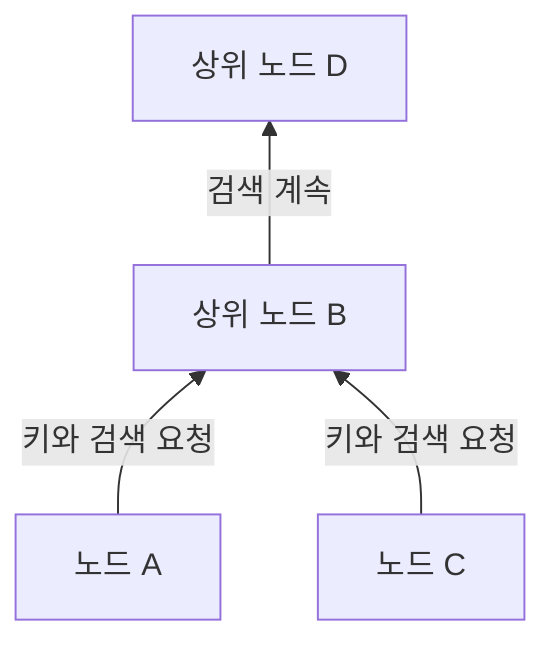
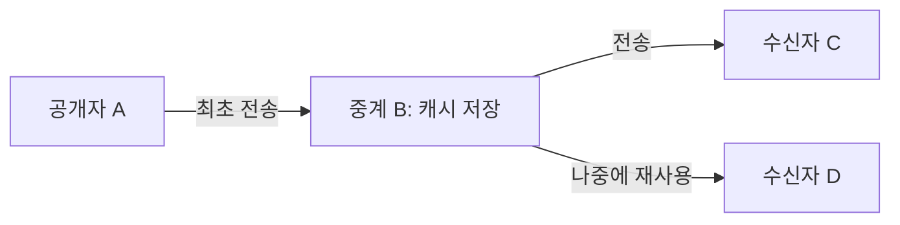

## 1. Winny가 풀려고 했던 문제

큰 파일을 많은 사람에게 전달하고 싶지만 최초 제공자의 업로드 대역폭은 제한되어 있습니다. 중앙 검색 서버도 두고 싶지 않고, 최초 공개자도 쉽게 식별되지 않게 하고 싶습니다. 이 세 목표를 어떻게 함께 달성할 것인가? 여기에 Winny의 기술적 흥미가 있습니다.

Winny는 가네코 이사무가 개발한 P2P 파일 공유 프로그램으로, 첫 시험판은 2002년 5월 6일 공개되었습니다. **P2P(Peer-to-Peer)**에서는 참여 컴퓨터가 데이터를 받는 동시에 다른 참여자에게 제공하는 역할도 합니다. 각각의 참여자를 피어 또는 노드라고 부릅니다. [일본 최고재판소 판결 영문 번역, WIPO Lex][court]

그러나 P2P라는 말만으로 검색 방법이나 익명성이 정해지지는 않습니다. **다른 노드 찾기, 파일 검색, 실제 내용 전송**을 구분해야 합니다. 아래 그림과 수치 예시는 개념 모형이며 특정 버전의 실제 통신 기록이 아닙니다.

## 2. 중앙 서버가 없어도 접속의 출발점은 필요하다

일반적인 웹 배포에서는 사용자가 지정된 서버에 접속합니다. 실제로는 CDN으로 전송을 분산할 수 있지만, 여기서는 단일 제공자와 비교합니다. P2P에서는 받은 사람도 다음 제공자가 될 수 있습니다.

Winny에는 파일 목록을 한곳에 모으는 중앙 검색 서버가 필요하지 않습니다. 그래도 새 노드가 다른 참여자의 주소를 하나도 모르면 연결할 수 없습니다. 초기 노드 정보를 발판으로 연결을 만듭니다. 중앙 목록이 없다는 말은 초기 접속 정보나 인터넷 기반 시설이 필요 없다는 뜻이 아닙니다. [JPNIC 기술 자료][jpnic]

이 논리적 연결 구조를 **오버레이 네트워크**라고 합니다. 도로 위에 버스 노선이 놓이듯, IP 네트워크 위에 애플리케이션의 경로를 만드는 것입니다. 각 노드는 전체 참여자가 아닌 일부 이웃과 정보를 교환합니다.

대체 경로가 있으면 이웃 노드가 종료되어도 통신할 수 있습니다. 하지만 참여와 이탈이 잦으면 연결 정보가 낡습니다. 분산되어 있다는 이유만으로 모든 파일을 찾거나 모든 장애를 견디는 것은 아닙니다.

## 3. 작은 목록 정보와 큰 파일을 분리한다

도서관에서 책을 찾을 때 모든 책을 가져올 필요는 없습니다. 목록을 먼저 보고 필요한 책만 가져오면 됩니다. Winny도 검색용 메타데이터와 파일 내용을 분리합니다.

| 요소 | 역할 | 주의할 구분 |
|---|---|---|
| 키 | 이름, 크기, 해시, 가져올 주소 등의 목록 정보 | 여기서 키는 암호를 푸는 복호화 키가 아님 |
| 본체·캐시 | 암호화된 파일 내용을 저장하고 전송 | 보유자가 최초 공개자라는 뜻은 아님 |
| 해시값 | 파일 식별과 비교에 사용 | 작성자나 안전성을 증명하는 전자서명이 아님 |

개발자 강연 보고서는 이러한 분리와 중계 노드에 내용을 저장하는 설계를 설명합니다. [GLOCOM 강연 보고서][glocom]

이름이 모두 `lecture.zip`인 두 파일도 내용은 다를 수 있습니다. 내용에 대응하는 식별 정보는 후보를 구별하는 데 도움이 됩니다. 그러나 악성 파일에도 해시값이 있습니다. 목록과 일치한다는 사실과 실행해도 안전하다는 사실은 다릅니다.

## 4. 계층화와 클러스터링으로 검색을 좁힌다

매번 모든 노드에 물으면 참여자가 늘수록 검색 트래픽이 커집니다. Winny는 회선 속도를 고려한 계층을 만들고, 키와 검색을 주로 상위 방향으로 보냅니다. 관심 키워드가 비슷한 노드를 연결하는 **클러스터링**도 검색 효율을 높입니다. [JPNIC 기술 자료][jpnic]

방향을 설명하는 모식도입니다. 상위란 지리적 북쪽이나 특정 회사의 고정 서버를 뜻하지 않습니다. 빠른 회선도 용량이 무한하지 않으며, 상위에 작업이 집중되면 부하 문제가 생깁니다.

클러스터링은 음악에 관심 있는 참여자 근처에서 음악 정보를 찾기 쉽게 하는 방식으로 이해할 수 있습니다. 키워드의 유사성을 이용할 뿐, AI가 내용의 진위나 가치를 판단하는 기능은 아닙니다.

**Winny를 ‘해시값이 가장 가까운 노드로 전달하는 DHT’로 설명하면 부정확합니다.** 분산 해시 테이블은 키 공간을 여러 노드에 나누어 맡기는 별도의 설계입니다. 파일 식별에 해시를 쓴다고 자동으로 DHT가 되는 것은 아닙니다. 목록 번호와 목록을 검색하는 경로는 구분해야 합니다.

## 5. 중계와 캐시가 제공자를 늘리는 방식

검색으로 후보를 찾은 다음 내용을 가져옵니다. 검색 정보와 파일 본체가 지나는 경로는 같지 않을 수 있습니다. Winny에는 키의 제공 주소를 바꾼 노드가 요청을 받고, 이전 제공자로부터 데이터를 가져와 중계·저장하는 방식이 있습니다. 캐시는 나중의 요청에도 사용할 수 있습니다. [JPNIC 기술 자료][jpnic]

D는 A에게 직접 받지 않고 B의 사본을 사용합니다. A의 부하가 줄고, D의 직접 송신자 B와 최초 공개자 A가 분리됩니다. 그렇다고 모든 다운로드가 같은 수의 중계 단계를 거친다는 뜻은 아닙니다.

### 100 MB를 100명에게 보낸다면

파일 크기를 $F$, 수신자 수를 $n$이라 합시다. 한 제공자가 모든 사람에게 완전한 사본을 한 번씩 보내면 업로드 총량은 다음과 같습니다.

$$
V_0 = nF
$$

$F=100\,\mathrm{MB}$, $n=100$이면 10,000 MB입니다. 최초 제공자가 한 사본만 보내고 나머지 99회는 캐시 보유자가 배포하는 이상적인 경우와 비교해 봅시다.

| 배포 가정 | 최초 제공자의 업로드 | 다른 참여자의 업로드 |
|---|---:|---:|
| 제공자가 100명 모두에게 직접 전송 | 10,000 MB | 0 MB |
| 최초 사본 이후 99회 재배포 | 100 MB | 9,900 MB |

**사라진 것은 최초 제공자에게 집중된 부하이지, 모두에게 사본을 전달하는 트래픽이 아닙니다.** 중계, 재전송, 검색 때문에 전체 트래픽은 오히려 늘 수 있습니다. 이 수치는 Winny의 실측치나 100배 빨라진다는 예측이 아닙니다.

마찬가지로 $k$개 제공자의 업로드 속도를 $u_i$, 수신자의 다운로드 용량을 $d$라 하면, 병렬 수신을 가정한 실효 속도 $r$의 개념적 상한은 다음과 같습니다.

$$
r \leq \min\left(d,\sum_{i=1}^{k}u_i\right)
$$

혼잡, 디스크 속도, 각 제공자가 가진 데이터도 영향을 줍니다. 열 대가 같은 느린 회선을 공유하면 열 배가 되지 않습니다. 인기 파일에는 사본이 늘기 쉽지만, 드문 파일은 유일한 보유자가 접속을 끊으면 받지 못할 수 있습니다.

## 6. 암호화는 보이지 않는다는 뜻이 아니다

Winny는 암호화·중계·캐시를 결합해 공개자를 알아보기 어렵게 하려 했습니다. 하지만 다음 네 성질은 구분해야 합니다.

| 성질 | 질문 | 추가 검토 사항 |
|---|---|---|
| 기밀성 | 관찰자가 내용을 읽을 수 있는가? | 암호 방식, 구현, 키 관리 |
| 익명성 | 행동을 개인과 연결할 수 있는가? | 이웃, 시각, 트래픽 양 관찰 |
| 진본성 | 주장된 작성자가 만든 데이터인가? | 신뢰할 서명이나 배포처 |
| 단말 보안 | 파일을 열면 컴퓨터가 손상되는가? | 실행 권한, 악성코드 방어 |

IP에서 직접 통신하려면 목적지 IP 주소가 필요합니다. 암호화가 연결의 존재와 모든 끝점 정보를 지우지는 않습니다. 캐시를 보냈다는 관찰만으로 최초 공개자를 단정할 수는 없지만, 여러 지점과 시간의 관찰을 결합할 여지는 있습니다.

익명성을 논할 때는 누가 무엇을 관찰하는지, 즉 위협 모델을 밝혀야 합니다. 이웃 하나를 보는 관찰자와 많은 연결을 감시하는 관찰자의 능력은 다릅니다. ‘완전 익명’이나 ‘원리적으로 추적 불가능’은 적절한 표현이 아닙니다.

## 7. 정보 유출: 단말 침해와 재배포를 구분한다

Winny 관련 유출은 악성코드 등의 원인으로 개인 데이터가 밖으로 나간 뒤 네트워크에서 복제되는 두 단계로 보면 이해하기 쉽습니다. IPA는 실제 사고 대응을 조사했습니다. [IPA 보고서][ipa]

전형적인 설명 흐름은 **수상한 파일 실행 → 악성코드의 정보 수집·공개 → 다른 노드가 수신 → 캐시로 재배포**입니다. Winny를 켜면 반드시 디스크 전체가 공개된다는 뜻이 아닙니다. 악성 프로그램의 동작과 P2P 배포는 구별해야 합니다.

원본을 지워도 이미 다른 컴퓨터에 전달된 사본까지 삭제할 수 있는 것은 아닙니다. 감염된 단말에서 평문을 읽으면 암호를 깰 필요조차 없습니다. 전송 암호화만으로 이 유출 경로를 막을 수는 없습니다.

어떤 데이터를 공유하는가? 사용자가 확인할 수 있는가? 단말 침해의 영향은 어디까지인가? 잘못 공개한 것을 회수할 수 있는가? 사용성과 통제 가능성도 배포 효율만큼 중요합니다.

## 8. 역사와 판결은 기술 평가와 구분한다

| 시기 | 사건 |
|---|---|
| 2002년 5월 | 첫 시험판 공개 |
| 2003년 5월 | P2P 게시판을 목표로 한 Winny 2 시험판 공개 |
| 2004년 | 가네코 이사무가 저작권 침해 방조 혐의로 체포 |
| 2011년 12월 19일 | 최고재판소가 검찰 상고를 기각하여 개발자 무죄 확정 |

Winny 2의 게시판은 분산 전송 위에 만든 애플리케이션입니다. 검색 클러스터링 자체가 게시판은 아닙니다. 분산만으로 게시물의 진본성, 영구 보존, 모든 삭제에 대한 저항성이 보장되지도 않습니다. [GLOCOM 강연 보고서][glocom]

재판의 쟁점은 해당 사건의 구체적 상황에서 소프트웨어 제공이 이용자의 저작권 침해를 방조한 범죄인가였습니다. 최고재판소는 이 사건에서 개발자의 범죄 성립을 인정하지 않았습니다. 모든 파일 공유를 합법화하거나 개발자에게 보편적 면책을 준 판결은 아닙니다. [최고재판소 판결][court]

## 9. Winny가 남기는 설계 질문

‘혁신적이므로 안전하다’와 ‘피해가 있었으므로 분산 기술은 무가치하다’는 모두 지나치게 단순합니다. 검색, 전송, 프라이버시, 통제는 서로 다른 공학적 목표입니다.

메타데이터와 본체 분리, 사본 재사용, 관심사가 비슷한 참여자 연결은 자원을 효율적으로 활용합니다. 반면 사본이 많으면 회수하기 어렵고, 중계가 늘면 지연과 관찰 지점도 달라집니다. 이점과 비용은 같은 메커니즘에서 나옵니다.

현대 [분산 시스템](/ko/p/cap-theorem-distributed-systems-tradeoff/)에도 다섯 질문을 던져 봅시다. **첫 노드는 어떻게 찾는가? 어디서 검색하는가? 누가 본체를 보내는가? 무엇을 누구에게 숨기는가? 공개 후 누가 통제하는가?** Winny는 이를 나누어 생각할 구체적인 사례입니다.

## 참고 자료

- [JPNIC: Internet Week 2006, P2P 기초와 네트워크 운영, 특히 9~15쪽(일본어)][jpnic]
- [GLOCOM: 가네코 이사무의 Winny 기술 강연 보고서, 2006년(일본어)][glocom]
- [IPA: Winny를 통한 정보 유출 사고 대응 조사, 2007년(일본어)][ipa]
- [WIPO Lex: 최고재판소 2009 (A) 1900, 2011년 12월 19일 판결(영문 번역)][court]

[jpnic]: https://www.nic.ad.jp/ja/materials/iw/2006/proceedings/T3-1.pdf
[glocom]: https://www.glocom.ac.jp/wp-content/uploads/2020/10/chijo106_042-053.pdf
[ipa]: https://www.ipa.go.jp/archive/files/000011527.pdf
[court]: https://www.wipo.int/wipolex/en/text/584277

