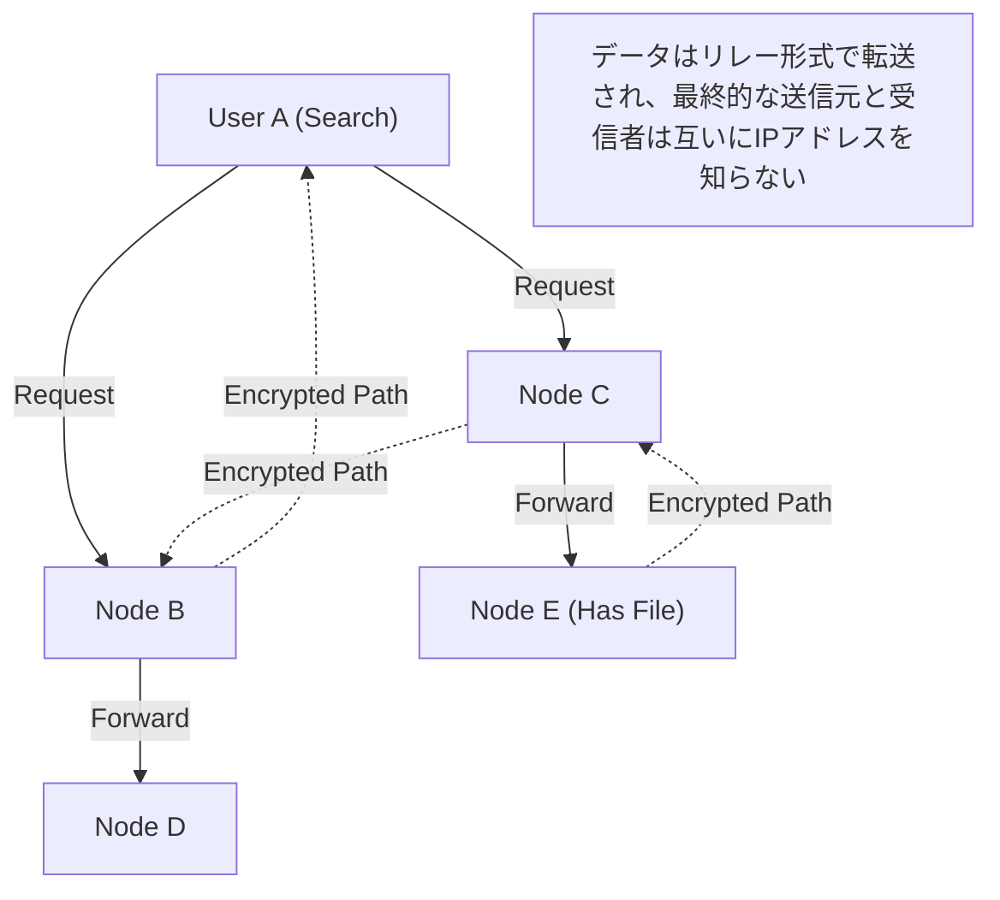

## 1. 2000年代初頭を席巻した「Winny」とは

2002年、巨大電子掲示板「2ちゃんねる」のダウンロード板に、「47氏」と名乗る匿名のプログラマーによって一本のソフトウェアが公開されました。それが「**Winny（ウィニー）**」です。

Winnyは、インターネット上のユーザー同士が直接ファイルをやり取りできる「ファイル共有ソフト」でした。既存のシステムとは一線を画す高い匿名性と圧倒的な転送効率を誇り、瞬く間に数百万人のユーザーを獲得しました。
しかし、その匿名性の高さゆえに著作権法違反の温床となり、さらにウイルスによる機密情報の漏洩事件が多発したことで大きな社会問題へと発展。2004年には、開発者である金子勇氏（47氏）が著作権法違反幇助の疑いで逮捕されるという、日本のIT史に残る悲劇の引き金となりました。

本記事では、著作権問題などの社会的側面に隠れて語られることの少ない、Winnyが内包していた「当時世界最先端のP2P（Peer-to-Peer）ネットワーク技術」の革新性について、純粋なコンピュータサイエンスの視点から深く解説します。

## 2. P2P（ピアツーピア）とは何か？

Winnyの技術を理解するために、まずはネットワークの基本構造を知る必要があります。

### クライアント・サーバー型（従来型）
WebサイトやYouTubeなど、私たちが普段利用しているインターネットの大部分はこの方式です。
中央に強力な「サーバー」が存在し、多数の「クライアント（私たちのPCやスマホ）」がサーバーにデータを要求します。構造がシンプルで管理しやすい反面、アクセスが集中するとサーバーがダウンしてしまったり、サーバー管理者に莫大なコストがかかるという弱点があります。

### P2P型（Peer-to-Peer）
中央のサーバーが存在せず、ネットワークに参加している個々のPC（ピア）が、お互いに対等な立場で直接通信し、データを提供し合う方式です。
参加者が増えれば増えるほど、システム全体の処理能力や帯域幅がスケールアップするという強靭な性質を持っています。

## 3. Winnyの革新性：ピュアP2PとFreenetアーキテクチャ

当時の海外のファイル共有ソフト（Napsterなど）は、「ファイルのやり取り自体はユーザー同士（P2P）で行うが、誰がどのファイルを持っているかという検索サーバーは中央に存在する」という「ハイブリッドP2P」方式でした。これは、中央サーバーが停止させられるとネットワーク全体が死滅するという弱点がありました。

これに対し、Winnyは中央サーバーを一切持たない「**ピュアP2P（純粋P2P）**」を実現していました。
Winnyのネットワークモデルは、高い匿名性を実現するために開発された「Freenet（フリーネット）」というアーキテクチャをベースに、金子氏独自の極めて優秀な改良が加えられたものでした。

### 鍵（キー）に基づく自律分散ルーティング
Winnyのネットワークでは、ファイルには固有のハッシュ値（ファイルの指紋のようなもの）に基づく「キー」が割り当てられ、個々のノード（ユーザーのPC）にも乱数に基づく「ノードID」が割り当てられます。

検索を行う際、ユーザーは特定のIPアドレスを指定するのではなく、「このキーに近い情報を持っているノードは誰か？」というリクエストをバケツリレーのように隣のノードへ伝言していきます。
各ノードは、自分の持っている情報の中から「よりリクエストに近いノード」へと転送するため、ネットワーク全体が一種の「巨大な分散データベース」として自律的に機能し、効率的に目的のファイルへと辿り着く数学的アルゴリズムが組み込まれていました。

## 4. 究極の匿名性を生んだ「キャッシュ・リレー」方式

Winnyが当時の技術者たちを驚嘆させた最大の理由は、その堅牢な**匿名性**のメカニズムです。

通常のP2Pでは、ファイルをダウンロードする際、送信元（シード）と受信者（ダウンローダー）が直接IPアドレスを繋いで通信するため、誰が誰にファイルを送ったかが簡単に特定できてしまいます。
しかし、Winnyは「**ファイルのバケツリレーと自動キャッシュ**」という仕組みを採用しました。

1. **暗号化された転送経路**：ファイルは直接送られるのではなく、中間に複数の無関係なノードを経由（リレー）して転送され、その経路上の通信はすべて暗号化されていました。
2. **自動キャッシュによる保有者の拡散**：ここが最大のポイントです。中継点となった無関係なノードのHDDに、転送中のファイルの一部が「暗号化されたキャッシュ」として自動的に保存されます。
3. **送信元の秘匿**：これにより、あるノードがファイルを送信しているのを発見しても、その人が「元々のファイルの公開者」なのか、単に「中継させられているだけの無関係な人」なのか、システム上区別することが原理的に不可能になったのです。

金子氏の天才的な点は、この「匿名化のためのリレー転送」によるネットワークへの負荷増大を、「キャッシュがネットワーク全体に分散配置されることで、人気のあるファイルほど近くのノードから高速にダウンロードできるようになる（CDN的な効果）」という形で、見事に効率化と結びつけた点にありました。

## 5. クラスタリング：BBS（掲示板）機能の内包

Winny2からは、ファイル共有だけでなく「掲示板」機能もP2Pネットワーク上に実装されました。
中央の2ちゃんねるサーバーが不要な、完全に検閲不能な分散型掲示板です。

ここでは、ユーザーの興味関心に基づく「クラスタリング技術」が採用されました。アニメに関心があるノード群、音楽に関心があるノード群など、ネットワークのトポロジー（接続形態）がユーザーの行動を学習して動的に変化し、似た者同士が自動的に近くに配置されるようになります。
これにより、巨大なネットワーク全体を無駄に検索することなく、極めて効率的な情報の伝播を実現していました。この高度なクラスタリング・アルゴリズムは、現代のAIのレコメンドシステムや分散処理技術に通じる先見性がありました。

## 6. 光と影：技術の進化と社会の摩擦

Winnyが内包していた「完全な非中央集権」「暗号化による通信の秘匿」「自律分散型の効率的ルーティング」といった技術的コンセプトは、その後登場するビットコインなどの「**ブロックチェーン**」や、IPFSなどの分散型Web（Web3）の思想にそのまま直結する極めて先進的なものでした。

もし金子勇氏が逮捕されず、この類稀なる才能が合法的なインフラ開発に向けられ、日本から世界標準となる分散システムが生み出されていたら、現在のインターネットの覇権図は少し違ったものになっていたかもしれません。

テクノロジー自体には善も悪もありません。しかし、その技術があまりにも強力で社会の法整備を追い越してしまったとき、強烈な摩擦が生じます。Winnyの歴史は、イノベーションと社会的責任、そして技術者をどう保護し育成すべきかという、現代にも通じる重い問いを私たちに突きつけています。