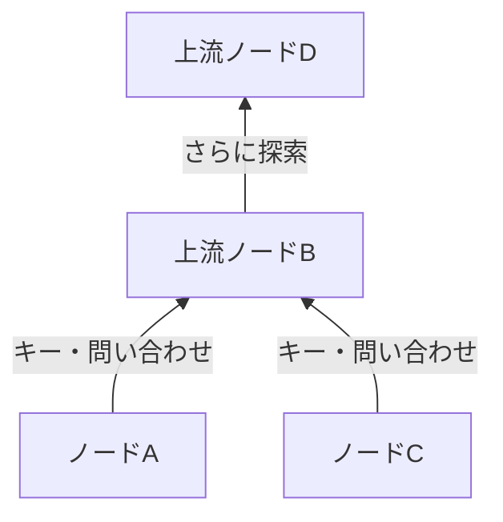
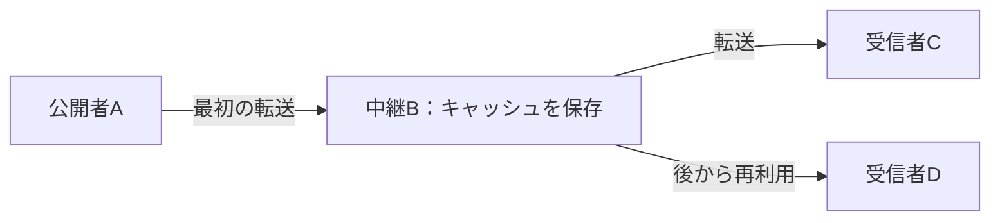

## 1. Winnyが解こうとした問題

大きなファイルを多くの人に届けたい。しかし配信元の回線は細く、中央の検索サーバーも置きたくない。しかも、最初の公開者を簡単には特定できないようにしたい。この三つをどう両立するか。ここにWinnyの技術的な面白さがあります。

Winnyは金子勇氏が開発したP2Pファイル共有ソフトです。最初の試用版は2002年5月6日に公開されました。P2Pは **Peer-to-Peer** の略で、参加するコンピューターがデータを受け取るだけでなく、ほかの参加者に提供する役割も担います。各参加者を「ピア」または「ノード」と呼びます。[最高裁判決の英訳（WIPO Lex）][court]

ただし、P2Pという言葉だけでは検索方法も匿名性も決まりません。**仲間を見つけること、ファイルを探すこと、本体を転送すること**を分けて考えましょう。本記事の図と数値例は概念モデルであり、特定バージョンの通信を再現したものではありません。

## 2. 「中央サーバーなし」でも最初の接続先は必要

一般的なWeb配信では、利用者は指定されたサーバーにアクセスします。実際にはCDNなどで配信を分散できますが、ここでは一台の配信元と比較します。P2Pでは受け取った側も次の配信元になれます。

Winnyにはファイル一覧を一か所に集める中央検索サーバーがありません。それでも、他の参加者のアドレスを何も知らなければ接続は始まりません。初期ノード情報を足がかりに参加者同士のつながりを作ります。「中央検索サーバーがない」と「接続の手がかりやインターネット基盤が不要」は別の話です。[JPNICの技術資料][jpnic]

この論理的なつながりを**オーバーレイネットワーク**といいます。道路の上にバス路線があるように、既存のIPネットワークの上にアプリケーション独自の経路を作るイメージです。ノードは全参加者と直結せず、一部の隣接ノードと情報を交換します。

代替経路があれば隣のノードが停止しても通信を続けられますが、参加・離脱が頻繁なら接続情報も古くなります。分散しただけで、ファイルが必ず見つかるわけでも、すべての障害に耐えられるわけでもありません。

## 3. 小さな「キー」と大きな「本体」を分ける

図書館では、読みたい本を探すたびに本棚の本を全部運んでくる必要はありません。まず目録を調べ、見つけた本だけを取り寄せます。Winnyでも検索情報とファイル本体を分けます。

| 要素 | 役割 | 混同しやすい点 |
|---|---|---|
| キー | ファイル名、サイズ、ハッシュ値、取得先などの目録情報 | 暗号の復号鍵という意味ではない |
| ボディ／キャッシュ | 暗号化されたファイル本体を保存・転送する | 保持者が最初の公開者とは限らない |
| ハッシュ値 | ファイルを識別・照合する値 | 作者や安全性を証明する電子署名ではない |

開発者の講演報告では、この分離と、中継ノードに本体を蓄積する設計が説明されています。[GLOCOMの講演報告][glocom]

同じ「lecture.zip」という名前でも中身が同じとは限りません。内容に対応する識別情報を使えば、同じファイルの候補を扱いやすくなります。ただし悪意あるファイルにもハッシュ値はあります。データが目録と一致することと、実行して安全であることは別の性質です。

## 4. 検索を階層化とクラスタリングで絞り込む

全員に毎回問い合わせると、人数が増えるほど検索通信が膨らみます。Winnyでは回線速度を考慮した階層を作り、主に上流へキーを流し、検索も上流に向けます。興味を示すキーワードが近いノード同士をつなぐ**クラスタリング**も検索の効率を高めます。[JPNICの技術資料][jpnic]

図は方向を説明する模式図です。上流は地理的な「北」でも、固定された運営会社のサーバーでもありません。高速な回線だから無限に処理できるわけでもなく、上流に負荷が集まる課題は残ります。

クラスタリングは、音楽に関心のある参加者の近くで音楽関連の情報を探しやすくする工夫と考えられます。キーワードの近さを利用するのであって、内容の正しさや価値をAIが判定する仕組みではありません。

**Winnyを「ハッシュ値に最も近いノードへ配送するDHT」と説明するのは不適切です。** DHT（分散ハッシュテーブル）はキー空間をノードに分担させる別の設計です。ファイル識別にハッシュ値を使うことだけで、そのネットワークがDHTになるわけではありません。目録の番号と、目録を探す経路は区別しましょう。

## 5. 中継とキャッシュ：提供者が増える仕組み

検索で候補を見つけたら本体を取得します。検索情報が通った経路と本体が流れる経路は同一とは限りません。Winnyには、キーの取得先を書き換えたノードが要求を受け、元の取得先からデータを取り寄せて中継・保存する仕組みがあります。キャッシュは後の転送に再利用されます。[JPNICの技術資料][jpnic]

DはAから直接受け取らずBのコピーを使います。Aの負荷が減り、Dから見た直近の送信者Bと最初の公開者Aが分かれます。ただし、すべての取得が必ず同じ段数の中継を通る、という意味ではありません。

### 100 MBを100人に届けるとき

大きさを $F$、受信者数を $n$ とします。一台から全員へ一度ずつ送る単純なモデルでは、配信元の送信量は次のようになります。

$$
V_0 = nF
$$

$F=100\,\mathrm{MB}$、$n=100$ なら10,000 MBです。配信元が最初のコピーを一つ送り、残りの99回をキャッシュ保持者が担えた理想的な場合と比較しましょう。

| 配信の仮定 | 配信元の送信量 | 他の参加者の送信量 |
|---|---:|---:|
| 配信元が100人に直接送る | 10,000 MB | 0 MB |
| 最初の1コピーの後、99回を再配布する | 100 MB | 9,900 MB |

**消えたのは配信元への集中であって、全員へ届ける通信量ではありません。** 中継段数、再送、検索通信によって総通信量が増える場合もあります。Winnyの実測値でも、常に100倍速くなるという予測でもありません。

同様に、$k$ 台の提供者の送信速度を $u_i$、受信側の回線速度を $d$ とすると、並列取得を仮定した実効速度 $r$ の上限は、概念的には次のようになります。

$$
r \leq \min\left(d,\sum_{i=1}^{k}u_i\right)
$$

実際には回線の混雑、ディスクの速度、必要なデータの偏りも効きます。10台が同じ遅い回線を共有していれば10倍にはなりません。人気のファイルはコピーが増えやすい反面、珍しいファイルは保持者が一人落ちるだけで取れなくなることもあります。

## 6. 暗号化は「誰にも分からない」を意味しない

Winnyは暗号化と中継・キャッシュを組み合わせ、公開者を見えにくくすることを目指しました。次の四つは分けて考える必要があります。

| 性質 | 問い | 別に必要な検討 |
|---|---|---|
| 内容の秘匿 | 途中で内容を読まれにくいか | 暗号方式・実装・鍵の扱い |
| 匿名性 | 行動と人物を結び付けにくいか | 隣接ノード、時刻や通信量の観測 |
| 真正性 | 正当な作成者のデータか | 信頼できる署名や配布元 |
| 端末の安全性 | 開いたファイルがPCを害さないか | 実行権限やマルウェア対策 |

IPネットワークで直接通信する相手には、接続先のIPアドレスが必要です。暗号化しても通信の存在や相手先まで消えるわけではありません。キャッシュを送ったという観測だけでは最初の公開者と断定できなくても、複数地点や時間をまたぐ観測を組み合わせる余地はあります。

匿名性を論じるときは「誰が何を観測できるのか」を明示する必要があります。隣の一台だけを見る相手と、多数の接続を観測できる相手では条件が違います。「完全匿名」「追跡は原理的に不可能」と評価するのは適切ではありません。

## 7. 情報漏えい：端末への侵入と再配布を分ける

Winnyを介した情報漏えいは、マルウェア感染などによって私的なデータが外部へ出て、その後コピーされる問題として理解すると整理できます。IPAは実際の被害対応を調査しています。[IPAの報告書][ipa]

典型的な説明モデルは、**不審なファイルの実行 → マルウェアによる情報収集・公開 → 他のノードによる取得 → キャッシュからの再配布**です。「Winnyを起動すると必ずディスク全体を公開する」という意味ではありません。端末を侵害したプログラムの動作と、P2Pによる流通を混同しないことが重要です。

元のファイルを消しても、別のPCに渡ったコピーまで一括削除できるとは限りません。暗号を破られなくても、感染した端末が平文を読み出せば漏えいします。通信の暗号化だけでは、この入口を防げません。

どのデータを共有対象にするのか、利用者は確認できるか、端末侵害の影響をどう抑えるか、誤公開をどこまで回収できるか。配信効率と同じくらい、操作性と管理性が重要になります。

## 8. 歴史と裁判を技術評価から切り分ける

| 時期 | 出来事 |
|---|---|
| 2002年5月 | 最初の試用版を公開 |
| 2003年5月 | P2P掲示板を目指したWinny 2の試用版を公開 |
| 2004年 | 金子勇氏が著作権法違反幇助の疑いで逮捕 |
| 2011年12月19日 | 最高裁が検察側の上告を棄却し、開発者の無罪が確定 |

Winny 2の掲示板は分散配信の上に構築するアプリケーションです。検索のクラスタリングそのものを掲示板と呼ぶわけではありません。分散しているだけで、投稿の真正性や永続性、あらゆる削除への耐性が保証されるものでもありません。[GLOCOMの講演報告][glocom]

裁判の焦点は、開発者によるソフトウェアの提供が、当該事件で利用者の著作権侵害を幇助する犯罪に当たるかどうかでした。最高裁は、この事件で開発者について犯罪の成立を認めませんでした。あらゆるファイル共有を合法にした判決でも、開発者が常に責任を負わないとした判決でもありません。[最高裁判決の英訳][court]

## 9. Winnyから学べる設計の問い

「革新的だから安全」「問題が起きたから分散技術は無価値」という評価では粗すぎます。検索、配信、秘匿、管理は、それぞれ別の設計目標です。

小さな目録と大きな本体を分けること、コピーを再利用すること、関心の近い参加者をつなぐことは、資源を効率よく使う発想です。一方、複製が増えるほど回収は難しくなり、中継が増えるほど遅延や観測点も変わります。利益と費用は同じ仕組みの両側にあります。

現代の[分散システム](/p/cap-theorem-distributed-systems-tradeoff/)にも五つの問いを当てはめてみましょう。**誰を最初に見つけるのか。どこで検索するのか。誰が本体を送るのか。何が誰から隠れるのか。公開後に誰が制御できるのか。** Winnyは、これらを一緒くたにせず考えるための具体的な教材です。

## 参考資料

- [JPNIC：Internet Week 2006・P2Pの基礎知識とネットワーク運用技術（特に9〜15ページ）][jpnic]
- [GLOCOM：金子勇氏の講演に基づく「Winnyの技術」報告（2006年）][glocom]
- [IPA：Winnyを介した情報漏えい被害対応の実態（2007年）][ipa]
- [WIPO Lex：最高裁判所・2009 (A) 1900、2011年12月19日判決（英訳）][court]

[jpnic]: https://www.nic.ad.jp/ja/materials/iw/2006/proceedings/T3-1.pdf
[glocom]: https://www.glocom.ac.jp/wp-content/uploads/2020/10/chijo106_042-053.pdf
[ipa]: https://www.ipa.go.jp/archive/files/000011527.pdf
[court]: https://www.wipo.int/wipolex/en/text/584277

