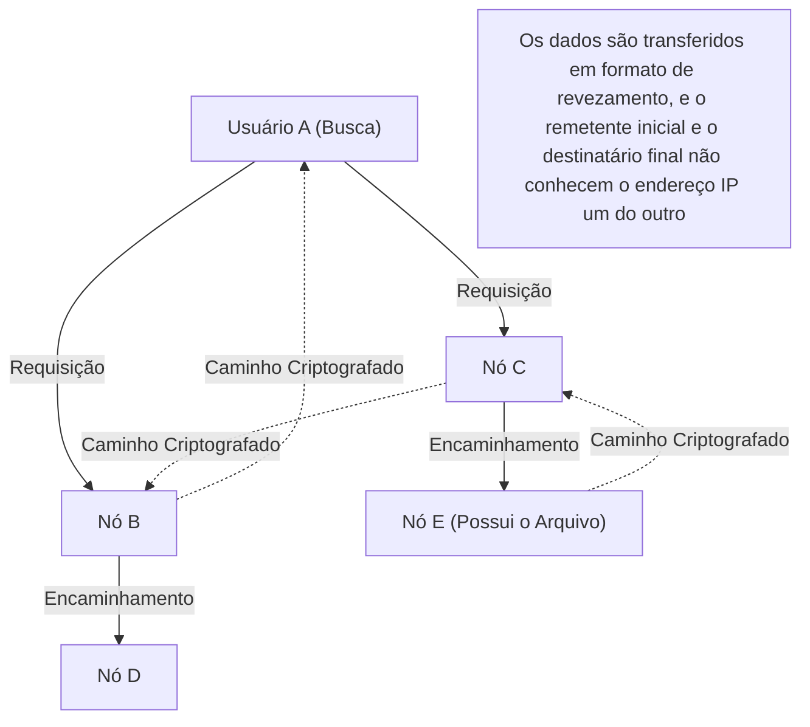

## 1. O que foi o "Winny" que dominou o início dos anos 2000?

Em 2002, no fórum de downloads do gigantesco quadro de mensagens eletrônicas "2channel", um programador anônimo autodenominado "47-shi" publicou um software. Esse software era o "**Winny**".

O Winny era um "software de compartilhamento de arquivos" que permitia a troca direta de arquivos entre usuários na Internet. Com alto nível de anonimato e incrível eficiência de transferência que o distinguiam dos sistemas existentes, ele rapidamente conquistou milhões de usuários.
No entanto, justamente por causa de seu alto grau de anonimato, tornou-se um terreno fértil para violações da lei de direitos autorais e, com o vazamento frequente de informações confidenciais devido a vírus, evoluiu para um grande problema social. Em 2004, a prisão do desenvolvedor, Isamu Kaneko (47-shi), sob a suspeita de cumplicidade em violações de direitos autorais, desencadeou uma tragédia que ficou marcada na história da TI japonesa.

Neste artigo, vamos explicar profundamente a inovatividade da "tecnologia de rede P2P (Peer-to-Peer) de ponta mundial da época", sob a perspectiva puramente da ciência da computação, um aspecto raramente discutido sob a sombra das questões sociais, como direitos autorais.

## 2. O que é P2P (Peer-to-Peer)?

Para entender a tecnologia do Winny, primeiro precisamos conhecer a estrutura básica das redes.

### Modelo Cliente-Servidor (Convencional)
A maior parte da Internet que usamos regularmente, como sites e o YouTube, segue esse modelo.
Um "servidor" poderoso fica no centro e vários "clientes" (nossos PCs e smartphones) solicitam dados a ele. Embora a estrutura seja simples e fácil de gerenciar, tem a desvantagem de que, se houver um grande fluxo de acessos simultâneos, o servidor pode cair, além de gerar custos enormes para o administrador.

### Modelo P2P (Peer-to-Peer)
Não há um servidor central; os PCs individuais (peers) conectados à rede se comunicam diretamente e trocam dados em pé de igualdade.
Possui uma natureza robusta onde a capacidade de processamento e a largura de banda de todo o sistema aumentam (escalam) conforme o número de participantes cresce.

## 3. A Inovação do Winny: P2P Puro e a Arquitetura Freenet

Naquela época, os softwares de compartilhamento de arquivos estrangeiros (como o Napster) usavam um modelo "P2P Híbrido", onde "a transferência dos arquivos em si ocorria entre os usuários (P2P), mas o servidor de busca que sabia quem tinha qual arquivo ficava no centro". A fraqueza era que a rede inteira morria se o servidor central parasse.

Em contraste, o Winny implementou um "**P2P Puro (Pure P2P)**" que não tinha servidor central algum.
O modelo de rede do Winny era baseado na arquitetura "Freenet", desenvolvida para oferecer alto anonimato, com melhorias próprias extremamente brilhantes adicionadas por Kaneko.

### Roteamento Distribuído Autônomo Baseado em Chaves (Keys)
Na rede do Winny, cada arquivo recebe uma "chave" baseada no seu valor de hash exclusivo (como uma impressão digital do arquivo) e cada nó (PC do usuário) recebe um "ID de nó" baseado em números aleatórios.

Ao fazer uma busca, em vez de especificar um endereço IP, o usuário passa o pedido adiante, de nó em nó (como uma corrida de revezamento), perguntando: "Quem é o nó mais próximo que tem informações sobre esta chave?".
Como cada nó transfere a solicitação para um nó "mais próximo da solicitação" usando as informações que tem, o sistema inteiro funciona de maneira autônoma como uma espécie de "gigantesco banco de dados distribuído", incorporando algoritmos matemáticos para chegar eficientemente ao arquivo desejado.

## 4. O Sistema de "Cache Relay" Que Criou o Anonimato Extremo

O maior motivo pelo qual o Winny surpreendeu os engenheiros da época foi o seu mecanismo robusto de **anonimato**.

No P2P comum, ao fazer o download de um arquivo, a origem (seeder) e o destinatário (downloader) se conectam diretamente pelos endereços IP, o que torna muito fácil rastrear quem enviou o arquivo para quem.
No entanto, o Winny adotou o sistema de "**revezamento de arquivos e cache automático**".

1. **Rota de transferência criptografada**: os arquivos não são enviados diretamente, mas transferidos (revezados) por meio de vários nós intermediários não relacionados, e toda a comunicação dessa rota era criptografada.
2. **Dispersão de detentores por cache automático**: este é o ponto principal. Parte do arquivo em trânsito é salvo automaticamente como um "cache criptografado" nos discos rígidos dos nós intermediários não relacionados que atuaram como pontos de trânsito.
3. **Ocultamento da origem (remetente)**: com isso, mesmo que seja descoberto que um nó está enviando um arquivo, tornou-se teoricamente impossível para o sistema distinguir se essa pessoa era o "publicador original do arquivo" ou apenas uma "pessoa não relacionada servindo de intermediário".

A genialidade de Kaneko estava em pegar o aumento da carga de rede gerado por essa "transferência de revezamento para anonimização" e transformá-lo de maneira brilhante em um ganho de eficiência: "com os caches espalhados por toda a rede, arquivos mais populares podem ser baixados muito mais rápido através de nós próximos (um efeito semelhante ao de um CDN)".

## 5. Clustering: Inclusão da Função de BBS (Fórum)

A partir do Winny2, não apenas o compartilhamento de arquivos, mas também uma função de "fórum" (BBS) foi implementada na rede P2P.
Era um fórum distribuído completamente incensurável, sem necessidade dos servidores centrais do 2channel.

Aqui, a "tecnologia de clustering" baseada no interesse do usuário foi adotada. Grupos de nós interessados em animes, grupos de nós interessados em música, etc. — a topologia da rede (forma de conexão) aprendia o comportamento dos usuários e mudava dinamicamente, de modo que pessoas com gostos parecidos fossem automaticamente colocadas perto umas das outras.
Graças a isso, ele alcançava uma disseminação de informações extremamente eficiente, sem realizar buscas desnecessárias por toda a rede gigantesca. Esse algoritmo avançado de clustering foi visionário e se alinha com as tecnologias atuais de processamento distribuído e os sistemas de recomendação de Inteligência Artificial (IA).

## 6. Luz e Sombra: A Evolução da Tecnologia e o Atrito com a Sociedade

Os conceitos tecnológicos integrados no Winny, como "descentralização completa", "ocultamento da comunicação por criptografia" e "roteamento autônomo distribuído e eficiente", foram incrivelmente pioneiros, conectando-se diretamente aos ideais do "**blockchain**", como no Bitcoin, e da Web descentralizada (Web3), como o IPFS, que surgiriam depois.

Se Isamu Kaneko não tivesse sido preso e seu raro talento tivesse sido direcionado para o desenvolvimento de uma infraestrutura legal, criando um sistema distribuído a partir do Japão para se tornar um padrão global, talvez o panorama atual da dominância na Internet fosse um pouco diferente.

A tecnologia em si não é boa nem má. No entanto, quando essa tecnologia é muito poderosa e ultrapassa a legislação de uma sociedade, ocorre um forte atrito. A história do Winny nos apresenta questões pesadas, ainda muito relevantes hoje, sobre inovação, responsabilidade social e como os engenheiros devem ser protegidos e incentivados.
