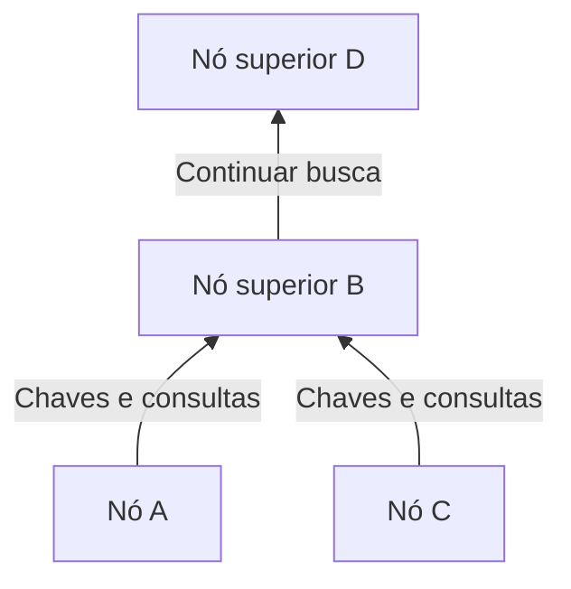
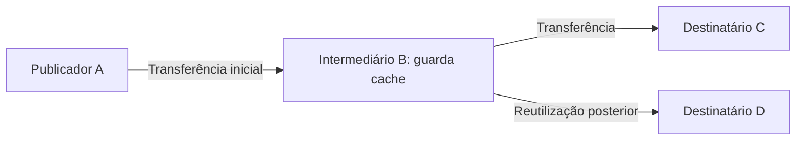

## 1. O problema que o Winny tentava resolver

Queremos distribuir um arquivo grande para muitas pessoas, mas a origem tem pouca capacidade de upload. Também queremos dispensar um servidor central de busca e dificultar a identificação de quem publicou o arquivo primeiro. Conciliar esses três objetivos torna o Winny tecnicamente interessante.

Winny é um programa de compartilhamento P2P desenvolvido por Isamu Kaneko. Sua primeira versão de teste foi publicada em 6 de maio de 2002. Em uma rede **ponto a ponto**, os computadores fornecem dados além de recebê-los. Cada participante é um par, ou nó. [Decisão da Suprema Corte japonesa, tradução inglesa no WIPO Lex][court]

P2P, por si só, não define a busca nem o anonimato. É preciso separar **encontrar outros nós, buscar arquivos e transferir seu conteúdo**. Os diagramas e cálculos abaixo são modelos conceituais, não registros de comunicação de uma versão específica.

## 2. Sem servidor central, mas com um ponto de entrada

Na distribuição web habitual, o usuário acessa um servidor designado. Uma CDN pode distribuir a entrega; aqui usamos uma única origem para simplificar. No P2P, quem recebe pode se tornar fornecedor.

O Winny não precisa de um servidor central que concentre o catálogo. Mesmo assim, um nó novo precisa conhecer algum endereço inicial. Informações sobre nós de entrada permitem estabelecer as primeiras conexões. A ausência de catálogo central não elimina a necessidade de contatos iniciais nem da infraestrutura da Internet. [Material técnico do JPNIC][jpnic]

Essas conexões lógicas formam uma **rede sobreposta**, como linhas de ônibus sobre uma malha de ruas. Cada nó troca informações com alguns vizinhos, sem se conectar diretamente a todos.

Caminhos alternativos podem manter a comunicação quando um vizinho sai. Porém, entradas e saídas frequentes tornam as informações desatualizadas. Descentralizar não garante encontrar qualquer arquivo nem resistir a toda falha.

## 3. Separar o pequeno registro do grande arquivo

Uma biblioteca não traz todos os livros a cada busca: consulta-se o catálogo e pede-se a obra desejada. O Winny também separa metadados e conteúdo.

| Elemento | Função | Distinção importante |
|---|---|---|
| Chave | Metadados como nome, tamanho, hash e endereço de obtenção | Não é, nesse contexto, uma chave de descriptografia |
| Corpo/cache | Armazenar e transferir o conteúdo criptografado | Seu detentor pode não ser o publicador original |
| Hash | Identificar e comparar arquivos | Não é assinatura que comprove autoria ou segurança |

O relato de uma palestra de Kaneko explica essa separação e o armazenamento nos nós intermediários. [Relato do GLOCOM][glocom]

Dois arquivos chamados `lecture.zip` podem conter dados diferentes. Identificadores relacionados ao conteúdo ajudam a distingui-los, mas arquivos maliciosos também têm hashes. Corresponder ao catálogo não equivale a ser seguro para executar.

## 4. Hierarquia e agrupamento orientam a busca

Perguntar sempre a todos aumentaria o tráfego conforme a rede crescesse. O Winny organiza uma hierarquia considerando a velocidade de conexão: chaves e buscas seguem principalmente para os níveis superiores. O **agrupamento por interesses** conecta nós com palavras-chave semelhantes para melhorar a busca. [JPNIC][jpnic]

É um esquema direcional. “Superior” não significa norte geográfico nem servidor fixo de uma organização. Uma conexão rápida ainda tem capacidade limitada, e o trabalho concentrado pode gerar sobrecarga.

O agrupamento pode facilitar encontrar informações musicais perto de participantes interessados em música. Semelhança de palavras-chave não é uma avaliação por IA da veracidade ou qualidade do conteúdo.

**Descrever o Winny como uma DHT que encaminha ao nó com o hash mais próximo é enganoso.** Uma tabela hash distribuída atribui partes do espaço de chaves a nós: trata-se de outro projeto. Usar hashes para identificar arquivos não transforma automaticamente a rede em DHT. Identificador de catálogo e caminho de busca são coisas diferentes.

## 5. Retransmissão e cache criam novos fornecedores

Depois de encontrar um candidato, é preciso obter seu conteúdo. Metadados e dados não necessariamente percorrem a mesma rota. O Winny inclui um mecanismo em que um nó altera o endereço de obtenção de uma chave, aceita o pedido, busca os dados na origem anterior e os retransmite e armazena. O cache pode atender a pedidos posteriores. [JPNIC][jpnic]

D usa a cópia de B em vez de receber diretamente de A. Isso reduz a carga de A e separa o remetente imediato de D do publicador original. Não significa que toda transferência passe pelo mesmo número de intermediários.

### Enviar 100 MB para 100 pessoas

Sejam $F$ o tamanho do arquivo e $n$ o número de destinatários. Se uma origem enviar uma cópia completa a cada pessoa, seu volume de upload será:

$$
V_0 = nF
$$

Para $F=100\,\mathrm{MB}$ e $n=100$, são 10.000 MB. Compare com um caso ideal em que a origem envia uma cópia e os detentores de cache fazem as outras 99 entregas.

| Hipótese | Upload da origem | Upload dos demais participantes |
|---|---:|---:|
| A origem entrega diretamente aos 100 destinatários | 10.000 MB | 0 MB |
| Uma cópia inicial, seguida de 99 redistribuições | 100 MB | 9.900 MB |

**O que desaparece é a concentração na origem, não o tráfego necessário para entregar todas as cópias.** Intermediários, retransmissões e buscas podem aumentar o tráfego total. Esses números não são medições do Winny nem uma previsão de velocidade cem vezes maior.

Se $u_i$ é a taxa de upload de cada um dos $k$ fornecedores e $d$ a capacidade de download do destinatário, assumindo obtenção paralela, um limite conceitual da taxa efetiva $r$ é:

$$
r \leq \min\left(d,\sum_{i=1}^{k}u_i\right)
$$

Congestionamento, disco e disponibilidade de cada parte dos dados também importam. Dez fornecedores compartilhando uma conexão lenta não multiplicam sua velocidade por dez. Arquivos populares acumulam cópias; um raro pode ficar indisponível quando seu único detentor sai.

## 6. Criptografia não significa invisibilidade

O Winny combinava criptografia, retransmissão e cache para dificultar a identificação do publicador. É preciso distinguir quatro propriedades.

| Propriedade | Pergunta | Outros fatores |
|---|---|---|
| Confidencialidade | Um observador consegue ler o conteúdo? | Algoritmo, implementação e gestão de chaves |
| Anonimato | A atividade pode ser ligada a uma pessoa? | Vizinhos, horários e volumes de tráfego |
| Autenticidade | Os dados vêm do autor declarado? | Assinaturas ou fontes confiáveis |
| Segurança do dispositivo | Abrir o arquivo pode prejudicar o computador? | Permissões de execução e defesa contra malware |

Comunicação IP direta exige um endereço de destino. Criptografar não apaga a existência da conexão nem todas as informações sobre suas pontas. Observar um envio de cache não basta para identificar a publicação original, mas observações de locais e momentos distintos podem ser combinadas.

Uma afirmação de anonimato exige um modelo de ameaça: quem observa o quê? Acompanhar um vizinho e monitorar muitas conexões são capacidades diferentes. “Totalmente anônimo” e “impossível de rastrear por princípio” são descrições inadequadas.

## 7. Vazamentos: separar invasão e redistribuição

Vazamentos ligados ao Winny podem ser entendidos em duas etapas: malware ou outra causa expõe dados privados do computador, e a rede depois os copia. A IPA investigou respostas a incidentes reais. [Relatório da IPA][ipa]

Uma sequência explicativa típica é **executar arquivo suspeito → malware coleta e publica informações → outros nós obtêm os dados → caches os redistribuem**. Isso não significa que iniciar o Winny publique necessariamente o disco inteiro. O comportamento do malware deve ser separado da distribuição P2P.

Excluir o original não necessariamente apaga as cópias já presentes em outros computadores. Se o malware lê os dados em claro no dispositivo infectado, não precisa quebrar a criptografia. Criptografar o transporte não bloqueia essa entrada.

Quais dados são compartilhados? O usuário consegue conferir? Até onde uma invasão se espalha? Uma publicação acidental pode ser recolhida? Usabilidade e controle importam tanto quanto eficiência.

## 8. Separar história e julgamento da avaliação técnica

| Data | Evento |
|---|---|
| Maio de 2002 | Primeira versão de teste |
| Maio de 2003 | Teste do Winny 2, voltado a um fórum P2P |
| 2004 | Kaneko preso sob suspeita de auxílio a violações de direitos autorais |
| 19 de dezembro de 2011 | Suprema Corte rejeita recurso da acusação, tornando definitiva a absolvição |

O fórum do Winny 2 era uma aplicação sobre a distribuição de dados. O agrupamento de buscas não era, em si, um fórum. Distribuição não garante autenticidade das publicações, permanência ou resistência a toda remoção. [GLOCOM][glocom]

A questão judicial era se fornecer o programa constituía auxílio criminoso às infrações dos usuários nas circunstâncias do caso. A Suprema Corte não reconheceu responsabilidade penal do desenvolvedor nesse caso. Não legalizou todo compartilhamento nem criou imunidade universal para desenvolvedores. [Decisão][court]

## 9. As perguntas de projeto que o Winny deixa

“Inovador, portanto seguro” e “houve danos, portanto distribuir não tem valor” são avaliações simplistas. Busca, entrega, privacidade e controle são objetivos diferentes.

Separar metadados e conteúdo, reutilizar cópias e conectar interesses semelhantes aproveita recursos. Porém, mais cópias dificultam o recolhimento, e mais intermediários alteram a latência e os pontos de observação. Benefícios e custos vêm dos mesmos mecanismos.

Aplique cinco perguntas aos sistemas atuais: **Como se encontra o primeiro nó? Onde se busca? Quem envia o conteúdo? O que fica oculto de quem? Quem mantém o controle depois da publicação?** O Winny é um caso concreto para examiná-las separadamente.

## Fontes

- [JPNIC: fundamentos de P2P e operação de redes, Internet Week 2006, especialmente pp. 9–15 (japonês)][jpnic]
- [GLOCOM: relato da palestra de Kaneko sobre Winny, 2006 (japonês)][glocom]
- [IPA: respostas a vazamentos pelo Winny, 2007 (japonês)][ipa]
- [WIPO Lex: Suprema Corte, 2009 (A) 1900, 19 de dezembro de 2011 (tradução inglesa)][court]

[jpnic]: https://www.nic.ad.jp/ja/materials/iw/2006/proceedings/T3-1.pdf
[glocom]: https://www.glocom.ac.jp/wp-content/uploads/2020/10/chijo106_042-053.pdf
[ipa]: https://www.ipa.go.jp/archive/files/000011527.pdf
[court]: https://www.wipo.int/wipolex/en/text/584277

