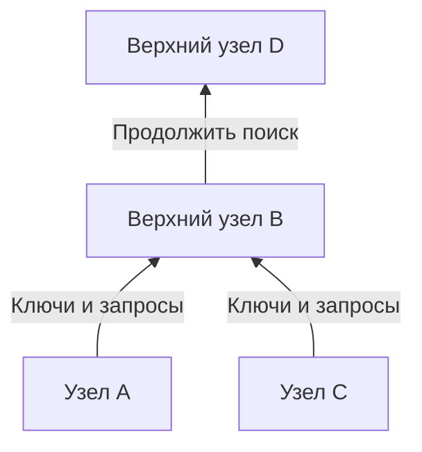
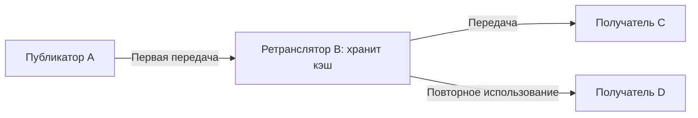

## 1. Какую задачу решала Winny

Нужно раздать большой файл множеству людей, но исходный отправитель ограничен в скорости отдачи. При этом хочется обойтись без центрального поискового сервера и затруднить установление того, кто опубликовал файл первым. Совмещение этих трёх целей и делает Winny технически интересной.

Winny — программа обмена файлами P2P, созданная Исаму Канэко. Первая пробная версия вышла 6 мая 2002 года. В **одноранговой сети** компьютеры не только получают данные, но и предоставляют их другим. Каждый участник называется пиром или узлом. [Решение Верховного суда Японии, английский перевод в WIPO Lex][court]

Само слово P2P не определяет ни способ поиска, ни анонимность. Следует различать **обнаружение узлов, поиск файлов и передачу содержимого**. Схемы и расчёты ниже — концептуальные модели, а не записи обмена конкретной версии.

## 2. Без центрального сервера, но не без точки входа

При обычной веб-раздаче пользователь обращается к указанному серверу. CDN может распределять доставку; для сравнения здесь берём один источник. В P2P получатель сам может стать поставщиком.

Winny не требует центрального сервера с каталогом файлов. Но новому узлу всё равно нужен первый адрес для подключения. Сведения о начальных узлах позволяют установить первые связи. Отсутствие центрального каталога не отменяет начальных контактов и инфраструктуры Интернета. [Технические материалы JPNIC][jpnic]

Эти логические связи образуют **оверлейную сеть**, подобно автобусным маршрутам поверх дорожной сети. Каждый узел обменивается сведениями с некоторыми соседями, а не со всеми участниками напрямую.

Запасные пути могут сохранить связь после ухода соседа. Однако частые подключения и отключения приводят к устареванию сведений. Децентрализация сама по себе не гарантирует нахождение каждого файла или устойчивость ко всем отказам.

## 3. Отделить маленькую запись от большого файла

В библиотеке не приносят все книги при каждом запросе. Сначала смотрят каталог, затем заказывают нужную книгу. Winny также разделяет метаданные поиска и содержимое.

| Элемент | Назначение | Важное различие |
|---|---|---|
| Ключ | Имя, размер, хеш, адрес получения и другие сведения каталога | Здесь это не ключ расшифрования |
| Тело/кэш | Хранение и передача зашифрованного содержимого | Держатель кэша не обязательно первый публикатор |
| Хеш | Идентификация и сравнение файлов | Не подпись, доказывающая авторство или безопасность |

В отчёте о выступлении Канэко объясняются это разделение и хранение данных на промежуточных узлах. [Отчёт GLOCOM][glocom]

Два файла с именем `lecture.zip` могут иметь разное содержимое. Связанные с содержимым идентификаторы помогают различать варианты, но вредоносные файлы тоже имеют хеши. Соответствие каталогу не означает безопасность запуска.

## 4. Иерархия и группировка направляют поиск

Если при каждом поиске спрашивать всех, трафик будет расти вместе с сетью. Winny строит иерархию с учётом скорости соединения: ключи и запросы идут преимущественно к верхним уровням. **Кластеризация** связывает узлы с похожими ключевыми словами интересов, повышая эффективность поиска. [JPNIC][jpnic]

Это схема направления. «Верхний» не означает географический север или постоянный сервер организации. Даже быстрое соединение ограничено, и сосредоточение работы наверху создаёт нагрузку.

Кластеризацию можно представить как облегчение поиска музыкальных сведений рядом с любителями музыки. Сходство ключевых слов — не оценка истинности или качества содержимого искусственным интеллектом.

**Описывать Winny как DHT, направляющую запрос к узлу с ближайшим хешем, неверно.** Распределённая хеш-таблица назначает узлам ответственность за части пространства ключей; это другой подход. Применение хешей для идентификации файлов не превращает сеть в DHT. Идентификатор каталога и путь поиска — разные вещи.

## 5. Ретрансляция и кэш создают новых поставщиков

После нахождения кандидата нужно получить содержимое. Путь поисковых сведений не обязан совпадать с путём данных. В Winny предусмотрен механизм, при котором узел меняет адрес получения в ключе, принимает запрос, забирает данные у предыдущего источника, пересылает и сохраняет их. Кэш обслуживает последующие запросы. [JPNIC][jpnic]

D использует копию B, а не получает файл прямо от A. Нагрузка A снижается, а непосредственный отправитель для D отличается от первого публикатора. Это не означает, что каждая загрузка проходит одинаковое число посредников.

### Передать 100 МБ ста получателям

Пусть $F$ — размер файла, $n$ — число получателей. Если один источник отправляет каждому полную копию, объём его отдачи равен:

$$
V_0 = nF
$$

При $F=100$ МБ и $n=100$ это 10 000 МБ. Сравним с идеальным случаем: источник отдаёт одну копию, а остальные 99 доставок выполняют держатели кэша.

| Предположение | Отдача источника | Отдача других участников |
|---|---:|---:|
| Источник напрямую обслуживает всех 100 | 10 000 МБ | 0 МБ |
| Одна исходная копия и 99 повторных раздач | 100 МБ | 9 900 МБ |

**Исчезает концентрация нагрузки на источнике, а не трафик, нужный для доставки всех копий.** Ретрансляция, повторы и поиск могут увеличить общий объём. Это не измерения Winny и не обещание стократного ускорения.

Пусть $u_i$ — скорость отдачи каждого из $k$ поставщиков, а $d$ — пропускная способность получателя. При параллельной загрузке концептуальная верхняя граница эффективной скорости $r$ такова:

$$
r \leq \min\left(d,\sum_{i=1}^{k}u_i\right)
$$

Влияют также перегрузка, скорость диска и наличие нужных данных. Десять поставщиков на одном медленном канале не увеличивают его скорость в десять раз. Популярные файлы накапливают копии; редкий файл может стать недоступным, когда отключится единственный держатель.

## 6. Шифрование не означает невидимость

Winny сочетала шифрование, ретрансляцию и кэш, чтобы затруднить распознавание публикатора. Нужно разделять четыре свойства.

| Свойство | Вопрос | Дополнительные факторы |
|---|---|---|
| Конфиденциальность | Может ли наблюдатель прочитать содержимое? | Алгоритм, реализация, управление ключами |
| Анонимность | Можно ли связать действия с человеком? | Соседи, время и объём трафика |
| Подлинность | Пришли ли данные от заявленного автора? | Доверенные подписи или источники |
| Безопасность устройства | Может ли открытие файла повредить компьютеру? | Права запуска и защита от вредоносного ПО |

Для прямой IP-связи нужен адрес назначения. Шифрование не скрывает сам факт соединения и всю информацию о его концах. Наблюдение отдачи из кэша само по себе не доказывает первичную публикацию, но сведения из разных мест и моментов могут сопоставляться.

Заявление об анонимности требует модели угроз: кто и что видит? Наблюдать одного соседа и множество соединений — разные возможности. Поэтому выражения «полная анонимность» и «принципиальная невозможность отследить» неуместны.

## 7. Утечки: отделить заражение от повторной раздачи

Утечки через Winny проще рассматривать в два этапа: вредоносная программа или другая причина раскрывает частные данные компьютера, затем сеть копирует их. IPA исследовала реагирование на реальные инциденты. [Отчёт IPA][ipa]

Типовая объяснительная цепочка: **запуск подозрительного файла → сбор и публикация сведений вредоносной программой → получение другими узлами → повторная раздача из кэшей**. Это не значит, что запуск Winny обязательно открывает весь диск. Поведение вредоносной программы и P2P-доставка различаются.

Удаление оригинала не обязательно удалит копии на чужих компьютерах. Если заражённое устройство читает открытые данные, взламывать шифр не требуется. Одно шифрование канала не закрывает этот путь.

Какие данные доступны для раздачи? Может ли пользователь это проверить? Как далеко распространяется ущерб от взлома? Можно ли отозвать ошибочную публикацию? Удобство и управляемость важны не меньше эффективности.

## 8. История и судебный вывод отдельно от оценки техники

| Дата | Событие |
|---|---|
| Май 2002 года | Первая пробная версия |
| Май 2003 года | Пробная Winny 2 с целью создания P2P-форума |
| 2004 год | Канэко арестован по подозрению в пособничестве нарушению авторского права |
| 19 декабря 2011 года | Верховный суд отклонил жалобу обвинения, оправдание разработчика стало окончательным |

Форум Winny 2 был приложением поверх распределённой доставки. Кластеризация поиска сама по себе форумом не являлась. Распределение не гарантирует подлинность сообщений, вечное хранение или устойчивость к любому удалению. [GLOCOM][glocom]

Суд рассматривал, являлось ли предоставление программы преступным содействием нарушениям пользователей при конкретных обстоятельствах дела. Верховный суд не признал уголовной ответственности разработчика в этом деле. Он не легализовал любой файлообмен и не установил всеобщий иммунитет разработчиков. [Решение][court]

## 9. Какие вопросы проектирования остаются

«Новаторское, значит безопасное» и «был вред, значит распределение бесполезно» — слишком грубые оценки. Поиск, доставка, приватность и управление являются разными целями.

Разделение метаданных и содержимого, повторное использование копий и связь похожих интересов экономят ресурсы. Но больше копий — сложнее отзыв; больше посредников — иные задержки и точки наблюдения. Выгоды и издержки возникают из одних механизмов.

Задайте современным системам пять вопросов: **Как находится первый узел? Где выполняется поиск? Кто передаёт содержимое? Что и от кого скрыто? Кто контролирует данные после публикации?** Winny даёт конкретный пример для раздельного рассмотрения этих вопросов.

## Источники

- [JPNIC: основы P2P и эксплуатация сетей, Internet Week 2006, особенно с. 9–15 (японский)][jpnic]
- [GLOCOM: отчёт о выступлении Канэко о Winny, 2006 (японский)][glocom]
- [IPA: реагирование на утечки через Winny, 2007 (японский)][ipa]
- [WIPO Lex: Верховный суд, 2009 (A) 1900, 19 декабря 2011 года (английский перевод)][court]

[jpnic]: https://www.nic.ad.jp/ja/materials/iw/2006/proceedings/T3-1.pdf
[glocom]: https://www.glocom.ac.jp/wp-content/uploads/2020/10/chijo106_042-053.pdf
[ipa]: https://www.ipa.go.jp/archive/files/000011527.pdf
[court]: https://www.wipo.int/wipolex/en/text/584277
