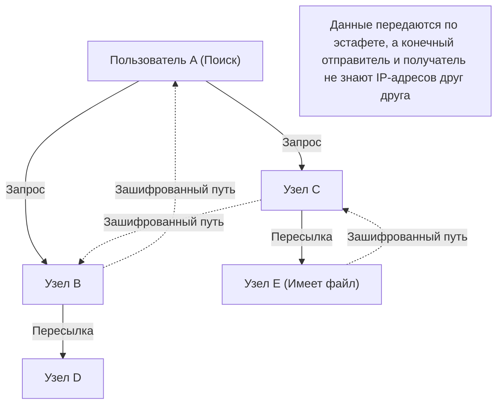

## 1. Что такое Winny, покоривший начало 2000-х годов

В 2002 году на доске загрузок огромного электронного форума 2channel анонимный программист под ником «47-й» (47氏) опубликовал одну программу. Это и был **Winny**.

Winny представлял собой «программу для обмена файлами», позволяющую пользователям в интернете напрямую обмениваться файлами. Она отличалась от существующих систем высокой степенью анонимности и потрясающей эффективностью передачи данных, в мгновение ока завоевав миллионы пользователей.
Однако из-за своей высокой анонимности программа стала рассадником нарушений авторских прав. Кроме того, участившиеся случаи утечки конфиденциальной информации из-за вирусов переросли в крупную социальную проблему. В 2004 году разработчик Исаму Канэко (47-й) был арестован по подозрению в пособничестве нарушению авторских прав, что стало началом одной из самых печальных страниц в истории японских ИТ.

В этой статье мы глубоко проанализируем с точки зрения чистой информатики инновационность «самых передовых в мире P2P (Peer-to-Peer) сетевых технологий того времени», заложенных в Winny, о которых редко говорят за тенью социальных аспектов, таких как проблемы с авторскими правами.

## 2. Что такое P2P (Peer-to-Peer)?

Чтобы понять технологии Winny, необходимо сначала разобраться в базовой структуре сетей.

### Клиент-серверная архитектура (традиционная)

Большая часть интернета, которой мы обычно пользуемся, например, веб-сайты или YouTube, работает по этой схеме.
В центре находится мощный «сервер», а множество «клиентов» (наши ПК и смартфоны) запрашивают у него данные. Хотя структура проста и легко управляема, у неё есть слабые места: при пиковых нагрузках сервер может выйти из строя, а администраторы серверов несут огромные расходы.

### P2P архитектура (Peer-to-Peer)

Это схема, в которой нет центрального сервера, а отдельные ПК (пиры), участвующие в сети, общаются друг с другом напрямую на равных условиях, предоставляя данные друг другу.
Она обладает устойчивым свойством: чем больше участников, тем больше масштабируются вычислительные мощности и пропускная способность всей системы.

## 3. Инновационность Winny: чистый P2P и архитектура Freenet

Зарубежные файлообменные программы того времени (такие как Napster) использовали «гибридный P2P», где сам обмен файлами происходил между пользователями (P2P), но поисковый сервер, знающий, у кого какой файл, находился в центре. Слабость этой схемы заключалась в том, что при остановке центрального сервера гибла вся сеть.

В отличие от них, Winny реализовал **«чистый P2P (Pure P2P)»**, вообще не имеющий центральных серверов.
Сетевая модель Winny базировалась на архитектуре Freenet, разработанной для обеспечения высокой анонимности, с добавлением уникальных и выдающихся улучшений от Канэко.

### Автономная распределенная маршрутизация на основе ключей (Key)

В сети Winny файлам присваивался «ключ» на основе уникального хэш-значения (подобие отпечатка файла), а отдельным узлам (ПК пользователей) также присваивался «ID узла» на основе случайных чисел.

При поиске пользователь не указывал конкретный IP-адрес, а передавал запрос вроде «У кого из узлов есть информация, близкая к этому ключу?» соседнему узлу, как по эстафете.
Поскольку каждый узел перенаправлял запрос к «узлу, который ближе к запросу» из имеющейся у него информации, вся сеть автономно функционировала как своеобразная «огромная распределенная база данных», а встроенный математический алгоритм позволял эффективно находить нужный файл.

## 4. Метод «кэш-реле», породивший идеальную анонимность

Главная причина, по которой Winny поразил инженеров того времени, — это его надежный механизм **анонимности**.

В обычном P2P при скачивании файла отправитель (сид) и получатель (личер) связываются напрямую по IP-адресам, поэтому легко определить, кто кому отправил файл.
Однако Winny внедрил механизм **«эстафетной передачи файлов и автоматического кэширования»**.

1. **Зашифрованный путь передачи**: файлы передавались не напрямую, а транзитом (через реле) через несколько независимых промежуточных узлов, и все коммуникации на этом пути были зашифрованы.
2. **Распространение владельцев за счет автоматического кэширования**: это ключевой момент. На жестких дисках не связанных между собой узлов, выступающих в качестве ретрансляторов, часть передаваемого файла автоматически сохранялась как «зашифрованный кэш».
3. **Сокрытие отправителя**: благодаря этому, даже обнаружив, что определенный узел отправляет файл, принципиально невозможно системно отличить, является ли этот человек «первоначальным публикатором файла» или просто «не имеющим к нему отношения человеком, через которого проходит транзит».

Гениальность Канэко заключалась в том, что он блестяще связал увеличение нагрузки на сеть из-за «эстафетной передачи для анонимизации» с эффективностью в виде того, что «распределяя кэш по всей сети, чем популярнее файл, тем быстрее его можно скачать с близлежащих узлов (эффект CDN)».

## 5. Кластеризация: внедрение функции BBS (форума)

Начиная с Winny2, в P2P-сети была реализована не только функция обмена файлами, но и функция «форума».
Это была полностью не подверженная цензуре распределенная доска объявлений, не нуждающаяся в центральном сервере 2channel.

Здесь применялась «технология кластеризации» на основе интересов пользователей. Топология сети (форма соединений) динамически изменялась, обучаясь на действиях пользователей — например, группы узлов, интересующихся аниме, или узлы, интересующиеся музыкой. В результате похожие пользователи автоматически размещались рядом друг с другом.
Благодаря этому достигалось крайне эффективное распространение информации без необходимости впустую искать ее по всей огромной сети. Этот продвинутый алгоритм кластеризации обладал дальновидностью, перекликаясь с современными системами рекомендаций на базе ИИ и технологиями распределенных вычислений.

## 6. Свет и тень: эволюция технологий и социальные трения

Технические концепции, заложенные в Winny, такие как «полная децентрализация», «сокрытие связи с помощью шифрования» и «эффективная автономная распределенная маршрутизация», были невероятно передовыми и напрямую связаны с появившимися позже идеями «**блокчейна**» (как, например, Bitcoin) и децентрализованного веба (Web3), такого как IPFS.

Если бы Исаму Канэко не был арестован, а этот редкий талант был направлен на легальную разработку инфраструктуры, и Япония создала бы распределенную систему мирового стандарта, то, возможно, карта гегемонии нынешнего интернета выглядела бы несколько иначе.

Технологии сами по себе не бывают хорошими или плохими. Однако когда технология настолько мощна, что обгоняет развитие правовой базы общества, возникает сильнейшее трение. История Winny ставит перед нами актуальные и сегодня серьезные вопросы: об инновациях, социальной ответственности и о том, как следует защищать и воспитывать инженеров.
