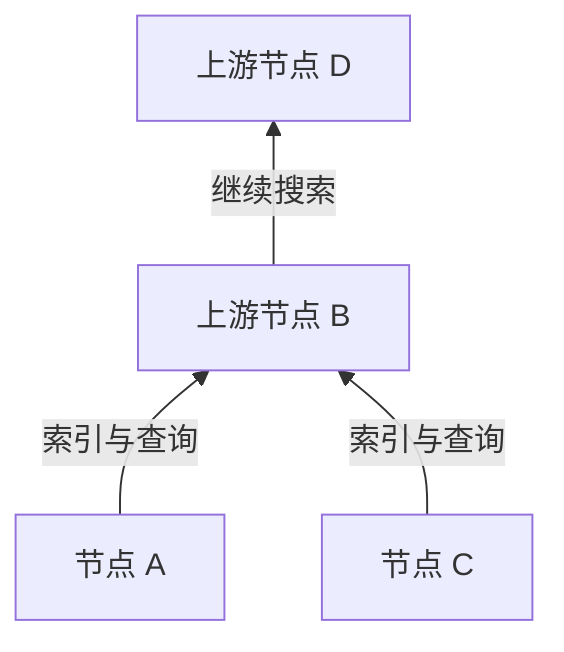
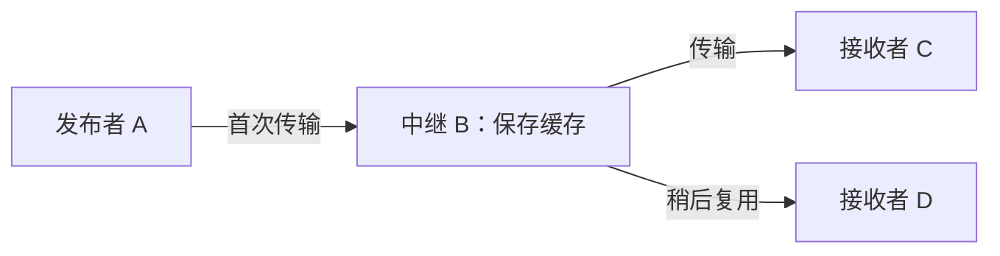

## 1. Winny 试图解决什么问题？

希望把大文件分发给许多人，但最初提供者的上传带宽有限；不想设置中央搜索服务器，又希望原始发布者不容易被识别。如何兼顾这三个目标？这是 Winny 在技术上值得研究的地方。

Winny 是金子勇开发的 P2P 文件共享软件，首个测试版于 2002 年 5 月 6 日发布。**P2P，即点对点通信**，意味着参与计算机不仅接收数据，也向其他参与者提供数据。每个参与者称为对等节点，简称节点。[日本最高法院判决英译本（WIPO Lex）][court]

不过，P2P 这个名称并不能说明如何搜索，也不能保证匿名。需要区分**发现其他节点、搜索文件、传输文件内容**三件事。本文的图和数值示例都是概念模型，并非某个版本的实际通信记录。

## 2. 没有中央服务器，仍然需要接入起点

普通网页分发由用户连接指定服务器。现实中也可借助 CDN 分散流量；这里为便于比较，只考虑一个源服务器。P2P 的不同之处是接收者也能成为提供者。

Winny 不需要集中保存文件目录的中央搜索服务器，但新节点如果不知道任何其他节点的地址，就无从连接。它需要以初始节点信息为起点建立联系。没有中央目录，不等于不需要初始连接信息和互联网基础设施。[JPNIC 技术资料][jpnic]

这些逻辑连接构成**覆盖网络**：就像道路之上的公交线路，应用在 IP 网络之上组织自己的路径。每个节点只与部分邻居交换信息，而不是连接全部参与者。

如果存在替代路径，邻居离线后通信仍可继续。但节点频繁加入、离开，会使连接信息过时。去中心化本身并不保证每个文件都能找到，也不保证能承受所有故障。

## 3. 把小索引与大文件分开

在图书馆找书时，不必搬来所有书。先查目录，再取需要的书即可。Winny 同样把搜索元数据和文件内容分开。

| 元素 | 作用 | 容易混淆的地方 |
|---|---|---|
| 键（key） | 文件名、大小、哈希值、获取地址等索引信息 | 此处不是密码学中的解密密钥 |
| 本体／缓存 | 保存和传输加密的文件内容 | 持有缓存的人未必是原始发布者 |
| 哈希值 | 用于识别和比对文件 | 不是证明作者身份或文件安全的数字签名 |

开发者讲演的报告介绍了这种分离，以及在中继节点保存内容的设计。[GLOCOM 讲演报告][glocom]

两个都叫 `lecture.zip` 的文件可能内容不同。与内容对应的标识有助于区分文件，但恶意文件也有哈希值。“与索引描述一致”和“执行起来安全”是两种不同的性质。

## 4. 通过分层和聚类缩小搜索范围

每次都询问所有节点，搜索流量就会随规模增长。Winny 根据连接速度组织层次，索引信息主要向上游传播，搜索也主要向上游进行。**聚类**则让兴趣关键词相近的节点更容易连接，提高搜索效率。[JPNIC 技术资料][jpnic]

这是表示方向的示意图。“上游”既不是地理上的北方，也不是固定由某家公司运营的服务器。高速连接的容量仍然有限，工作集中在上游也会产生负载问题。

可以把聚类理解为：在音乐爱好者附近，更容易找到音乐相关信息。它利用关键词相近这一特征，并不是让 AI 判断内容是否正确或有价值。

**把 Winny 说成“向哈希值最近的节点路由的 DHT”并不恰当。** 分布式哈希表将键空间分配给不同节点，是另一种设计。使用哈希识别文件，不会自动让网络成为 DHT。目录编号和查找目录的路径必须分开理解。

## 5. 中继和缓存怎样增加提供者？

找到候选文件后，才开始获取内容。搜索信息的路径不一定等于文件数据的路径。Winny 的一种机制允许节点改写索引中的获取地址，接受请求后从原来的提供者取回数据，再中继并保存。缓存随后可以服务其他请求。[JPNIC 技术资料][jpnic]

D 使用 B 的副本，而不是直接从 A 接收。这既减轻 A 的负载，也使 D 的直接发送者 B 与最初发布者 A 分离。但不能据此断言所有下载都经过相同数量的中继。

### 向 100 人发送 100 MB

设文件大小为 $F$，接收人数为 $n$。如果单个来源向每人发送一份完整副本，其上传总量为：

$$
V_0 = nF
$$

当 $F=100\,\mathrm{MB}$、$n=100$ 时，结果为 10,000 MB。再考虑理想情况：来源仅发送一份，随后 99 次分发由缓存持有者完成。

| 分发假设 | 原始来源上传量 | 其他参与者上传量 |
|---|---:|---:|
| 来源直接发给全部 100 人 | 10,000 MB | 0 MB |
| 首次发送一份，再分发 99 次 | 100 MB | 9,900 MB |

**减少的是来源承担的集中负载，而不是让每个人获得副本所需的流量。** 中继、重传和搜索开销还可能增加总流量。这不是 Winny 的测量结果，也不意味着速度必然提升 100 倍。

类似地，设 $k$ 个提供者各自的上传速率为 $u_i$，接收方的下载容量为 $d$。在可并行获取的假设下，有效速率 $r$ 的概念性上界为：

$$
r \leq \min\left(d,\sum_{i=1}^{k}u_i\right)
$$

实际还受拥塞、磁盘速度和数据分布影响。十个提供者若共用一条慢线路，速度不会变成十倍。热门文件容易积累副本，冷门文件则可能因唯一持有者离线而无法获取。

## 6. 加密不等于隐身

Winny 将加密、中继和缓存结合起来，试图让发布者更难识别。但下面四种性质应当分别讨论。

| 性质 | 问题 | 还需考虑 |
|---|---|---|
| 保密性 | 旁观者能否读取内容？ | 算法、实现、密钥管理 |
| 匿名性 | 能否把行为关联到个人？ | 邻居、时间和流量观测 |
| 真实性 | 数据是否来自声称的作者？ | 可信签名或发布来源 |
| 终端安全 | 打开文件会不会危害电脑？ | 执行权限和恶意软件防护 |

IP 网络中的直接通信需要目标 IP 地址。加密不会抹去连接的存在，也不会隐去一切端点信息。仅看到某节点发送缓存，不足以断定它最初发布了文件；但不同位置、不同时间的观测可能被结合起来。

匿名性需要明确威胁模型：谁能看到什么？只观察一个邻居，与监测大量连接的能力不同。因此，“完全匿名”“原理上无法追踪”都不是合适的评价。

## 7. 信息泄露：区分终端入侵与再分发

Winny 相关泄露可以分为两个阶段：恶意软件等因素把电脑中的私人数据暴露出去，网络随后复制这些数据。IPA 调查过实际事件的处置过程。[IPA 报告][ipa]

典型的解释链条是：**运行可疑文件 → 恶意软件收集并公开信息 → 其他节点获取 → 缓存继续分发**。这并不意味着启动 Winny 就一定会公开整块硬盘。恶意程序的行为和 P2P 分发机制必须区分。

删除原文件，不一定能删除已经到达其他电脑的副本。如果受感染的终端直接读取明文，根本不需要破解加密。仅靠传输加密无法堵住这个入口。

哪些数据参与共享？用户能否检查？终端遭入侵时影响能扩散多远？误发布能否撤回？易用性和可控性与分发效率同样重要。

## 8. 将历史与司法结论同技术评价分开

| 时间 | 事件 |
|---|---|
| 2002 年 5 月 | 首个测试版发布 |
| 2003 年 5 月 | 面向 P2P 论坛的 Winny 2 测试版发布 |
| 2004 年 | 金子勇因涉嫌帮助侵犯著作权被捕 |
| 2011 年 12 月 19 日 | 最高法院驳回检方上诉，开发者无罪判决确定 |

Winny 2 的论坛是建立在分布式传输之上的应用，而不是搜索聚类本身。分布式结构不会自动保证帖子真实、永久保存，或抵抗所有删除方式。[GLOCOM 讲演报告][glocom]

案件审理的是：在具体案情下，开发者提供软件是否构成帮助用户侵犯著作权的犯罪。最高法院没有认定开发者在该案中构成犯罪。这既不是将所有文件共享合法化，也不是赋予软件开发者普遍免责权。[最高法院判决][court]

## 9. Winny 留下的设计问题

“有创新，所以安全”和“造成过伤害，所以分布式技术毫无价值”都过于粗糙。搜索、传输、隐私和控制是不同的工程目标。

将元数据与内容分开、复用副本、连接兴趣相近的参与者，都有助于利用资源。但副本越多，撤回越困难；中继越多，延迟与观测位置也随之改变。收益和代价来自同一机制。

分析现代分布式系统时，也可以问五个问题：**第一个节点如何找到？在哪里搜索？谁发送内容？什么信息对谁隐藏？发布后谁还能控制？** Winny 为分别思考这些问题提供了具体案例。

## 参考资料

- [JPNIC：Internet Week 2006，P2P 基础与网络运维，特别是第 9—15 页（日文）][jpnic]
- [GLOCOM：金子勇关于 Winny 技术的讲演报告，2006 年（日文）][glocom]
- [IPA：通过 Winny 泄露信息的事件处置调查，2007 年（日文）][ipa]
- [WIPO Lex：最高法院 2009 (A) 1900 案，2011 年 12 月 19 日判决（英译）][court]

[jpnic]: https://www.nic.ad.jp/ja/materials/iw/2006/proceedings/T3-1.pdf
[glocom]: https://www.glocom.ac.jp/wp-content/uploads/2020/10/chijo106_042-053.pdf
[ipa]: https://www.ipa.go.jp/archive/files/000011527.pdf
[court]: https://www.wipo.int/wipolex/en/text/584277
