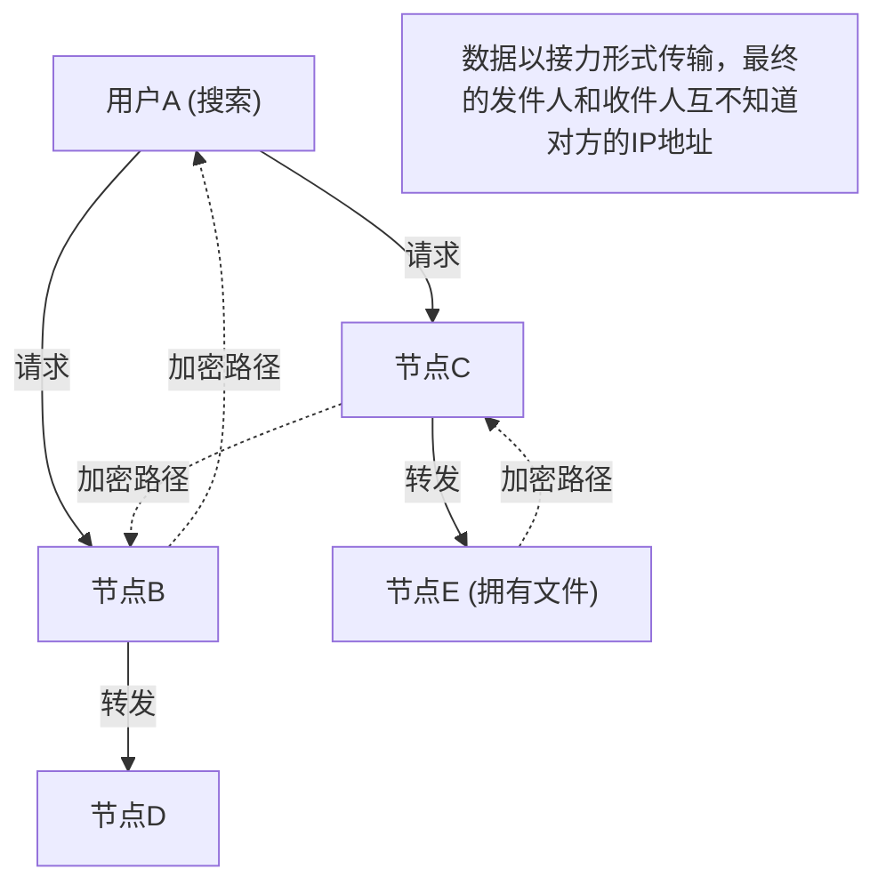

## 1. 2000年代初头席卷社会的「Winny」是什么

2002年，一款软件由自称「47氏」的匿名程序员在巨大的电子公告板「2ch」的下载版块公开发布了。那就是「 **Winny（ウィニー）** 」。

Winny是一款允许互联网上的用户之间直接进行文件交换的「文件共享软件」。它凭借与现有系统截然不同的高匿名性和压倒性的传输效率，瞬间获得了数百万的用户。
然而，正是由于其高度的匿名性，它成为了违反版权法的温床，并且由于病毒导致的机密信息泄露事件频发，演变成了一个重大的社会问题。2004年，开发者金子勇先生（47氏）因涉嫌协助侵犯版权被捕，这成为了日本IT史上留下悲剧的导火索。

在本文中，我们将从纯粹的计算机科学视角，深入解说Winny所包含的、隐藏在版权问题等社会层面背后较少被提及的「当时世界最顶尖的P2P（Peer-to-Peer）网络技术」的创新性。

## 2. 什么是P2P（Peer-to-Peer）？

为了理解Winny的技术，首先必须了解网络的基本结构。

### 客户端-服务器型（传统型）
网站、YouTube等我们平时使用的互联网大部分都采用这种模式。
中心存在着强大的「服务器」，众多的「客户端（我们的PC或智能手机）」向服务器请求数据。虽然结构简单易于管理，但缺点是如果访问集中，服务器可能会宕机，而且服务器管理员需要承担巨大的成本。

### P2P型（Peer-to-Peer）
不存在中心服务器，参与网络的各个PC（节点）在平等的立场上互相直接通信，并互相提供数据。
它具有一种强韧的特性，即参与者越多，整个系统的处理能力和带宽就越能实现规模扩张。

## 3. Winny的创新性：纯P2P与Freenet架构

当时海外的文件共享软件（如Napster等）采用的是「文件交换本身在用户之间（P2P）进行，但关于谁拥有哪个文件的搜索服务器存在于中心」的「混合P2P」模式。这种模式的弱点在于，一旦中心服务器被停止，整个网络就会瘫痪。

与此相对，Winny实现了完全没有中心服务器的「 **纯P2P（纯粹P2P）** 」。
Winny的网络模型是基于为了实现高匿名性而开发的「Freenet」架构，并加入了金子先生独创的极其优秀的改进而成的。

### 基于密钥（Key）的自主分布式路由
在Winny的网络中，文件会被分配一个基于固有哈希值（类似文件的指纹）的「密钥」，而各个节点（用户的PC）也会被分配一个基于随机数的「节点ID」。

在进行搜索时，用户并不是指定特定的IP地址，而是像接力传水桶一样，将「谁拥有与这个密钥相近的信息？」的请求传递给相邻的节点。
每个节点会从自己拥有的信息中，将其转发给「与请求更相近的节点」，因此整个网络就像一个「巨大的分布式数据库」一样自主运作，其中内置了能够高效找到目标文件的数学算法。

## 4. 创造极致匿名性的「缓存中继」方式

Winny让当时的工程师们惊叹的最大原因，在于其坚固的 **匿名性** 机制。

在普通的P2P中，下载文件时，发送方（做种者）和接收方（下载者）直接连接IP地址进行通信，因此很容易就能查出是谁把文件发给了谁。
然而，Winny采用了「 **文件的接力传递与自动缓存** 」机制。

1. **加密的传输路径** ：文件不是直接发送，而是中途经过（中继）多个无关的节点进行传输，并且该路径上的所有通信都是加密的。
2. **通过自动缓存扩散持有者** ：这是最关键的一点。在作为中继点的无关节点的硬盘上，传输中文件的一部分会自动作为「加密的缓存」被保存下来。
3. **隐藏发送源** ：由此一来，即使发现某个节点正在发送文件，在系统上也从原理上不可能区分出那个人到底是「原始文件的发布者」，还是仅仅「被强制作为中继的无关人士」。

金子先生的天才之处在于，他将这种「为了匿名化而进行的中继传输」所带来的网络负载增加，以「通过将缓存分散配置到整个网络中，越受欢迎的文件就越能从附近的节点高速下载（类似CDN的效果）」的形式，完美地与效率提升结合在了一起。

## 5. 聚类：内置BBS（公告板）功能

从Winny2开始，不仅是文件共享，「公告板」功能也被实现在了P2P网络上。
这是一个完全无法审查的分布式公告板，不需要中心的2ch服务器。

在这里，采用了基于用户兴趣和关注点的「聚类技术」。对动画感兴趣的节点群、对音乐感兴趣的节点群等，网络拓扑（连接形态）会学习用户的行为并动态变化，使得相似的人会自动被配置到相近的位置。
通过这种方式，无需无谓地搜索整个庞大的网络，就实现了极其高效的信息传播。这种高级的聚类算法，具有与现代AI推荐系统和分布式处理技术相通的前瞻性。

## 6. 光与影：技术的进化与社会的摩擦

Winny所包含的「完全去中心化」、「通过加密隐藏通信」、「自主分布式的高效路由」等技术理念，与后来出现的比特币等「 **区块链** 」以及IPFS等分布式Web（Web3）的思想直接相通，是极为先进的。

如果金子勇先生没有被捕，这罕见的才华被用于合法的基建开发，从日本诞生出成为世界标准的分布式系统的话，现在的互联网霸权版图可能会有些不同。

技术本身没有善恶之分。然而，当这项技术过于强大，超越了社会的法律建设时，就会产生强烈的摩擦。Winny的历史，向我们抛出了创新与社会责任、以及应该如何保护和培养技术人员等，同样适用于现代的沉重问题。
