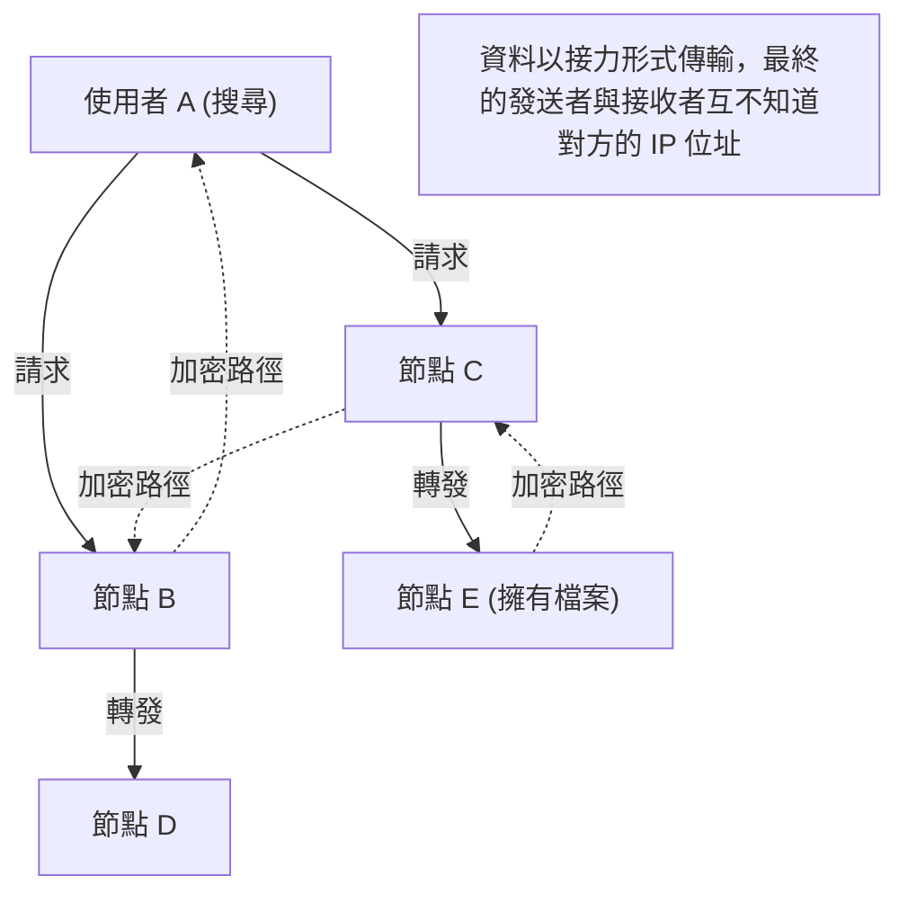

## 1. 席捲 2000 年代初期的「Winny」是什麼？

2002 年，在巨大的電子佈告欄「2ch」的下載板上，一位自稱「47氏」的匿名程式設計師發布了一款軟體。那就是「 **Winny** 」。

Winny 是一款讓網際網路上的使用者之間能夠直接互傳檔案的「檔案分享軟體」。它具備與現有系統截然不同的高匿名性與壓倒性的傳輸效率，在轉眼間便獲得了數百萬名使用者。
然而，正因為其高度的匿名性，成為了違反著作權法的溫床，加上因病毒導致機密資訊外洩的事件頻傳，進而演變成重大的社會問題。2004 年，開發者金子勇先生（47氏）因涉嫌幫助違反著作權法而遭到逮捕，成為了日本 IT 史上遺留的悲劇導火線。

在本文中，我們將從純粹的電腦科學視角，深入解說隱藏在著作權問題等社會層面下鮮少被提及的，Winny 所蘊含的「當時世界最頂尖的 P2P（Peer-to-Peer）網路技術」之革命性。

## 2. 什麼是 P2P（對等網路）？

為了理解 Winny 的技術，我們首先必須了解網路的基本結構。

### 主從式架構（傳統型）
網站或 YouTube 等我們平時使用的網際網路，大部分都屬於這種模式。
中央存在著強大的「伺服器」，而多數的「用戶端（我們的電腦或智慧型手機）」會向伺服器請求資料。這種架構的優點是結構簡單且易於管理，但缺點是當存取集中時伺服器可能會當機，且伺服器管理者需要承擔龐大的成本。

### P2P 型（Peer-to-Peer）
不存在中央伺服器，參與網路的各個電腦（節點）處於對等的立場，彼此直接進行通訊並互相提供資料的模式。
具有參與者越多，整個系統的處理能力和頻寬就越能擴展的強韌特性。

## 3. Winny 的革命性：純粹 P2P 與 Freenet 架構

當時海外的檔案分享軟體（如 Napster 等），採用的是「檔案的傳輸本身是由使用者之間（P2P）進行，但管理誰擁有哪個檔案的搜尋伺服器則存在於中央」的「混合式 P2P」模式。這種模式有一個弱點，就是一旦中央伺服器被停機，整個網路就會癱瘓。

相對於此，Winny 實現了完全不具備中央伺服器的「 **純粹 P2P（Pure P2P）** 」。
Winny 的網路模型，是以為了實現高匿名性而開發的「Freenet」架構為基礎，加上金子先生獨創且極為優秀的改良所打造出來的。

### 基於金鑰（Key）的自主分散式路由
在 Winny 的網路中，檔案會被分配一個基於其固有雜湊值（類似檔案的指紋）的「金鑰」，而各個節點（使用者的電腦）也會被分配一個基於亂數的「節點 ID」。

在進行搜尋時，使用者並不是指定特定的 IP 位址，而是像傳話遊戲一樣，將「誰擁有與這個金鑰相近的資訊？」的請求傳遞給相鄰的節點。
由於各個節點會從自己擁有的資訊中，將請求轉發給「與請求更相近的節點」，因此整個網路便作為一種「巨大的分散式資料庫」自主運作，系統內建了能高效率找到目標檔案的數學演算法。

## 4. 創造出極致匿名性的「快取接力」模式

Winny 讓當時的技術人員們驚嘆不已的最大理由，在於其堅固的 **匿名性** 機制。

在一般的 P2P 中，下載檔案時，發送者（種子）和接收者（下載者）會直接連接 IP 位址進行通訊，因此可以輕易查出是誰將檔案傳給了誰。
但是，Winny 採用了「 **檔案的接力傳遞與自動快取** 」機制。

1. **加密的傳輸路徑** ：檔案並不是直接傳送，而是中途經過（接力）多個無關的節點進行傳輸，且該路徑上的通訊全都被加密。
2. **透過自動快取擴散擁有者** ：這是最關鍵的一點。作為中繼站的無關節點的硬碟中，會自動將傳輸中檔案的一部分儲存為「加密的快取」作為備份。
3. **隱藏發送者** ：透過上述機制，即使發現某個節點正在發送檔案，從系統原理上也無法區分那個人究竟是「原始檔案的公開者」，還是單純「被迫作為中繼站的無關第三者」。

金子先生的天才之處在於，他將這種「為了匿名化而進行的接力傳輸」所增加的網路負載，透過「快取被分散配置到整個網路中，使得越熱門的檔案越能從附近的節點高速下載（類似 CDN 的效果）」的形式，漂亮地與效率提升結合在一起。

## 5. 分群（Clustering）：內建 BBS（佈告欄）功能

從 Winny2 開始，除了檔案分享之外，P2P 網路上也實作了「佈告欄」功能。
這是一個完全無法被審查的分散式佈告欄，不需要中央的 2ch 伺服器。

在這裡，採用了基於使用者興趣和關心的「分群（Clustering）技術」。對動畫感興趣的節點群、對音樂感興趣的節點群等，網路的拓樸（連接型態）會學習使用者的行為並動態變化，使興趣相投的人自動被配置在相近的位置。
透過這項技術，可以不用白費力氣去搜尋龐大的整個網路，實現了極高效率的資訊傳播。這種高度的分群演算法，具備了通往現代 AI 推薦系統與分散式處理技術的先見之明。

## 6. 光與影：技術的演進與社會的摩擦

Winny 所蘊含的「完全去中心化」、「透過加密隱藏通訊」、「自主分散式的高效路由」等技術概念，是極為先進的，這與後來出現的比特幣等「 **區塊鏈（Blockchain）** 」以及 IPFS 等分散式網頁（Web3）的思想直接相連。

如果金子勇先生沒有被捕，而這份罕見的才華被應用於合法的基礎建設開發上，並由日本創造出成為世界標準的分散式系統，那麼現在網際網路的霸權版圖可能就會有所不同了。

科技本身並沒有善惡之分。但是，當這項技術過於強大，超越了社會的法律規範時，就會產生強烈的摩擦。Winny 的歷史，向我們拋出了一個現代依然適用的沉重課題：關於創新與社會責任，以及我們應該如何保護並培育技術人員。
