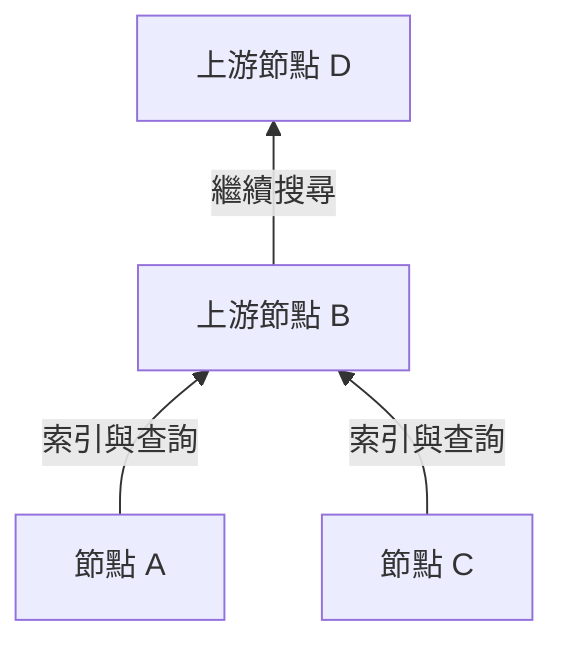
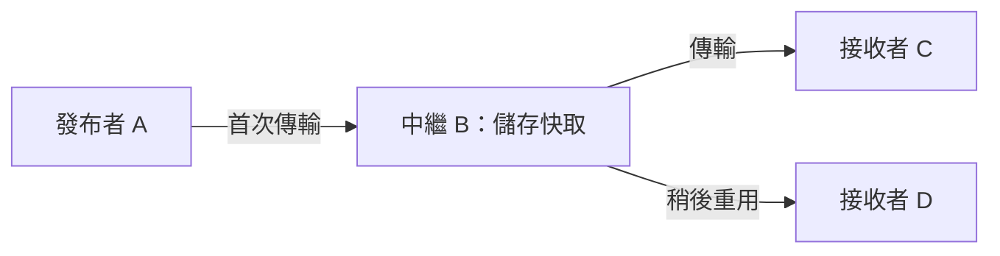

## 1. Winny 試圖解決什麼問題？

希望把大型檔案分送給許多人，但原始提供者的上傳頻寬有限；不想設置中央搜尋伺服器，又希望最初發布者不容易被辨識。如何兼顧這三個目標？這正是 Winny 在技術上值得研究的地方。

Winny 是金子勇開發的 P2P 檔案分享軟體，首個測試版於 2002 年 5 月 6 日發布。**P2P，也就是點對點通訊**，表示參與的電腦不只接收資料，也能向其他參與者提供資料。每個參與者稱為對等節點，簡稱節點。[日本最高法院判決英譯本（WIPO Lex）][court]

不過，P2P 這個名稱並不能說明如何搜尋，也不能保證匿名。需要區分**尋找其他節點、搜尋檔案、傳輸檔案內容**三件事。本文的圖與數值範例都是概念模型，並非特定版本的實際通訊紀錄。

## 2. 沒有中央伺服器，仍然需要連線起點

一般網頁傳送由使用者連到指定伺服器。實務上也可透過 CDN 分散流量；這裡為方便比較，只考慮單一來源。P2P 的差異在於接收者也能成為提供者。

Winny 不需要集中儲存檔案目錄的中央搜尋伺服器，但新節點若不知道任何其他節點的位址，就無從連線。它需要以初始節點資訊為起點建立聯繫。沒有中央目錄，不代表不需要初始連線資訊與網際網路基礎設施。[JPNIC 技術資料][jpnic]

這些邏輯連線構成**覆疊網路**：就像道路之上的公車路線，應用程式在 IP 網路上組織自己的路徑。每個節點只與部分鄰居交換資訊，而不是連到所有參與者。

若有替代路徑，鄰居離線後通訊仍可繼續。但節點頻繁加入、離開，會讓連線資訊過時。去中心化本身不保證每個檔案都找得到，也不保證能承受所有故障。

## 3. 把小索引與大檔案分開

在圖書館找書時，不必搬來所有書。先查目錄，再取需要的書即可。Winny 同樣將搜尋用的中繼資料與檔案內容分開。

| 元素 | 作用 | 容易混淆之處 |
|---|---|---|
| 鍵（key） | 檔名、大小、雜湊值、取得位址等索引資訊 | 這裡不是密碼學中的解密金鑰 |
| 本體／快取 | 儲存與傳輸加密的檔案內容 | 持有快取的人未必是最初發布者 |
| 雜湊值 | 用來辨識與比對檔案 | 不是證明作者身分或檔案安全的數位簽章 |

開發者演講的報告介紹了這種分離，以及在中繼節點儲存內容的設計。[GLOCOM 演講報告][glocom]

兩個都叫 `lecture.zip` 的檔案可能內容不同。對應內容的識別資訊有助於區分檔案，但惡意檔案也有雜湊值。「符合索引描述」和「執行起來安全」是不同的性質。

## 4. 透過分層與分群縮小搜尋範圍

每次都詢問所有節點，搜尋流量就會隨規模增加。Winny 依連線速度建立階層，索引資訊主要往上游傳播，搜尋也主要朝上游進行。**分群**則讓興趣關鍵字相近的節點較容易連結，提高搜尋效率。[JPNIC 技術資料][jpnic]

這是表示方向的示意圖。「上游」既不是地理上的北方，也不是固定由某家公司經營的伺服器。高速連線仍有容量限制，工作集中於上游也會帶來負載問題。

可以把分群想成：在音樂愛好者附近，更容易找到音樂相關資訊。它利用關鍵字相近的特徵，並不是讓 AI 判斷內容是否正確或有價值。

**把 Winny 說成「往雜湊值最近的節點路由的 DHT」並不恰當。** 分散式雜湊表把鍵值空間分配給不同節點，是另一種設計。使用雜湊辨識檔案，不會自動讓網路成為 DHT。目錄編號與搜尋目錄的路徑必須分開理解。

## 5. 中繼與快取如何增加提供者？

找到候選檔案後，才開始取得內容。搜尋資訊的路徑不一定等於檔案資料的路徑。Winny 的一種機制讓節點改寫索引中的取得位址，接受請求後向原本的提供者取得資料，再中繼並儲存。快取之後可以服務其他請求。[JPNIC 技術資料][jpnic]

D 使用 B 的副本，而不是直接向 A 接收。這既降低 A 的負載，也讓 D 的直接傳送者 B 與最初發布者 A 分離。但不能據此認為所有下載都經過相同數量的中繼。

### 向 100 人傳送 100 MB

設檔案大小為 $F$，接收人數為 $n$。若單一來源向每人傳送一份完整副本，其上傳總量為：

$$
V_0 = nF
$$

當 $F=100\,\mathrm{MB}$、$n=100$，結果是 10,000 MB。再考慮理想情況：來源只傳送一份，接著 99 次分送由快取持有者完成。

| 分送假設 | 原始來源上傳量 | 其他參與者上傳量 |
|---|---:|---:|
| 來源直接傳給全部 100 人 | 10,000 MB | 0 MB |
| 首次傳送一份，再分送 99 次 | 100 MB | 9,900 MB |

**減少的是來源承擔的集中負載，而不是讓每個人取得副本所需的流量。** 中繼、重傳與搜尋開銷還可能增加總流量。這不是 Winny 的實測結果，也不代表速度必然提升 100 倍。

同樣地，設 $k$ 個提供者各自的上傳速率為 $u_i$，接收端的下載容量為 $d$。假設可以平行取得資料，有效速率 $r$ 的概念性上限為：

$$
r \leq \min\left(d,\sum_{i=1}^{k}u_i\right)
$$

實際還受壅塞、磁碟速度與資料分布影響。十個提供者若共用一條慢速線路，速度不會變成十倍。熱門檔案容易累積副本，冷門檔案則可能因唯一持有者離線而無法取得。

## 6. 加密不等於隱形

Winny 結合加密、中繼與快取，希望讓發布者更難辨識。但下面四種性質應分別討論。

| 性質 | 問題 | 還需考慮 |
|---|---|---|
| 機密性 | 旁觀者能否讀取內容？ | 演算法、實作、金鑰管理 |
| 匿名性 | 能否把行為連結到個人？ | 鄰居、時間與流量觀測 |
| 真實性 | 資料是否來自聲稱的作者？ | 可信簽章或發布來源 |
| 端點安全 | 開啟檔案會不會危害電腦？ | 執行權限與惡意軟體防護 |

IP 網路中的直接通訊需要目的地 IP 位址。加密不會抹去連線的存在，也不會隱藏所有端點資訊。只看到某節點傳送快取，不足以斷定它最初發布了檔案；但不同地點、時間的觀測可能被結合。

匿名性需要明確的威脅模型：誰能看見什麼？只觀察一個鄰居，與監測大量連線的能力不同。因此，「完全匿名」「原理上無法追蹤」都不是合適的評價。

## 7. 資料外洩：區分端點入侵與再次分送

Winny 相關外洩可以分成兩個階段：惡意軟體等因素把電腦內的私人資料公開出去，網路隨後複製資料。IPA 調查過實際事件的處理過程。[IPA 報告][ipa]

典型的解釋流程是：**執行可疑檔案 → 惡意軟體蒐集並公開資訊 → 其他節點取得 → 快取繼續分送**。這不表示啟動 Winny 就一定會公開整顆硬碟。惡意程式的行為與 P2P 分送機制必須區分。

刪除原始檔案，不一定能刪除已到其他電腦的副本。如果受感染端點直接讀取明文，根本不需要破解加密。僅靠傳輸加密無法堵住這個入口。

哪些資料參與分享？使用者能否檢查？端點遭入侵時影響能擴散多遠？誤發布能否撤回？易用性與可控性和分送效率同樣重要。

## 8. 將歷史與司法結論同技術評價分開

| 時間 | 事件 |
|---|---|
| 2002 年 5 月 | 首個測試版發布 |
| 2003 年 5 月 | 以 P2P 討論區為目標的 Winny 2 測試版發布 |
| 2004 年 | 金子勇因涉嫌幫助侵犯著作權遭逮捕 |
| 2011 年 12 月 19 日 | 最高法院駁回檢方上訴，開發者無罪判決確定 |

Winny 2 的討論區是建構於分散式傳輸之上的應用，而不是搜尋分群本身。分散式架構不會自動保證文章真實、永久保存，或能抵抗所有刪除方式。[GLOCOM 演講報告][glocom]

案件審理的是：在具體案情下，開發者提供軟體是否構成幫助使用者侵犯著作權的犯罪。最高法院未認定開發者在該案構成犯罪。這既不是將所有檔案分享合法化，也不是賦予軟體開發者普遍免責權。[最高法院判決][court]

## 9. Winny 留下的設計問題

「有創新，所以安全」與「造成過傷害，所以分散式技術毫無價值」都過於粗糙。搜尋、傳輸、隱私與控制是不同的工程目標。

將中繼資料與內容分開、重用副本、連結興趣相近的參與者，都有助於運用資源。但副本越多，撤回越困難；中繼越多，延遲與觀測位置也會改變。效益與代價來自同一機制。

分析現代分散式系統時，也可以問五個問題：**如何找到第一個節點？在哪裡搜尋？誰傳送內容？什麼資訊對誰隱藏？發布後誰還能控制？** Winny 提供了分別思考這些問題的具體案例。

## 參考資料

- [JPNIC：Internet Week 2006，P2P 基礎與網路維運，特別是第 9–15 頁（日文）][jpnic]
- [GLOCOM：金子勇關於 Winny 技術的演講報告，2006 年（日文）][glocom]
- [IPA：經由 Winny 洩漏資訊的事件處理調查，2007 年（日文）][ipa]
- [WIPO Lex：最高法院 2009 (A) 1900 案，2011 年 12 月 19 日判決（英譯）][court]

[jpnic]: https://www.nic.ad.jp/ja/materials/iw/2006/proceedings/T3-1.pdf
[glocom]: https://www.glocom.ac.jp/wp-content/uploads/2020/10/chijo106_042-053.pdf
[ipa]: https://www.ipa.go.jp/archive/files/000011527.pdf
[court]: https://www.wipo.int/wipolex/en/text/584277

