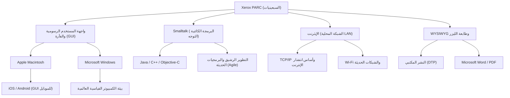

# Xerox PARC: المختبر الذي اخترع حواسيب المستقبل وفقد السوق

## مقدمة

عند استخدامنا لأجهزة الكمبيوتر أو الهواتف الذكية الحديثة، نعتبر النقر على الأيقونات على الشاشة، وتحريك النوافذ، والاتصال بالشبكات عبر Wi-Fi أو الإيثرنت، وإنشاء مستندات مطبوعة بخطوط عالية الدقة أمراً مفروغاً منه. ولكن هل تعلم أن كل هذه التقنيات قد تم اختراعها في "مكان واحد" وفي "وقت واحد تقريباً"؟

هذا المكان هو "Xerox PARC" (مركز أبحاث بالو ألتو التابع لشركة زيروكس)، والذي تأسس في السبعينيات. يقع هذا المختبر في التلال الهادئة لمدينة بالو ألتو بولاية كاليفورنيا، وكان بلا شك أحد الأماكن التي جمعت أكثر العقول ابتكارًا في تاريخ البشرية.

في هذه المقالة، نستعرض الخلفية التي تأسس فيها Xerox PARC والذي حدد تاريخ الكمبيوتر، والعديد من الاختراعات الثورية التي نشأت هناك (Xerox Alto، مفهوم Dynabook، Smalltalk، الإيثرنت، طابعة الليزر، ومحرر WYSIWYG). كما نتناول سخرية التاريخ المتمثلة في "لماذا لم تستطع زيروكس السيطرة على السوق رغم امتلاكها لهذه التقنيات"، وصولاً إلى الزيارة المصيرية لستيف جوبز. سنرسم الصورة الكاملة بكل حماس وبالاستناد إلى حقائق مفصلة، في مقال واسع النطاق يلامس حاجز الـ 10000 حرف.

## الفصل الأول: خلفية التأسيس ─ البحث عن "مكتب المستقبل"

في أواخر الستينيات، كانت شركة زيروكس (Xerox Corporation) تتمتع بحالة احتكار ساحقة في سوق آلات التصوير، وكانت تجني أرباحًا ضخمة. ومع ذلك، كان بعض المديرين التنفيذيين يشعرون بقلق بالغ إزاء المستقبل. كان هذا القلق يكمن في فكرة: "قد يأتي عصر لا يعتمد على الورق، مما سيؤدي إلى زوال الطلب على آلات التصوير التي تطبع على الورق". كانت زيروكس بحاجة إلى التحول من مجرد "شركة آلات تصوير" إلى "شركة تقدم بنية تحتية للمعلومات".

قاد هذا التوجه جاك جولدمان، كبير الباحثين في زيروكس، الذي اقترح إنشاء مختبر أبحاث أساسي. في عام 1970، أنشأت زيروكس "Xerox PARC" في بالو ألتو بولاية كاليفورنيا، في الساحل الغربي بجوار جامعة ستانفورد، بعيدًا عن مقرها الرئيسي في نيويورك على الساحل الشرقي.

تم اختيار بوب تايلور ليكون أول مدير للمختبر، وهو الذي قاد مكتب تقنيات معالجة المعلومات (IPTO) في وكالة مشاريع البحوث المتقدمة الدفاعية (ARPA)، وقدم تمويلًا لشبكة ARPANET، التي تعتبر النموذج الأولي للإنترنت. كان لدى تايلور خبرة في دعم مختبرات مثل مختبر دوجلاس إنجيلبارت (مخترع الفأرة)، وكان يمتلك شبكة واسعة من العلاقات مع أبرز علماء الكمبيوتر في جميع أنحاء أمريكا.

دعا تايلور قائلاً: "الميزانية وفيرة، ابحثوا في ما يعجبكم"، وقام بجذب الباحثين الشباب العباقرة الواحد تلو الآخر من معهد ستانفورد للأبحاث (SRI)، ومعهد ماساتشوستس للتكنولوجيا (MIT)، وجامعة يوتا، وغيرها. كان هدفهم الوحيد هو: "بناء مكتب المستقبل بعد 10 سنوات، هنا والآن".

## الفصل الثاني: Xerox Alto ─ الكمبيوتر الشخصي الذي جاء عبر آلة الزمن

الإنجاز الأكبر لـ PARC، والذي يمكن اعتباره السلف لجميع أجهزة الكمبيوتر الشخصية الحديثة، هو "Xerox Alto" (زيروكس ألتو) الذي اكتمل في عام 1973.

في ذلك الوقت، كان الكمبيوتر عبارة عن جهاز رئيسي ضخم يشغل غرفة كاملة، وكان من المعتاد تشغيله باستخدام البطاقات المثقبة أو الواجهات النصية فقط (CUI). لكن Alto كان مختلفاً. هذا الجهاز، الذي صممه تشاك ثاكر وبتلر لامبسون وآخرون، كان أول تجسيد في العالم لمفهوم "الكمبيوتر الشخصي" الذي يوضع على مكتب الفرد ليستخدمه بشكل حصري.

كانت ابتكارات Alto تكمن في النقاط التالية:

1. **واجهة المستخدم الرسومية (GUI) والشاشة النقطية (Bitmap Display)**:
   استخدم شاشة تتيح التحكم في البكسلات الفردية، مما سمح برسم الأشكال والصور بحرية، وليس فقط النصوص. تم استخدام استعارة "سطح المكتب" على الشاشة، وتم عرض أيقونات المجلدات والملفات.

2. **التشغيل البديهي باستخدام الفأرة**:
   قاموا بتحسين الفأرة التي اخترعها دوجلاس إنجيلبارت، وتم تجهيز الجهاز كمعيار بفأرة سهلة الاستخدام بثلاثة أزرار. وبدلاً من كتابة أوامر معقدة على لوحة المفاتيح، كان النظام الذي يكتفي بـ "التأشير والنقر" على الأيقونات على الشاشة يعتبر تجربة سحرية في ذلك الوقت.

3. **نظام النوافذ**:
   كان لديه القدرة على تشغيل عدة برامج في وقت واحد وعرض كل منها كـ "نافذة" متداخلة. أدى هذا إلى تحقيق بيئة متعددة المهام التي نعتبرها من المسلمات اليوم، مثل إجراء حسابات في نافذة أخرى أثناء كتابة مستند.

لم يتم بيع Alto تجاريًا، ولكن تم توزيع الآلاف منه داخل PARC وفي بعض الجامعات، مما أتاح للباحثين تجربة "بيئة الحوسبة المستقبلية". وباستخدام Alto، قاموا حتى بتطوير أول لعبة تصويب شبكية في العالم وهي "Maze War".

## الفصل الثالث: مفهوم "Dynabook" لآلان كاي والبرمجة كائنية التوجه

الشخص الذي دعم بيئة برمجيات Alto من الأساس ونظر إلى مستقبل أبعد هو الرؤيوي آلان كاي (Alan Kay).

اعتقد كاي أن "الكمبيوتر لا ينبغي أن يكون مجرد آلة حاسبة، بل يجب أن يكون وسيطاً (Meta-medium) لتوسيع التفكير البشري". واقترح مفهوم "Dynabook". كان هذا عبارة عن "جهاز كمبيوتر لوحي نحيف ومحمول بحجم ورقة A4، مزود بشاشة عالية الدقة ولوحة مفاتيح وقدرات اتصال شبكي، يُمكّن حتى الأطفال من البرمجة والإبداع بشكل بديهي". وبشكل مذهل، تم اقتراح هذا في أواخر الستينيات وأوائل السبعينيات، وتوقع تمامًا الأجهزة اللوحية الحالية مثل iPad.

ولتحقيق Dynabook، قام كاي وزملاؤه بتطوير لغة وبيئة "Smalltalk".

Smalltalk هي اللغة التي أسست لمفهوم "البرمجة كائنية التوجه (OOP)" الذي لا غنى عنه في هندسة البرمجيات الحديثة. النموذج الذي يتعامل مع جميع البيانات والبرامج كـ "كائنات (Objects)" تتواصل مع بعضها البعض من خلال "الرسائل (Messaging)"، كان نهجاً مختلفاً تماماً عن اللغات الإجرائية في ذلك الوقت (مثل C و FORTRAN).

لم تكن Smalltalk مجرد لغة، بل كانت نظام تشغيل، وكانت هي بيئة واجهة المستخدم الرسومية (GUI) نفسها. كما تم تنفيذ مفهوم "النوافذ المتداخلة (Overlapping Windows)" لأول مرة في بيئة Smalltalk-76. كان بإمكان المبرمجين إعادة كتابة كود النظام أثناء تشغيله في الوقت الفعلي، مما وفر مرونة وإبداعًا عاليين للغاية. لقد ترك كاي مقولة شهيرة: "أفضل طريقة للتنبؤ بالمستقبل هي اختراعه"، ومن خلال Smalltalk، كان يخترع المستقبل بالفعل.

## الفصل الرابع: الإيثرنت (Ethernet) ─ ولادة الشبكة التي تربط العالم

إذا كانت أجهزة الكمبيوتر الشخصية تحسن الإنتاجية الفكرية للفرد، فإن ربطها سيولد قيمة أكبر بكثير. من هذه الفكرة وُلد "الإيثرنت (Ethernet)".

استلهم المخترع روبرت ميتكالف (Robert Metcalfe) الفكرة من نظام اتصالات شبكة لاسلكية يسمى (ALOHAnet) في جامعة هاواي. لقد ابتكر نظامًا بسيطًا حيث تشترك أجهزة كمبيوتر متعددة في كابل محوري واحد، وفي حالة تعارض البيانات (تصادم)، يتم الانتظار لفترة زمنية عشوائية قبل إعادة الإرسال.

في عام 1973، قام ميتكالف مع زميله ديفيد بوجز ببناء نظام يربط أجهزة Alto ببعضها البعض لتبادل البيانات، وأطلقوا عليه اسم "Ethernet". كانت سرعة الاتصال في ذلك الوقت 2.94 ميجابت في الثانية، وفي عصر لم تكن فيه سوى الاتصالات النصية، كان هذا اتصالاً فائق السرعة والسعة بشكل مذهل.

بفضل الإيثرنت، تمكن باحثو PARC من مشاركة الملفات بين أجهزة Alto، وإرسال البريد الإلكتروني لبعضهم البعض، وإرسال مهام الطباعة إلى الطابعات عبر الشبكة. تم بناء أول شبكة محلية (LAN) كاملة في العالم داخل مبنى PARC، واكتمل النموذج الأولي لبيئة المكاتب الحديثة. أسس ميتكالف لاحقًا شركة 3Com، ودفع بالإيثرنت ليصبح معيارًا عالميًا.

## الفصل الخامس: طابعة الليزر و WYSIWYG ─ ثورة منذ اختراع الطباعة بحروف متحركة

جلب PARC أيضاً ثورة في مجال "الطباعة على الورق"، وهو العمل الأساسي لشركة زيروكس. وكان الشخصية المركزية في ذلك هو جاري ستاركويذر (Gary Starkweather).

في ذلك الوقت، كانت مخرجات الكمبيوتر عادةً ما تتكون من نصوص رديئة تُطبع بواسطة طابعات نقطية (Dot Matrix). خطرت لستاركويذر فكرة تسليط ضوء الليزر مباشرة على الأسطوانة الحساسة للضوء داخل آلة التصوير الرئيسية لشركة زيروكس لكتابة النصوص والصور. واجهت الفكرة رفضاً من المقر الرئيسي بحجة أنها "ستأكل فقط الطلب على النسخ"، لكنه واصل بحثه بعد انتقاله إلى PARC، وأكمل أول طابعة ليزر في العالم "EARS" في عام 1971.

علاوة على ذلك، كان البرنامج الثوري الذي طوره تشارلز سيموني وبتلر لامبسون لتحقيق أقصى استفادة من ذلك هو معالج النصوص "Bravo" (برافو).

كان Bravo أول برنامج في العالم يجسد مفهوم "WYSIWYG" (What You See Is What You Get: ما تراه هو ما تحصل عليه). حيث تخرج المستندات المعروضة بخطوط وتخطيطات جميلة على شاشة Alto (والتي كانت شاشة عمودية مثل الورقة)، واضحة تمامًا من طابعة الليزر بنفس الشكل.

كان من المعتاد في أجهزة الكمبيوتر السابقة ألا تعرف التخطيط حتى ترى نتيجة الطباعة. ومع ذلك، أصبح الجمع بين Bravo وطابعة الليزر نقطة البداية للنشر المكتبي (DTP)، ولاحقًا انتقل سيموني إلى مايكروسوفت لتطوير "Microsoft Word".

## الفصل السادس: تقاطع الأقدار ─ زيارة ستيف جوبز لـ PARC

مع اقتراب نهاية السبعينيات، بدأ نوع من الإحباط يتراكم داخل PARC. فعلى الرغم من أن الباحثين أكملوا الصورة الكاملة لكمبيوتر المستقبل، لم يفهم المسؤولون التنفيذيون في المقر الرئيسي لشركة زيروكس كيفية تحويله إلى منتج وكيفية بيعه. بالنسبة للإدارة، كان Alto مجرد "نموذج أولي مكلف للغاية"، وكانت آلات التصوير هي التي تولد الأرباح كالعادة.

في خضم ذلك، وقع حدث حاسم غير مجرى التاريخ. في ديسمبر 1979، زار رائد الأعمال الشاب الصاعد، والمؤسس المشارك لشركة Apple Computer، ستيف جوبز (Steve Jobs) مختبر PARC.

أصبح جوبز محبوبًا في وادي السيليكون بفضل النجاح الهائل الذي حققه Apple II، لكنه كان يبحث عن كمبيوتر الجيل التالي. ومقابل تنازل Apple عن حصة استثمارية في أسهمها لصالح زيروكس، حصل جوبز وزملاؤه من المهندسين على حق معاينة تقنيات PARC.

قام باحثو PARC، مثل لاري تيسلر (مخترع النسخ واللصق Copy & Paste)، بتقديم عرض توضيحي لـ Alto و Smalltalk لجوبز. النوافذ المتداخلة على الشاشة، والتشغيل السلس باستخدام الفأرة، واختيار الأوامر من القوائم المنبثقة. بمجرد أن رأى جوبز ذلك، شعر بصدمة كأن صاعقة ضربته.

قال جوبز لاحقًا:
"لقد أروني (في PARC) البرمجة الكائنية التوجه، وأروني الشبكات أيضًا. لكن واجهة المستخدم الرسومية جذبت انتباهي بالكامل، ولم أرَ الاثنين الآخرين على الإطلاق. وفي أقل من 10 دقائق، كنت مقتنعًا بأن جميع أجهزة الكمبيوتر في المستقبل ستكون هكذا. كان الأمر واضحًا كالشمس."

عندما عاد جوبز إلى Apple، قلب سياسة تطوير مشاريع "Lisa" و "Macintosh" الجارية رأساً على عقب، وأمر ببذل كل جهد ممكن لصنع جهاز كمبيوتر قائم على واجهة المستخدم الرسومية. وفي هذه العملية، انتقل العديد من مهندسي PARC المتميزين، بمن فيهم لاري تيسلر، إلى Apple لتحويل مُثلهم العليا إلى منتجات.

في عام 1984، أعلنت Apple عن أول جهاز Macintosh. لقد أصبح أول كمبيوتر شخصي يجسد رؤية PARC كمنتج بسعر في متناول الجماهير، وسيغير العالم إلى الأبد.

## الفصل السابع: لماذا فقدت زيروكس السوق؟ (The Fumble)

اخترع Xerox PARC جميع التقنيات التي من شأنها أن تخلق صناعات بآلاف المليارات من الدولارات، مثل الكمبيوتر الشخصي، وواجهة المستخدم الرسومية (GUI)، والفأرة، والشبكات، وطابعات الليزر. ومع ذلك، لم تتمكن زيروكس نفسها من السيطرة على هذه الأسواق. في تاريخ الأعمال، يُطلق على هذا أحيانًا اسم "أكبر فشل في التاريخ" (The Fumble).

لماذا فقدت زيروكس السوق؟ الأسباب الرئيسية هي كما يلي:

1. **لعنة العمل الأساسي (آلات التصوير) وعدم فهم الإدارة**:
   كان فريق الإدارة في زيروكس في نيويورك على الساحل الشرقي مجموعة من الخبراء في الكيمياء والهندسة الميكانيكية (آلات التصوير)، ولم يتمكنوا من فهم قيمة الرقميات والبرمجيات. بالنسبة لهم، كانت أجهزة الكمبيوتر الشخصية "تهديدًا لمبيعات آلات التصوير" أو مجرد "آلة كاتبة باهظة الثمن للسكرتيرات".

2. **التكاليف الباهظة**:
   في السبعينيات، كان بناء جهاز Alto يكلف أكثر من 10,000 دولار لقطع الغيار فقط. كان هذا مكلفًا للغاية بالنسبة للبيع في السوق الاستهلاكية العامة في ذلك الوقت، وكان من الضروري انتظار انخفاض تكلفة الأجهزة وفقًا لقانون مور.

3. **الحواجز بين المؤسسات (الساحل الشرقي مقابل الساحل الغربي)**:
   كان هناك فجوة ثقافية يائسة بين الإدارة في المقر الرئيسي وباحثي PARC الذين تأثروا بثقافة الهيبيز في الساحل الغربي. كان هناك نقص في التواصل لمحاولة فهم بعضهم البعض.

4. **الافتقار إلى التسويق وشبكة المبيعات**:
   أخيرًا، عندما أطلقت زيروكس نظامًا تجاريًا يسمى "Xerox Star" في عام 1981، كان متقدمًا للغاية، لكنه كان باهظ الثمن ويكلف عشرات الآلاف من الدولارات للنظام بأكمله. لم يكن مندوبو مبيعات آلات التصوير يعرفون كيفية بيع أجهزة الكمبيوتر الشبكية المعقدة هذه.

فوتت إدارة زيروكس "الفرصة لتصبح بطل صناعة المعلومات"، ولكن من ناحية أخرى، حققت زيروكس أرباحًا بمليارات الدولارات فقط من أعمال طابعات الليزر التي اخترعها ستاركويذر. وهناك رأي مفاده أن الاستثمار في PARC كان ناجحًا للغاية، حيث أن طابعة الليزر وحدها حققت أرباحًا غطت جميع تكاليف الأبحاث في PARC وزيادة.

## الفصل الثامن: إرث Xerox PARC وتأثيره على العصر الحديث

الأفكار التي تدفقت من زيروكس إلى Apple و Microsoft انتشرت في النهاية في جميع أنحاء العالم كـ Windows و Mac OS. أصبحت الإيثرنت البنية التحتية لشبكات جميع الشركات، وأرست الأساس لمجتمع الإنترنت اليوم.

فيما يلي رسم مفاهيمي يوضح كيف تم تمرير تقنيات PARC إلى العصر الحديث.

لم يكن الإنجاز الأكبر لـ PARC هو بيع منتج معين، بل كان "التغيير الجذري لنموذج الحوسبة". نقل "الآلة الحاسبة" لتصبح "أداة للإنتاج الفكري"، وانتقالها من كونها "حِكراً على الخبراء" إلى "أداة شخصية".

قام باحثو PARC، وعلى رأسهم آلان كاي، ببناء نظام مثالي لا يقبل المساومة استجابةً للسؤال الصريح: "كيف يجب أن يكون كمبيوتر المستقبل؟". نظرًا لأن الرؤية التي رسموها كانت مثالية وقوية جدًا، يمكن القول إن الخمسين عامًا التالية من صناعة الكمبيوتر لم تكن سوى تاريخ من محاولة "صنع المستقبل الذي اخترعه PARC بشكل أرخص، أصغر، وبكميات أكبر".

## خاتمة

تعلمنا قصة Xerox PARC أهمية البحث الأساسي في الابتكار، والصعوبة القصوى في ربطه بالأعمال التجارية. يمكنك "اختراع المستقبل"، لكن إيصاله إلى السوق يتطلب موهبة وتوقيتاً آخرين.

اليوم، عندما نخرج هواتفنا الذكية من جيوبنا، وننقر على الشاشة للوصول إلى المعلومات من جميع أنحاء العالم، فإن "المستقبل" الذي تم الحلم به في بالو ألتو قبل 50 عامًا ينبض بالحياة تحت أطراف أصابعنا. إن حلم Dynabook الذي تخيله باحثو Xerox PARC قد مر عبر أيدي العديد من الشركات والعباقرة، وهو الآن بين أيدينا بالذات.
