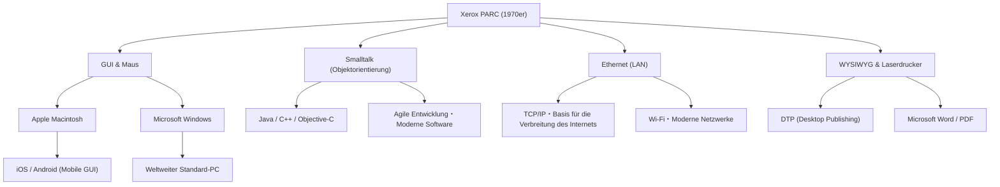

# Xerox PARC: Das Forschungslabor, das den Computer der Zukunft erfand, aber den Markt verpasste

## Einleitung

Wenn wir heute moderne Computer und Smartphones bedienen, klicken wir wie selbstverständlich auf Symbole auf dem Bildschirm, verschieben Fenster, verbinden uns über Wi-Fi oder Ethernet mit Netzwerken und erstellen Dokumente, die in hochauflösenden Schriftarten gedruckt werden. Aber wussten Sie, dass all diese Technologien an "einem einzigen Ort" und "fast zur gleichen Zeit" erfunden wurden?

Dieser Ort war das in den 1970er Jahren gegründete "Xerox PARC (Palo Alto Research Center)". Das in den ruhigen Hügeln von Palo Alto, Kalifornien, gelegene Forschungslabor war zweifellos der Ort, an dem sich einige der innovativsten Köpfe der Menschheitsgeschichte versammelten.

Dieser Artikel zeichnet ein umfassendes Bild des Xerox PARC, das die Geschichte der Computertechnologie entscheidend geprägt hat. Er beleuchtet die Hintergründe der Gründung, die revolutionären Erfindungen (Xerox Alto, das Dynabook-Konzept, Smalltalk, Ethernet, Laserdrucker, WYSIWYG-Editoren), die historische Ironie, warum Xerox trotz dieser Technologien nie den Markt beherrschen konnte, sowie den schicksalhaften Besuch von Steve Jobs. 

## Kapitel 1: Gründungshintergrund ─ Auf der Suche nach dem "Büro der Zukunft"

Ende der 1960er Jahre genoss Xerox, das damals ein absolutes Monopol auf dem Kopierermarkt hatte, enorme Gewinne. Einige Führungskräfte hatten jedoch starke Bedenken hinsichtlich der Zukunft. Sie befürchteten: "Eines Tages wird das papierlose Zeitalter anbrechen und die Nachfrage nach Kopierern, die auf Papier drucken, wird verschwinden." Xerox musste sich von einer bloßen "Kopiererfirma" zu einem "Anbieter von Informationsarchitektur" entwickeln.

Angetrieben wurde diese Vision von Jack Goldman, dem leitenden Forscher von Xerox, der die Gründung eines Grundlagenforschungslabors vorschlug. 1970 gründete Xerox das "Xerox PARC" in Palo Alto, Kalifornien, weit weg von der Unternehmenszentrale an der Ostküste in New York und in direkter Nachbarschaft zur Stanford University.

Als erster Direktor wurde Bob Taylor ausgewählt, der zuvor das Information Processing Techniques Office (IPTO) bei der ARPA (Advanced Research Projects Agency) geleitet und die Finanzierung des ARPANET, des Vorläufers des Internets, koordiniert hatte. Taylor hatte Erfahrung in der Unterstützung von Forschungslabors wie dem von Douglas Engelbart (dem Erfinder der Computermaus) und verfügte über ein starkes Netzwerk zu den besten Informatikern in ganz Amerika.

Taylor verkündete: "Das Budget ist reichlich vorhanden, forscht an dem, was ihr wollt", und rekrutierte nacheinander brillante junge Forscher vom Stanford Research Institute (SRI), vom Massachusetts Institute of Technology (MIT), von der University of Utah und anderen Institutionen. Ihr einziges Ziel war es: "Das Büro der Zukunft in 10 Jahren schon jetzt hier zu erschaffen."

## Kapitel 2: Xerox Alto ─ Ein Personal Computer aus der Zeitmaschine

Der größte Erfolg von PARC und der Vorfahre aller modernen PCs ist der 1973 fertiggestellte "Xerox Alto".

Damals waren Computer riesige Mainframes, die ganze Räume füllten, und es war üblich, sie über Lochkarten oder reine Text-CUI (Character User Interfaces) zu bedienen. Der Alto war jedoch anders. Entwickelt von Chuck Thacker, Butler Lampson und anderen, war diese Maschine die erste, die das Konzept eines "Personal Computers" verwirklichte, den eine Einzelperson auf ihrem Schreibtisch haben und exklusiv nutzen konnte.

Die Innovationen des Alto lagen in den folgenden Punkten:

1. **GUI (Graphical User Interface) und Bitmap-Display**:
   Er verwendete ein Display, bei dem die Pixel auf dem Bildschirm einzeln gesteuert werden konnten, wodurch nicht nur Text, sondern auch Formen und Bilder frei gezeichnet werden konnten. Der Bildschirm nutzte die Metapher eines "Desktops", auf dem Symbole für Ordner und Dateien angezeigt wurden.

2. **Intuitive Bedienung mit der Maus**:
   Die von Douglas Engelbart erfundene Maus wurde verbessert und standardmäßig eine einfach zu bedienende 3-Tasten-Maus integriert. Das System, bei dem die Bedienung einfach durch "Zeigen und Klicken" auf Symbole auf dem Bildschirm erfolgte, anstatt komplexe Befehle über die Tastatur einzugeben, war für die damalige Zeit wie Magie.

3. **Fenstersystem**:
   Es hatte die Fähigkeit, mehrere Programme gleichzeitig auszuführen und jedes als überlappendes "Fenster" (Window) anzuzeigen. Dies ermöglichte die heute alltägliche Multitasking-Umgebung, in der man beispielsweise in einem Fenster ein Dokument erstellt, während in einem anderen Berechnungen durchgeführt werden.

Obwohl der Alto nie kommerziell verkauft wurde, wurden Tausende davon innerhalb von PARC und an einigen Universitäten verteilt, sodass Forscher die "Computerumgebung der Zukunft" erleben konnten. Mit dem Alto entwickelten sie sogar das weltweit erste netzwerkfähige Multiplayer-Shooter-Spiel, "Maze War".

## Kapitel 3: Alan Kays "Dynabook"-Konzept und Objektorientierung

Die Softwareumgebung des Alto, die die Basis bildete und noch weiter in die Zukunft blickte, wurde von einem Visionär namens Alan Kay entwickelt.

Kay glaubte, dass "Computer nicht nur Rechenmaschinen sind, sondern ein Medium (Metamedium) sein sollten, um das menschliche Denken zu erweitern." Er schlug das "Dynabook"-Konzept vor. Dabei handelte es sich um "einen tragbaren, flachen, tafelförmigen Computer in etwa der Größe A4, mit einem hochauflösenden Display, einer Tastatur und Netzwerkfunktionen, auf dem selbst Kinder intuitiv programmieren und kreativ tätig sein könnten." Erstaunlicherweise wurde dies in den späten 1960er und frühen 70er Jahren vorgeschlagen und nahm die heutigen Tablet-Geräte wie das iPad perfekt vorweg.

Um dieses Dynabook zu realisieren, Kay und sein Team entwickelten die Softwaresprache und -umgebung "Smalltalk".

Smalltalk ist die Sprache, die das Konzept der "objektorientierten Programmierung (OOP)" etablierte, das in der modernen Softwareentwicklung unverzichtbar ist. Das Paradigma, alle Daten und Programme als "Objekte" zu behandeln, die über "Messaging" miteinander kommunizieren, war ein völlig anderer Ansatz als die damaligen prozeduralen Sprachen (wie C oder FORTRAN).

Smalltalk war nicht nur eine Sprache, sondern ein Betriebssystem und die GUI-Umgebung selbst. Das Konzept der "überlappenden Fenster", die übereinander angezeigt werden, wurde in der Smalltalk-Umgebung (Smalltalk-76) erstmals implementiert. Programmierer konnten den Code des laufenden Systems in Echtzeit umschreiben, was ein extrem hohes Maß an Flexibilität und Kreativität bot. Kay prägte den berühmten Satz: "Der beste Weg, die Zukunft vorauszusagen, ist, sie zu erfinden." Und mit Smalltalk erfand er buchstäblich die Zukunft.

## Kapitel 4: Ethernet ─ Die Geburt des Netzwerks, das die Welt verbindet

Wenn Personal Computer die intellektuelle Produktivität des Einzelnen steigern, dann würde durch ihre Vernetzung ein noch viel größerer Wert entstehen. Aus diesem Gedanken heraus entstand das "Ethernet".

Der Erfinder Robert Metcalfe ließ sich von einer drahtlosen Netzwerk-Kommunikationsmethode namens ALOHAnet an der University of Hawaii inspirieren. Er entwickelte ein einfaches System, bei dem sich mehrere Computer ein einziges Koaxialkabel teilen. Wenn Daten kollidieren, warten sie eine zufällige Zeit, bevor sie erneut gesendet werden.

1973 baute Metcalfe zusammen mit seinem Kollegen David Boggs ein System, das Altos miteinander verband, um Daten auszutauschen, und nannte es "Ethernet". Die Kommunikationsgeschwindigkeit betrug damals 2,94 Mbit/s, was in einer Zeit, in der es nur textbasierte Kommunikation gab, eine erstaunlich hohe Kapazität und Geschwindigkeit darstellte.

Mit Ethernet konnten Forscher im PARC Dateien zwischen Altos austauschen, sich gegenseitig E-Mails senden und Druckaufträge über das Netzwerk an Drucker schicken. Innerhalb des PARC-Gebäudes wurde das weltweit erste vollwertige LAN (Local Area Network) aufgebaut, womit der Prototyp der modernen Büroumgebung fertiggestellt war. Später gründete Metcalfe die Firma 3Com und machte Ethernet zum weltweiten Standard.

## Kapitel 5: Laserdrucker und WYSIWYG ─ Die Revolution seit dem Buchdruck

PARC revolutionierte auch das Kerngeschäft von Xerox, das "Drucken auf Papier". Die Schlüsselfigur dabei war Gary Starkweather.

Damals waren die Computerausgaben in der Regel grobe Zeichen, die von Nadeldruckern und ähnlichen Geräten erzeugt wurden. Starkweather kam auf die Idee, Laserlicht direkt auf die Fotoleitertrommel zu strahlen, die sich in den wichtigsten Kopierern von Xerox befand, um Zeichen und Bilder zu schreiben. Von der Zentrale wurde er kaltgestellt, weil man meinte: "Das wird nur die Nachfrage nach Kopierern beeinträchtigen." Doch nachdem er zu PARC gewechselt war, setzte er seine Forschungen fort und vollendete 1971 den weltweit ersten Laserdrucker, "EARS".

Darüber hinaus war das bahnbrechende Softwareprogramm, das dies voll ausschöpfte, das von Charles Simonyi und Butler Lampson entwickelte Textverarbeitungsprogramm "Bravo".

Bravo verkörperte weltweit als erstes das Konzept von "WYSIWYG (What You See Is What You Get)". Ein Dokument mit wunderschönen Schriftarten und Layouts, das auf dem Alto-Bildschirm (der ebenfalls im Hochformat, wie ein Blatt Papier, war) angezeigt wurde, kam exakt so und in gestochen scharfer Qualität aus dem Laserdrucker.

Bei früheren Computern wusste man normalerweise erst nach dem Drucken, wie das Layout aussah. Die Kombination aus Bravo und dem Laserdrucker war jedoch der Ursprung des Desktop Publishing (DTP). Simonyi wechselte später zu Microsoft, um "Microsoft Word" zu entwickeln.

## Kapitel 6: Schicksalhafte Kreuzung ─ Steve Jobs' Besuch im PARC

Gegen Ende der 1970er Jahre begann sich innerhalb von PARC eine gewisse Frustration aufzubauen. Obwohl die Forscher das vollständige Bild des Computers der Zukunft entworfen hatten, verstand das Management der Xerox-Zentrale überhaupt nicht, wie man es kommerzialisieren und verkaufen sollte. Für das Management war der Alto nur ein "zu teurer Prototyp", und was Gewinne brachte, waren nach wie vor Kopierer.

Inmitten dieser Situation ereignete sich etwas Entscheidendes, das die Geschichte verändern sollte. Im Dezember 1979 besuchte der aufstrebende junge Unternehmer und Mitbegründer von Apple Computer, Steve Jobs, das PARC.

Jobs war mit dem großen Erfolg des Apple II zum Liebling des Silicon Valley geworden, suchte aber nach dem Computer der nächsten Generation. Im Austausch für das Angebot an Xerox, in Apple-Aktien zu investieren, erhielten Jobs und seine Ingenieurskollegen das Recht, die Technologie im PARC zu besichtigen.

PARC-Forscher wie Larry Tesler (der Erfinder von Copy & Paste) demonstrierten Jobs den Alto und Smalltalk. Überlappende Fenster auf dem Bildschirm, flüssige Bedienung mit der Maus, die Auswahl von Befehlen aus Popup-Menüs – in dem Moment, als er das sah, war Jobs wie vom Blitz getroffen.

Später erzählte Jobs:
"Sie (PARC) haben mir objektorientierte Programmierung gezeigt, und sie haben mir Netzwerke gezeigt. Aber ich war so völlig fasziniert von der GUI-Demo, dass ich die anderen beiden gar nicht bemerkt habe. Innerhalb von zehn Minuten war mir klar, dass eines Tages alle Computer so funktionieren würden. Es war so offensichtlich wie die Sonne."

Nach seiner Rückkehr zu Apple warf Jobs die Entwicklungspläne für die laufenden Projekte "Lisa" und "Macintosh" komplett um und ordnete an, alle Anstrengungen auf die Entwicklung eines GUI-basierten Computers zu konzentrieren. Dabei wechselten viele brillante PARC-Ingenieure, darunter auch Larry Tesler, zu Apple, um ihre Ideale in einem kommerziellen Produkt zu verwirklichen.

1984 stellte Apple den ersten Macintosh vor. Er wurde der erste Personal Computer, der die Vision von PARC zu einem für die Massen erschwinglichen Preis kommerzialisierte, und veränderte die Welt für immer.

## Kapitel 7: Warum Xerox den Markt verpasste (The Fumble)

Das Xerox PARC erfand alle Technologien, die später Billionen-Dollar-Industrien hervorbrachten, darunter den Personal Computer, GUI, die Maus, Netzwerke und Laserdrucker. Xerox selbst konnte diese Märkte jedoch nie dominieren. In der Geschäftsgeschichte wird dies oft als "The Fumble" (Das historische Versäumnis) bezeichnet.

Warum hat Xerox den Markt verpasst? Die Hauptgründe sind die folgenden:

1. **Die Fesseln des Kerngeschäfts (Kopierer) und das Unverständnis des Managements**:
   Das Management von Xerox an der Ostküste in New York bestand aus Experten für Chemie und Maschinenbau (Kopierer), die den Wert von Digitaltechnik und Software nicht verstehen konnten. Für sie war der PC lediglich eine "Bedrohung für den Kopiererverkauf" oder bestenfalls eine "teure Schreibmaschine für Sekretärinnen".

2. **Zu hohe Kosten**:
   In den 1970er Jahren kostete ein Alto allein an Materialkosten über 10.000 US-Dollar. Das war viel zu teuer, um es an normale Verbraucher zu verkaufen, und man musste darauf warten, dass die Hardwarekosten aufgrund des Mooreschen Gesetzes sanken.

3. **Die Mauer zwischen den Abteilungen (Ostküste vs. Westküste)**:
   Zwischen dem Management in der Zentrale und den von der Hippiekultur beeinflussten Forschern an der Westküste herrschte eine unüberwindbare kulturelle Kluft. Es mangelte an Kommunikation und dem Versuch, einander zu verstehen.

4. **Mangel an Marketing und Vertriebsnetz**:
   Als Xerox 1981 schließlich ein kommerzielles System namens "Xerox Star" auf den Markt brachte, war es zwar sehr fortschrittlich, aber ein komplettes System kostete Zehntausende von Dollar. Die Kopierer-Verkäufer wussten nicht, wie sie diese komplexen Netzwerkcomputer verkaufen sollten.

Während das Management von Xerox die Chance verpasste, der "Herrscher der Informationsindustrie" zu werden, erzielte Xerox allein mit dem von Starkweather erfundenen Laserdrucker-Geschäft Gewinne in Milliardenhöhe. Insofern kann man auch argumentieren, dass die Investition in PARC ein großer Erfolg war, da allein der Laserdrucker mehr als genug Gewinn abwarf, um die gesamten Forschungskosten von PARC zu decken.

## Kapitel 8: Das Erbe des Xerox PARC und sein Einfluss auf die heutige Zeit

Die Ideen, die von Xerox zu Apple und Microsoft flossen, verbreiteten sich schließlich als Windows und Mac OS auf der ganzen Welt. Ethernet wurde zur Netzwerkinfrastruktur für unzählige Unternehmen und legte den Grundstein für die heutige Internetgesellschaft.

Das folgende Diagramm zeigt, wie die Technologien von PARC an die moderne Welt weitergegeben wurden.

Die größte Errungenschaft von PARC bestand nicht im Verkauf bestimmter Produkte, sondern darin, "das Computerparadigma grundlegend verändert zu haben". Es verwandelte den "Rechner" in ein "Werkzeug für intellektuelle Produktivität", von etwas für "Experten" in etwas für das "Individuum".

PARC-Forscher wie Alan Kay bauten kompromisslos ideale Systeme, um die reine Frage zu beantworten: "Wie sollte der Computer der Zukunft aussehen?" Ihre Vision war so perfekt und wirkungsvoll, dass die Geschichte der Computerindustrie in den folgenden 50 Jahren im Grunde nur die Geschichte davon war, "wie man die von PARC erfundene Zukunft billiger, kleiner und in Massen produzieren kann."

## Fazit

Die Geschichte des Xerox PARC lehrt uns, wie wichtig Grundlagenforschung für Innovationen ist, und zeigt gleichzeitig die extreme Schwierigkeit, diese in kommerziellen Erfolg umzuwandeln. Es ist eine Sache, die "Zukunft zu erfinden", aber sie auf den Markt zu bringen, erfordert ein ganz anderes Talent und das richtige Timing.

Wenn wir heute unsere Smartphones aus der Tasche holen, auf den Bildschirm tippen und auf Informationen aus aller Welt zugreifen, pulsiert in unseren Fingerspitzen die "Zukunft", von der man vor 50 Jahren in Palo Alto träumte. Der Traum vom Dynabook, den die Forscher des Xerox PARC hatten, ist durch die Hände vieler Unternehmen und Genies gegangen und liegt nun genau in unseren Händen.
