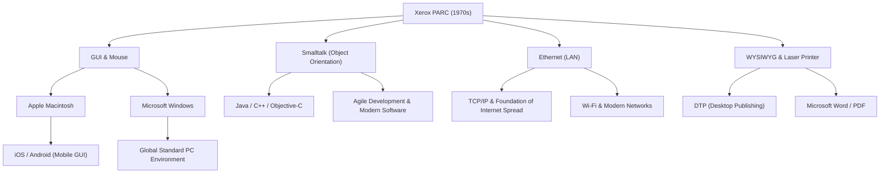

# Xerox PARC: The Lab That Invented the Computer of the Future but Missed the Market

## Introduction

When operating modern computers and smartphones, we naturally click on icons on the screen, move windows, connect to networks via Wi-Fi or Ethernet, and create documents printed in high-definition fonts. However, did you know that all these technologies were invented in "one place" and at "almost the same time"?

That place is "Xerox PARC" (Palo Alto Research Center), established in the 1970s. Located in the quiet hills of Palo Alto, California, this laboratory was undoubtedly one of the places where the most innovative minds in human history gathered.

In this article, we will explore the background of the establishment of Xerox PARC, which determined the history of computers, the numerous revolutionary inventions created there (Xerox Alto, Dynabook concept, Smalltalk, Ethernet, laser printer, WYSIWYG editor), the irony of history as to "why Xerox could not become the champion of the market despite having such technology," and Steve Jobs's fateful visit. We will depict its entire picture on a massive scale of nearly 10,000 characters, based on overwhelming passion and detailed facts.

## Chapter 1: Background of Establishment — In Search of the "Office of the Future"

In the late 1960s, Xerox Corporation, which held an overwhelming monopoly in the copier market, was enjoying massive profits. However, some executives had a strong sense of crisis about the future. They worried that "someday a paperless era will arrive, and the demand for copiers that print on paper will disappear." Xerox needed to transform from a mere "copier company" to a "company that provides information architecture."

This vision was driven by Jack Goldman, the chief scientist at Xerox, who proposed the establishment of a basic research laboratory. In 1970, Xerox established "Xerox PARC" in Palo Alto, California, adjacent to Stanford University on the West Coast, far from its headquarters in New York on the East Coast.

Bob Taylor, who had led the Information Processing Techniques Office (IPTO) at ARPA (Advanced Research Projects Agency) and funded the ARPANET, the prototype of the Internet, was chosen as the first director. Taylor had experience supporting Douglas Engelbart's (the inventor of the mouse) laboratory and had strong connections with brilliant computer scientists across America.

Taylor called out, "There is a plentiful budget, research whatever you like," and successively recruited genius young researchers of the time from institutions like the Stanford Research Institute (SRI), the Massachusetts Institute of Technology (MIT), and the University of Utah. Their sole goal was to "create the office of the future 10 years from now, right here, right now."

## Chapter 2: Xerox Alto — A Personal Computer Transported by a Time Machine

The greatest achievement of PARC, and arguably the ancestor of all modern PCs, is the "Xerox Alto," completed in 1973.

At the time, a computer was typically a giant mainframe that occupied an entire room, and it was common sense to operate it using punch cards or text-only CUIs (Character User Interfaces). But the Alto was different. Designed by Chuck Thacker, Butler Lampson, and others, this machine was the world's first embodiment of the concept of a "personal computer"—a device placed on a desk for an individual's exclusive use.

The Alto's innovations were as follows:

1. **GUI (Graphical User Interface) and Bitmap Display**:
   It featured a display that could individually control pixels on the screen, allowing text, shapes, and images to be drawn freely. The metaphor of a "desktop" was used on the screen, displaying icons of folders and files.

2. **Intuitive Operation with a Mouse**:
   It came standard with an easy-to-use 3-button mouse, an improvement on the mouse invented by Douglas Engelbart. The system, where operations could be completed simply by "pointing and clicking" icons on the screen instead of typing complex commands on a keyboard, felt like magic at the time.

3. **Window System**:
   It had the ability to run multiple programs simultaneously and display each as overlapping "windows." This realized a multitasking environment, such as calculating in another window while writing a document, which is taken for granted today.

The Alto was never sold commercially, but thousands of units were distributed within PARC and to some universities, allowing researchers to experience the "future computing environment." Using the Alto, they even developed "Maze War," the world's first network multiplayer shooting game.

## Chapter 3: Alan Kay's "Dynabook" Concept and Object Orientation

The visionary who supported Alto's software environment from the ground up and looked even further into the future was Alan Kay.

Kay believed that "a computer should not be just a calculator, but a medium (metamedium) to expand human thought." The concept he proposed was the "Dynabook." It was "a thin, portable, board-like computer about the size of an A4 sheet of paper, with a high-definition display, keyboard, and network communication capabilities, a device that even children could intuitively use for programming and creative activities." Amazingly, this was proposed in the late 1960s and early 1970s, perfectly predicting current tablet devices like the iPad.

The software language and environment developed by Kay and his team to realize this Dynabook was "Smalltalk."

Smalltalk is a language that established the concept of "Object-Oriented Programming (OOP)," which is indispensable in modern software engineering. The paradigm where all data and programs are treated as "objects" that communicate with each other through "messaging" was a completely different approach from the procedural languages of the time (such as C and FORTRAN).

Smalltalk was not just a language; it was an OS and the GUI environment itself. The concept of "overlapping windows," where windows are displayed on top of each other, was also first implemented in the Smalltalk environment (Smalltalk-76). Programmers could rewrite the running system's code in real-time, providing extremely high flexibility and creativity. Kay famously said, "The best way to predict the future is to invent it," and he was quite literally inventing the future through Smalltalk.

## Chapter 4: Ethernet — The Birth of the Network Connecting the World

If personal computers improve individual intellectual productivity, connecting them will create even greater value. "Ethernet" was born from this idea.

Its inventor, Robert Metcalfe, drew inspiration from the University of Hawaii's ALOHAnet, a wireless network communication system. He devised a simple mechanism where multiple computers share a single coaxial cable, and if data collides, they wait a random amount of time before retransmitting.

In 1973, Metcalfe, along with his colleague David Boggs, built a system to connect Altos and exchange data, naming it "Ethernet." The communication speed at the time was 2.94 Mbps, which was an astonishingly high-capacity and high-speed communication in an era where only text-based communication existed.

With Ethernet, researchers at PARC could share files between Altos, send emails, and send print jobs to printers over the network. The world's first full-scale LAN (Local Area Network) was built inside the PARC building, completing the prototype of the modern office environment. Metcalfe later founded 3Com and pushed Ethernet to become a global standard.

## Chapter 5: Laser Printers and WYSIWYG — A Revolution Since Letterpress Printing

PARC also brought a revolution to Xerox's core business of "paper printing." The central figure in this was Gary Starkweather.

At the time, computer output was generally poor-quality text from dot-matrix printers. Starkweather came up with the idea of directly shining a laser beam onto the photoreceptor drum inside Xerox's flagship copiers to draw text and images. Although he was given the cold shoulder by headquarters, who claimed it would "only eat into the demand for copiers," he transferred to PARC, continued his research, and completed the world's first laser printer, "EARS," in 1971.

Furthermore, a groundbreaking piece of software to fully utilize this was the word processor "Bravo," developed by Charles Simonyi and Butler Lampson.

Bravo embodied the concept of "WYSIWYG" (What You See Is What You Get) for the first time in the world. Documents with beautiful fonts and layouts displayed on the Alto's screen (which was a portrait display just like paper) would come out clearly printed from the laser printer in exactly the same form.

With previous computers, it was normal not to know the layout until the printing result was seen. However, the combination of Bravo and the laser printer became the origin of Desktop Publishing (DTP). Later, Simonyi moved to Microsoft and developed "Microsoft Word."

## Chapter 6: The Crossroads of Fate — Steve Jobs's Visit to PARC

As the end of the 1970s approached, a certain kind of frustration began to build up within PARC. Despite the researchers having completed the entire picture of the future computer, Xerox's management at headquarters had no idea how to turn it into a product or how to sell it. To management, the Alto was an "overpriced prototype," and it was still copiers that generated profits.

In the midst of this, a decisive event that moved history occurred. In December 1979, an up-and-coming young entrepreneur, Apple Computer co-founder Steve Jobs, visited PARC.

Jobs had become the darling of Silicon Valley with the massive success of the Apple II, but he was searching for the next generation of computers. In exchange for Apple letting Xerox invest in its stock, Jobs and his fellow engineers gained the right to view PARC's technology.

PARC researchers like Larry Tesler (the inventor of copy and paste) gave Jobs a demonstration of the Alto and Smalltalk. Windows overlapping on the screen, smooth operation using a mouse, and selecting commands from pop-up menus. The moment he saw this, Jobs was struck by lightning.

Jobs later recounted:
"They (PARC) showed me object-oriented programming, they showed me the network. But I was so completely blinded by the GUI demo that I didn't even see the other two. Within 10 minutes, it was obvious to me that all computers would work like this someday. It was as clear as the sun."

Upon returning to Apple, Jobs fundamentally overturned the development plans for the ongoing "Lisa" and "Macintosh" projects and ordered that all efforts be put into creating a GUI-based computer. In the process, many brilliant PARC engineers, including Larry Tesler, moved to Apple to turn their ideals into products.

In 1984, Apple announced the first Macintosh. It became the first personal computer to commercialize PARC's vision at a price affordable to the masses, and it would change the world forever.

## Chapter 7: Why Did Xerox Miss the Market? (The Fumble)

Xerox PARC invented all the technologies that would create trillion-dollar industries: personal computers, GUIs, mice, networks, and laser printers. However, Xerox itself was unable to dominate those markets. In the history of business, this is sometimes called "The Fumble" (the greatest mistake in history).

Why did Xerox miss the market? The main reasons are as follows:

1. **The Curse of the Core Business (Copiers) and Management's Lack of Understanding**:
   The Xerox executives on the East Coast in New York were a group of experts in chemistry and mechanical engineering (copiers) and could not understand the value of digital and software. To them, PCs were merely "a threat to copier sales" or "expensive typewriters for secretaries."

2. **Prohibitive Costs**:
   The Alto of the 1970s cost over $10,000 just in parts. It was far too expensive to be sold in the general consumer market at the time, and they needed to wait for hardware costs to drop due to Moore's Law.

3. **Walls Between Organizations (East Coast vs. West Coast)**:
   There was a hopeless cultural divide between the corporate executives and the PARC researchers, who were influenced by the hippie culture of the West Coast. There was a lack of communication to try and understand each other.

4. **Lack of Marketing and Sales Networks**:
   When Xerox finally released a commercial system called the "Xerox Star" in 1981, it was highly advanced but extremely expensive, costing tens of thousands of dollars for a complete system. The copier salesmen had no idea how to sell this complex network computer.

While Xerox's management missed the chance to become the "champion of the information industry," the laser printer business invented by Starkweather alone brought Xerox billions of dollars in profit. In the sense that the laser printer alone brought in enough profit to more than recoup all of PARC's research expenses, some view the investment in PARC as a massive success.

## Chapter 8: Xerox PARC's Legacy and Impact on the Modern World

The ideas that flowed out of Xerox to Apple and Microsoft eventually spread around the world as Mac OS and Windows. Ethernet became the network infrastructure for all companies and laid the foundation for today's Internet society.

The following is a conceptual diagram showing how PARC's technologies have been passed down to the modern era.

PARC's greatest achievement was not selling a specific product, but "fundamentally changing the paradigm of computing." It shifted the "calculator" into a "tool for intellectual production," and from "something for experts" to "something for individuals."

Alan Kay and other PARC researchers built an uncompromisingly ideal system in response to the pure question, "What should the computer of the future be?" Their vision was so perfect and powerful that the history of the computer industry over the next 50 years can essentially be said to be nothing more than the history of "how to make the future invented by PARC cheaper, smaller, and in massive quantities."

## Conclusion

The story of Xerox PARC teaches us the importance of basic research in innovation and the extreme difficulty of connecting it to business. Even if one can "invent the future," delivering it to the market requires a different set of talents and timing.

Today, when we take our smartphones out of our pockets, tap the screen, and access information from around the world, the "future" dreamed of 50 years ago in Palo Alto is vividly alive at our fingertips. The dream of the Dynabook envisioned by the researchers at Xerox PARC has passed through the hands of various companies and geniuses, and is right now in our own hands.
