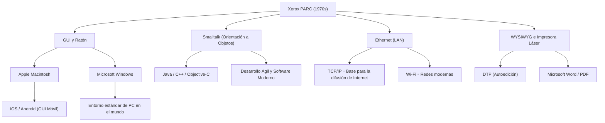

# Xerox PARC: El laboratorio que inventó la computadora del futuro pero perdió el mercado

## Introducción

Al operar las computadoras y los teléfonos inteligentes modernos, damos por sentado el hecho de hacer clic en iconos en la pantalla, mover ventanas, conectarnos a redes a través de Wi-Fi o Ethernet, y crear documentos impresos con fuentes de alta definición. Sin embargo, ¿sabías que todas estas tecnologías fueron inventadas en "un solo lugar" y "casi al mismo tiempo"?

Ese lugar es "Xerox PARC (Palo Alto Research Center)", establecido en la década de 1970. Ubicado en las tranquilas colinas de Palo Alto, California, este laboratorio fue, sin duda, uno de los lugares donde se reunieron las mentes más innovadoras de la historia de la humanidad.

En este artículo, desde los antecedentes de la fundación de Xerox PARC que determinó la historia de las computadoras, pasando por las numerosas invenciones revolucionarias (Xerox Alto, el concepto Dynabook, Smalltalk, Ethernet, la impresora láser, el editor WYSIWYG) creadas allí, hasta la ironía histórica de "por qué Xerox no pudo convertirse en el líder del mercado a pesar de tener una tecnología tan avanzada", y la visita fatídica de Steve Jobs, describiremos todo el panorama basándonos en hechos detallados y con una pasión abrumadora, en una escala cercana a las 10,000 palabras.

## Capítulo 1: Antecedentes de la fundación ─ En busca de la "Oficina del Futuro"

A finales de la década de 1960, Xerox (Xerox Corporation), que tenía un monopolio abrumador en el mercado de copiadoras, disfrutaba de enormes ganancias. Sin embargo, algunos directivos albergaban un fuerte sentido de crisis sobre el futuro. Temían que "algún día llegara la era sin papel y desapareciera la demanda de copiadoras que imprimen en papel". Xerox necesitaba transformarse de ser simplemente una "empresa de copiadoras" a una "empresa que proporciona arquitectura de la información".

Quien lideró esta visión fue Jack Goldman, investigador principal de Xerox, quien propuso la creación de un laboratorio de investigación básica. En 1970, Xerox estableció "Xerox PARC" en Palo Alto, California, junto a la Universidad de Stanford, en la costa oeste, lejos de la sede central en el estado de Nueva York en la costa este.

Bob Taylor, quien dirigió la Oficina de Técnicas de Procesamiento de Información (IPTO) en ARPA (Agencia de Proyectos de Investigación Avanzados de Defensa) y financió el prototipo de Internet, ARPANET, fue elegido como el primer director. Taylor tenía experiencia apoyando laboratorios como el de Douglas Engelbart (el inventor del ratón) y tenía fuertes conexiones con los científicos informáticos más brillantes de Estados Unidos.

Taylor hizo un llamado diciendo: "El presupuesto es abundante, investiguen lo que quieran", y reclutó a los jóvenes y geniales investigadores de la época de instituciones como el Stanford Research Institute (SRI), el Instituto de Tecnología de Massachusetts (MIT) y la Universidad de Utah. Su objetivo era solo uno: "Crear aquí y ahora la oficina del futuro de dentro de 10 años".

## Capítulo 2: Xerox Alto ─ La computadora personal traída en una máquina del tiempo

El mayor logro de PARC, y el ancestro de todas las PC modernas, es el "Xerox Alto", completado en 1973.

En ese momento, las computadoras eran enormes mainframes que ocupaban habitaciones enteras, y lo normal era operarlas con tarjetas perforadas o CUI (Interfaz de Usuario de Caracteres) basada en texto. Pero Alto era diferente. Diseñada por Chuck Thacker y Butler Lampson, esta máquina fue la primera en el mundo en materializar el concepto de "computadora personal" que una persona podía poner en su escritorio y usar de manera exclusiva.

La innovación de Alto radicó en los siguientes puntos:

1. **GUI (Interfaz Gráfica de Usuario) y pantalla de mapa de bits**:
   Adoptó una pantalla que podía controlar píxeles individualmente, permitiendo dibujar no solo texto, sino también formas e imágenes libremente. Utilizó la metáfora de un "escritorio" en la pantalla, mostrando iconos de carpetas y archivos.

2. **Operación intuitiva con el ratón**:
   Mejoró el ratón inventado por Douglas Engelbart, equipándolo de manera estándar con un ratón de 3 botones fácil de usar. El sistema, donde en lugar de escribir comandos complejos en un teclado, todo se podía hacer simplemente "señalando y haciendo clic" en los iconos de la pantalla, fue una experiencia mágica para su época.

3. **Sistema de ventanas**:
   Tenía la capacidad de ejecutar múltiples programas simultáneamente y mostrarlos como "ventanas" superpuestas. Esto hizo posible el entorno multitarea que hoy damos por sentado, como hacer cálculos en otra ventana mientras se crea un documento.

Alto nunca se vendió comercialmente, pero se distribuyeron miles de unidades dentro de PARC y en algunas universidades, permitiendo a los investigadores experimentar el "entorno informático del futuro". Usando Alto, incluso desarrollaron el primer juego de disparos en red del mundo, "Maze War".

## Capítulo 3: El concepto "Dynabook" de Alan Kay y la Orientación a Objetos

Alan Kay, un visionario, fue quien apoyó fundamentalmente el entorno de software de Alto y miró aún más hacia el futuro.

Kay creía que "la computadora no debe ser solo una calculadora, sino un medio (metamedio) para expandir el pensamiento humano". Él propuso el concepto de "Dynabook". Era "un dispositivo informático en forma de tabla, delgado y portátil, aproximadamente del tamaño A4, con una pantalla de alta resolución, teclado y funciones de comunicación en red, donde incluso un niño podría programar intuitivamente y realizar actividades creativas". Sorprendentemente, esto fue propuesto entre finales de los años 60 y principios de los 70, y predijo perfectamente las tabletas actuales como el iPad.

Como lenguaje y entorno de software para hacer realidad este Dynabook, Kay y su equipo desarrollaron "Smalltalk".

Smalltalk es el lenguaje que estableció el concepto de "Programación Orientada a Objetos (OOP)", esencial en la ingeniería de software moderna. El paradigma de tratar todos los datos y programas como "objetos" que se comunican entre sí mediante "mensajes" era un enfoque completamente diferente a los lenguajes procedimentales de la época (como C o FORTRAN).

Smalltalk no era solo un lenguaje, era un sistema operativo y también el propio entorno GUI. El concepto de "ventanas superpuestas" se implementó por primera vez en el entorno Smalltalk (Smalltalk-76). Los programadores podían reescribir el código del sistema en ejecución en tiempo real, ofreciendo una flexibilidad y creatividad extremadamente altas. Kay dejó una famosa frase: "La mejor manera de predecir el futuro es inventarlo", y él, precisamente a través de Smalltalk, estaba inventando el futuro.

## Capítulo 4: Ethernet ─ El nacimiento de la red que conecta al mundo

Si las computadoras personales mejoran la productividad intelectual individual, conectarlas crearía un valor aún mayor. De esta idea nació "Ethernet".

El inventor Robert Metcalfe se inspiró en un sistema de comunicación de red inalámbrica llamado ALOHAnet de la Universidad de Hawái. Él ideó un mecanismo simple donde múltiples computadoras compartían un solo cable coaxial, y si los datos colisionaban, esperaban un tiempo aleatorio antes de reenviarlos.

En 1973, Metcalfe, junto a su colega David Boggs, construyó un sistema para conectar Altos entre sí e intercambiar datos, al que llamó "Ethernet". La velocidad de comunicación en ese momento era de 2.94 Mbps, y en una época en la que solo existía la comunicación basada en texto, esto era una comunicación asombrosamente rápida y de gran capacidad.

Gracias a Ethernet, los investigadores de PARC pudieron compartir archivos entre Altos, enviarse correos electrónicos y enviar trabajos de impresión a las impresoras a través de la red. Dentro del edificio de PARC se construyó la primera LAN (Red de Área Local) a gran escala del mundo, completando el prototipo del entorno de oficina moderno. Metcalfe fundaría más tarde la empresa 3Com y convertiría a Ethernet en un estándar global.

## Capítulo 5: La impresora láser y WYSIWYG ─ La revolución desde la imprenta

PARC también revolucionó el negocio principal de Xerox, la "impresión en papel". La figura central fue Gary Starkweather.

En ese momento, la salida de las computadoras solía ser de caracteres de baja calidad impresos por impresoras matriciales, entre otras. Starkweather tuvo la idea de escribir caracteres e imágenes apuntando directamente un rayo láser al tambor fotorreceptor dentro de la copiadora principal de Xerox. La sede central lo rechazó diciendo: "Solo canibalizará la demanda de copias", pero él, tras ser trasladado a PARC, continuó su investigación y completó la primera impresora láser del mundo, "EARS", en 1971.

Además, el software revolucionario para aprovechar al máximo esto fue el procesador de textos "Bravo", desarrollado por Charles Simonyi y Butler Lampson.

Bravo encarnó por primera vez en el mundo el concepto de "WYSIWYG (Lo que ves es lo que obtienes)". Los documentos con hermosas fuentes y diseños mostrados en la pantalla del Alto (que además era una pantalla vertical como el papel) salían impresos de manera nítida por la impresora láser exactamente en la misma forma.

En las computadoras de entonces, era normal no saber cómo quedaría el diseño hasta ver el resultado impreso. Sin embargo, la combinación de Bravo y la impresora láser se convirtió en el origen de la autoedición (DTP), y más tarde, Simonyi se trasladaría a Microsoft para desarrollar "Microsoft Word".

## Capítulo 6: Cruce de destinos ─ La visita de Steve Jobs a PARC

A medida que se acercaba el final de la década de 1970, comenzó a acumularse cierta frustración dentro de PARC. Aunque los investigadores habían completado el panorama completo de la computadora del futuro, los directivos de Xerox en la sede central no entendían en absoluto cómo comercializarlo o cómo venderlo. Para los directivos, Alto era "un prototipo demasiado caro", y lo que generaba beneficios seguían siendo las copiadoras.

En medio de todo esto, ocurrió un evento decisivo que cambiaría la historia. En diciembre de 1979, el prometedor joven empresario y cofundador de Apple Computer, Steve Jobs, visitó PARC.

Jobs se había convertido en el mimado de Silicon Valley con el gran éxito del Apple II, pero estaba buscando la computadora de próxima generación. A cambio de que Apple le cediera a Xerox una participación en su inversión, Jobs y sus ingenieros colegas obtuvieron el derecho de ver la tecnología de PARC.

El investigador de PARC Larry Tesler (inventor del copiar y pegar) y otros le hicieron a Jobs una demostración de Alto y Smalltalk. Ventanas superpuestas en la pantalla, un funcionamiento fluido con el ratón y la selección de comandos desde menús emergentes. En el momento en que vio eso, Jobs quedó impactado como si le hubiera caído un rayo.

Jobs dijo más tarde:
"Ellos (PARC) me mostraron la programación orientada a objetos, y también me mostraron las redes. Pero me quedé completamente cautivado por la demostración de la GUI, y ni siquiera vi las otras dos cosas. En menos de diez minutos, me convencí de que todas las computadoras del futuro serían así. Era tan obvio como el sol."

Al regresar a Apple, Jobs cambió radicalmente el rumbo de desarrollo de los proyectos en curso "Lisa" y "Macintosh", y ordenó que se pusiera todo el esfuerzo en crear una computadora basada en GUI. En el proceso, Larry Tesler y muchos otros ingenieros brillantes de PARC se trasladaron a Apple para comercializar sus propios ideales.

En 1984, Apple presentó la primera Macintosh. Se convirtió en la primera computadora personal que comercializó la visión de PARC a un precio accesible para el público, cambiando el mundo para siempre.

## Capítulo 7: ¿Por qué Xerox perdió el mercado? (The Fumble)

Xerox PARC inventó todas las tecnologías que darían lugar a industrias multimillonarias: computadoras personales, GUI, ratón, redes y la impresora láser. Sin embargo, la propia Xerox no pudo dominar esos mercados. En la historia de los negocios, esto a veces se conoce como "el mayor fracaso de la historia (The Fumble)".

¿Por qué Xerox perdió el mercado? Las razones principales son las siguientes:

1. **La atadura al negocio principal (copiadoras) y la incomprensión de los directivos**:
   Los ejecutivos de Xerox en Nueva York, en la costa este, eran un grupo de expertos en química e ingeniería mecánica (copiadoras) y no podían entender el valor de lo digital y el software. Para ellos, las PC no eran más que "una amenaza para las ventas de copiadoras" o "máquinas de escribir caras para secretarias".

2. **Costos demasiado altos**:
   El Alto de la década de 1970 costaba más de $10,000 solo en piezas. Era demasiado caro para venderlo en el mercado general de consumidores de la época, y hubo que esperar a que el costo del hardware disminuyera gracias a la Ley de Moore.

3. **El muro entre organizaciones (Costa Este vs Costa Oeste)**:
   Había una brecha cultural abismal entre los ejecutivos de la sede central y los investigadores de PARC, influenciados por la cultura hippie de la costa oeste. Faltaba comunicación para tratar de entenderse mutuamente.

4. **Falta de marketing y red de ventas**:
   Cuando Xerox finalmente lanzó un sistema comercial llamado "Xerox Star" en 1981, era muy avanzado, pero el sistema completo costaba decenas de miles de dólares y era costoso. Los vendedores de copiadoras no sabían cómo vender esta compleja computadora en red.

Los directivos de Xerox perdieron "la oportunidad de convertirse en los líderes de la industria de la información", pero por otro lado, solo con el negocio de impresoras láser inventado por Starkweather, Xerox obtuvo miles de millones de dólares en ganancias. Hay quienes opinan que la inversión en PARC fue un gran éxito, en el sentido de que solo la impresora láser generó suficientes beneficios para recuperar todos los costos de investigación de PARC con creces.

## Capítulo 8: El legado de Xerox PARC y su impacto en la actualidad

Las ideas que fluyeron de Xerox hacia Apple y Microsoft finalmente se extendieron por todo el mundo como Windows y Mac OS. Ethernet se convirtió en la infraestructura de red de todas las empresas y sentó las bases de la sociedad actual de Internet.

A continuación se muestra un diagrama conceptual de cómo se ha heredado la tecnología de PARC en la actualidad.

El mayor logro de PARC no fue vender un producto específico, sino "cambiar fundamentalmente el paradigma de la computación". De una "calculadora" a una "herramienta de producción intelectual", de "algo para expertos" a "algo para individuos".

Alan Kay y los investigadores de PARC construyeron un sistema ideal sin concesiones en respuesta a la pregunta pura de "cómo debería ser la computadora del futuro". Dado que la visión que pintaron era tan perfecta y poderosa, se puede decir que la industria de las computadoras de los últimos 50 años ha sido esencialmente la historia de "cómo fabricar de manera más barata, más pequeña y en grandes cantidades el futuro que inventó PARC".

## Conclusión

La historia de Xerox PARC nos enseña la importancia de la investigación básica en la innovación y la extrema dificultad de conectarla con los negocios. Aunque se pueda "inventar el futuro", llevarlo al mercado requiere otros talentos y el momento adecuado.

Hoy en día, cuando sacamos nuestro teléfono inteligente del bolsillo, tocamos la pantalla y accedemos a información de todo el mundo, ese "futuro" soñado en Palo Alto hace 50 años late vívidamente en la punta de nuestros dedos. El sueño del Dynabook que imaginaron los investigadores de Xerox PARC ha pasado por las manos de varias empresas y genios, y ahora está, literalmente, en nuestras manos.
