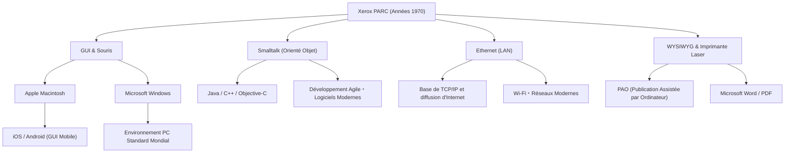

# Xerox PARC : Le laboratoire qui a inventé l'ordinateur du futur mais manqué le marché

## Introduction

Lorsque nous utilisons nos ordinateurs et smartphones modernes, nous trouvons naturel de cliquer sur des icônes, de déplacer des fenêtres, de nous connecter via Wi-Fi ou Ethernet, et de créer des documents avec des polices haute définition. Cependant, saviez-vous que toutes ces technologies ont été inventées au "même endroit" et "presque en même temps" ?

Cet endroit est le "Xerox PARC (Palo Alto Research Center)", fondé dans les années 1970. Situé dans les collines tranquilles de Palo Alto, en Californie, ce laboratoire fut sans doute l'un des lieux de rassemblement des esprits les plus innovants de l'histoire de l'humanité.

Dans cet article, nous explorerons le contexte de la création du Xerox PARC, qui a façonné l'histoire de l'informatique, les nombreuses inventions révolutionnaires qui y ont vu le jour (Xerox Alto, le concept Dynabook, Smalltalk, Ethernet, l'imprimante laser, l'éditeur WYSIWYG), l'ironie historique de la raison pour laquelle Xerox n'a pas pu dominer le marché malgré de telles technologies, et enfin la visite fatidique de Steve Jobs. Tout cela sera détaillé avec passion et basé sur des faits, dans un format de près de 10 000 caractères.

## Chapitre 1 : Contexte de création ─ À la recherche du "bureau du futur"

À la fin des années 1960, Xerox Corporation dominait le marché des photocopieurs et profitait de bénéfices colossaux. Cependant, certains membres de la direction ressentaient une forte appréhension face à l'avenir : "Et si l'ère du sans-papier arrivait, faisant disparaître la demande de photocopieurs sur papier ?" Xerox devait se transformer, passant d'une simple "entreprise de photocopieurs" à une "entreprise fournissant l'architecture de l'information".

Cette vision fut portée par Jack Goldman, chercheur principal chez Xerox, qui proposa la création d'un laboratoire de recherche fondamentale. En 1970, Xerox fonda le "Xerox PARC" à Palo Alto, en Californie, à côté de l'Université de Stanford, très loin du siège social situé sur la côte est, dans l'État de New York.

Bob Taylor fut choisi comme premier directeur. Il avait dirigé l'Information Processing Techniques Office (IPTO) de l'ARPA et financé l'ARPANET, le prototype d'Internet. Taylor avait de l'expérience dans le soutien de laboratoires comme celui de Douglas Engelbart (l'inventeur de la souris) et possédait un vaste réseau parmi les meilleurs informaticiens d'Amérique.

Taylor annonça : "Nous avons un budget abondant, faites des recherches sur ce qui vous plaît", et recruta d'illustres jeunes chercheurs talentueux du Stanford Research Institute (SRI), du MIT et de l'Université de l'Utah. Leur seul objectif était de "créer ici et maintenant le bureau du futur, tel qu'il sera dans 10 ans".

## Chapitre 2 : Xerox Alto ─ L'ordinateur personnel amené par une machine à remonter le temps

La plus grande réalisation du PARC, que l'on peut considérer comme l'ancêtre de tous les PC modernes, est le "Xerox Alto", achevé en 1973.

À l'époque, les ordinateurs étaient des mainframes géants occupant des pièces entières, et il était courant de les utiliser via des cartes perforées ou des interfaces en ligne de commande (CUI). Mais l'Alto était différent. Conçue par Chuck Thacker et Butler Lampson, cette machine fut la première au monde à concrétiser le concept de "l'ordinateur personnel", qu'un individu pouvait placer sur son bureau et utiliser en exclusivité.

Les innovations de l'Alto comprenaient :

1. **Interface utilisateur graphique (GUI) et affichage bitmap** :
   Il utilisait un écran capable de contrôler individuellement les pixels, permettant de dessiner librement non seulement des lettres mais aussi des formes et des images. La métaphore du "bureau" (desktop) fut utilisée, affichant des icônes de dossiers et de fichiers.

2. **Fonctionnement intuitif avec une souris** :
   Il améliorait la souris inventée par Douglas Engelbart pour inclure une souris standard à trois boutons facile à utiliser. Le système, où l'utilisateur n'avait plus besoin de taper des commandes complexes mais simplement de pointer et cliquer, semblait magique à l'époque.

3. **Système de fenêtrage** :
   Il permettait d'exécuter plusieurs programmes simultanément et de les afficher sous forme de "fenêtres" superposées. Cela a permis de réaliser l'environnement multitâche que nous tenons pour acquis aujourd'hui, comme calculer dans une fenêtre tout en rédigeant un document dans une autre.

Bien que l'Alto n'ait jamais été vendu commercialement, des milliers d'unités furent distribuées au sein du PARC et dans quelques universités, permettant aux chercheurs d'expérimenter "l'environnement informatique du futur". En utilisant l'Alto, ils ont même développé "Maze War", le premier jeu de tir en réseau au monde.

## Chapitre 3 : Le concept "Dynabook" d'Alan Kay et l'orientation objet

Alan Kay, un visionnaire, soutenait l'environnement logiciel de l'Alto et regardait encore plus loin vers l'avenir.

Kay pensait que "l'ordinateur ne devait pas être une simple calculatrice, mais un média (méta-média) pour étendre la pensée humaine". Il proposa le concept de "Dynabook" : "un appareil informatique plat, fin et portable, d'environ la taille d'une page A4, doté d'un écran haute définition, d'un clavier et de capacités de communication réseau, permettant même à un enfant de programmer et de créer intuitivement". Étonnamment, proposé à la fin des années 1960 et au début des années 1970, ce concept anticipait parfaitement les tablettes actuelles comme l'iPad.

Pour réaliser ce Dynabook, Kay et son équipe développèrent le langage et l'environnement logiciel "Smalltalk".

Smalltalk est le langage qui a établi le concept de "programmation orientée objet (POO)", désormais indispensable à l'ingénierie logicielle moderne. Le paradigme traitant toutes les données et tous les programmes comme des "objets" qui communiquent entre eux par "messages" était une approche complètement différente des langages procéduraux de l'époque (comme le C et le FORTRAN).

Smalltalk n'était pas seulement un langage, c'était aussi un système d'exploitation et l'environnement GUI lui-même. Le concept de "fenêtres superposées" fut également implémenté pour la première fois dans l'environnement Smalltalk (Smalltalk-76). Les programmeurs pouvaient réécrire le code du système en cours d'exécution en temps réel, offrant une flexibilité et une créativité extrêmes. Kay a laissé cette célèbre citation : "La meilleure façon de prédire l'avenir est de l'inventer", et à travers Smalltalk, il inventait littéralement l'avenir.

## Chapitre 4 : Ethernet ─ La naissance du réseau qui connecte le monde

Si les ordinateurs personnels amélioraient la productivité intellectuelle individuelle, les connecter créerait encore plus de valeur. C'est de cette idée qu'est né "Ethernet".

L'inventeur Robert Metcalfe s'est inspiré d'une méthode de communication réseau sans fil appelée ALOHAnet de l'Université d'Hawaï. Il a conçu un mécanisme simple où plusieurs ordinateurs partageaient un seul câble coaxial ; si les données entraient en collision, elles attendaient un temps aléatoire avant d'être retransmises.

En 1973, Metcalfe, avec son collègue David Boggs, a construit un système reliant les Altos pour échanger des données, le nommant "Ethernet". La vitesse de communication à l'époque était de 2,94 Mbps, ce qui était une communication à haut débit et de grande capacité étonnante pour une époque où seule la communication basée sur le texte existait.

Grâce à Ethernet, les chercheurs du PARC pouvaient partager des fichiers entre Altos, envoyer des e-mails et soumettre des travaux d'impression sur le réseau. Le premier véritable réseau local (LAN) au monde fut construit dans les locaux du PARC, complétant le prototype de l'environnement de bureau moderne. Metcalfe fondera plus tard 3Com et fera d'Ethernet une norme mondiale.

## Chapitre 5 : L'imprimante laser et WYSIWYG ─ La révolution depuis l'imprimerie

Le PARC a également apporté une révolution à l'activité principale de Xerox, l'"impression papier". Le personnage central de cette évolution fut Gary Starkweather.

À l'époque, la sortie des ordinateurs se composait généralement de caractères grossiers produits par des imprimantes matricielles. Starkweather a eu l'idée de projeter un rayon laser directement sur le tambour photosensible à l'intérieur du photocopieur phare de Xerox pour y écrire des textes et des images. Bien qu'il ait reçu un accueil glacial du siège, qui estimait que "cela cannibaliserait la demande de photocopies", il a continué ses recherches après avoir été transféré au PARC et a achevé en 1971 "EARS", la première imprimante laser au monde.

Pour tirer le meilleur parti de cela, le traitement de texte "Bravo" fut développé par Charles Simonyi et Butler Lampson.

Bravo a incarné le concept de "WYSIWYG (What You See Is What You Get)" pour la première fois au monde. Les documents avec de belles polices et mises en page affichés sur l'écran de l'Alto (qui était un affichage portrait, comme du papier) étaient imprimés clairement par l'imprimante laser exactement comme ils apparaissaient à l'écran.

Avant cela, avec les ordinateurs, il était normal de ne pas connaître la mise en page avant de voir le résultat imprimé. La combinaison de Bravo et de l'imprimante laser a marqué l'origine de la publication assistée par ordinateur (PAO), et plus tard, Simonyi rejoindra Microsoft pour développer "Microsoft Word".

## Chapitre 6 : Le carrefour du destin ─ La visite de Steve Jobs au PARC

Vers la fin des années 1970, une certaine frustration commençait à s'accumuler au sein du PARC. Bien que les chercheurs aient achevé la vision de l'ordinateur de demain, la direction de Xerox ne comprenait pas comment le commercialiser ou le vendre. Pour la direction, l'Alto était un "prototype beaucoup trop cher", et c'étaient toujours les photocopieurs qui généraient des profits.

C'est alors qu'un événement décisif se produisit. En décembre 1979, le jeune entrepreneur en pleine ascension, Steve Jobs, cofondateur d'Apple Computer, visita le PARC.

Jobs était devenu l'enfant chéri de la Silicon Valley grâce à l'immense succès de l'Apple II, mais il était à la recherche de l'ordinateur de la prochaine génération. En échange de l'octroi par Apple à Xerox du droit d'investir dans des actions, Jobs et ses collègues ingénieurs obtinrent le droit de voir la technologie du PARC.

Le chercheur du PARC Larry Tesler (l'inventeur du copier-coller) et d'autres ont fait une démonstration de l'Alto et de Smalltalk à Jobs. Fenêtres superposées à l'écran, fonctionnement fluide de la souris, sélection de commandes dans des menus contextuels... Dès qu'il a vu cela, Jobs a été frappé par la foudre.

Jobs dira plus tard :
"Ils m'ont montré la programmation orientée objet, ils m'ont montré le réseau. Mais j'ai été tellement aveuglé par la démonstration de l'interface graphique que je n'ai pas vu les deux autres. En moins de 10 minutes, il m'est apparu comme une évidence que tous les ordinateurs du futur fonctionneraient ainsi. C'était clair comme le jour."

De retour chez Apple, Jobs a complètement bouleversé l'orientation du développement des projets "Lisa" et "Macintosh" alors en cours, ordonnant que tous les efforts soient consacrés à la création d'un ordinateur basé sur une interface graphique. Ce faisant, de nombreux ingénieurs brillants du PARC, dont Larry Tesler, sont passés chez Apple pour commercialiser leurs propres idéaux.

En 1984, Apple a annoncé le premier Macintosh. C'était le premier ordinateur personnel à commercialiser la vision du PARC à un prix abordable pour le grand public, et cela changerait le monde pour toujours.

## Chapitre 7 : Pourquoi Xerox a-t-il manqué le marché ? (The Fumble)

Le Xerox PARC a inventé toutes les technologies qui allaient créer des industries valant des milliers de milliards de dollars, comme l'ordinateur personnel, l'interface graphique, la souris, les réseaux et l'imprimante laser. Cependant, Xerox n'a pas réussi à dominer ces marchés lui-même. Dans l'histoire des affaires, c'est parfois appelé le "plus gros raté de l'histoire (The Fumble)".

Pourquoi Xerox a-t-il manqué le marché ? Les principales raisons sont les suivantes :

1. **L'emprise de l'activité principale (photocopieurs) et l'incompréhension de la direction** :
   La direction de Xerox à New York, sur la côte est, était un groupe d'experts en chimie et en ingénierie mécanique (photocopieurs) qui ne pouvait comprendre la valeur du numérique et des logiciels. Pour eux, le PC n'était qu'une "menace pour les ventes de photocopieurs" ou une "machine à écrire coûteuse pour secrétaires".

2. **Des coûts trop élevés** :
   Dans les années 1970, l'Alto coûtait plus de 10 000 dollars rien qu'en pièces détachées. Il était beaucoup trop cher pour être vendu sur le marché grand public de l'époque, et il fallait attendre la baisse du coût du matériel entraînée par la loi de Moore.

3. **Le mur entre les organisations (Côte Est vs Côte Ouest)** :
   Il y avait un fossé culturel désespéré entre la direction du siège et les chercheurs du PARC, influencés par la culture hippie de la côte ouest. Il y avait un manque de communication pour essayer de se comprendre.

4. **Absence de marketing et de réseau de vente** :
   Lorsque Xerox a finalement sorti le système commercial "Xerox Star" en 1981, bien qu'il ait été extrêmement avancé, l'ensemble du système coûtait des dizaines de milliers de dollars. Les vendeurs de photocopieurs ne savaient pas comment vendre cet ordinateur en réseau complexe.

La direction de Xerox a raté "l'occasion de devenir le maître de l'industrie de l'information", mais d'un autre côté, l'activité d'imprimantes laser inventée par Starkweather à elle seule a généré des milliards de dollars de bénéfices pour Xerox. On peut considérer que l'investissement dans le PARC fut un énorme succès, dans le sens où l'imprimante laser à elle seule a largement remboursé tous les frais de recherche du PARC.

## Chapitre 8 : L'héritage du Xerox PARC et son impact moderne

Les idées qui se sont échappées de Xerox vers Apple et Microsoft se sont finalement répandues dans le monde entier sous les noms de Windows et Mac OS. Ethernet est devenu l'infrastructure réseau de chaque entreprise, jetant les bases de la société Internet d'aujourd'hui.

Voici un diagramme conceptuel montrant comment la technologie du PARC a été transmise au monde moderne.

La plus grande réalisation du PARC n'a pas été de vendre un produit spécifique, mais d'avoir "fondamentalement changé le paradigme de l'informatique". Passer d'une "machine à calculer" à un "outil de production intellectuelle", de l'"apanage des experts" à la "propriété de l'individu".

Les chercheurs du PARC, y compris Alan Kay, ont construit le système idéal sans compromis en réponse à la question pure : "Que devrait être l'ordinateur du futur ?". La vision qu'ils ont dessinée était si parfaite et si puissante que l'on pourrait dire que les 50 années suivantes de l'industrie informatique n'ont été qu'une histoire pour trouver "comment fabriquer l'avenir inventé par le PARC moins cher, plus petit et en plus grande quantité".

## Conclusion

L'histoire du Xerox PARC nous enseigne l'importance de la recherche fondamentale dans l'innovation et la difficulté extrême de la lier aux affaires. Vous pouvez "inventer l'avenir", mais le mettre sur le marché requiert des talents et un timing différents.

Aujourd'hui, lorsque nous sortons nos smartphones de nos poches, tapotons sur l'écran pour accéder aux informations du monde entier, cet "avenir" rêvé à Palo Alto il y a 50 ans bat sous nos doigts. Le rêve du Dynabook imaginé par les chercheurs du Xerox PARC, après être passé entre les mains de diverses entreprises et génies, est maintenant entre nos mains.
