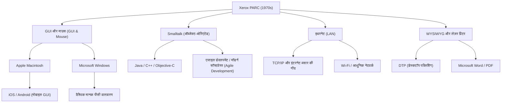

# Xerox PARC: भविष्य के कंप्यूटर का आविष्कार करते हुए बाजार से चूकने वाली प्रयोगशाला

## प्रस्तावना (Introduction)

आज जब हम कंप्यूटर या स्मार्टफोन का उपयोग करते हैं, तो हम स्क्रीन पर आइकन पर क्लिक करना, विंडो को स्थानांतरित करना, वाई-फाई (Wi-Fi) या इथरनेट (Ethernet) के माध्यम से नेटवर्क से जुड़ना, और उच्च-रिज़ॉल्यूशन वाले फ़ॉन्ट के साथ दस्तावेज़ बनाना स्वाभाविक मानते हैं। लेकिन क्या आप जानते हैं कि ये सभी तकनीकें "एक ही स्थान" पर और "लगभग एक ही समय" में आविष्कृत की गई थीं?

वह स्थान है 1970 के दशक में स्थापित "Xerox PARC" (Palo Alto Research Center: ज़ेरॉक्स पालो ऑल्टो रिसर्च सेंटर)। कैलिफ़ोर्निया के पालो ऑल्टो की शांत पहाड़ियों में स्थित यह शोध संस्थान निस्संदेह मानव इतिहास में सबसे नवोन्मेषी (innovative) दिमागों के एकत्र होने वाले स्थानों में से एक था।

इस लेख में, हम कंप्यूटर के इतिहास को परिभाषित करने वाले Xerox PARC की स्थापना की पृष्ठभूमि, वहां किए गए कई क्रांतिकारी आविष्कारों (Xerox Alto, Dynabook विज़न, Smalltalk, Ethernet, लेज़र प्रिंटर, WYSIWYG एडिटर), और इस ऐतिहासिक विडंबना कि "इतनी महान तकनीक होने के बावजूद ज़ेरॉक्स बाज़ार का विजेता क्यों नहीं बन पाया", के साथ-साथ स्टीव जॉब्स की ऐतिहासिक यात्रा का पूरा चित्र प्रस्तुत करेंगे। यह लेख विस्तृत तथ्यों और अपार उत्साह के आधार पर तैयार किया गया है।

## अध्याय 1: स्थापना की पृष्ठभूमि ─ "भविष्य के कार्यालय" की तलाश में

1960 के दशक के उत्तरार्ध में, ज़ेरॉक्स (Xerox Corporation), जिसका कॉपियर बाज़ार पर एकाधिकार था, भारी मुनाफ़ा कमा रही थी। हालाँकि, कुछ अधिकारियों को भविष्य को लेकर गंभीर चिंताएँ थीं। उन्हें डर था कि "एक दिन पेपरलेस (कागज़-रहित) युग आएगा और कागज़ पर प्रिंट करने वाले कॉपियर की माँग ख़त्म हो जाएगी।" ज़ेरॉक्स को महज़ एक "कॉपियर कंपनी" से "सूचना वास्तुकला (information architecture) प्रदान करने वाली कंपनी" में बदलने की ज़रूरत थी।

इस विज़न का नेतृत्व ज़ेरॉक्स के मुख्य शोधकर्ता जैक गोल्डमैन ने किया, जिन्होंने एक बुनियादी अनुसंधान प्रयोगशाला स्थापित करने का प्रस्ताव रखा। 1970 में, ज़ेरॉक्स ने न्यूयॉर्क राज्य में अपने पूर्वी तट के मुख्यालय से दूर, पश्चिमी तट पर कैलिफ़ोर्निया में स्टैनफोर्ड विश्वविद्यालय के निकट पालो ऑल्टो में "Xerox PARC" की स्थापना की।

पहले निदेशक के रूप में बॉब टेलर को चुना गया, जिन्होंने ARPA (एडवांस्ड रिसर्च प्रोजेक्ट्स एजेंसी) के सूचना प्रसंस्करण तकनीक कार्यालय (IPTO) का नेतृत्व किया था और इंटरनेट के पूर्वज ARPANET को वित्तपोषित किया था। डगलस एंगेलबार्ट (माउस के आविष्कारक) की प्रयोगशाला आदि का समर्थन करने के अनुभव के साथ, टेलर के पास पूरे अमेरिका में शीर्ष कंप्यूटर वैज्ञानिकों के साथ मजबूत संपर्क थे।

टेलर ने घोषणा की, "हमारे पास प्रचुर बजट है, आप जो चाहें उस पर शोध करें," और एक के बाद एक तत्कालीन जीनियस युवा शोधकर्ताओं को स्टैनफोर्ड रिसर्च इंस्टीट्यूट (SRI), MIT, उटाह विश्वविद्यालय आदि से अपने यहां शामिल किया। उनका केवल एक ही लक्ष्य था: "10 साल बाद के भविष्य के कार्यालय का आज, यहीं निर्माण करना।"

## अध्याय 2: Xerox Alto ─ टाइम मशीन द्वारा लाया गया पर्सनल कंप्यूटर

PARC की सबसे बड़ी उपलब्धि, जिसे सभी आधुनिक पीसी का पूर्वज कहा जा सकता है, 1973 में पूरा हुआ "Xerox Alto" (ज़ेरॉक्स ऑल्टो) है।

उस समय, कंप्यूटर आमतौर पर बड़े मेनफ्रेम होते थे जो पूरे कमरे को घेर लेते थे, और यह सामान्य ज्ञान था कि उन्हें केवल पंच कार्ड या टेक्स्ट-आधारित CUI (कैरेक्टर यूज़र इंटरफ़ेस) के माध्यम से संचालित किया जाता था। लेकिन ऑल्टो अलग था। चक थ्रैकर और बटलर लैंपसन जैसे लोगों द्वारा डिज़ाइन की गई यह मशीन दुनिया की पहली ऐसी मशीन थी जिसने "पर्सनल कंप्यूटर" की अवधारणा को साकार किया, जिसे कोई व्यक्ति अपनी डेस्क पर रखकर अकेले इस्तेमाल कर सकता था।

ऑल्टो की नवीनता निम्नलिखित बिंदुओं में निहित थी:

1. **GUI (ग्राफ़िकल यूज़र इंटरफ़ेस) और बिटमैप डिस्प्ले**:
   इसने एक डिस्प्ले अपनाया जो स्क्रीन पर पिक्सल को व्यक्तिगत रूप से नियंत्रित कर सकता था, जिससे न केवल टेक्स्ट बल्कि आकृतियों और छवियों को भी स्वतंत्र रूप से चित्रित किया जा सकता था। स्क्रीन पर "डेस्कटॉप" रूपक (metaphor) का उपयोग किया गया, जिसमें फ़ोल्डर और फ़ाइलों के आइकन प्रदर्शित किए गए।

2. **माउस के साथ सहज ज्ञान युक्त (intuitive) संचालन**:
   डगलस एंगेलबार्ट द्वारा आविष्कार किए गए माउस को बेहतर बनाया गया, और 3-बटन वाला उपयोग में आसान माउस मानक उपकरण के रूप में प्रदान किया गया। कीबोर्ड पर जटिल कमांड टाइप करने के बजाय, यह प्रणाली जिसमें उपयोगकर्ता स्क्रीन पर आइकन को केवल "पॉइंट और क्लिक" करके काम पूरा कर सकता था, उस समय किसी जादू से कम नहीं थी।

3. **विंडो सिस्टम**:
   इसमें एक साथ कई प्रोग्राम चलाने और उनमें से प्रत्येक को ओवरलैपिंग "विंडोज़ (खिड़कियों)" के रूप में प्रदर्शित करने की क्षमता थी। इसने मल्टीटास्किंग वातावरण को संभव बनाया, जिसे आज हम स्वाभाविक मानते हैं, जैसे कि दस्तावेज़ बनाते समय किसी अन्य विंडो में गणना करना।

ऑल्टो को कभी भी व्यावसायिक रूप से बेचा नहीं गया, लेकिन इसकी हजारों इकाइयां PARC के भीतर और कुछ विश्वविद्यालयों में वितरित की गईं, जिससे शोधकर्ताओं को "भविष्य के कंप्यूटिंग वातावरण" का अनुभव मिला। उन्होंने ऑल्टो का उपयोग करके दुनिया का पहला नेटवर्क मल्टीप्लेयर शूटिंग गेम "Maze War" भी विकसित किया।

## अध्याय 3: एलन के का "Dynabook" विज़न और ऑब्जेक्ट-ओरिएंटेड प्रोग्रामिंग

ऑल्टो के सॉफ़्टवेयर वातावरण की आधारशिला रखने वाले और उससे भी आगे भविष्य की कल्पना करने वाले व्यक्ति एलन के (Alan Kay) नामक एक दूरदर्शी थे।

के का मानना ​​था कि "कंप्यूटर को केवल एक कैलकुलेटर नहीं होना चाहिए, बल्कि मानवीय विचारों को विस्तारित करने वाला एक माध्यम (मेटा-मीडियम) होना चाहिए।" उन्होंने "Dynabook (डायनाबुक)" की अवधारणा प्रस्तावित की। यह "एक A4 आकार का, पतला, पोर्टेबल, टैबलेट जैसा कंप्यूटर था, जिसमें उच्च-रिज़ॉल्यूशन डिस्प्ले, कीबोर्ड और नेटवर्क संचार क्षमताएं थीं, जिससे बच्चे भी सहजता से प्रोग्रामिंग और रचनात्मक गतिविधियां कर सकें।" आश्चर्यजनक रूप से, यह 1960 के दशक के उत्तरार्ध से 1970 के दशक के प्रारंभ में प्रस्तावित किया गया था, और इसने वर्तमान आईपैड जैसे टैबलेट उपकरणों की पूरी तरह से भविष्यवाणी कर दी थी।

इस डायनाबुक को साकार करने के लिए सॉफ़्टवेयर भाषा और वातावरण के रूप में के और उनकी टीम ने "Smalltalk (स्मॉलटॉक)" विकसित किया।

स्मॉलटॉक वह भाषा है जिसने "ऑब्जेक्ट-ओरिएंटेड प्रोग्रामिंग (OOP)" की अवधारणा स्थापित की, जो आधुनिक सॉफ़्टवेयर इंजीनियरिंग में अनिवार्य है। सभी डेटा और प्रोग्राम को "ऑब्जेक्ट्स" के रूप में मानने का प्रतिमान, जो "मैसेजिंग" के माध्यम से एक-दूसरे के साथ संवाद करते हैं, तत्कालीन प्रक्रियात्मक भाषाओं (जैसे C या FORTRAN) से बिल्कुल अलग दृष्टिकोण था।

स्मॉलटॉक केवल एक भाषा नहीं थी, बल्कि यह एक OS और GUI वातावरण भी था। विंडोज़ को ओवरलैप करके प्रदर्शित करने वाली "ओवरलैपिंग विंडोज़" की अवधारणा भी पहली बार स्मॉलटॉक वातावरण (Smalltalk-76) में लागू की गई थी। प्रोग्रामर रनिंग सिस्टम के कोड को वास्तविक समय में फिर से लिख सकते थे, जो अत्यंत उच्च स्तर का लचीलापन और रचनात्मकता प्रदान करता था। के ने एक प्रसिद्ध उद्धरण दिया था, "भविष्य की भविष्यवाणी करने का सबसे अच्छा तरीका इसका आविष्कार करना है", और उन्होंने वास्तव में स्मॉलटॉक के माध्यम से भविष्य का आविष्कार किया।

## अध्याय 4: इथरनेट (Ethernet) ─ दुनिया को जोड़ने वाले नेटवर्क का जन्म

यदि पर्सनल कंप्यूटर व्यक्तिगत बौद्धिक उत्पादकता में सुधार करते हैं, तो उन्हें एक साथ जोड़ने से और भी अधिक मूल्य पैदा होगा। इस विचार से "इथरनेट (Ethernet)" का जन्म हुआ।

आविष्कारक रॉबर्ट मेटकाफ (Robert Metcalfe) को हवाई विश्वविद्यालय के "ALOHAnet" नामक वायरलेस नेटवर्क संचार प्रणाली से प्रेरणा मिली। उन्होंने एक सरल तंत्र तैयार किया जहां कई कंप्यूटर एक ही कोएक्सियल (coaxial) केबल साझा करते हैं, और यदि डेटा टकराता (collision) है, तो वे यादृच्छिक (random) समय तक प्रतीक्षा करने के बाद डेटा को पुनः भेजते हैं।

1973 में, मेटकाफ ने अपने सहयोगी डेविड बोग्स के साथ मिलकर ऑल्टो को एक-दूसरे से जोड़ने और डेटा विनिमय करने के लिए एक प्रणाली बनाई, और इसे "इथरनेट" नाम दिया। उस समय की संचार गति 2.94 Mbps थी, जो एक ऐसे युग में चौंकाने वाली बड़ी क्षमता और उच्च गति वाला संचार था जहाँ केवल टेक्स्ट-आधारित संचार मौजूद था।

इथरनेट के माध्यम से, PARC के शोधकर्ता ऑल्टो के बीच फ़ाइलें साझा करने, ईमेल भेजने और नेटवर्क पर प्रिंटर पर प्रिंट जॉब भेजने में सक्षम हुए। PARC भवन के भीतर दुनिया का पहला पूर्ण-स्तरीय LAN (लोकल एरिया नेटवर्क) बनाया गया, और आधुनिक कार्यालय वातावरण का प्रोटोटाइप पूरा हो गया। मेटकाफ ने बाद में 3Com कंपनी की स्थापना की और इथरनेट को एक वैश्विक मानक के रूप में स्थापित किया।

## अध्याय 5: लेज़र प्रिंटर और WYSIWYG ─ प्रिंटिंग प्रेस के बाद की क्रांति

PARC ने ज़ेरॉक्स के मुख्य व्यवसाय "कागज़ की छपाई" में भी क्रांति ला दी। इसके केंद्र में गैरी स्टार्कवेदर (Gary Starkweather) थे।

उस समय, कंप्यूटर का आउटपुट आमतौर पर डॉट-मैट्रिक्स प्रिंटर द्वारा छपे भद्दे अक्षर होते थे। स्टार्कवेदर ने ज़ेरॉक्स के प्रमुख कॉपियर के अंदर लगे फोटोसेंसिटिव (photosensitive) ड्रम पर लेज़र प्रकाश को सीधे निर्देशित करके अक्षर और चित्र उकेरने का विचार किया। मुख्यालय ने इस विचार को यह कहते हुए खारिज कर दिया कि "यह केवल कॉपियर की मांग को कम कर देगा," लेकिन PARC में स्थानांतरित होने के बाद, उन्होंने अपना शोध जारी रखा और 1971 में दुनिया का पहला लेज़र प्रिंटर, "EARS" पूरा किया।

इसके अलावा, इसका अधिकतम लाभ उठाने के लिए क्रांतिकारी सॉफ़्टवेयर वर्ड प्रोसेसर "Bravo (ब्रावो)" था, जिसे चार्ल्स सिमोनी और बटलर लैंपसन द्वारा विकसित किया गया था।

ब्रावो ने दुनिया में पहली बार "WYSIWYG (व्हाट यू सी इज़ व्हाट यू गेट: जो आप देखते हैं वही आपको मिलता है)" की अवधारणा को साकार किया। ऑल्टो के डिस्प्ले (जो कागज़ की तरह वर्टिकल डिस्प्ले था) पर सुंदर फ़ॉन्ट और लेआउट के साथ प्रदर्शित दस्तावेज़ बिल्कुल उसी रूप में लेज़र प्रिंटर से स्पष्ट रूप से मुद्रित होकर निकलते थे।

उस समय तक, आमतौर पर मुद्रण परिणाम देखे बिना लेआउट का पता नहीं चलता था। हालाँकि, ब्रावो और लेज़र प्रिंटर के संयोजन ने डेस्कटॉप पब्लिशिंग (DTP) की नींव रखी, और बाद में सिमोनी माइक्रोसॉफ्ट चले गए जहाँ उन्होंने "Microsoft Word" विकसित किया।

## अध्याय 6: भाग्य का चौराहा ─ स्टीव जॉब्स का PARC दौरा

1970 के दशक के अंत तक, PARC के भीतर एक प्रकार की हताशा पैदा होने लगी थी। हालांकि शोधकर्ताओं ने भविष्य के कंप्यूटर की पूरी तस्वीर तैयार कर ली थी, लेकिन ज़ेरॉक्स के मुख्यालय के प्रबंधन को यह बिल्कुल समझ नहीं आ रहा था कि इसका व्यवसायीकरण कैसे किया जाए और इसे कैसे बेचा जाए। प्रबंधन के लिए, ऑल्टो "बहुत महंगा प्रोटोटाइप" था, और कॉपियर अभी भी मुनाफा कमा रहे थे।

इस बीच, एक ऐसी ऐतिहासिक घटना घटी जिसने इतिहास बदल दिया। दिसंबर 1979 में, एप्पल कंप्यूटर (Apple Computer) के सह-संस्थापक, एक युवा और उभरते उद्यमी स्टीव जॉब्स (Steve Jobs) ने PARC का दौरा किया।

एप्पल II की बड़ी सफलता से जॉब्स सिलिकॉन वैली के चहेते बन गए थे, लेकिन वे अगली पीढ़ी के कंप्यूटर की तलाश में थे। एप्पल द्वारा ज़ेरॉक्स को निवेश का अवसर देने के बदले में, जॉब्स और उनके साथी इंजीनियरों को PARC की तकनीक को देखने का अधिकार मिला।

PARC के शोधकर्ता लैरी टेस्लर (कॉपी एंड पेस्ट के आविष्कारक) और अन्य ने जॉब्स को ऑल्टो और स्मॉलटॉक का प्रदर्शन दिखाया। ओवरलैपिंग विंडो, माउस का उपयोग करके सुचारू संचालन, और पॉप-अप मेनू से कमांड चुनना। इस दृश्य को देखते ही, जॉब्स को ऐसा लगा मानो उन पर बिजली गिर गई हो।

जॉब्स ने बाद में कहा:
"उन्होंने (PARC) मुझे ऑब्जेक्ट-ओरिएंटेड प्रोग्रामिंग भी दिखाई और नेटवर्क भी दिखाया। लेकिन मैं GUI के डेमो से पूरी तरह मंत्रमुग्ध हो गया था, मुझे बाकी दो चीजें दिखाई ही नहीं दीं। दस मिनट के भीतर ही, मुझे यकीन हो गया कि भविष्य के सभी कंप्यूटर ऐसे ही होंगे। यह सूरज की तरह स्पष्ट था।"

एप्पल में लौटने के बाद, जॉब्स ने चल रही परियोजनाओं "Lisa (लिसा)" और "Macintosh (मैकिन्टोश)" की विकास दिशा को पूरी तरह से उलट दिया, और GUI-आधारित कंप्यूटर बनाने के लिए अपनी सारी ऊर्जा लगा दी। इस प्रक्रिया में, लैरी टेस्लर सहित PARC के कई उत्कृष्ट इंजीनियर अपने आदर्शों का व्यवसायीकरण करने के लिए एप्पल चले गए।

1984 में, एप्पल ने पहला मैकिन्टोश पेश किया। यह वह पहला पर्सनल कंप्यूटर था जिसने PARC के दृष्टिकोण को जनता के लिए किफायती कीमत पर व्यवसायीकृत किया और दुनिया को हमेशा के लिए बदल दिया।

## अध्याय 7: ज़ेरॉक्स बाज़ार से क्यों चूक गया? (The Fumble)

Xerox PARC ने पर्सनल कंप्यूटर, GUI, माउस, नेटवर्क और लेज़र प्रिंटर जैसी सभी तकनीकों का आविष्कार किया, जिनसे खरबों डॉलर का उद्योग पैदा हुआ। लेकिन ज़ेरॉक्स खुद इन बाज़ारों पर हावी नहीं हो सका। व्यापार के इतिहास में, इसे कभी-कभी "इतिहास की सबसे बड़ी विफलता (The Fumble)" कहा जाता है।

ज़ेरॉक्स बाज़ार से क्यों चूक गया? इसके मुख्य कारण निम्नलिखित हैं:

1. **मुख्य व्यवसाय (कॉपियर) का बंधन और प्रबंधन की नासमझी**:
   न्यूयॉर्क में पूर्वी तट पर स्थित ज़ेरॉक्स का प्रबंधन रसायन विज्ञान और मैकेनिकल इंजीनियरिंग (कॉपियर) के विशेषज्ञों का एक समूह था, जो डिजिटल या सॉफ़्टवेयर के मूल्य को नहीं समझ सकता था। उनके लिए, पीसी केवल "कॉपियर की बिक्री को खतरे में डालने वाली चीज़" या "सचिवों के लिए महंगा टाइपराइटर" थे।

2. **बहुत अधिक लागत**:
   1970 के दशक में ऑल्टो के केवल पुर्जों की कीमत ही 10,000 डॉलर से अधिक थी। उस समय सामान्य उपभोक्ता बाज़ार में बेचने के लिए यह बहुत महंगा था, और उन्हें मूर के नियम के कारण हार्डवेयर की लागत कम होने का इंतज़ार करना पड़ा।

3. **संगठनात्मक दीवारें (पूर्वी तट बनाम पश्चिमी तट)**:
   मुख्यालय के प्रबंधन और पश्चिमी तट की हिप्पी संस्कृति से प्रभावित PARC के शोधकर्ताओं के बीच गहरी सांस्कृतिक खाई थी। एक-दूसरे को समझने के लिए संचार की कमी थी।

4. **मार्केटिंग और बिक्री नेटवर्क का अभाव**:
   जब अंततः ज़ेरॉक्स ने 1981 में "Xerox Star" नामक एक वाणिज्यिक प्रणाली लॉन्च की, तो यह बहुत उन्नत थी, लेकिन पूरे सिस्टम की कीमत दसियों हज़ार डॉलर थी। कॉपियर सेल्समैन नहीं जानते थे कि इस जटिल नेटवर्क कंप्यूटर को कैसे बेचा जाए।

हालांकि ज़ेरॉक्स के प्रबंधन ने "सूचना उद्योग का बादशाह बनने का मौका" गंवा दिया, लेकिन दूसरी ओर, स्टार्कवेदर द्वारा आविष्कृत लेज़र प्रिंटर व्यवसाय ने ही ज़ेरॉक्स के लिए अरबों डॉलर का मुनाफा कमाया। इस अर्थ में कि अकेले लेज़र प्रिंटर ने PARC के पूरे शोध व्यय को वसूल करने से अधिक मुनाफा कमाया, कुछ लोग यह भी मानते हैं कि PARC में निवेश एक बड़ी सफलता थी।

## अध्याय 8: Xerox PARC की विरासत और आधुनिक दुनिया पर प्रभाव

ज़ेरॉक्स से एप्पल और माइक्रोसॉफ्ट तक पहुँचे विचार अंततः विंडोज और मैक ओएस के रूप में दुनिया भर में फैल गए। इथरनेट हर कॉर्पोरेट नेटवर्क का बुनियादी ढांचा बन गया और आज के इंटरनेट समाज की नींव रखी।

नीचे दिया गया वैचारिक आरेख दिखाता है कि आधुनिक युग में PARC की तकनीक कैसे विरासत में मिली है।

PARC की सबसे बड़ी उपलब्धि किसी विशेष उत्पाद को बेचना नहीं था, बल्कि "कंप्यूटिंग प्रतिमान (paradigm) को मौलिक रूप से बदलना" था। "कैलकुलेटर" को "बौद्धिक उत्पादन के उपकरण" में बदलना, और "विशेषज्ञों की चीज़" को "व्यक्तिगत उपकरण" में बदलना।

एलन के और PARC के अन्य शोधकर्ताओं ने बिना किसी समझौते के एक आदर्श प्रणाली का निर्माण किया, जिसने इस शुद्ध प्रश्न का उत्तर दिया कि "भविष्य के कंप्यूटर कैसे होने चाहिए?" उनके द्वारा प्रस्तुत विज़न इतना परिपूर्ण और शक्तिशाली था कि पिछले 50 वर्षों का कंप्यूटर उद्योग मूल रूप से केवल "PARC द्वारा आविष्कृत भविष्य को कैसे सस्ता, छोटा और भारी मात्रा में बनाया जाए" का ही इतिहास रहा है।

## निष्कर्ष (Conclusion)

Xerox PARC की कहानी हमें नवाचार में बुनियादी अनुसंधान के महत्व और इसे व्यवसाय से जोड़ने की अत्यधिक कठिनाई सिखाती है। "भविष्य का आविष्कार" किया जा सकता है, लेकिन इसे बाज़ार में लाने के लिए अलग तरह की प्रतिभा और सही समय की आवश्यकता होती है।

आज, जब हम अपनी जेब से स्मार्टफोन निकालते हैं और दुनिया भर की जानकारी तक पहुंचने के लिए स्क्रीन पर टैप करते हैं, तो हमारे फिंगरटिप्स पर वह "भविष्य" धड़क रहा होता है जिसका 50 साल पहले पालो ऑल्टो में सपना देखा गया था। Xerox PARC के शोधकर्ताओं द्वारा कल्पना की गई डायनाबुक का सपना, विभिन्न कंपनियों और प्रतिभाशाली व्यक्तियों के माध्यम से, आज सचमुच हमारे हाथों में है।
