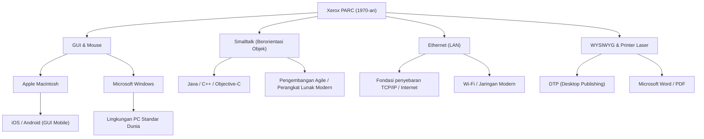

# Xerox PARC: Laboratorium yang Menemukan Komputer Masa Depan Namun Kehilangan Pasar

## Pendahuluan

Saat mengoperasikan komputer dan ponsel cerdas modern, kita dengan sendirinya mengklik ikon di layar, memindahkan jendela, terhubung ke jaringan melalui Wi-Fi atau Ethernet, dan membuat dokumen yang dicetak dengan font beresolusi tinggi. Namun, tahukah Anda fakta bahwa semua teknologi ini diciptakan di "satu tempat" dan pada "waktu yang hampir bersamaan"?

Tempat itu adalah "Xerox PARC (Palo Alto Research Center)", yang didirikan pada tahun 1970-an. Terletak di perbukitan yang tenang di Palo Alto, California, laboratorium ini tidak diragukan lagi adalah salah satu tempat di mana para pemikir paling inovatif dalam sejarah umat manusia berkumpul.

Dalam artikel ini, kita akan membahas latar belakang pendirian Xerox PARC yang menentukan sejarah komputer, berbagai penemuan revolusioner yang diciptakan di sana (Xerox Alto, konsep Dynabook, Smalltalk, Ethernet, printer laser, editor WYSIWYG), serta ironi sejarah "mengapa Xerox dengan teknologi sehebat itu tidak bisa menjadi penguasa pasar", hingga kunjungan menentukan dari Steve Jobs. Kami akan menggambarkan semuanya dengan antusiasme yang luar biasa dan berdasarkan fakta-fakta yang detail, dalam skala yang mendekati 10.000 karakter.

## Bab 1: Latar Belakang Pendirian ─ Mencari "Kantor Masa Depan"

Pada akhir 1960-an, Xerox (Xerox Corporation), yang memonopoli pasar mesin fotokopi, menikmati keuntungan besar. Namun, di antara manajemen ada yang merasakan krisis kuat akan masa depan. Kekhawatiran mereka adalah, "Suatu saat era tanpa kertas (paperless) akan tiba, dan permintaan akan mesin fotokopi untuk mencetak di atas kertas akan menghilang." Xerox perlu bertransformasi dari sekadar "perusahaan mesin fotokopi" menjadi "perusahaan yang menyediakan arsitektur informasi."

Visi ini didorong oleh Jack Goldman, kepala peneliti di Xerox, yang mengusulkan pendirian laboratorium penelitian dasar. Pada tahun 1970, Xerox mendirikan "Xerox PARC" di Palo Alto, California, yang berdekatan dengan Universitas Stanford di Pantai Barat, jauh dari markas besar di New York di Pantai Timur.

Orang yang terpilih sebagai direktur pertama adalah Bob Taylor, yang sebelumnya memimpin Information Processing Techniques Office (IPTO) di ARPA (Advanced Research Projects Agency) dan mendanai ARPANET, prototipe internet. Taylor memiliki pengalaman mendanai laboratorium Douglas Engelbart (penemu mouse) dan memiliki jaringan kuat dengan ilmuwan komputer brilian di seluruh Amerika.

Taylor berkata, "Anggaran melimpah, telitilah apa yang kalian suka," dan dia merekrut peneliti muda jenius dari Stanford Research Institute (SRI), Massachusetts Institute of Technology (MIT), Universitas Utah, dan lainnya. Tujuan mereka hanya satu: "Menciptakan kantor masa depan 10 tahun dari sekarang, di sini, saat ini juga."

## Bab 2: Xerox Alto ─ Komputer Pribadi yang Dibawa oleh Mesin Waktu

Pencapaian terbesar PARC, dan nenek moyang dari setiap PC modern, adalah "Xerox Alto" yang diselesaikan pada tahun 1973.

Pada saat itu, ketika berbicara tentang komputer, yang terbayang adalah mainframe raksasa yang memenuhi seluruh ruangan, dan umumnya dioperasikan dengan punch card atau CUI (Character User Interface) berbasis teks. Tapi Alto berbeda. Dirancang oleh Chuck Thacker, Butler Lampson, dan kawan-kawan, mesin ini adalah wujud fisik pertama di dunia dari konsep "komputer pribadi (personal computer)" yang diletakkan di atas meja dan digunakan secara eksklusif oleh satu individu.

Inovasi Alto terletak pada poin-poin berikut:

1. **GUI (Graphical User Interface) dan Layar Bitmap**:
   Menggunakan layar yang piksel-pikselnya dapat dikontrol secara individual, memungkinkan penggambaran tidak hanya teks tetapi juga bentuk dan gambar dengan bebas. Metafora "desktop" digunakan di layar, menampilkan ikon folder dan file.

2. **Operasi Intuitif dengan Mouse**:
   Memodifikasi mouse yang ditemukan oleh Douglas Engelbart, melengkapinya dengan mouse tiga tombol yang mudah digunakan. Sistem di mana operasi diselesaikan hanya dengan "menunjuk dan mengklik" ikon di layar, alih-alih mengetik perintah kompleks pada keyboard, adalah pengalaman ajaib pada waktu itu.

3. **Sistem Jendela (Window System)**:
   Memiliki fungsi untuk menjalankan beberapa program secara bersamaan dan menampilkannya sebagai "jendela" yang saling tumpang tindih. Ini mewujudkan lingkungan multitasking yang saat ini dianggap biasa, seperti membuat dokumen sambil melakukan perhitungan di jendela lain.

Meskipun Alto tidak pernah dijual secara komersial, ribuan unit didistribusikan di dalam PARC dan beberapa universitas, memungkinkan para peneliti merasakan "lingkungan komputasi masa depan." Dengan menggunakan Alto, mereka bahkan mengembangkan "Maze War", game menembak jaringan kompetitif pertama di dunia.

## Bab 3: Konsep "Dynabook" Alan Kay dan Berorientasi Objek

Orang yang menopang lingkungan perangkat lunak Alto dari dasarnya dan melihat lebih jauh ke masa depan adalah seorang visioner bernama Alan Kay.

Kay percaya bahwa "komputer seharusnya bukan sekadar mesin hitung, tetapi media untuk memperluas pemikiran manusia (metamedium)." Ia mengusulkan konsep "Dynabook." Ini adalah "komputer berbentuk papan tipis dan portabel seukuran A4, dengan layar beresolusi tinggi, keyboard, dan fungsi komunikasi jaringan, memungkinkan bahkan anak-anak untuk secara intuitif melakukan pemrograman dan aktivitas kreatif." Hebatnya, ini diusulkan antara akhir 1960-an hingga awal 1970-an, dan secara sempurna meramalkan perangkat tablet modern seperti iPad.

Sebagai bahasa dan lingkungan perangkat lunak untuk mewujudkan Dynabook ini, Kay dan timnya mengembangkan "Smalltalk."

Smalltalk adalah bahasa yang menetapkan konsep "Object-Oriented Programming (OOP)," yang sangat diperlukan dalam rekayasa perangkat lunak modern. Paradigma di mana semua data dan program diperlakukan sebagai "objek" yang saling berkomunikasi melalui "pesan" adalah pendekatan yang sama sekali berbeda dari bahasa prosedural (seperti C dan FORTRAN) pada masa itu.

Smalltalk bukan sekadar bahasa, melainkan juga sebuah OS dan lingkungan GUI itu sendiri. Konsep "jendela yang tumpang tindih (overlapping windows)" juga pertama kali diimplementasikan dalam lingkungan Smalltalk (Smalltalk-76). Programmer dapat menulis ulang kode sistem yang sedang berjalan secara real-time, memberikan fleksibilitas dan kreativitas yang sangat tinggi. Kay meninggalkan kutipan terkenal, "Cara terbaik untuk memprediksi masa depan adalah dengan menemukannya," dan dia benar-benar menemukan masa depan melalui Smalltalk.

## Bab 4: Ethernet ─ Lahirnya Jaringan yang Menghubungkan Dunia

Jika komputer pribadi meningkatkan produktivitas intelektual individu, menghubungkannya akan menciptakan nilai yang jauh lebih besar. Dari pemikiran ini lahirlah "Ethernet".

Penemunya, Robert Metcalfe, mendapat inspirasi dari metode komunikasi jaringan nirkabel di Universitas Hawaii yang disebut ALOHAnet. Ia merancang mekanisme sederhana di mana beberapa komputer berbagi satu kabel koaksial, dan jika data bertabrakan (collision), mereka akan menunggu waktu acak sebelum mengirim ulang.

Pada tahun 1973, Metcalfe dan koleganya David Boggs membangun sistem yang menghubungkan Alto untuk bertukar data, dan menamakannya "Ethernet." Kecepatan komunikasinya saat itu adalah 2,94 Mbps, yang di era komunikasi berbasis teks, merupakan kapasitas besar dan kecepatan tinggi yang mencengangkan.

Dengan Ethernet, para peneliti PARC dapat berbagi file antar Alto, saling mengirim email, dan mengirim pekerjaan pencetakan ke printer melalui jaringan. LAN (Local Area Network) berskala penuh pertama di dunia dibangun di dalam gedung PARC, menyelesaikan prototipe lingkungan kantor modern. Metcalfe kemudian mendirikan 3Com, mendorong Ethernet menjadi standar dunia.

## Bab 5: Printer Laser dan WYSIWYG ─ Revolusi Sejak Mesin Cetak Huruf Lepas

PARC juga membawa revolusi pada bisnis inti Xerox, yaitu "pencetakan kertas." Tokoh sentralnya adalah Gary Starkweather.

Pada saat itu, keluaran komputer umumnya berupa huruf kasar dari printer dot-matrix dan sejenisnya. Starkweather muncul dengan ide menembakkan sinar laser langsung ke drum fotoreseptor di dalam mesin fotokopi andalan Xerox untuk menulis teks dan gambar. Dia ditanggapi dingin oleh kantor pusat, yang mengatakan "Itu hanya akan memakan permintaan fotokopi," namun setelah pindah ke PARC, dia melanjutkan penelitiannya dan pada tahun 1971 menyelesaikan "EARS," printer laser pertama di dunia.

Selanjutnya, perangkat lunak revolusioner untuk memanfaatkannya secara maksimal adalah pengolah kata "Bravo," yang dikembangkan oleh Charles Simonyi dan Butler Lampson.

Bravo adalah yang pertama di dunia yang mewujudkan konsep "WYSIWYG (What You See Is What You Get: Apa yang Anda lihat adalah apa yang Anda dapatkan)." Dokumen dengan font dan tata letak yang indah yang ditampilkan di layar Alto (layar berorientasi potret seperti kertas) dicetak dengan jelas dari printer laser dalam bentuk aslinya.

Komputer sebelumnya, tata letak biasanya tidak diketahui sampai Anda melihat hasil cetakan. Namun, kombinasi Bravo dan printer laser menjadi asal mula Desktop Publishing (DTP), dan Simonyi kemudian pindah ke Microsoft untuk mengembangkan "Microsoft Word."

## Bab 6: Persimpangan Takdir ─ Kunjungan Steve Jobs ke PARC

Menjelang akhir 1970-an, semacam rasa frustrasi mulai menumpuk di dalam PARC. Meskipun para peneliti telah menyelesaikan gambaran utuh komputer masa depan, manajemen markas besar Xerox sama sekali tidak mengerti bagaimana mengubahnya menjadi produk dan menjualnya. Bagi manajemen, Alto adalah "prototipe yang terlalu mahal," dan yang menghasilkan keuntungan tetaplah mesin fotokopi.

Di tengah situasi tersebut, terjadi peristiwa menentukan yang mengubah sejarah. Pada bulan Desember 1979, seorang pengusaha muda yang sedang naik daun, salah satu pendiri Apple Computer, Steve Jobs, mengunjungi PARC.

Jobs telah menjadi kesayangan Lembah Silikon dengan kesuksesan besar Apple II, tetapi dia sedang mencari komputer generasi berikutnya. Sebagai imbalan atas Apple yang memberi Xerox kuota investasi saham, Jobs dan sesama insinyurnya mendapatkan hak untuk mengamati teknologi PARC.

Peneliti PARC Larry Tesler (penemu copy & paste) dan rekan-rekannya mendemonstrasikan Alto dan Smalltalk kepada Jobs. Jendela di layar tumpang tindih, dioperasikan dengan lancar menggunakan mouse, dan perintah dipilih dari menu pop-up. Saat melihatnya, Jobs sangat terkejut seolah disambar petir.

Jobs kemudian berkata:
"Mereka (PARC) juga menunjukkan pemrograman berorientasi objek dan jaringan. Tapi saya benar-benar terpikat oleh demo GUI, dan sama sekali tidak melihat dua yang lain. Dalam waktu kurang dari 10 menit, saya yakin bahwa semua komputer di masa depan akan seperti ini. Itu sangat jelas seperti matahari."

Sekembalinya ke Apple, Jobs sepenuhnya membatalkan arah pengembangan proyek "Lisa" dan "Macintosh" yang sedang berlangsung, dan memerintahkan segala upaya untuk membuat komputer berbasis GUI. Dalam prosesnya, banyak insinyur PARC yang brilian, termasuk Larry Tesler, pindah ke Apple untuk mengkomersilkan cita-cita mereka.

Pada tahun 1984, Apple mengumumkan Macintosh generasi pertama. Ini menjadi komputer pribadi pertama yang mengkomersilkan visi PARC pada harga yang terjangkau bagi massa, dan selamanya mengubah dunia.

## Bab 7: Mengapa Xerox Kehilangan Pasar? (The Fumble)

Xerox PARC menciptakan semua teknologi yang melahirkan industri bernilai triliunan dolar, seperti komputer pribadi, GUI, mouse, jaringan, dan printer laser. Namun, Xerox sendiri gagal mendominasi pasar tersebut. Dalam sejarah bisnis, ini sering disebut sebagai "kegagalan terbesar dalam sejarah (The Fumble)."

Mengapa Xerox kehilangan pasar? Alasan utamanya adalah sebagai berikut:

1. **Kutukan Bisnis Inti (Mesin Fotokopi) dan Kurangnya Pemahaman Manajemen**:
   Tim manajemen Xerox di New York, Pantai Timur, adalah kelompok ahli kimia dan teknik mesin (mesin fotokopi), dan mereka tidak dapat memahami nilai digital atau perangkat lunak. Bagi mereka, PC tidak lebih dari "ancaman bagi penjualan mesin fotokopi" atau "mesin tik mahal untuk sekretaris."

2. **Biaya yang Terlalu Tinggi**:
   Alto pada tahun 1970-an menelan biaya lebih dari $10.000 hanya untuk suku cadang. Itu terlalu mahal untuk dijual di pasar konsumen umum pada masa itu, dan perlu menunggu biaya perangkat keras turun sesuai Hukum Moore.

3. **Hambatan Antar Organisasi (Pantai Timur vs Pantai Barat)**:
   Ada jurang budaya yang putus asa antara manajemen markas besar dan peneliti PARC yang dipengaruhi oleh budaya hippie Pantai Barat. Terdapat kekurangan komunikasi untuk mencoba memahami satu sama lain.

4. **Kurangnya Pemasaran dan Jaringan Penjualan**:
   Ketika Xerox akhirnya merilis sistem komersial bernama "Xerox Star" pada tahun 1981, sistem itu sangat canggih, tetapi harganya puluhan ribu dolar untuk keseluruhan sistem. Penjual mesin fotokopi tidak tahu bagaimana menjual komputer jaringan yang rumit ini.

Manajemen Xerox kehilangan "kesempatan untuk menjadi penguasa industri informasi", tetapi di sisi lain, hanya dari bisnis printer laser yang ditemukan oleh Starkweather, Xerox meraup keuntungan miliaran dolar. Ada juga pandangan bahwa investasi di PARC sukses besar karena printer laser saja telah menutupi seluruh biaya penelitian PARC dan memberikan keuntungan yang melimpah.

## Bab 8: Warisan Xerox PARC dan Pengaruhnya di Era Modern

Ide-ide yang mengalir dari Xerox ke Apple dan Microsoft akhirnya menyebar ke seluruh dunia sebagai Windows dan Mac OS. Ethernet telah menjadi infrastruktur jaringan untuk semua perusahaan dan membangun fondasi masyarakat internet saat ini.

Berikut adalah diagram konseptual yang menunjukkan bagaimana teknologi PARC diwariskan ke era modern.

Pencapaian terbesar PARC bukanlah menjual produk tertentu, tetapi "mengubah secara fundamental paradigma komputasi." Dari "mesin hitung" menjadi "alat untuk produksi intelektual", dari "milik para ahli" menjadi "milik individu."

Peneliti PARC seperti Alan Kay membangun sistem ideal tanpa kompromi untuk menjawab pertanyaan murni, "Seperti apa seharusnya komputer masa depan?" Visi yang mereka gambarkan begitu sempurna dan kuat, sehingga bisa dikatakan bahwa industri komputer selama 50 tahun berikutnya pada dasarnya hanyalah sejarah tentang "bagaimana membuat masa depan yang ditemukan oleh PARC menjadi lebih murah, lebih kecil, dan dalam jumlah yang lebih besar."

## Penutup

Kisah Xerox PARC mengajarkan kita pentingnya penelitian dasar dalam inovasi dan betapa sulitnya menghubungkannya dengan bisnis. Kita mungkin bisa "menemukan masa depan", tetapi membawanya ke pasar membutuhkan bakat dan waktu yang berbeda.

Hari ini, ketika kita mengeluarkan ponsel cerdas dari saku, mengetuk layar, dan mengakses informasi dari seluruh dunia, di ujung jari kita berdenyut kehidupan "masa depan" yang diimpikan di Palo Alto 50 tahun lalu. Mimpi Dynabook yang dibayangkan oleh peneliti Xerox PARC kini telah melalui tangan berbagai perusahaan dan para jenius, dan benar-benar ada di genggaman tangan kita.
