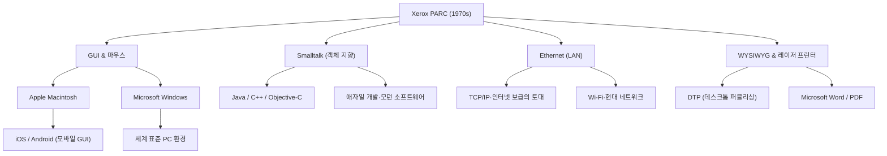

# Xerox PARC: 미래의 컴퓨터를 발명하고도 시장을 놓친 연구소

## 서론

현대의 컴퓨터나 스마트폰을 조작할 때, 우리는 당연하게 화면 위의 아이콘을 클릭하고 창을 이동시키며, Wi-Fi나 이더넷을 통해 네트워크에 연결하고, 고해상도 폰트로 인쇄된 문서를 작성합니다. 그러나 이 모든 기술들이 '하나의 장소'에서, '거의 같은 시기'에 발명되었다는 사실을 알고 계십니까?

그 장소가 바로 1970년대에 설립된 'Xerox PARC (Palo Alto Research Center: 제록스 팔로알토 연구소)'입니다. 캘리포니아주 팔로알토의 조용한 구릉지대에 위치한 이 연구소는, 의심할 여지 없이 인류 역사상 가장 혁신적인 두뇌들이 모인 장소 중 하나였습니다.

본 기사에서는 컴퓨터의 역사를 결정지은 Xerox PARC의 설립 배경부터, 그곳에서 탄생한 수많은 혁명적 발명(Xerox Alto, 다이나북 구상, 스몰토크, 이더넷, 레이저 프린터, WYSIWYG 에디터), 그리고 '왜 제록스는 이토록 뛰어난 기술을 가지고도 시장의 패자가 되지 못했는가'라는 역사의 아이러니, 더 나아가 스티브 잡스의 운명적인 방문까지, 압도적인 열량과 상세한 사실에 기반하여 그 전모를 그려냅니다.

## 제1장: 설립 배경 ─ '미래의 사무실'을 찾아서

1960년대 후반, 복사기 시장에서 압도적인 독점 상태에 있던 제록스(Xerox Corporation)는 거액의 이익을 구가하고 있었습니다. 그러나 경영진 중에는 미래에 대한 강한 위기감을 품은 자들도 있었습니다. "언젠가 페이퍼리스(paperless) 시대가 도래하여 종이에 인쇄하는 복사기의 수요가 소멸하지 않을까"하는 우려였습니다. 제록스는 단순한 '복사기 회사'에서 '정보의 아키텍처를 제공하는 회사'로 탈바꿈할 필요가 있었습니다.

이 비전을 견인한 사람이 제록스의 수석 연구원이었던 잭 골드먼(Jack Goldman)으로, 그는 기초 연구소의 설립을 제안합니다. 1970년, 제록스는 본사가 있는 동해안의 뉴욕주에서 멀리 떨어진 서해안, 캘리포니아주 스탠퍼드 대학교에 인접한 팔로알토에 'Xerox PARC'를 설립했습니다.

초대 소장으로 발탁된 인물은 ARPA(국방고등연구계획국)에서 정보처리기술실(IPTO)을 이끌며 인터넷의 원형인 ARPANET의 자금 지원 등을 수행했던 밥 테일러(Bob Taylor)였습니다. 테일러는 마우스의 발명가인 더글러스 엔겔바트의 연구소 등을 지원한 경험이 있어, 미국 전역의 우수한 컴퓨터 과학자들과 강한 인맥을 가지고 있었습니다.

테일러는 "예산은 풍부하니, 원하는 것을 연구해라"고 촉구하며 스탠퍼드 연구소(SRI)나 매사추세츠 공과대학교(MIT), 유타 대학교 등에서 당시의 천재적인 젊은 연구자들을 차례로 스카우트했습니다. 그들의 목표는 단 하나, "10년 후 미래의 사무실을 지금, 이곳에 만들어내는 것"이었습니다.

## 제2장: Xerox Alto ─ 타임머신을 타고 온 개인용 컴퓨터

PARC의 최대 성과이자 현대의 모든 PC의 조상이라고 할 수 있는 것이 1973년에 완성된 'Xerox Alto(제록스 알토)'입니다.

당시 컴퓨터라고 하면 방 전체를 차지하는 거대한 메인프레임이었고, 조작은 천공 카드나 텍스트뿐인 CUI(문자 사용자 인터페이스)로 하는 것이 상식이었습니다. 그러나 Alto는 달랐습니다. 찰스 태커(Chuck Thacker)나 버틀러 램프슨(Butler Lampson) 등에 의해 설계된 이 머신은, 개인이 책상 위에 두고 독점해서 사용하는 '퍼스널 컴퓨터'의 개념을 세계 최초로 실체화한 것이었습니다.

Alto의 혁신성은 다음 점들에 있었습니다:

1. **GUI(그래픽 사용자 인터페이스)와 비트맵 디스플레이**:
   화면상의 픽셀을 개별적으로 제어할 수 있는 디스플레이를 채택하여, 문자뿐만 아니라 도형이나 이미지를 자유롭게 그릴 수 있었습니다. 화면에는 '데스크톱'이라는 메타포가 사용되어 폴더나 파일의 아이콘이 표시되었습니다.

2. **마우스를 통한 직관적인 조작**:
   더글러스 엔겔바트가 발명한 마우스를 개량하여 3버튼식의 사용하기 쉬운 마우스를 표준 장비로 갖추었습니다. 키보드로 복잡한 명령어를 입력하는 대신 화면의 아이콘을 '가리키고 클릭하는' 것만으로 조작이 완료되는 시스템은, 당시로서는 마법과도 같은 경험이었습니다.

3. **윈도우 시스템**:
   여러 프로그램을 동시에 실행하고, 각각을 겹쳐진 '윈도우(창)'로 표시하는 기능을 가졌습니다. 이로 인해 문서를 작성하면서 다른 창에서 계산을 하는 등 현대에서는 당연한 멀티태스킹 환경이 구현되었습니다.

Alto는 상업적으로 판매되지는 않았지만, PARC 내부나 일부 대학에 수천 대가 배포되어 연구자들에게 '미래의 컴퓨팅 환경'을 체험하게 했습니다. 그들은 Alto를 사용하여 세계 최초의 네트워크 대전형 슈팅 게임 'Maze War'까지 개발했습니다.

## 제3장: 앨런 케이의 'Dynabook' 구상과 객체 지향

Alto의 소프트웨어 환경을 근본에서부터 지탱하고, 나아가 그 너머의 미래를 내다보고 있던 사람이 앨런 케이(Alan Kay)라는 비저너리입니다.

케이는 "컴퓨터는 단순한 계산기가 아니라 인간의 사고를 확장하기 위한 미디어(메타 미디어)여야 한다"고 생각했습니다. 그가 주창한 것이 'Dynabook(다이나북)'이라는 구상입니다. 이는 "A4 크기 정도의 얇은 휴대 가능한 판상형 컴퓨터로, 고해상도 디스플레이와 키보드, 네트워크 통신 기능을 가지며, 어린아이도 직관적으로 프로그래밍이나 창작 활동을 할 수 있는 기기"라는 것이었습니다. 놀랍게도 이는 1960년대 후반에서 70년대 초반에 제창된 것으로, 현재의 아이패드 등 태블릿 단말기를 완벽하게 예견하고 있었습니다.

이 Dynabook을 실현하기 위한 소프트웨어 언어·환경으로서 케이 등이 개발한 것이 'Smalltalk(스몰토크)'입니다.

Smalltalk는 현대 소프트웨어 공학에서 빼놓을 수 없는 '객체 지향 프로그래밍(OOP)'의 개념을 확립한 언어입니다. 모든 데이터나 프로그램을 '객체'로 다루고, 그것들이 '메시징'을 통해 서로 통신하는 패러다임은 당시의 절차적 언어(C언어나 포트란 등)와는 전혀 다른 접근법이었습니다.

Smalltalk는 단순한 언어가 아니라 OS이자 GUI 환경 그 자체이기도 했습니다. 윈도우를 겹쳐 표시하는 '오버랩 윈도우'의 개념도 Smalltalk 환경(Smalltalk-76)에서 처음 구현되었습니다. 프로그래머는 실행 중인 시스템의 코드를 실시간으로 재작성할 수 있어 극도로 높은 유연성과 창조성을 제공했습니다. 케이는 "미래를 예측하는 가장 좋은 방법은 미래를 발명하는 것이다"라는 유명한 말을 남겼는데, 그는 그야말로 Smalltalk를 통해 미래를 발명하고 있었던 것입니다.

## 제4장: 이더넷(Ethernet) ─ 세계를 연결하는 네트워크의 탄생

개인용 컴퓨터가 개인의 지적 생산성을 향상시킨다면, 그것들을 연결하면 더욱 거대한 가치가 창출될 것이다. 이 발상에서 탄생한 것이 'Ethernet(이더넷)'입니다.

발명가인 로버트 멧캐프(Robert Metcalfe)는 하와이 대학교의 알로하넷(ALOHAnet)이라는 무선 네트워크 통신 방식에서 영감을 얻었습니다. 그는 여러 컴퓨터가 하나의 동축 케이블을 공유하며, 데이터가 충돌(콜리전)할 경우 무작위 시간 동안 대기한 후 재전송하는 단순한 방식을 고안했습니다.

1973년, 멧캐프는 동료 데이비드 보그스와 함께 Alto들을 서로 연결하여 데이터를 주고받는 시스템을 구축했고, 이를 'Ethernet'이라 명명했습니다. 당시 통신 속도는 2.94 Mbps였으며, 텍스트 기반 통신밖에 존재하지 않던 시대에서 이는 경이적인 대용량·초고속 통신이었습니다.

이더넷을 통해 PARC의 연구자들은 Alto 간에 파일을 공유하고, 이메일을 주고받으며, 네트워크 너머의 프린터에 인쇄 작업을 전송할 수 있게 되었습니다. PARC의 건물 내에는 세계 최초의 본격적인 LAN(근거리 통신망)이 구축되어 현대 사무실 환경의 프로토타입이 완성되었습니다. 멧캐프는 훗날 3Com을 설립하여 이더넷을 세계 표준 규격으로 끌어올리게 됩니다.

## 제5장: 레이저 프린터와 WYSIWYG ─ 활판 인쇄 이래의 혁명

제록스의 본업인 '종이 인쇄'에도 PARC는 혁명을 가져왔습니다. 그 중심인물이 게리 스타크웨더(Gary Starkweather)입니다.

당시 컴퓨터의 출력은 도트 매트릭스 프린터 등에 의한 조잡한 문자가 일반적이었습니다. 스타크웨더는 제록스의 주력 복사기 내부에 있는 감광 드럼에 레이저 광을 직접 조사하여 문자와 이미지를 기록한다는 아이디어를 떠올립니다. 본사로부터는 "복사기 수요를 갉아먹을 뿐이다"라며 냉대를 받았지만, PARC로 이적한 그는 연구를 계속하여 1971년에 세계 최초의 레이저 프린터 'EARS'를 완성했습니다.

더욱이 이를 최대한 활용하기 위한 획기적인 소프트웨어가, 찰스 시모니(Charles Simonyi)와 버틀러 램프슨이 개발한 워드 프로세서 'Bravo(브라보)'입니다.

Bravo는 'WYSIWYG(What You See Is What You Get: 보는 대로 얻는다)'라는 개념을 세계 최초로 구현했습니다. 화면상의 Alto 디스플레이(게다가 종이와 같은 세로형 디스플레이)에 표시된 아름다운 폰트와 레이아웃의 문서가 그대로 레이저 프린터에서 선명하게 인쇄되어 나오는 것입니다.

그때까지의 컴퓨터는 인쇄 결과를 보기 전에는 레이아웃을 알 수 없는 것이 보통이었습니다. 그러나 Bravo와 레이저 프린터의 조합은 데스크톱 퍼블리싱(DTP)의 원점이 되었고, 이후 시모니는 마이크로소프트로 이적하여 'Microsoft Word'를 개발하게 됩니다.

## 제6장: 운명의 교차점 ─ 스티브 잡스의 PARC 방문

1970년대의 끝이 다가오면서 PARC 내부에서는 일종의 좌절감이 쌓이기 시작했습니다. 연구자들은 미래의 컴퓨터의 전모를 완성했음에도 불구하고, 제록스 본사의 경영진은 그것을 어떻게 제품화하고 어떻게 팔아야 할지 전혀 이해하지 못했기 때문입니다. 경영진에게 Alto는 '너무 비싼 시제품'이었고, 이익을 창출하는 것은 여전히 복사기였습니다.

그런 와중에 역사를 움직이는 결정적인 사건이 일어납니다. 1979년 12월, 신진기예의 젊은 기업가, 애플 컴퓨터의 공동 창업자 스티브 잡스(Steve Jobs)가 PARC를 방문한 것입니다.

잡스는 Apple II의 대성공으로 실리콘 밸리의 총아가 되었지만, 차세대 컴퓨터를 모색하고 있었습니다. 애플이 제록스에게 주식 투자枠을 양보하는 대가로, 잡스와 동료 엔지니어들은 PARC의 기술을 견학할 권리를 얻었습니다.

PARC의 연구원인 래리 테슬러(복사&붙여넣기 발명가) 등이 잡스에게 Alto와 Smalltalk 데먼스트레이션을 선보였습니다. 화면상의 창이 겹치고, 마우스를 사용하여 부드럽게 조작하며, 팝업 메뉴에서 명령을 선택하는 그 모습을 본 순간, 잡스는 벼락에 맞은 듯한 충격을 받았습니다.

잡스는 훗날 이렇게 말했습니다.
"그들(PARC)은 객체 지향 프로그래밍도 보여주었고 네트워크도 보여주었다. 그러나 나는 GUI 데모에 완전히 마음을 빼앗겨 나머지 두 개는 전혀 눈에 들어오지 않았다. 10분도 채 안 되어, 나는 미래의 컴퓨터가 모두 이렇게 될 것이라고 확신했다. 그것은 태양처럼 명백했다."

잡스는 애플로 돌아가자 진행 중이던 프로젝트 'Lisa(리사)'와 'Macintosh(매킨토시)'의 개발 방침을 근본적으로 뒤집고 전력을 다해 GUI 기반 컴퓨터를 만들도록 지시했습니다. 그 과정에서 래리 테슬러를 비롯한 많은 PARC의 우수한 엔지니어들이 자신의 이상을 제품화하기 위해 애플로 이적했습니다.

1984년, 애플은 초대 매킨토시를 발표했습니다. 그것은 PARC의 비전을 대중이 손에 닿을 수 있는 가격으로 제품화한 최초의 개인용 컴퓨터가 되었고, 세상을 영원히 바꾸게 됩니다.

## 제7장: 왜 제록스는 시장을 놓쳤는가? (The Fumble)

Xerox PARC는 개인용 컴퓨터, GUI, 마우스, 네트워크, 레이저 프린터 등 수조 달러 규모의 산업을 창출할 기술을 모두 발명했습니다. 그러나 제록스 자신은 그 시장을 지배하지 못했습니다. 비즈니스 역사에서 이는 '역사상 가장 큰 실수(The Fumble)'라고 불리기도 합니다.

왜 제록스는 시장을 놓쳤을까요? 주요 이유는 다음과 같습니다.

1. **본업(복사기)의 굴레와 경영진의 몰이해**:
   동해안의 뉴욕에 있는 제록스의 경영진은 화학과 기계공학(복사기)의 전문가 집단이었고, 디지털이나 소프트웨어의 가치를 이해하지 못했습니다. 그들에게 PC는 '복사기 매출을 위협하는 존재' 혹은 '비서용 비싼 타자기'에 불과했습니다.

2. **너무 높은 비용**:
   1970년대의 Alto는 부품값만 1만 달러 이상이 들었습니다. 당시의 일반 소비자 대상 시장에 판매하기에는 너무 비쌌으며, 무어의 법칙에 의한 하드웨어 비용 하락을 기다릴 필요가 있었습니다.

3. **조직 간의 장벽 (동해안 vs 서해안)**:
   본사 경영진과 서해안의 히피 문화에 영향을 받은 PARC 연구자들 사이에는 절망적인 문화적 단절이 있었습니다. 서로를 이해하려는 의사소통이 부족했습니다.

4. **마케팅과 판매망의 부재**:
   마침내 제록스가 1981년에 'Xerox Star(제록스 스타)'라는 상용 시스템을 출시했을 때, 그것은 매우 고도화되었지만 시스템 전체로 수만 달러나 하는 고가의 장비였습니다. 복사기 영업사원들에게는 이 복잡한 네트워크 컴퓨터를 어떻게 팔아야 할지 알 길이 없었습니다.

제록스 경영진은 '정보 산업의 패자가 될 기회'를 놓쳤지만, 한편으로 스타크웨더가 발명한 레이저 프린터 사업만으로도 제록스는 수십억 달러의 이익을 올렸습니다. 레이저 프린터 하나만으로 PARC의 전체 연구비를 회수하고도 남을 이익을 가져다주었다는 의미에서는 PARC에 대한 투자가 대성공이었다는 시각도 있습니다.

## 제8장: Xerox PARC의 유산과 현대에 미친 영향

제록스에서 애플이나 마이크로소프트로 유출된 아이디어는 이윽고 Windows나 Mac OS로서 전 세계에 보급되었습니다. 이더넷은 모든 기업의 네트워크 인프라가 되었고 오늘의 인터넷 사회의 토대를 구축했습니다.

다음은 PARC의 기술이 현대에 어떻게 계승되었는지를 보여주는 개념도입니다.

PARC의 가장 큰 공적은 특정 제품을 판 것이 아니라, '컴퓨팅의 패러다임을 근본적으로 바꾸었다는 것'입니다. '계산기'를 '지적 생산의 도구'로, '전문가의 것'에서 '개인의 것'으로.

앨런 케이를 비롯한 PARC의 연구자들은 '미래의 컴퓨터는 어떠해야 하는가'라는 순수한 물음에 대해 타협 없는 이상적인 시스템을 구축했습니다. 그들이 그린 비전이 너무나도 완벽하고 강력했기에, 그 후 50년 동안의 컴퓨터 산업은 본질적으로 "PARC가 발명한 미래를 어떻게 더 싸게, 더 작게, 대량으로 만들 것인가"라는 역사에 불과하다고도 할 수 있습니다.

## 맺음말

Xerox PARC의 이야기는 혁신에 있어서 기초 연구의 중요성과 그것을 비즈니스로 연결하는 것의 극한의 어려움을 가르쳐줍니다. '미래를 발명하는' 것은 가능하더라도, 그것을 시장에 전달하기 위해서는 또 다른 재능과 타이밍이 필요합니다.

오늘날 우리가 주머니에서 스마트폰을 꺼내어 화면을 탭하여 전 세계의 정보에 접근할 때, 그 손끝에는 50년 전 팔로알토에서 꿈꾸었던 '미래'가 면면히 숨 쉬고 있습니다. Xerox PARC의 연구자들이 마음속에 그렸던 Dynabook의 꿈은 다양한 기업과 천재들의 손을 거쳐 지금 바로 우리 손안에 있는 것입니다.
