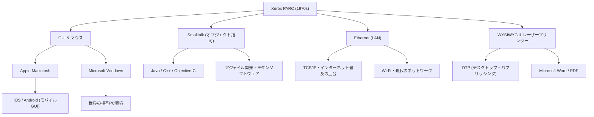

# Xerox PARC：未来のコンピュータを発明しながら市場を逃した研究所

## はじめに

現代のコンピュータやスマートフォンを操作する際、私たちは当然のように画面上のアイコンをクリックし、ウィンドウを移動させ、Wi-FiやEthernetを通じてネットワークに接続し、高精細なフォントで印刷されたドキュメントを作成しています。しかし、これらの技術がすべて「一つの場所」で、「ほぼ同時期」に発明されたという事実をご存知でしょうか。

その場所こそが、1970年代に設立された「Xerox PARC（Palo Alto Research Center：ゼロックス・パロアルト研究所）」です。カリフォルニア州パロアルトの静かな丘陵地帯に位置するこの研究所は、間違いなく人類の歴史において最も革新的な頭脳が集まった場所の一つでした。

本記事では、コンピュータの歴史を決定づけたXerox PARCの設立背景から、そこで生み出された数々の革命的発明（Xerox Alto、Dynabook構想、Smalltalk、Ethernet、レーザープリンター、WYSIWYGエディタ）、そして「なぜゼロックスはこれほどの技術を持ちながら市場の覇者になれなかったのか」という歴史の皮肉、さらにスティーブ・ジョブズの運命的な訪問まで、圧倒的な熱量と詳細な事実に基づき、10000字規模に迫るスケールでその全貌を描き出します。

## 第1章：設立の背景 ─ 「未来のオフィス」を求めて

1960年代後半、コピー機市場で圧倒的な独占状態にあったゼロックス（Xerox Corporation）は、巨額の利益を謳歌していました。しかし、経営陣の中には将来への強い危機感を抱く者もいました。「いつかペーパーレスの時代が到来し、紙に印刷するコピー機の需要が消滅するのではないか」という懸念です。ゼロックスは単なる「コピー機の会社」から「情報のアーキテクチャを提供する会社」へと脱皮する必要がありました。

このビジョンを牽引したのが、ゼロックスの主任研究員であったジャック・ゴールドマンであり、彼は基礎研究所の設立を提案します。1970年、ゼロックスは本社のある東海岸のニューヨーク州から遠く離れた西海岸、カリフォルニア州スタンフォード大学に隣接するパロアルトに「Xerox PARC」を設立しました。

初代所長として白羽の矢が立ったのは、ARPA（国防高等研究計画局）で情報処理技術室（IPTO）を率い、インターネットの原型であるARPANETの資金提供などを行ったボブ・テイラーでした。テイラーは、ダグラス・エンゲルバート（マウスの発明者）の研究所などを支援した経験があり、アメリカ中の優秀なコンピュータ科学者たちと強い人脈を持っていました。

テイラーは「予算は潤沢にある、好きなことを研究してくれ」と呼びかけ、スタンフォード研究所（SRI）やマサチューセッツ工科大学（MIT）、ユタ大学などから、当時の天才的な若手研究者たちを次々と引き抜きました。彼らの目標はただ一つ、「10年後の未来のオフィスを今、ここに作り出すこと」でした。

## 第2章：Xerox Alto ─ タイムマシンで運ばれてきたパーソナル・コンピュータ

PARCの最大の成果であり、現代のあらゆるPCの祖先とも言えるのが、1973年に完成した「Xerox Alto（ゼロックス・アルト）」です。

当時、コンピュータといえば部屋全体を占拠する巨大なメインフレームであり、操作はパンチカードやテキストのみのCUI（キャラクター・ユーザー・インターフェース）で行うのが常識でした。しかしAltoは違いました。チャック・サッカーやバトラー・ランプソンらによって設計されたこのマシンは、個人が机の上に置いて独占して使う「パーソナル・コンピュータ」の概念を世界で初めて実体化したものでした。

Altoの革新性は以下の点にありました：

1. **GUI（グラフィカル・ユーザー・インターフェース）とビットマップ・ディスプレイ**：
   画面上のピクセルを個別に制御できるディスプレイを採用し、文字だけでなく図形や画像を自由に描画できました。画面には「デスクトップ」というメタファーが用いられ、フォルダやファイルのアイコンが表示されました。

2. **マウスによる直感的な操作**：
   ダグラス・エンゲルバートが発明したマウスを改良し、3ボタン式の使いやすいマウスを標準装備しました。キーボードで複雑なコマンドを打ち込む代わりに、画面上のアイコンを「指さしてクリックする」だけで操作が完結するシステムは、当時としては魔法のような体験でした。

3. **ウィンドウ・システム**：
   複数のプログラムを同時に実行し、それぞれを重なり合う「ウィンドウ（窓）」として表示する機能を持ちました。これにより、文書を作成しながら別のウィンドウで計算を行うといった、現代では当たり前のマルチタスク環境が実現しました。

Altoは商用販売されることはありませんでしたが、PARC内や一部の大学に数千台が配布され、「未来のコンピューティング環境」を研究者たちに体験させました。彼らはAltoを使い、世界初のネットワーク対戦型シューティングゲーム「Maze War」まで開発しています。

## 第3章：アラン・ケイの「Dynabook」構想とオブジェクト指向

Altoのソフトウェア環境を根底から支え、さらにその先の未来を見据えていたのが、アラン・ケイ（Alan Kay）というビジョナリーです。

ケイは「コンピュータは単なる計算機ではなく、人間の思考を拡張するためのメディア（メタメディア）であるべきだ」と考えました。彼が提唱したのが「Dynabook（ダイナブック）」という構想です。これは「A4サイズ程度の薄型の持ち運べる板状のコンピュータで、高精細なディスプレイとキーボード、ネットワーク通信機能を持ち、子供でも直感的にプログラミングや創作活動ができるデバイス」というものでした。驚くべきことに、これは1960年代後半から70年代前半に提唱されたものであり、現在のiPadなどのタブレット端末を完璧に予見していました。

このDynabookを実現するためのソフトウェア言語・環境として、ケイらが開発したのが「Smalltalk（スモールトーク）」です。

Smalltalkは、現代のソフトウェア工学において欠かせない「オブジェクト指向プログラミング（OOP）」の概念を確立した言語です。すべてのデータやプログラムを「オブジェクト（物）」として扱い、それらが「メッセージング」によって互いに通信し合うというパラダイムは、当時の手続き型言語（C言語やFORTRANなど）とは全く異なるアプローチでした。

Smalltalkは単なる言語ではなく、OSであり、GUI環境そのものでもありました。ウィンドウを重ねて表示する「オーバーラップ・ウィンドウ」の概念も、Smalltalk環境（Smalltalk-76）で初めて実装されました。プログラマーは実行中のシステムのコードをリアルタイムで書き換えることができ、極めて高い柔軟性と創造性を提供しました。ケイは「未来を予測する最良の方法は、それを発明することだ」という有名な言葉を残していますが、彼はまさにSmalltalkを通じて未来を発明していたのです。

## 第4章：イーサネット（Ethernet） ─ 世界を繋ぐネットワークの誕生

パーソナル・コンピュータが個人の知的生産性を向上させるなら、それらを繋げばさらに巨大な価値が生まれる。この発想から生まれたのが「Ethernet（イーサネット）」です。

発明者のロバート・メトカーフ（Robert Metcalfe）は、ハワイ大学のアロハネット（ALOHAnet）という無線ネットワーク通信方式からインスピレーションを得ました。彼は、複数のコンピュータが一本の同軸ケーブルを共有し、データが衝突（コリジョン）した場合はランダムな時間待機してから再送するというシンプルな仕組みを考案しました。

1973年、メトカーフは同僚のデビッド・ボッグスとともに、Alto同士を接続してデータのやり取りを行うシステムを構築し、これを「Ethernet」と名付けました。当時の通信速度は2.94 Mbpsであり、テキストベースの通信しか存在しなかった時代において、これは驚異的な大容量・高速通信でした。

Ethernetによって、PARCの研究者たちはAlto間でファイルを共有し、電子メールを送り合い、ネットワーク越しにプリンターに印刷ジョブを送信することが可能になりました。PARCの建物内には世界初の本格的なLAN（ローカル・エリア・ネットワーク）が構築され、現代のオフィス環境のプロトタイプが完成しました。メトカーフは後に3Com社を設立し、Ethernetを世界の標準規格へと押し上げることになります。

## 第5章：レーザープリンターとWYSIWYG ─ 活版印刷以来の革命

ゼロックスの本業である「紙の印刷」にも、PARCは革命をもたらしました。その中心人物がゲイリー・スタークウェザー（Gary Starkweather）です。

当時、コンピュータの出力はドットマトリクスプリンターなどによる粗末な文字が一般的でした。スタークウェザーは、ゼロックスの主力コピー機の内部にある感光体ドラムに、レーザー光を直接照射して文字や画像を書き込むというアイデアを思いつきます。本社からは「コピーの需要を食うだけだ」と冷遇されましたが、PARCに移籍した彼は研究を続け、1971年に世界初のレーザープリンター「EARS」を完成させました。

さらに、これを最大限に活用するための画期的なソフトウェアが、チャールズ・シモニーとバトラー・ランプソンによって開発されたワードプロセッサ「Bravo（ブラボー）」です。

Bravoは「WYSIWYG（What You See Is What You Get：見たままが得られる）」という概念を世界で初めて体現しました。画面上のAltoのディスプレイ（しかも紙と同じ縦長のディスプレイ）に表示された美しいフォントやレイアウトの文書が、そのままの形でレーザープリンターから鮮明に印刷されて出てくるのです。

それまでのコンピュータは、印刷結果を見るまでレイアウトがわからないのが普通でした。しかし、Bravoとレーザープリンターの組み合わせは、デスクトップ・パブリッシング（DTP）の原点となり、後にシモニーはマイクロソフトに移籍して「Microsoft Word」を開発することになります。

## 第6章：運命の交差点 ─ スティーブ・ジョブズのPARC訪問

1970年代の終わりに近づくにつれ、PARC内部ではある種のフラストレーションが溜まり始めていました。研究者たちは未来のコンピュータの全貌を完成させていたにもかかわらず、ゼロックスの本社経営陣はそれをどう製品化し、どう売ればいいのか全く理解していなかったからです。経営陣にとって、Altoは「高価すぎる試作品」であり、利益を生み出すのは相変わらずコピー機でした。

そんな中、歴史を動かす決定的な出来事が起こります。1979年12月、新進気鋭の若き起業家、Apple Computerの共同創業者スティーブ・ジョブズ（Steve Jobs）がPARCを訪問したのです。

ジョブズはApple IIの大成功でシリコンバレーの寵児となっていましたが、次世代のコンピュータを模索していました。Appleがゼロックスに株式の投資枠を譲る見返りとして、ジョブズと同僚のエンジニアたちはPARCの技術を見学する権利を得ました。

PARCの研究員であるラリー・テスラー（コピー＆ペーストの発明者）らがジョブズにAltoとSmalltalkのデモンストレーションを行いました。画面上のウィンドウが重なり、マウスを使ってスムーズに操作し、ポップアップメニューからコマンドを選ぶ。その様子を見た瞬間、ジョブズは雷に打たれたような衝撃を受けました。

ジョブズは後にこう語っています。
「彼ら（PARC）はオブジェクト指向プログラミングも見せてくれたし、ネットワークも見せてくれた。しかし私はGUIのデモに完全に目を奪われ、他の２つは全く見えていなかった。10分もしないうちに、私は将来のコンピュータがすべてこうなると確信した。それは太陽のように明らかだった」

ジョブズはAppleに戻ると、進行中だったプロジェクト「Lisa（リサ）」と「Macintosh（マッキントッシュ）」の開発方針を根本から覆し、全力を挙げてGUIベースのコンピュータを作るよう命じました。その過程で、ラリー・テスラーをはじめとする多くのPARCの優秀なエンジニアたちが、自らの理想を製品化するためにAppleへと移籍していきました。

1984年、Appleは初代Macintoshを発表。それはPARCのビジョンを大衆の手の届く価格で製品化した最初のパーソナル・コンピュータとなり、世界を永遠に変えることになります。

## 第7章：なぜゼロックスは市場を逃したのか？（The Fumble）

Xerox PARCは、パーソナル・コンピュータ、GUI、マウス、ネットワーク、レーザープリンターなど、数兆ドル規模の産業を生み出す技術をすべて発明しました。しかし、ゼロックス自身はそれらの市場を支配することはできませんでした。ビジネスの歴史において、これは「歴史上最大の失敗（The Fumble）」と呼ばれることもあります。

なぜゼロックスは市場を逃したのでしょうか。主な理由は以下の通りです。

1. **本業（コピー機）の呪縛と経営陣の無理解**：
   東海岸のニューヨークにいるゼロックスの経営陣は、化学と機械工学（コピー機）の専門家集団であり、デジタルやソフトウェアの価値を理解できませんでした。彼らにとってPCは「コピー機の売上を脅かす存在」あるいは「秘書用の高価なタイプライター」に過ぎませんでした。

2. **高すぎるコスト**：
   1970年代のAltoは、部品代だけで1万ドル以上のコストがかかりました。当時の一般消費者向け市場で販売するにはあまりに高価であり、ムーアの法則によるハードウェアのコスト低下を待つ必要がありました。

3. **組織間の壁（東海岸 vs 西海岸）**：
   本社の経営陣と西海岸のヒッピー文化に影響を受けたPARCの研究者たちの間には、絶望的な文化的な溝がありました。お互いを理解しようとするコミュニケーションが不足していました。

4. **マーケティングと販売網の欠如**：
   ついにゼロックスが1981年に「Xerox Star（ゼロックス・スター）」という商用システムを発売したとき、それは非常に高度でしたが、システム全体で数万ドルもする高価なものでした。コピー機の営業マンには、この複雑なネットワーク・コンピュータをどう売ればいいのか分かりませんでした。

ゼロックスの経営陣は「情報産業の覇者になるチャンス」を逃しましたが、一方で、スタークウェザーの発明したレーザープリンター事業だけで、ゼロックスは数十億ドルの利益を上げました。レーザープリンターだけでもPARCの全研究費を回収して余りある利益をもたらしたという意味では、PARCへの投資は大成功だったという見方もあります。

## 第8章：Xerox PARCの遺産と現代への影響

ゼロックスからAppleやMicrosoftに流出したアイデアは、やがてWindowsやMac OSとして世界中に普及しました。イーサネットはあらゆる企業のネットワークインフラとなり、今日のインターネット社会の土台を築きました。

以下は、PARCの技術がどのように現代に受け継がれたかを示す概念図です。

PARCの最大の功績は、特定の製品を売ったことではなく、「コンピューティングのパラダイムを根本的に変えたこと」です。「計算機」を「知的生産のツール」へ、「専門家のもの」から「個人のもの」へ。

アラン・ケイをはじめとするPARCの研究者たちは、「未来のコンピュータはどうあるべきか」という純粋な問いに対して、妥協のない理想のシステムを構築しました。彼らが描いたビジョンがあまりにも完璧で強力だったため、その後の50年間のコンピュータ産業は、本質的に「PARCが発明した未来を、いかに安く、小さく、大量に作るか」という歴史に過ぎないとも言えます。

## おわりに

Xerox PARCの物語は、イノベーションにおける基礎研究の重要性と、それをビジネスへと結びつけることの極限の難しさを教えてくれます。「未来を発明する」ことはできても、それを市場に届けるにはまた別の才能とタイミングが必要です。

今日、私たちがポケットからスマートフォンを取り出し、画面をタップして世界中の情報にアクセスするとき、その指先には、50年前のパロアルトで夢想された「未来」が脈々と息づいています。Xerox PARCの研究者たちが思い描いたDynabookの夢は、様々な企業と天才たちの手を経て、今まさに私たちの手の中にあるのです。
