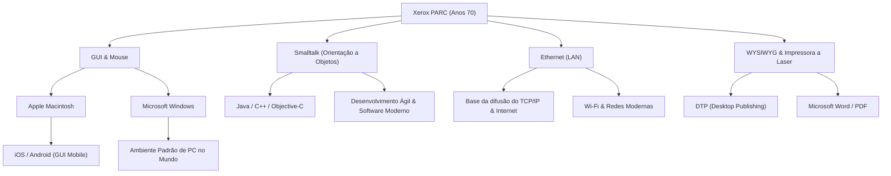

# Xerox PARC: O laboratório que inventou o computador do futuro, mas perdeu o mercado

## Introdução

Ao operarmos os computadores e smartphones de hoje, damos como certo clicar em ícones na tela, mover janelas, conectar a redes via Wi-Fi ou Ethernet e criar documentos impressos com fontes de alta definição. Mas você sabia que todas essas tecnologias foram inventadas em "um único lugar" e "quase ao mesmo tempo"?

Esse lugar é o "Xerox PARC (Palo Alto Research Center)", fundado na década de 1970. Localizado nas colinas tranquilas de Palo Alto, na Califórnia, este laboratório foi inquestionavelmente um dos lugares onde as mentes mais inovadoras da história da humanidade se reuniram.

Neste artigo, traçaremos toda a história, com base em fatos detalhados e muita paixão - em uma escala que beira os 10.000 caracteres -, desde o contexto da fundação do Xerox PARC que determinou a história dos computadores, as inúmeras invenções revolucionárias criadas lá (Xerox Alto, visão Dynabook, Smalltalk, Ethernet, impressora a laser, editor WYSIWYG), a ironia histórica de "por que a Xerox não conseguiu se tornar a líder do mercado com essas tecnologias", até a visita fatídica de Steve Jobs.

## Capítulo 1: O Contexto da Fundação ─ Em busca do "Escritório do Futuro"

No final da década de 1960, a Xerox Corporation, que detinha um monopólio esmagador no mercado de copiadoras, desfrutava de enormes lucros. No entanto, havia quem entre a diretoria nutrisse um forte sentimento de crise em relação ao futuro: "E se chegar a era sem papel e a demanda por copiadoras de papel desaparecer?" A Xerox precisava passar de apenas "uma empresa de copiadoras" para "uma empresa que fornece a arquitetura da informação".

Jack Goldman, cientista-chefe da Xerox, liderou essa visão e propôs a fundação de um laboratório de pesquisa básica. Em 1970, a Xerox estabeleceu o "Xerox PARC" em Palo Alto, Califórnia, ao lado da Universidade de Stanford, na Costa Oeste - longe de sua sede na Costa Leste, em Nova York.

O escolhido para ser o primeiro diretor foi Bob Taylor, que liderou o Escritório de Técnicas de Processamento de Informação (IPTO) na ARPA (Agência de Projetos de Pesquisa Avançada de Defesa) e financiou a ARPANET, a precursora da Internet. Taylor tinha experiência no apoio a laboratórios como o de Douglas Engelbart (o inventor do mouse) e possuía uma forte rede de contatos com os melhores cientistas da computação de todos os Estados Unidos.

Dizendo: "Temos muito orçamento, pesquisem o que quiserem", Taylor recrutou um após o outro jovens pesquisadores brilhantes do Stanford Research Institute (SRI), do Massachusetts Institute of Technology (MIT) e da Universidade de Utah, entre outros. O objetivo deles era apenas um: "Criar o escritório do futuro, daqui a 10 anos, aqui e agora".

## Capítulo 2: Xerox Alto ─ O Computador Pessoal Trazido por uma Máquina do Tempo

A maior conquista do PARC e, sem dúvida, o ancestral de todos os PCs modernos, é o "Xerox Alto", concluído em 1973.

Naquela época, a ideia de computador era um gigantesco mainframe que ocupava uma sala inteira, geralmente operado por cartões perfurados ou texto CUI (Character User Interface). Mas o Alto era diferente. Projetado por Chuck Thacker, Butler Lampson e outros, foi a primeira concretização mundial do conceito de um "computador pessoal" que um indivíduo podia ter em sua mesa de forma exclusiva.

As inovações do Alto incluíam:

1. **GUI (Graphical User Interface) e Tela de Bitmap**:
   Ele utilizava uma tela que podia controlar pixels individualmente, permitindo que o usuário desenhasse não apenas texto, mas também formas e imagens livremente. A metáfora do "desktop" foi usada na tela, exibindo ícones de pastas e arquivos.

2. **Operação intuitiva por Mouse**:
   O mouse inventado por Douglas Engelbart foi aprimorado para um modelo de três botões e veio como padrão. Em vez de digitar comandos complexos em um teclado, o sistema de simplesmente "apontar e clicar" no ícone da tela era uma experiência quase mágica na época.

3. **Sistema de Janelas**:
   Possuía a capacidade de executar múltiplos programas simultaneamente e exibi-los como "janelas" sobrepostas. Isso possibilitou o ambiente multitarefa que hoje damos como garantido, como fazer um cálculo em outra janela enquanto se escreve um documento.

O Alto nunca foi vendido comercialmente, mas milhares de unidades foram distribuídas no próprio PARC e em algumas universidades, permitindo aos pesquisadores experimentar o "ambiente de computação do futuro". Eles até desenvolveram o "Maze War", o primeiro jogo de tiro em rede do mundo, usando o Alto.

## Capítulo 3: A Visão "Dynabook" de Alan Kay e a Orientação a Objetos

Alan Kay, um visionário, apoiou o ambiente de software do Alto desde a sua base e olhou ainda mais para o futuro.

Kay acreditava que "os computadores não devem ser apenas calculadoras, mas uma mídia (metamídia) para expandir o pensamento humano". O que ele propôs foi a visão "Dynabook". Era um "dispositivo de computador plano, fino e portátil do tamanho A4, com tela de alta resolução, teclado e capacidades de comunicação em rede, que até crianças poderiam usar intuitivamente para programar e realizar atividades criativas". Surpreendentemente, essa proposta surgiu entre o final da década de 1960 e o início da década de 1970, antevendo perfeitamente tablets atuais como o iPad.

Para realizar esse Dynabook, Kay e sua equipe desenvolveram a linguagem e ambiente de software "Smalltalk".

A Smalltalk estabeleceu o conceito de "Programação Orientada a Objetos (POO)", que é indispensável na engenharia de software moderna. O paradigma de tratar todos os dados e programas como "objetos" que se comunicam através da troca de mensagens foi uma abordagem completamente diferente das linguagens processuais da época (como C e FORTRAN).

Smalltalk não era apenas uma linguagem, era um sistema operacional e o próprio ambiente GUI. O conceito de "janelas sobrepostas" foi implementado pela primeira vez no ambiente Smalltalk (Smalltalk-76). Os programadores podiam reescrever o código do sistema em execução em tempo real, proporcionando níveis incrivelmente altos de flexibilidade e criatividade. Kay tem a famosa frase: "A melhor maneira de prever o futuro é inventá-lo", e através do Smalltalk, ele literalmente inventou o futuro.

## Capítulo 4: Ethernet ─ O Nascimento da Rede que Conecta o Mundo

Se os computadores pessoais melhoram a produtividade intelectual individual, um valor ainda maior seria gerado se eles fossem conectados. Desse conceito nasceu a "Ethernet".

O inventor Robert Metcalfe inspirou-se no ALOHAnet, o sistema de comunicação de rede sem fio da Universidade do Havaí. Ele criou um sistema simples onde vários computadores compartilham um único cabo coaxial e, caso os dados colidam, esperam um período de tempo aleatório antes de retransmitir.

Em 1973, Metcalfe e seu colega David Boggs construíram um sistema para conectar Altos e trocar dados, o qual ele chamou de "Ethernet". A velocidade de transmissão da época era de 2,94 Mbps, o que, numa era em que só existia a comunicação baseada em texto, representava uma velocidade incrivelmente alta e de grande capacidade.

Com a Ethernet, os pesquisadores do PARC puderam compartilhar arquivos entre Altos, enviar e-mails e trabalhos de impressão pela rede. A primeira rede local (LAN) real do mundo foi construída dentro do edifício do PARC, completando um protótipo do ambiente de escritório moderno. Mais tarde, Metcalfe fundou a 3Com, impulsionando a Ethernet para se tornar o padrão global.

## Capítulo 5: Impressora a Laser e WYSIWYG ─ Uma Revolução Desde a Impressão Tipográfica

O PARC também trouxe uma revolução para a "impressão em papel", que era o negócio principal da Xerox. A figura central foi Gary Starkweather.

Naquela época, as saídas de computador geralmente eram caracteres de baixa qualidade provenientes de impressoras matriciais. Starkweather teve a ideia de irradiar a luz do laser diretamente no cilindro fotossensível dentro da copiadora carro-chefe da Xerox para escrever letras e imagens. Recebeu frieza da sede, que dizia "isso só vai devorar a demanda por cópias", mas continuou sua pesquisa depois de se mudar para o PARC e concluiu a "EARS", a primeira impressora a laser do mundo, em 1971.

Além disso, um software revolucionário chamado "Bravo", desenvolvido por Charles Simonyi e Butler Lampson, foi criado para tirar o máximo proveito da impressora.

O Bravo foi o primeiro no mundo a concretizar o conceito de "WYSIWYG (What You See Is What You Get)". Documentos com belas fontes e layouts exibidos na tela do Alto (que era orientada verticalmente como papel) poderiam ser impressos com nitidez pela impressora a laser exatamente da forma como apareciam.

Até então, os computadores não conseguiam mostrar como seria o layout antes de imprimi-lo. A combinação de Bravo e da impressora a laser foi a base da Editoração Eletrônica (Desktop Publishing - DTP), e Simonyi mais tarde se transferiu para a Microsoft para desenvolver o "Microsoft Word".

## Capítulo 6: O Cruzamento do Destino ─ A Visita de Steve Jobs ao PARC

À medida que o final da década de 1970 se aproximava, uma certa frustração começava a se acumular dentro do PARC. Embora os pesquisadores tivessem completado o projeto geral do computador do futuro, os diretores da Xerox não tinham ideia de como comercializá-lo ou vendê-lo. Para os executivos, o Alto era um "protótipo muito caro" e os lucros continuavam a vir das copiadoras.

Foi então que aconteceu um evento decisivo na história. Em dezembro de 1979, o jovem e promissor empreendedor Steve Jobs, cofundador da Apple Computer, visitou o PARC.

Com o enorme sucesso do Apple II, Jobs tornou-se o favorito do Vale do Silício, mas procurava o computador da próxima geração. Em troca da permissão de que a Xerox investisse em ações da Apple, Jobs e seus colegas engenheiros obtiveram o direito de observar as tecnologias do PARC.

Pesquisadores do PARC como Larry Tesler (inventor do copiar e colar) demonstraram o Alto e o Smalltalk para Jobs. Janelas sobrepostas na tela, navegação suave com um mouse, comandos escolhidos em um menu pop-up. Ao ver isso, Jobs ficou impressionado como se tivesse sido atingido por um raio.

Mais tarde, Jobs relatou:
"Eles (o PARC) me mostraram a programação orientada a objetos e me mostraram a rede. Mas eu estava tão cativado pela demonstração da GUI que não prestei atenção nos outros dois. Em menos de 10 minutos, tive certeza de que, no futuro, todos os computadores seriam assim. Era óbvio como a luz do sol."

Ao voltar para a Apple, Jobs subverteu fundamentalmente as diretrizes de desenvolvimento dos projetos "Lisa" e "Macintosh" em andamento e ordenou que seus esforços se concentrassem na construção de um computador baseado em GUI. Durante o processo, muitos engenheiros brilhantes do PARC, incluindo Larry Tesler, migraram para a Apple para transformar seus ideais em produtos.

Em 1984, a Apple revelou o primeiro Macintosh. Foi o primeiro computador pessoal a traduzir a visão do PARC em um produto que o público em geral podia pagar, e mudou o mundo para sempre.

## Capítulo 7: Por Que a Xerox Perdeu o Mercado? (The Fumble)

O Xerox PARC inventou todas as tecnologias que impulsionaram indústrias de trilhões de dólares: computadores pessoais, GUIs, mouses, redes, impressoras a laser. No entanto, a própria Xerox não conseguiu dominar esses mercados. Na história dos negócios, isso às vezes é chamado de "O maior erro da história" (The Fumble).

Por que a Xerox perdeu o mercado? As principais razões são:

1. **A Maldição do Negócio Principal (Copiadoras) e a Falta de Compreensão dos Executivos**:
   Os executivos da Xerox, sediados em Nova York na Costa Leste, eram especialistas em química e engenharia mecânica (copiadoras) e não conseguiam entender o valor do digital ou de software. Para eles, o PC era apenas "uma ameaça às vendas de copiadoras" ou uma "máquina de escrever cara para secretárias".

2. **Custo Altíssimo**:
   Na década de 1970, o custo do Alto em peças passava de 10.000 dólares. Era caro demais para ser vendido no mercado consumidor em geral na época, necessitando aguardar a redução de custos de hardware impulsionada pela Lei de Moore.

3. **Muros Organizacionais (Costa Leste vs Costa Oeste)**:
   Havia uma barreira cultural formidável entre os executivos da sede e os pesquisadores do PARC, fortemente influenciados pela cultura hippie da Costa Oeste. Havia falta de comunicação e de vontade de se entenderem.

4. **Falta de Marketing e de Redes de Distribuição**:
   Quando a Xerox finalmente lançou um sistema comercial chamado "Xerox Star" em 1981, embora fosse altamente avançado, era muito caro, custando dezenas de milhares de dólares. Os vendedores de copiadoras não tinham ideia de como vender aqueles computadores de rede complexos.

Enquanto a gerência da Xerox perdeu "a chance de dominar o mercado da informação", por outro lado, com os lucros do negócio de impressoras a laser inventadas por Starkweather, a empresa lucrou bilhões de dólares. No sentido de que as impressoras a laser sozinhas renderam mais que todos os custos de pesquisa do PARC, alguns dizem que o investimento no PARC foi um enorme sucesso.

## Capítulo 8: O Legado do Xerox PARC e seu Impacto Moderno

As ideias que vazaram da Xerox para a Apple e a Microsoft eventualmente se espalharam globalmente como Windows e Mac OS. A Ethernet tornou-se a infraestrutura de rede para todas as empresas, lançando as bases para a sociedade atual baseada na Internet.

Abaixo está um diagrama conceitual de como as tecnologias do PARC foram transmitidas aos dias de hoje:

A maior conquista do PARC não foi a venda de produtos específicos, mas "a mudança fundamental no paradigma da computação". Transformou o "computador" de "um aparelho de cálculos" para "uma ferramenta intelectual", de algo "pertencente a especialistas" para algo "pertencente ao indivíduo".

Os pesquisadores do PARC, incluindo Alan Kay, construíram um sistema ideal sem concessões para a questão de "como os computadores do futuro deveriam ser". Suas visões eram tão perfeitas e poderosas que a história dos próximos 50 anos da indústria da computação pode ser vista essencialmente como "fazer o futuro inventado pelo PARC ser mais barato, menor e produzido em massa".

## Conclusão

A história do Xerox PARC nos ensina a importância da pesquisa fundamental na inovação e as extremas dificuldades de conectá-la aos negócios. Embora "o futuro possa ser inventado", levá-lo ao mercado exige um conjunto diferente de talentos e timing.

Hoje, quando tiramos nossos smartphones dos bolsos, tocamos na tela e acessamos informações ao redor do mundo, na ponta dos nossos dedos "o futuro" idealizado em Palo Alto há 50 anos pulsa vividamente. O sonho do Dynabook imaginado pelos pesquisadores do Xerox PARC passou pelas mãos de várias empresas e mentes brilhantes e agora repousa firmemente na palma de nossas mãos.
