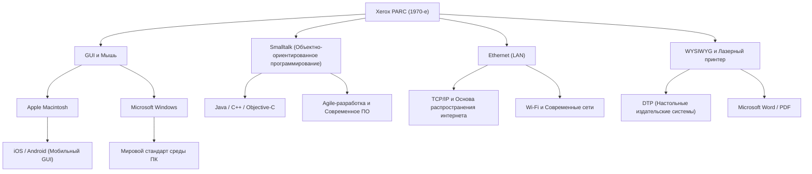

# Xerox PARC: Исследовательский центр, который изобрел компьютеры будущего, но упустил рынок

## Введение

Когда мы работаем на современных компьютерах и смартфонах, мы воспринимаем как должное то, что можем кликать на иконки, перемещать окна, подключаться к сети по Wi-Fi или Ethernet и создавать документы с красивыми шрифтами. Но знаете ли вы, что все эти технологии были изобретены "в одном месте" и "примерно в одно время"?

Это место — "Xerox PARC" (Palo Alto Research Center), основанный в 1970-х годах. Этот исследовательский центр, расположенный на тихих холмах Пало-Альто, Калифорния, без сомнения, стал одним из мест, где собрались величайшие умы в истории человечества.

В этой статье мы подробно рассмотрим историю Xerox PARC, определившую развитие компьютеров. Мы поговорим о предпосылках создания центра, революционных изобретениях (Xerox Alto, концепция Dynabook, Smalltalk, Ethernet, лазерный принтер, WYSIWYG-редакторы), иронии истории о том, "почему Xerox с такими технологиями не смог стать лидером рынка", а также о судьбоносном визите Стива Джобса.

## Глава 1: Предпосылки создания ─ В поисках "Офиса будущего"

В конце 1960-х годов корпорация Xerox занимала монопольное положение на рынке копировальных аппаратов и получала огромные прибыли. Однако среди руководства были те, кто испытывал сильное чувство опасности за будущее. Они опасались, что "однажды наступит эра безбумажных технологий, и спрос на копировальные аппараты, печатающие на бумаге, исчезнет". Xerox нужно было превратиться из "компании по производству копировальных аппаратов" в "компанию, предоставляющую информационную архитектуру".

Главным инициатором этого видения был Джек Голдман, главный научный сотрудник Xerox, который предложил создать центр фундаментальных исследований. В 1970 году Xerox основала "Xerox PARC" в Пало-Альто, Калифорния, рядом со Стэнфордским университетом, далеко от штаб-квартиры на восточном побережье в Нью-Йорке.

На должность первого директора был назначен Боб Тейлор, который руководил Бюро методов обработки информации (IPTO) в ARPA и финансировал ARPANET — прототип интернета. Тейлор имел опыт поддержки лаборатории Дугласа Энгельбарта (изобретателя мыши) и обладал обширными связями среди лучших ученых-компьютерщиков Америки.

Тейлор заявил: "У нас щедрый бюджет, исследуйте то, что вам нравится", и переманил гениальных молодых исследователей из Стэнфордского исследовательского института (SRI), Массачусетского технологического института (MIT), Университета Юты и других. У них была только одна цель: "Создать офис будущего через 10 лет прямо здесь и сейчас".

## Глава 2: Xerox Alto ─ Персональный компьютер, привезенный на машине времени

Самым значительным достижением PARC и предком всех современных ПК стал "Xerox Alto", завершенный в 1973 году.

В то время компьютер представлял собой огромный мейнфрейм, занимавший целую комнату, и обычно управлялся с помощью перфокарт или текстового CUI (символьного пользовательского интерфейса). Но Alto был другим. Разработанная Чаком Такером, Батлером Лампсоном и другими, эта машина впервые в мире воплотила концепцию "персонального компьютера", который можно поставить на стол и использовать индивидуально.

Инновации Alto заключались в следующем:

1. **GUI (Графический пользовательский интерфейс) и растровый дисплей**:
   Он использовал дисплей, который мог управлять пикселями индивидуально, что позволяло рисовать не только текст, но и фигуры, и изображения. На экране использовалась метафора "рабочего стола", отображались иконки папок и файлов.

2. **Интуитивное управление с помощью мыши**:
   Они усовершенствовали мышь, изобретенную Дугласом Энгельбартом, и сделали 3-кнопочную мышь стандартным оснащением. Вместо ввода сложных команд с клавиатуры, система позволяла управлять всем, просто "указывая и кликая" по иконкам на экране, что казалось волшебством в то время.

3. **Оконная система**:
   Она позволяла запускать несколько программ одновременно, отображая их как перекрывающиеся "окна". Это реализовало современную среду многозадачности, где, например, вы можете писать документ в одном окне и производить вычисления в другом.

Alto никогда не продавался на коммерческой основе, но тысячи единиц были распределены внутри PARC и в некоторых университетах, позволяя исследователям испытать "вычислительную среду будущего". Используя Alto, они даже разработали "Maze War", первый в мире сетевой шутер от первого лица.

## Глава 3: Концепция "Dynabook" Алана Кея и объектно-ориентированное программирование

В основе программной среды Alto, предвосхитившей будущее, лежал визионер по имени Алан Кей.

Кей считал, что "компьютер не должен быть просто вычислительной машиной, это должно быть медиа (мета-медиа) для расширения человеческого мышления". Он предложил концепцию "Dynabook". Это было "портативное плоское устройство размером с лист А4, с дисплеем высокого разрешения, клавиатурой и сетевыми возможностями, позволяющее даже детям интуитивно программировать и заниматься творчеством". Удивительно, но это было предложено в конце 1960-х - начале 1970-х годов и идеально предсказало современные планшеты, такие как iPad.

В качестве языка и среды для реализации Dynabook Кей и его команда разработали "Smalltalk".

Smalltalk — это язык, который установил концепцию "объектно-ориентированного программирования (ООП)", без которой невозможно представить современную программную инженерию. Парадигма, в которой все данные и программы рассматриваются как "объекты", взаимодействующие друг с другом посредством обмена сообщениями, была совершенно иным подходом по сравнению с процедурными языками того времени (такими как C и FORTRAN).

Smalltalk был не просто языком; это была операционная система и сама графическая среда. Концепция "перекрывающихся окон" также была впервые реализована в среде Smalltalk (Smalltalk-76). Программисты могли переписывать код работающей системы в реальном времени, обеспечивая невероятную гибкость и креативность. Кей знаменит своей фразой "Лучший способ предсказать будущее — изобрести его", и через Smalltalk он действительно изобретал будущее.

## Глава 4: Ethernet ─ Рождение сети, связывающей мир

Если персональные компьютеры повышают интеллектуальную продуктивность индивида, то их объединение создает еще большую ценность. Эта идея привела к созданию "Ethernet".

Изобретатель Роберт Меткалф вдохновлялся ALOHAnet, системой беспроводной связи в Гавайском университете. Он разработал простую систему, где несколько компьютеров разделяют один коаксиальный кабель, и в случае столкновения данных (коллизии) они ждут случайное время перед повторной отправкой.

В 1973 году Меткалф и его коллега Дэвид Боггс создали систему, соединяющую компьютеры Alto для обмена данными, и назвали её "Ethernet". Скорость передачи составляла 2.94 Мбит/с, что было невероятной емкостью и скоростью в эпоху, когда существовала только текстовая связь.

С помощью Ethernet исследователи PARC могли обмениваться файлами между Alto, отправлять электронную почту и отправлять задания на печать на принтеры по сети. В здании PARC была создана первая в мире настоящая LAN (локальная вычислительная сеть), завершив прототип современной офисной среды. Позже Меткалф основал 3Com и сделал Ethernet мировым стандартом.

## Глава 5: Лазерный принтер и WYSIWYG ─ Революция со времен изобретения книгопечатания

PARC также произвел революцию в основном бизнесе Xerox — "печати на бумаге". Ключевой фигурой здесь был Гэри Старкуэзер.

В то время вывод компьютеров обычно представлял собой грубый текст с матричных принтеров. Старкуэзеру пришла в голову идея использовать лазер для непосредственной записи текста и изображений на фоторецепторный барабан внутри основных копиров Xerox. Хотя штаб-квартира проигнорировала его идею, считая, что она лишь "поглотит спрос на копирование", он перешел в PARC, продолжил исследования и в 1971 году создал первый в мире лазерный принтер "EARS".

Кроме того, новаторским программным обеспечением, которое позволило использовать это на все сто процентов, стал текстовый процессор "Bravo", разработанный Чарльзом Симони и Батлером Лампсоном.

Bravo впервые в мире воплотил концепцию "WYSIWYG" (Что видишь, то и получаешь). Документ с красивыми шрифтами и макетом, отображаемый на экране дисплея Alto (вертикально ориентированном, как лист бумаги), четко распечатывался в том же виде на лазерном принтере.

В предыдущих компьютерах обычно невозможно было узнать макет, пока не увидишь результат печати. Но комбинация Bravo и лазерного принтера стала началом настольных издательских систем (DTP), а позже Симони перешел в Microsoft и разработал "Microsoft Word".

## Глава 6: Перекресток судеб ─ Визит Стива Джобса в PARC

К концу 1970-х годов в PARC начало накапливаться чувство разочарования. Хотя исследователи завершили полное видение компьютеров будущего, руководство Xerox в штаб-квартире совершенно не понимало, как это коммерциализировать и продавать. Для руководства Alto был "слишком дорогостоящим прототипом", а прибыль по-прежнему приносили копировальные аппараты.

В этот момент происходит решающее историческое событие. В декабре 1979 года PARC посетил Стив Джобс, молодой амбициозный предприниматель и сооснователь Apple Computer.

Джобс стал любимцем Кремниевой долины после огромного успеха Apple II, но он искал компьютер следующего поколения. В обмен на то, что Apple предоставила Xerox право купить свои акции до выхода на биржу, Джобс и его коллеги-инженеры получили право на демонстрацию технологий PARC.

Исследователь PARC Ларри Теслер (изобретатель копирования и вставки) продемонстрировал Джобсу Alto и Smalltalk. Окна перекрывались на экране, плавно управлялись мышью, а команды выбирались из всплывающих меню. В момент, когда Джобс увидел это, он был поражен как громом.

Позже Джобс рассказывал:
"Они показали мне объектно-ориентированное программирование, они показали мне сети... Но я был так ослеплен графическим интерфейсом, что даже не заметил остальных двух вещей. Меньше чем через десять минут мне стало очевидно, что однажды все компьютеры будут работать именно так. Это было так же ясно, как день."

Вернувшись в Apple, Джобс радикально изменил направление разработки проектов "Lisa" и "Macintosh", приказав команде направить все силы на создание компьютеров с графическим интерфейсом. В процессе многие выдающиеся инженеры PARC, включая Ларри Теслера, перешли в Apple, чтобы воплотить свои идеалы в коммерческие продукты.

В 1984 году Apple выпустила оригинальный Macintosh. Это был первый персональный компьютер, коммерциализировавший видение PARC по доступной для масс цене, и он навсегда изменил мир.

## Глава 7: Почему Xerox упустила рынок? (The Fumble)

Xerox PARC изобрел все технологии, которые породили индустрию стоимостью в триллионы долларов: персональный компьютер, GUI, мышь, сети, лазерный принтер. Однако сама Xerox не смогла доминировать на этих рынках. В истории бизнеса это иногда называют "Величайшим провалом в истории" (The Fumble).

Почему Xerox упустила рынок? Основные причины следующие:

1. **Зависимость от основного бизнеса (копиры) и непонимание руководства**:
   Руководство Xerox в Нью-Йорке на восточном побережье состояло из экспертов в области химии и машиностроения (копиры) и не понимало ценности цифровых технологий и программного обеспечения. Для них ПК были "угрозой продажам копиров" или просто "дорогой пишущей машинкой для секретарей".

2. **Слишком высокие затраты**:
   В 1970-х годах стоимость компонентов для одного Alto превышала 10 000 долларов. Он был слишком дорогим для потребительского рынка того времени, и пришлось ждать снижения стоимости оборудования в соответствии с законом Мура.

3. **Стена между подразделениями (Восточное побережье против Западного побережья)**:
   Между руководством в штаб-квартире и исследователями PARC, находившимися под влиянием культуры хиппи западного побережья, существовала непреодолимая культурная пропасть. Не хватало коммуникации для того, чтобы попытаться понять друг друга.

4. **Отсутствие маркетинга и каналов сбыта**:
   Когда Xerox наконец выпустила коммерческую систему "Xerox Star" в 1981 году, она была очень передовой, но стоимость всей системы составляла десятки тысяч долларов. Продавцы копиров не знали, как продавать эту сложную сетевую вычислительную систему.

Руководство Xerox упустило шанс "стать лидером информационной индустрии", но, с другой стороны, только бизнес лазерных принтеров, изобретенных Старкуэзером, принес Xerox миллиарды долларов прибыли. В том смысле, что одни только лазерные принтеры окупили все затраты на исследования PARC с избытком, можно сказать, что инвестиции в PARC были огромным успехом.

## Глава 8: Наследие Xerox PARC и влияние на современность

Идеи, перетекшие из Xerox в Apple и Microsoft, в конечном итоге распространились по всему миру как Windows и Mac OS. Ethernet стал сетевой инфраструктурой для всех предприятий, заложив основу современного интернет-общества.

Ниже приведена концептуальная схема, показывающая, как технологии PARC были унаследованы в современную эпоху:

Величайшее достижение PARC заключается не в продаже конкретных продуктов, а в "фундаментальном изменении парадигмы вычислений". Переход "вычислительной машины" к "инструменту интеллектуальной продуктивности", от "устройства для специалистов" к "персональному устройству".

Исследователи PARC, в том числе Алан Кей, создали бескомпромиссную идеальную систему в ответ на чисто теоретический вопрос "Какими должны быть компьютеры будущего?". Поскольку видение, которое они нарисовали, было настолько совершенным и мощным, можно сказать, что последующие 50 лет компьютерной индустрии по сути были историей о том, "как сделать будущее, изобретенное PARC, дешевле, меньше и в массовых количествах".

## Заключение

История Xerox PARC учит нас важности фундаментальных исследований для инноваций и невероятной сложности их воплощения в бизнес. Можно "изобрести будущее", но для того чтобы вывести его на рынок, требуются совершенно другие таланты и правильное время.

Сегодня, когда мы достаем смартфон из кармана, прикасаемся к экрану и получаем доступ к информации по всему миру, "будущее", о котором мечтали в Пало-Альто 50 лет назад, живо в наших кончиках пальцев. Мечта о Dynabook, придуманная исследователями Xerox PARC, прошла через руки различных компаний и гениев, и теперь находится прямо в наших руках.
