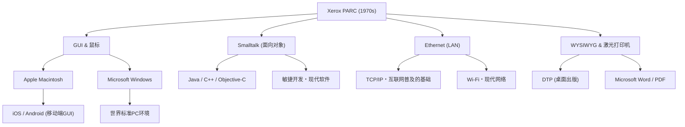

# Xerox PARC：在发明未来计算机的同时错失市场的研究所

## 前言

在操作现代计算机或智能手机时，我们理所当然地点击屏幕上的图标、移动窗口、通过Wi-Fi或以太网连接网络，并创建以高精度字体打印的文档。然而，你是否知道，所有这些技术几乎都是在“同一个地方”、“大约同一时期”被发明的？

这个地方就是成立于1970年代的“Xerox PARC（Palo Alto Research Center：施乐帕洛阿尔托研究中心）”。这座位于加利福尼亚州帕洛阿尔托宁静丘陵地带的研究所，毫无疑问是人类历史上汇聚了最具创新力大脑的地方之一。

本文将从决定计算机历史的Xerox PARC设立背景出发，讲述那里诞生的众多革命性发明（Xerox Alto、Dynabook构想、Smalltalk、以太网、激光打印机、WYSIWYG编辑器），以及“为什么施乐拥有如此强大的技术却未能成为市场霸主”的历史讽刺，再到史蒂夫·乔布斯那场命中注定的访问。我们将以压倒性的热情和详尽的事实，在近万字的篇幅中全景展现这段历史。

## 第1章：设立的背景 ─ 追寻“未来的办公室”

在1960年代后期，施乐（Xerox Corporation）在复印机市场占据了压倒性的垄断地位，享受着巨额利润。然而，管理层中也有人对未来抱有强烈的危机感。他们担心：“总有一天会迎来无纸化时代，需要在纸上打印的复印机需求是否会消失？”施乐需要从单纯的“复印机公司”蜕变为“提供信息架构的公司”。

推动这一愿景的是施乐的首席研究员杰克·戈德曼（Jack Goldman），他提议建立一个基础研究所。1970年，施乐在远离其东海岸纽约州总部、毗邻加州斯坦福大学的西海岸帕洛阿尔托，设立了“Xerox PARC”。

被选为首任所长的是曾在ARPA（国防高级研究计划局）领导信息处理技术办公室（IPTO），并为互联网雏形ARPANET提供资金的鲍勃·泰勒（Bob Taylor）。泰勒曾有资助过道格拉斯·恩格尔巴特（鼠标发明者）研究所的经验，并且在美国各地优秀的计算机科学家中拥有强大的人脉。

泰勒呼吁道：“预算很充足，请尽情研究你们喜欢的东西”，并接连从斯坦福研究所（SRI）、麻省理工学院（MIT）、犹他大学等机构挖来了当时天才般的年轻研究员。他们的目标只有一个：“就在此时此地，创造出10年后的未来办公室”。

## 第2章：Xerox Alto ─ 乘坐时光机而来的个人计算机

PARC最大的成果，也可以说是现代所有PC祖先的，便是1973年完成的“Xerox Alto（施乐Alto）”。

当时，计算机通常是占据整个房间的巨大主机，通过打孔卡或纯文本的CUI（字符用户界面）进行操作是常识。但Alto不同。由查克·萨克（Chuck Thacker）和巴特勒·兰普森（Butler Lampson）等人设计的这台机器，在世界上首次将个人放在桌面上独占使用的“个人计算机”概念实体化了。

Alto的创新性体现在以下几点：

1. **GUI（图形用户界面）与位图显示器**：
   采用能够独立控制屏幕上每个像素的显示器，不仅是文字，还能自由绘制图形和图像。屏幕上使用了“桌面”的比喻，显示了文件夹和文件的图标。

2. **使用鼠标的直观操作**：
   改良了道格拉斯·恩格尔巴特发明的鼠标，标准配备了易于使用的三键鼠标。无需在键盘上输入复杂的命令，只需“指向并点击”屏幕上的图标即可完成操作的系统，在当时犹如魔法般的体验。

3. **窗口系统**：
   具备同时运行多个程序，并将它们作为重叠的“窗口”显示的功能。由此实现了在一边编写文档一边在另一个窗口进行计算的现代司空见惯的多任务环境。

Alto虽然从未被商业销售，但在PARC内部及部分大学分发了数千台，让研究人员体验到了“未来的计算环境”。他们甚至使用Alto开发了世界上第一款网络对战射击游戏《Maze War》。

## 第3章：艾伦·凯的“Dynabook”构想与面向对象

从根本上支撑Alto软件环境，并将目光投向更长远未来的，是富有远见的艾伦·凯（Alan Kay）。

凯认为“计算机不应仅仅是计算器，而应是扩展人类思维的媒介（元媒介）”。他提出了“Dynabook”的构想。这是一种“大约A4纸大小的轻薄便携平板状计算机，拥有高精度显示屏、键盘和网络通信功能，即使是孩子也能直观地进行编程和创作活动的设备”。令人惊讶的是，这是在1960年代后期到70年代前期提出的概念，完美地预见了现在的iPad等平板设备。

为了实现这个Dynabook，凯等人开发了作为其软件语言和环境的“Smalltalk”。

Smalltalk是确立了现代软件工程中不可或缺的“面向对象编程（OOP）”概念的语言。将所有数据和程序作为“对象（事物）”处理，它们通过“消息传递”相互通信的范式，与当时的面向过程语言（如C语言和FORTRAN）是完全不同的路径。

Smalltalk不仅是一门语言，它还是操作系统，更是GUI环境本身。叠加显示窗口的“重叠窗口”概念也是在Smalltalk环境（Smalltalk-76）中首次实现的。程序员可以实时重写运行中系统的代码，提供了极高的灵活性和创造性。凯留下了一句名言：“预测未来最好的方法就是去发明它”，而他正是通过Smalltalk发明了未来。

## 第4章：以太网（Ethernet） ─ 连接世界的网络的诞生

如果个人计算机能提高个人的知识生产力，那么将它们连接起来将产生更加巨大的价值。基于这一想法诞生了“以太网（Ethernet）”。

发明者罗伯特·梅特卡夫（Robert Metcalfe）从夏威夷大学的ALOHAnet无线网络通信方式中获得了灵感。他构想了一个简单的机制：多台计算机共享一根同轴电缆，当数据发生冲突（碰撞）时，等待随机时间后再重新发送。

1973年，梅特卡夫与同事大卫·博格斯（David Boggs）一起构建了连接Alto以进行数据交换的系统，并将其命名为“以太网”。当时的通信速度为2.94 Mbps，在那个只有基于文本的通信存在的时代，这是惊人的大容量和高速通信。

通过以太网，PARC的研究人员可以在Alto之间共享文件、互发电子邮件，并跨越网络向打印机发送打印作业。PARC的建筑内构建了世界上第一个真正的LAN（局域网），完成了现代办公环境的原型。梅特卡夫后来创立了3Com公司，将以太网推向了世界标准规格。

## 第5章：激光打印机与WYSIWYG ─ 活字印刷以来的革命

在施乐的主业“纸张打印”方面，PARC也带来了革命。其核心人物是加里·斯塔克韦瑟（Gary Starkweather）。

当时，计算机的输出通常是通过点阵打印机打印出的粗糙文字。斯塔克韦瑟想出了一个主意：直接用激光照射施乐主力复印机内部的感光鼓来写入文字和图像。虽然被总部冷嘲热讽称“这只会吞噬复印的需求”，但调到PARC的他继续研究，并于1971年完成了世界上第一台激光打印机“EARS”。

此外，为了最大限度地利用它而开发的突破性软件，是查尔斯·西蒙尼（Charles Simonyi）和巴特勒·兰普森开发的文字处理器“Bravo”。

Bravo在世界上首次体现了“WYSIWYG（所见即所得：What You See Is What You Get）”的概念。在屏幕上的Alto显示器（而且是和纸张一样纵向的显示器）上显示的优美字体和排版的文档，可以原封不动地从激光打印机中清晰地打印出来。

在此之前的计算机，通常在看到打印结果之前是不知道排版效果的。然而，Bravo和激光打印机的结合成为了桌面出版（DTP）的起点，后来西蒙尼跳槽到微软并开发了“Microsoft Word”。

## 第6章：命运的交叉点 ─ 史蒂夫·乔布斯访问PARC

随着1970年代末的临近，PARC内部开始积聚起某种挫败感。尽管研究人员已经完成了未来计算机的全貌，但施乐总部的管理层却完全不明白该如何将其产品化并销售。对管理层来说，Alto只是一个“过于昂贵的原型”，能带来利润的依然是复印机。

在这种情况下，发生了一件推动历史的决定性事件。1979年12月，崭露头角的年轻企业家、苹果电脑（Apple Computer）的联合创始人史蒂夫·乔布斯（Steve Jobs）访问了PARC。

乔布斯虽然凭借Apple II的巨大成功成为了硅谷的宠儿，但他仍在探索下一代计算机。作为苹果向施乐让出股票投资额度的回报，乔布斯和同事工程师们获得了参观PARC技术的权利。

PARC的研究员拉里·泰斯勒（Larry Tesler，复制粘贴的发明者）等人向乔布斯演示了Alto和Smalltalk。屏幕上的窗口重叠，使用鼠标流畅操作，从弹出菜单中选择命令。看到这一幕的瞬间，乔布斯受到了如遭雷击般的震撼。

乔布斯后来这样说道：
“他们（PARC）还向我展示了面向对象编程，也展示了网络。但我完全被GUI的演示迷住了，另外两个根本没看进去。不到10分钟，我就确信未来的计算机全都会变成这样。这就像太阳一样明显。”

乔布斯回到苹果后，从根本上推翻了正在进行中的“Lisa”和“Macintosh”项目的开发方针，下令倾全公司之力制造基于GUI的计算机。在此过程中，以拉里·泰斯勒为首的许多PARC优秀工程师，为了将自己的理想产品化而跳槽到了苹果。

1984年，苹果发布了第一代Macintosh。它成为了将PARC的愿景以大众能负担得起的价格产品化的第一台个人计算机，从而永远改变了世界。

## 第7章：为什么施乐错失了市场？（The Fumble）

Xerox PARC发明了个人计算机、GUI、鼠标、网络、激光打印机等创造了数万亿美元规模产业的技术。然而，施乐自身却未能主导这些市场。在商业历史上，这有时被称为“史上最大的失误（The Fumble）”。

为什么施乐会错失市场呢？主要原因如下：

1. **主业（复印机）的束缚与管理层的不理解**：
   位于东海岸纽约的施乐管理层是一群化学和机械工程（复印机）的专家，无法理解数字和软件的价值。对他们来说，PC只不过是“威胁复印机销量的存在”或“供秘书使用的高级打字机”。

2. **过高的成本**：
   1970年代的Alto仅零部件成本就超过1万美元。对于当时的普通消费市场来说过于昂贵，必须等待摩尔定律带来的硬件成本下降。

3. **组织间的壁垒（东海岸 vs 西海岸）**：
   总部管理层与受西海岸嬉皮士文化影响的PARC研究员之间存在着不可逾越的文化鸿沟。缺乏试图理解彼此的沟通。

4. **缺乏营销和销售网络**：
   当施乐终于在1981年推出名为“Xerox Star（施乐Star）”的商业系统时，它虽然非常先进，但整个系统却要价数万美元。复印机的推销员根本不知道如何销售这种复杂的网络计算机。

尽管施乐管理层错失了“成为信息产业霸主的机会”，但另一方面，仅凭斯塔克韦瑟发明的激光打印机业务，施乐就赚取了数十亿美元的利润。从激光打印机一项就足以收回PARC全部研究经费并带来丰厚利润的意义上说，也有人认为对PARC的投资取得了巨大的成功。

## 第8章：Xerox PARC的遗产与对现代的影响

从施乐流出到苹果和微软的想法，最终作为Windows和Mac OS普及到全世界。以太网成为了所有企业的网络基础设施，奠定了今天互联网社会的基础。

以下是展示PARC技术如何传承到现代的概念图：

PARC最大的功绩不是卖出了特定产品，而是“从根本上改变了计算的范式”。将“计算器”变成了“知识生产的工具”，从“专家的专属”变成了“个人的物品”。

以艾伦·凯为首的PARC研究人员们，对于“未来的计算机应该是什么样”这个纯粹的问题，构建了毫不妥协的理想系统。正是因为他们描绘的愿景太过完美且强大，可以说其后50年的计算机产业历史，本质上不过是“如何将PARC发明的未来，制造得更便宜、更小巧、更量产”的历史。

## 结语

Xerox PARC的故事告诉我们，基础研究在创新中的重要性，以及将其与商业结合的极限难度。即使能“发明未来”，要将它推向市场还需要另外的才能和时机。

今天，当我们从口袋里拿出智能手机，轻触屏幕访问全世界的信息时，我们的指尖正跳动着50年前在帕洛阿尔托梦想的“未来”。Xerox PARC的研究人员们构想的Dynabook之梦，经过各家企业和天才们之手，现在正真真切切地握在我们手中。
