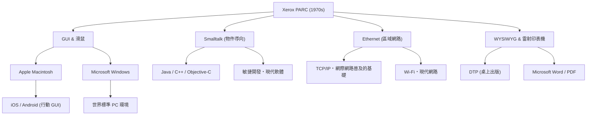

# Xerox PARC：發明未來電腦卻錯失市場的實驗室

## 前言

當我們操作現代的電腦或智慧型手機時，我們會理所當然地點擊螢幕上的圖示、移動視窗、透過 Wi-Fi 或乙太網路連接網路，並使用高解析度字體建立文件。但是，您知道所有這些技術都是在「同一個地方」、「幾乎同一個時期」發明的嗎？

這個地方就是 1970 年代成立的「Xerox PARC（Palo Alto Research Center：全錄帕羅奧多研究中心）」。這座位於加州帕羅奧多寧靜丘陵地帶的實驗室，無疑是人類歷史上匯聚了最具創新精神大腦的地方之一。

本文將從決定電腦歷史的全錄 PARC 成立背景說起，介紹在那裡誕生的無數革命性發明（Xerox Alto、Dynabook 構想、Smalltalk、乙太網路、雷射印表機、WYSIWYG 編輯器），探討「為什麼全錄擁有如此技術卻無法成為市場霸主」的歷史諷刺，以及史蒂夫·賈伯斯命運般的來訪。我們將以極高的熱情與基於詳細事實，透過近萬字的篇幅描繪其全貌。

## 第一章：成立背景 ─ 尋求「未來的辦公室」

1960 年代後期，在影印機市場佔據壓倒性壟斷地位的全錄（Xerox Corporation），享受著巨額利潤。然而，管理層中也有人對未來抱有強烈的危機感：「總有一天會迎來無紙化時代，在紙上列印的影印機需求會不會消失？」全錄需要從單純的「影印機公司」蛻變為「提供資訊架構的公司」。

引領這個願景的是全錄的首席研究員傑克·戈德曼（Jack Goldman），他提議建立一個基礎研究實驗室。1970 年，全錄在遠離紐約州東海岸總部的西海岸，加州史丹佛大學附近的帕羅奧多成立了「Xerox PARC」。

被選為首任所長的是曾領導 ARPA（國防高等研究計劃署）資訊處理技術處（IPTO），並資助網際網路原型 ARPANET 的鮑勃·泰勒（Bob Taylor）。泰勒曾有支持道格拉斯·恩格爾巴特（滑鼠發明者）實驗室等經驗，在全美優秀的電腦科學家之間擁有人脈。

泰勒呼籲「我們有充足的預算，請研究你們喜歡的東西」，並從史丹佛研究院（SRI）、麻省理工學院（MIT）、猶他大學等地，陸續挖角了當時天才般的年輕研究人員。他們唯一的目標就是：「將 10 年後未來的辦公室，現在就呈現在這裡」。

## 第二章：Xerox Alto ─ 坐時光機來的個人電腦

PARC 最大的成果，可以說是現代所有 PC 祖先的，就是 1973 年完成的「Xerox Alto（全錄 Alto）」。

當時說到電腦，人們常識中認為那是佔據整個房間的巨大大型主機，並只能透過打孔卡或純文字的 CUI（字元使用者介面）進行操作。但 Alto 卻不一樣。由查克·薩克（Chuck Thacker）和巴特勒·蘭普森（Butler Lampson）等人設計的這台機器，是世界上第一個將個人放在桌上獨佔使用的「個人電腦」概念具體化的產物。

Alto 的革命性在於以下幾點：

1. **GUI（圖形使用者介面）和點陣圖顯示器**：
   採用了可以單獨控制螢幕上像素的顯示器，不僅是文字，還能自由繪製圖形和圖像。螢幕上使用了「桌面」的隱喻，並顯示了資料夾和檔案的圖示。

2. **滑鼠直覺的操作**：
   改良了道格拉斯·恩格爾巴特發明的滑鼠，標準配備了易於使用的三鍵滑鼠。無需使用鍵盤輸入複雜命令，只需在螢幕上「指向並點擊」圖示即可完成操作的系統，在當時簡直如同魔法般的體驗。

3. **視窗系統**：
   具備同時執行多個程式，並將它們顯示為相互重疊的「視窗（Window）」的功能。這實現了現代司空見慣的多工處理環境，例如一邊編寫文件一邊在另一個視窗中進行計算。

Alto 雖然從未商業化銷售，但在 PARC 內部和部分大學分發了數千台，讓研究人員體驗了「未來的運算環境」。他們甚至使用 Alto 開發了世界上第一款網路對戰射擊遊戲「Maze War」。

## 第三章：艾倫·凱的「Dynabook」構想與物件導向

從根本上支撐 Alto 的軟體環境，並進一步放眼未來的，是名為艾倫·凱（Alan Kay）的遠見者。

凱認為「電腦不應該只是個計算機，而應該是擴展人類思考的媒體（元媒體）」。他所提倡的是「Dynabook」構想。這是「一種大約 A4 尺寸、輕薄可攜帶的板狀電腦，擁有高解析度顯示器、鍵盤和網路通訊功能，連孩子也能直覺地進行程式設計和創作活動的設備」。令人驚訝的是，這是在 1960 年代後期到 70 年代初期提出的，完美地預見了現在的 iPad 等平板裝置。

為了實現這個 Dynabook，凱等人開發的軟體語言和環境就是「Smalltalk」。

Smalltalk 是確立了現代軟體工程中不可或缺的「物件導向程式設計（OOP）」概念的語言。將所有的資料和程式都當作「物件（物）」來處理，它們之間透過「訊息傳遞」進行通訊的範式，與當時的程序導向語言（如 C 語言或 FORTRAN）是完全不同的方法。

Smalltalk 不僅是一種語言，也是一種作業系統，更是 GUI 環境本身。將視窗重疊顯示的「重疊視窗（Overlapping Windows）」概念也是在 Smalltalk 環境（Smalltalk-76）中首次實作的。程式設計師可以即時改寫執行中系統的程式碼，提供了極高的靈活性和創造力。凱留下一句名言：「預測未來最好的方法，就是發明它。」而他確實透過 Smalltalk 發明了未來。

## 第四章：乙太網路（Ethernet） ─ 連結世界的網路誕生

如果個人電腦能提高個人的知識生產力，那麼將它們連接起來就會產生更巨大的價值。由這個想法誕生的就是「乙太網路（Ethernet）」。

發明者羅伯特·梅特卡夫（Robert Metcalfe）從夏威夷大學的 ALOHAnet 無線網路通訊方式中獲得了靈感。他構想了一個簡單的機制，讓多台電腦共享一根同軸電纜，當資料發生碰撞（Collision）時，就等待隨機時間後再次發送。

1973 年，梅特卡夫與同事大衛·博格斯（David Boggs）一起建構了一個連接 Alto 之間進行資料交換的系統，並將其命名為「Ethernet」。當時的通訊速度為 2.94 Mbps，在只有純文字通訊的時代，這是驚人的大容量、高速通訊。

透過乙太網路，PARC 的研究人員可以在 Alto 之間分享檔案、互傳電子郵件，並透過網路將列印任務發送給印表機。PARC 建築內建構了世界上第一個真正的區域網路（LAN），完成了現代辦公環境的原型。梅特卡夫後來成立了 3Com 公司，並將乙太網路推向了世界標準規格。

## 第五章：雷射印表機與 WYSIWYG ─ 活字印刷以來的革命

在全錄的老本行「紙張列印」方面，PARC 也帶來了革命。其核心人物是加里·斯塔克韋瑟（Gary Starkweather）。

當時，電腦的輸出通常是點陣印表機等印出的粗糙文字。斯塔克韋瑟想到了一個點子，就是將雷射光直接照射在全錄主力影印機內部的感光鼓上，從而寫入文字和圖像。總部雖然冷落他，認為這「只會侵蝕影印的需求」，但調到 PARC 後他繼續研究，並於 1971 年完成了世界上第一台雷射印表機「EARS」。

此外，為了充分利用這項技術，查爾斯·西蒙尼（Charles Simonyi）和巴特勒·蘭普森開發了革命性的文書處理器「Bravo」。

Bravo 首次在世界上體現了「WYSIWYG（所見即所得：What You See Is What You Get）」的概念。在畫面上 Alto 顯示器（而且是和紙張一樣的直向顯示器）顯示的美麗字體和排版的檔案，會原封不動地從雷射印表機清晰地列印出來。

在那之前的電腦，通常在看到列印結果之前都無法知道排版。然而，Bravo 和雷射印表機的結合，成為了桌上出版（DTP）的起點。西蒙尼後來轉投微軟，開發了「Microsoft Word」。

## 第六章：命運的交差點 ─ 史蒂夫·賈伯斯訪問 PARC

隨著 1970 年代接近尾聲，PARC 內部開始累積某種挫折感。儘管研究人員已經完成了未來電腦的全貌，全錄總部的管理層卻完全不明白如何將其產品化及如何銷售。對管理層來說，Alto 只是「太昂貴的原型機」，能創造利潤的依然是影印機。

就在此時，發生了推動歷史的決定性事件。1979 年 12 月，嶄露頭角的年輕企業家、Apple Computer 的共同創辦人史蒂夫·賈伯斯（Steve Jobs）訪問了 PARC。

賈伯斯因 Apple II 的巨大成功成為矽谷寵兒，但正在摸索下一代電腦。作為 Apple 讓出股票投資額度給全錄的回報，賈伯斯和他的工程師同事們獲得了參觀 PARC 技術的權利。

PARC 的研究員拉里·特斯勒（Larry Tesler，複製貼上的發明者）等人向賈伯斯展示了 Alto 和 Smalltalk 的示範。畫面上的視窗重疊，使用滑鼠流暢地操作，從彈出選單中選擇命令。看到這一幕的瞬間，賈伯斯受到了如雷擊般的震撼。

賈伯斯後來這樣說道：
「他們（PARC）還向我展示了物件導向程式設計，也展示了網路。但我完全被 GUI 的示範吸引了，根本沒看到另外兩個。不到 10 分鐘，我就確信未來的電腦都會變成這樣。那就像太陽一樣清晰可見。」

賈伯斯回到 Apple 後，徹底推翻了進行中的「Lisa」和「Macintosh」專案的開發方針，下令全力打造基於 GUI 的電腦。在這個過程中，包括拉里·特斯勒在內的許多 PARC 優秀工程師，為了將自己的理想產品化而跳槽到了 Apple。

1984 年，Apple 發表了第一代 Macintosh。它成為第一台以大眾負擔得起的價格將 PARC 願景產品化的個人電腦，並永遠改變了世界。

## 第七章：為什麼全錄錯失了市場？（The Fumble）

Xerox PARC 發明了個人電腦、GUI、滑鼠、網路、雷射印表機等能創造數兆美元規模產業的所有技術。然而，全錄自己卻沒能主導這些市場。在商業歷史上，這有時被稱為「史上最大的失誤（The Fumble）」。

為什麼全錄錯失了市場？主要原因如下：

1. **老本行（影印機）的束縛與管理層的不理解**：
   位於東海岸紐約的全錄管理層，是一群化學和機械工程（影印機）專家，無法理解數位和軟體的價值。對他們來說，PC 只是「威脅影印機銷量的存在」或者「給秘書用的昂貴打字機」。

2. **成本過高**：
   1970 年代的 Alto，光是零件成本就超過 1 萬美元。要在當時的消費市場銷售實在太貴，必須等待摩爾定律帶來硬體成本的降低。

3. **組織間的隔閡（東海岸 vs 西海岸）**：
   總部管理層和深受西海岸嬉皮文化影響的 PARC 研究人員之間，存在著令人絕望的文化鴻溝。缺乏相互理解的溝通。

4. **缺乏行銷和銷售網路**：
   當全錄終於在 1981 年推出名為「Xerox Star（全錄 Star）」的商業系統時，雖然非常先進，但整個系統高達數萬美元，十分昂貴。影印機業務員完全不知道該如何推銷這種複雜的網路電腦。

雖然全錄管理層錯失了「成為資訊產業霸主的機會」，但另一方面，光是斯塔克韋瑟發明的雷射印表機業務，就為全錄帶來了數十億美元的利潤。單憑雷射印表機帶來的利潤，就足以收回 PARC 所有的研究經費且綽綽有餘，從這個意義上來說，也有人認為對 PARC 的投資是非常成功的。

## 第八章：Xerox PARC 的遺產與對現代的影響

從全錄流向 Apple 和 Microsoft 的想法，最終以 Windows 和 Mac OS 的形式普及全世界。乙太網路成為所有企業的網路基礎設施，奠定了今日網際網路社會的基礎。

以下是顯示 PARC 技術如何傳承至今的概念圖。

PARC 最大的功績，不在於銷售了特定的產品，而是「徹底改變了運算的範式」。將「計算機」變為「知識生產的工具」，從「專家的東西」變為「個人的東西」。

以艾倫·凱為首的 PARC 研究人員們，面對「未來的電腦應該是什麼樣子」這樣純粹的疑問，建構了一個毫不妥協的理想系統。由於他們描繪的願景太過完美與強大，其後 50 年的電腦產業歷史，可以說本質上不過是「如何將 PARC 發明的未來，製造得更便宜、更小巧、更大規模」的歷史罷了。

## 結語

Xerox PARC 的故事，教會了我們在創新中基礎研究的重要性，以及將其與商業結合的極限難度。即使能「發明未來」，要將其推向市場還需要另一種才能和時機。

今天，當我們從口袋裡拿出智慧型手機，點擊螢幕並連接到世界各地的資訊時，我們的指尖下，正脈動著 50 年前在帕羅奧多夢想的「未來」。Xerox PARC 研究人員們構想的 Dynabook 夢想，經過各家企業和天才們之手，現在正掌握在我們手中。
