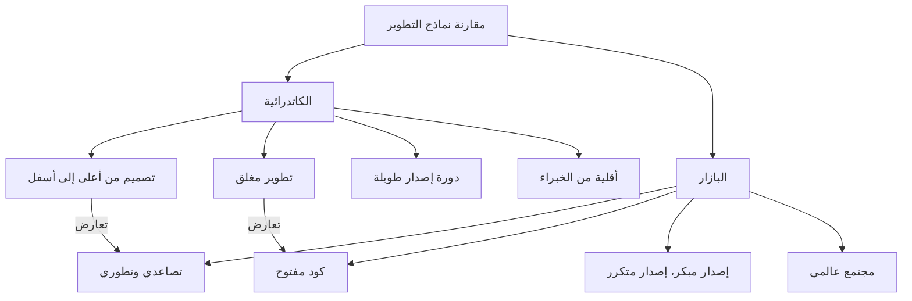

# ثورة المصدر المفتوح و"الكاتدرائية والبازار": التحول النموذجي الذي غير تاريخ تطوير البرمجيات

لقد شهد عالم البرمجيات تطوراً جذرياً في العقود القليلة الماضية. من بين هذه التغيرات، يعد ظهور مفهوم "المصدر المفتوح (Open Source)" وانتشاره من أهم التغيرات الأساسية. اليوم، تعتمد البنية التحتية للإنترنت التي نستخدمها، والهواتف الذكية، والحوسبة السحابية، وحتى الذكاء الاصطناعي بشكل كبير على البرمجيات مفتوحة المصدر (OSS).

في هذه المقالة، سنتعمق في جوهر ثورة المصدر المفتوح هذه، ونستكشف كيف قلب المقال التذكاري "الكاتدرائية والبازار (The Cathedral and the Bazaar)" للكاتب إريك س. ريموند (Eric S. Raymond) نموذج تطوير البرمجيات رأساً على عقب. سننظر في ذلك من وجهات نظر متعددة: الخلفية التاريخية، والتطور التكنولوجي، والتأثير على هندسة البرمجيات الحديثة.

## 1. فجر البرمجيات وعصر "الكاتدرائية"

### صعود البرمجيات الاحتكارية

في الأيام الأولى لظهور أجهزة الكمبيوتر، كانت البرمجيات والأجهزة كياناً واحداً، وكان مفهوم التعامل التجاري مع البرمجيات كمنتج مستقل ضعيفاً. ومع ذلك، من السبعينيات إلى الثمانينيات، رسخت شركات التكنولوجيا الكبرى مثل IBM نموذج عمل "احتكاري (Proprietary)"، حيث كانت البرمجيات محمية بحقوق الطبع والنشر ويتم بيعها مع إبقاء الكود المصدري مغلقاً (Closed).

كان نموذج تطوير البرمجيات في هذا العصر منظماً للغاية ويُدار من أعلى إلى أسفل (Top-down). كان أسلوباً يقوم فيه نخبة مختارة من المبرمجين بتنفيذ كل شيء من التصميم إلى التنفيذ والاختبار في بيئة مغلقة وفقاً لخطة صارمة.

### خصائص نموذج "الكاتدرائية"

شبه إريك س. ريموند أسلوب تطوير البرمجيات التقليدي هذا ببناء "كاتدرائية".

*   **التصميم المركزي**: يقوم بعض المصممين العباقرة، المعروفين باسم المهندسين المعماريين، برسم الصورة الكبيرة، ويقوم العمال بتنفيذ العمل وفقاً لذلك.
*   **بيئة تطوير مغلقة**: الكود المصدري سري للشركة، ومن المستحيل على الغرباء المشاركة في عملية التطوير.
*   **دورة إصدار طويلة**: السعي للحصول على منتج مثالي يعني أن الأمر يستغرق وقتاً طويلاً، من عدة أشهر إلى عدة سنوات، قبل الإصدار.
*   **اكتشاف الأخطاء وإصلاحها**: نظراً لأن المختبرين الداخليين المحدودين فقط هم من يبحثون عن الأخطاء، فغالباً ما يتأخر اكتشافها.

كان نموذج الكاتدرائية هذا عقلانياً في ظل الموارد المحدودة في ذلك الوقت، وكان القوة الدافعة لإنشاء أنظمة ضخمة ومعقدة مثل Microsoft Windows وأنظمة UNIX التجارية. ولكن في الوقت نفسه، أدى ذلك إلى إبطاء وتيرة الابتكار وخلق جدار عالٍ بين المطورين والمستخدمين.

## 2. العطش للحرية: ولادة حركة البرمجيات الحرة

كان هناك مبرمج شعر بإحساس قوي بالخطر تجاه صعود البرمجيات الاحتكارية. إنه ريتشارد ستولمان (Richard Stallman)، الذي كان ينتمي إلى مختبر الذكاء الاصطناعي في معهد ماساتشوستس للتكنولوجيا (MIT).

### مشروع GNU و GPL

جادل ستولمان بأن البرمجيات يجب أن تستند إلى القيمة الإنسانية العالمية المتمثلة في مشاركة المعرفة، وأنه يجب أن يكون الجميع قادرين على استخدامها بحرية ودراستها وتعديلها وإعادة توزيعها. في عام 1983، أطلق "مشروع GNU" وبدأ في تطوير نظام تشغيل متوافق مع UNIX ومجاني بالكامل.

علاوة على ذلك، من أجل دعم فلسفته قانونياً، صاغ "رخصة جنو العمومية (GPL: GNU General Public License)". الميزة الأبرز لـ GPL هي المفهوم المعروف باسم "Copyleft". هذا قيد قوي يفرض أنه عند تعديل أو إعادة توزيع برنامج تم إصداره بموجب GPL، يجب أيضاً إصدار أعماله المشتقة بموجب نفس ترخيص GPL، مما أدى إلى إنشاء آلية تضمن الحفاظ على حرية البرمجيات بشكل دائم.

### حدود البرمجيات الحرة

لاقت أفكار ستولمان صدى لدى العديد من قراصنة الكمبيوتر (Hackers)، وأسفرت عن أدوات ممتازة مثل GCC (مترجم C) و Emacs (محرر نصوص). ومع ذلك، واجه تطوير النواة (GNU Hurd)، التي هي قلب نظام التشغيل الكامل، صعوبات، ووقع معسكر البرمجيات الحرة في حالة اكتمل فيها "الجسد" تقريباً ولكن يفتقر إلى "القلب".

## 3. صدمة "البازار": ولادة لينكس

في عام 1991، نشر لينوس تورفالدس (Linus Torvalds)، وهو طالب في جامعة هلسنكي في فنلندا، نواة نظام تشغيل صغيرة تدعى "Linux" طورها كهواية على مجموعات الأخبار عبر الإنترنت.

### أسلوب تطوير فوضوي

نشر لينوس كوده المصدري وناشد القراصنة في جميع أنحاء العالم: "هل يمكن لأحد المساعدة؟". ومن المثير للدهشة أن العديد من المطورين استجابوا لهذه الدعوة عبر الإنترنت وبدأوا في إرسال التصحيحات (أكواد الإصلاح).

قام لينوس بدمج التصحيحات المرسلة بوتيرة غاضبة وأصدر إصدارات جديدة بشكل شبه يومي. لم يكن هناك مخطط دقيق مسبق، ولا تخصيص واضح لمن كان مسؤولاً عن ماذا. كان أسلوب تطوير فوضوياً وغير منظم للغاية حيث قام الجميع بالعبث في الأجزاء التي تهمهم وتحديثها كما يحلو لهم.

### لماذا نجح لينكس؟

وفقاً للحس السليم لهندسة البرمجيات التقليدية (نموذج الكاتدرائية)، كان من المفترض أن تؤدي طريقة التطوير اللامركزية وغير المخطط لها هذه إلى انهيار النظام. ومع ذلك، وبدلاً من الانهيار، نما نظام لينكس بسرعة تفوقت على أنظمة UNIX التجارية وحقق استقراراً مذهلاً.

أوضح مقال "الكاتدرائية والبازار" لإريك س. ريموند هذا اللغز.

## 4. إريك س. ريموند و "الكاتدرائية والبازار"

في عام 1997، من خلال مشروع برنامج يسمى "Fetchmail" طوره بنفسه، مارس ريموند بنفسه نموذج "البازار" الخاص بـ لينكس ولخص تجربته وتحليله في مقال بعنوان "الكاتدرائية والبازار".

عبّر هذا المقال ببراعة عن ديناميكيات تطوير المصدر المفتوح وأحدث صدمة كبيرة في الصناعة. دعونا نلقي نظرة على بعض القواعد الأساسية فيه.

### المبادئ الأساسية لنموذج البازار

شبه ريموند نموذج البازار بسوق شرق أوسطي (بازار) حيث يتجول أشخاص متنوعون وتتم معاملات مختلفة في وقت واحد.

### قانون لينوس (Linus's Law)

أشهر مقولة في "الكاتدرائية والبازار" هي "قانون لينوس": "**نظراً لوجود عدد كافٍ من العيون، تصبح جميع الأخطاء سطحية (Given enough eyeballs, all bugs are shallow)**".

في نموذج الكاتدرائية، يقع اكتشاف الأخطاء وإصلاحها على عاتق عدد قليل من المطورين والمختبرين. من ناحية أخرى، في نموذج البازار، نظراً لأن الكود المصدري مفتوح، فإن الآلاف بل وعشرات الآلاف من المستخدمين حول العالم يقرؤون الكود ويشغلونه ويبلغون عن المشكلات. إنها فكرة أنه من خلال توجيه عدد لا يحصى من "العيون" ذات المعرفة والخلفيات المختلفة إلى الكود، سيصبح أي خطأ، مهما كان معقداً، مشكلة بسيطة يمكن لشخص ما حلها.

### إصدار مبكر، إصدار متكرر (Release early. Release often.)

في نموذج البازار، بدلاً من الانتظار حتى الوصول إلى حالة مثالية، يتم إصدار الأشياء التي تعمل بسرعة حتى لو كانت غير مكتملة، ويتم إنشاء حلقة ملاحظات من المستخدمين. يمنع هذا اتجاه التطوير من الانحراف عن الاحتياجات الحقيقية للمستخدمين ويحافظ على حماس المجتمع.

### معاملة المستخدمين كمطورين مشاركين

"إن معاملة المستخدمين كمطورين مشاركين هي المسار الأكثر أماناً لتحسين الكود بسرعة وتصحيح الأخطاء بفعالية."
في نموذج البازار، لا يعتبر المستخدمون مجرد "مستهلكين". إنهم "مطورون مشاركون" يبلغون عن الأخطاء، ويكتبون التصحيحات أحياناً، ويقترحون ميزات جديدة. إن كيفية استخلاص قوة هذا المجتمع وإدارتها تحدد نجاح أو فشل المشروع.

## 5. ولادة مصطلح "المصدر المفتوح"

بعد نشر "الكاتدرائية والبازار"، بدأت فلسفتها في التأثير على عالم الأعمال وتجاوزت بعض مجتمعات القراصنة.

في عام 1998، اتخذت شركة Netscape Communications، التي كانت تخسر أمام Internet Explorer من Microsoft في سوق متصفحات الويب، قراراً دراماتيكياً بنشر الكود المصدري لمتصفحها (Netscape Communicator) كخطوة يائسة للنهوض. وراء هذا القرار كان إلهام الإدارة التي قرأت "الكاتدرائية والبازار".

بسبب هذا الحدث، ولإزالة الفروق السياسية والأيديولوجية (خاصة الرفض من عالم الأعمال) التي تحملها كلمة "الحرية (Free)" في حركة البرمجيات الحرة، تم اقتراح مصطلح جديد أكثر براغماتية وملاءمة للأعمال. هذا هو "**المصدر المفتوح (Open Source)**".

مع تأسيس مبادرة المصدر المفتوح (OSI) وتحديد تعريف المصدر المفتوح (OSD)، أصبح المصدر المفتوح شائعاً بسرعة كعنصر أساسي في استراتيجية تكنولوجيا المعلومات للشركات.

## 6. التحول النموذجي الذي أحدثته ثورة المصدر المفتوح

لم تقتصر ثورة المصدر المفتوح ونموذج البازار على حقيقة أن "الكود المصدري أصبح مفتوحاً"، بل أحدثت تحولاً نموذجياً لا رجعة فيه في هندسة البرمجيات ككل.

### ظهور أنظمة التحكم في الإصدار الموزعة (Git)

كان نموذج البازار، حيث يقوم المطورون في جميع أنحاء العالم بتعديل الكود بشكل غير متزامن وموزع، يواجه قيوداً مع أنظمة التحكم في الإصدار المركزية التقليدية (مثل CVS و Subversion). لحل هذه المشكلة، قام لينوس تورفالدس بنفسه بتطوير "Git". إن ظهور Git ومنصة GitHub التي تستضيفه قلل بشكل كبير من حواجز تطوير المصدر المفتوح وخلق ثقافة جديدة تسمى "البرمجة الاجتماعية (Social Coding)".

### التطوير الرشيق (Agile) و CI/CD

ترتبط فلسفة نموذج البازار "إصدار مبكر، إصدار متكرر" ارتباطاً وثيقاً بأفكار التطوير الرشيق الحديث و DevOps. الطريقة التي يتم بها تحسين البرمجيات باستمرار في تكرارات قصيرة واختبارها ونشرها تلقائياً من خلال مسارات CI/CD (التكامل المستمر / النشر المستمر) يمكن اعتبارها شكلاً متطوراً من نموذج البازار.

### الوقوف على أكتاف العمالقة

اليوم، لا يوجد مطور يقوم بإنشاء خدمة ويب أو تطبيق جديد بالكامل من الصفر. من خلال الوقوف على "أكتاف العمالقة" مفتوحة المصدر، مثل أنظمة التشغيل (Linux)، وخوادم الويب (Apache، Nginx)، وقواعد البيانات (MySQL، PostgreSQL)، ولغات البرمجة، والعدد الهائل من المكتبات وأطر العمل (مثل React، TensorFlow)، أصبح بإمكان المطورين التركيز على إنشاء القيمة الأساسية لأعمالهم.

## 7. البازار الحديث: دخول الشركات وتشكيل النظام البيئي

حتى مايكروسوفت، التي صرحت ذات مرة أن "المصدر المفتوح هو مرض السرطان"، استحوذت الآن على GitHub وأصبحت واحدة من أكبر المساهمين في المصادر المفتوحة. شركات التكنولوجيا العملاقة الأخرى مثل Google و Meta (Facebook) و Amazon تتبنى أيضاً استراتيجية نشر تقنياتها الأساسية (مثل Kubernetes و React و PyTorch) كمصادر مفتوحة للسيطرة على المعايير الصناعية (De facto standards).

لم يعد البازار الحديث مجرد مكان للقراصنة المتطوعين فقط. لقد تطور إلى نظام بيئي ضخم ومعقد، حيث يلتزم المهندسون المحترفون الذين يتقاضون رواتب من الشركات بالعمل بدوام كامل، وتقوم مؤسسات قوية (مثل مؤسسة Linux ومؤسسة Apache Software) بإدارة الحوكمة وتمويل المشاريع.

## 8. التحديات والتوقعات المستقبلية

ومع ذلك، فإن نموذج البازار مفتوح المصدر ليس مثالياً أيضاً. في السنوات الأخيرة، ظهرت بعض التحديات الخطيرة.

*   **متلازمة الإرهاق (Burnout) لدى المشرفين**: هناك العديد من الحالات التي يتم فيها الحفاظ على برمجيات مفتوحة المصدر هامة ومستخدمة على نطاق واسع بصعوبة بواسطة عدد قليل من المشرفين غير مدفوعي الأجر، وقد وصل العبء النفسي والمالي عليهم إلى حده الأقصى.
*   **هجمات سلسلة التوريد (Supply Chain Attacks)**: مع زيادة تعقيد تبعيات البرمجيات، تتزايد مخاطر الهجمات التي تستغل نقاط الضعف في البرمجيات مفتوحة المصدر (مثل ثغرة Log4j) لتتسبب في أضرار جسيمة للبنية التحتية الاجتماعية.
*   **عدم التوازن في التمويل**: في حين أن هناك شركات تحقق أرباحاً هائلة باستخدام المصادر المفتوحة، لم يتم حل "مشكلة الراكب المجاني (Free-rider problem)" حيث لا تعود الأرباح إلى المطورين الذين بنوا هذه الأسس.

لمواجهة هذه التحديات، يتم استكشاف نماذج استدامة جديدة (Sustainability)، مثل آليات الدعم المالي مثل GitHub Sponsors، والتوظيف المباشر لمطوري المصادر المفتوحة من قبل الشركات، ودعم تدقيق الأمان من قبل الوكالات الحكومية.

## خاتمة

تجاوزت رؤية العالم التي اقترحها "الكاتدرائية والبازار" إطار كود البرمجيات لتنتشر إلى مجموعة واسعة من المجالات مثل مشاركة المعرفة مثل ويكيبيديا (Wikipedia)، والبيانات المفتوحة، وحتى الأجهزة المفتوحة والعلوم المفتوحة.

من "الكاتدرائية" المركزية من أعلى إلى أسفل إلى "البازار" اللامركزي المستقل. يمكن القول إن ثورة المصدر المفتوح هذه هي واحدة من أنجح التجارب الاجتماعية للبشرية للتعاون في إنتاج المعرفة والتكنولوجيا. نحن لا نزال نقف في خضم بازار ضخم ومتطور باستمرار.
