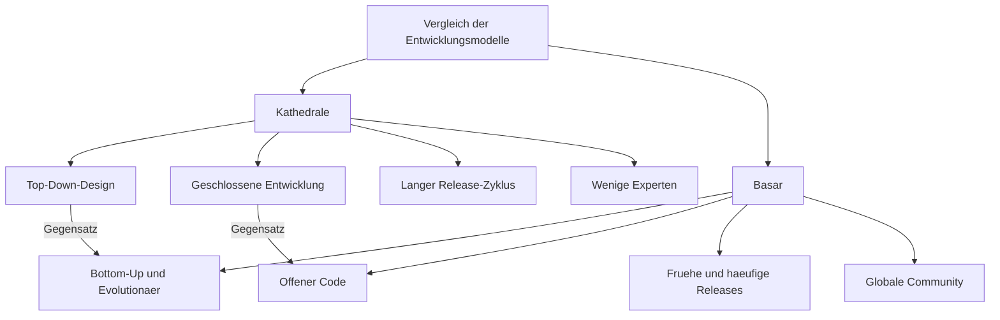
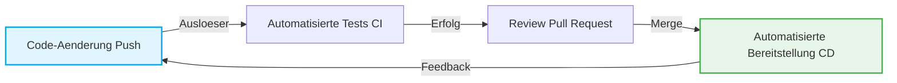

# Die Open-Source-Revolution und "Die Kathedrale und der Basar": Der Paradigmenwechsel, der die Geschichte der Softwareentwicklung veränderte

Die Welt der Software hat in den letzten Jahrzehnten eine dramatische Entwicklung durchgemacht. Eine der wichtigsten und grundlegendsten Veränderungen ist die Geburt und Verbreitung des Konzepts "Open Source". Ein Großteil der heutigen Infrastruktur, von der Internet-Infrastruktur über Smartphones und Cloud-Computing bis hin zu KI, basiert auf Open-Source-Software (OSS).

In diesem Artikel beleuchten wir den Kern dieser Open-Source-Revolution und untersuchen tiefgehend aus verschiedenen Perspektiven – dem historischen Hintergrund, der technologischen Entwicklung und den Auswirkungen auf das moderne Software-Engineering –, wie das wegweisende Essay *Die Kathedrale und der Basar* (The Cathedral and the Bazaar) von Eric S. Raymond das Paradigma der Softwareentwicklung grundlegend veränderte.

## 1. Die Anfänge der Software und die Ära der "Kathedrale"

### Der Aufstieg proprietärer Software

In der Frühzeit der Computer bildeten Software und Hardware eine Einheit, und das Konzept des Softwarehandels als eigenständiges Geschäft war kaum existent. Doch in den 1970er und 1980er Jahren etablierten riesige Tech-Unternehmen wie IBM ein "proprietäres" (monopolistisches) Geschäftsmodell, bei dem Software urheberrechtlich geschützt und der Quellcode als Geschäftsgeheimnis (closed) verkauft wurde.

Das Softwareentwicklungsmodell dieser Ära war hochgradig organisiert und von oben nach unten (Top-Down) verwaltet. Ein kleiner Kreis ausgewählter Elite-Programmierer führte Design, Implementierung und Tests in einer geschlossenen Umgebung streng nach Plan durch.

### Merkmale des "Kathedralen"-Modells

Eric S. Raymond verglich diesen traditionellen Stil der Softwareentwicklung mit dem Bau einer "Kathedrale".

*   **Zentralisiertes Design**: Einige brillante Designer, Architekten genannt, entwerfen das Gesamtbild, und die Arbeiter führen die Arbeiten entsprechend aus.
*   **Geschlossene Entwicklungsumgebung**: Der Quellcode ist ein Geschäftsgeheimnis, und Außenstehende können sich nicht am Entwicklungsprozess beteiligen.
*   **Lange Release-Zyklen**: Das Streben nach einem perfekten Produkt erfordert Monate bis Jahre bis zur Veröffentlichung.
*   **Fehlerfindung und -behebung**: Da nur begrenzte interne Tester nach Fehlern suchen, werden diese oft spät entdeckt.

Dieses Kathedralen-Modell war in der damaligen Umgebung begrenzter Ressourcen sinnvoll und die treibende Kraft hinter riesigen, komplexen Systemen wie Microsoft Windows und kommerziellem UNIX. Gleichzeitig verlangsamte es jedoch das Innovationstempo und errichtete hohe Hürden zwischen Entwicklern und Benutzern.

## 2. Der Durst nach Freiheit: Die Geburt der Freie-Software-Bewegung

Ein Programmierer war zutiefst besorgt über den Aufstieg proprietärer Software: Richard Stallman vom Artificial Intelligence Laboratory des Massachusetts Institute of Technology (MIT).

### Das GNU-Projekt und die GPL

Stallman argumentierte, dass Software auf dem universellen menschlichen Wert des Wissensaustauschs basieren sollte und jeder die Freiheit haben sollte, sie zu nutzen, zu studieren, zu modifizieren und weiterzugeben. 1983 startete er das "GNU-Projekt" zur Entwicklung eines vollständig freien UNIX-kompatiblen Betriebssystems.

Um seine Philosophie rechtlich zu untermauern, verfasste er außerdem die "GNU General Public License" (GPL). Das wichtigste Merkmal der GPL ist das Konzept des "Copyleft". Dabei handelt es sich um eine starke Einschränkung: Wenn unter GPL veröffentlichte Software verändert und weitergegeben wird, müssen die abgeleiteten Werke unter derselben GPL-Lizenz veröffentlicht werden. Dies schuf einen Mechanismus, der die Freiheit der Software dauerhaft bewahrte.

### Die Grenzen der freien Software

Stallmans Ideen stießen bei vielen Hackern auf Resonanz und brachten hervorragende Werkzeuge wie GCC (C-Compiler) und Emacs (Texteditor) hervor. Die Entwicklung des Kernels (GNU Hurd), der den Kern eines vollständigen Betriebssystems bildet, geriet jedoch ins Stocken. Das Lager der freien Software befand sich in einer Situation, in der der "Körper" fast fertig war, ihm aber das "Herz" fehlte.

## 3. Der Schock des "Basars": Die Geburt von Linux

1991 veröffentlichte Linus Torvalds, ein Student an der Universität Helsinki in Finnland, den kleinen Betriebssystem-Kernel "Linux", den er als Hobby entwickelt hatte, in einer Internet-Newsgroup.

### Ein chaotischer Entwicklungsstil

Linus veröffentlichte seinen Quellcode und rief Hacker auf der ganzen Welt auf: "Kann mir jemand helfen?". Überraschenderweise folgten zahlreiche Entwickler über das Internet diesem Aufruf und begannen, Patches (Korrekturcodes) einzusenden.

Linus integrierte die eingesandten Patches mit rasender Geschwindigkeit und veröffentlichte fast täglich neue Versionen. Es gab keinen strengen Bauplan im Vorfeld und keine klare Aufgabenverteilung, wer wofür zuständig war. Es war ein extrem unorganisierter und chaotischer Entwicklungsstil, bei dem jeder nach Belieben an dem Teil arbeitete, der ihn interessierte, und diesen verbesserte.

### Warum war Linux erfolgreich?

Gemäß dem gesunden Menschenverstand der traditionellen Softwareentwicklung (dem Kathedralen-Modell) hätte ein solch ungeplanter, dezentraler Entwicklungsansatz zum Zusammenbruch des Systems führen müssen. Statt jedoch zu kollabieren, wuchs Linux mit einer Geschwindigkeit, die kommerzielles UNIX übertraf, und erreichte eine erstaunliche Stabilität.

Das Geheimnis hinter diesem Erfolg lüftete Eric S. Raymond in seinem Werk *Die Kathedrale und der Basar*.

## 4. Eric S. Raymond und *Die Kathedrale und der Basar*

1997 wendete Raymond das "Basar"-Modell von Linux selbst in seinem Softwareprojekt "Fetchmail" an und fasste seine Erfahrungen und Analysen in dem Essay *Die Kathedrale und der Basar* zusammen.

Dieser Aufsatz brachte die Dynamik der Open-Source-Entwicklung brillant auf den Punkt und erschütterte die Industrie maßgeblich. Lassen Sie uns einige seiner Kerngesetze betrachten.

### Grundprinzipien des Basarmodells

Raymond verglich das Basarmodell mit einem nahöstlichen Markt (Basar), auf dem unterschiedlichste Menschen umhergehen und gleichzeitig verschiedene Geschäfte getätigt werden.

### Das Linus-Gesetz (Linus's Law)

Die berühmteste Maxime in *Die Kathedrale und der Basar* ist das "Linus-Gesetz": "**Given enough eyeballs, all bugs are shallow**" (Mit genügend Augen sind alle Fehler leicht zu finden).

Beim Kathedralen-Modell ruht die Last der Fehlerfindung und -behebung auf den Schultern weniger Entwickler und Tester. Beim Basarmodell hingegen ist der Quellcode offen, sodass Tausende oder Zehntausende Benutzer weltweit den Code lesen, ausführen und Probleme melden. Die Erkenntnis lautet: Wenn unzählige "Augen" mit unterschiedlichem Wissen und Hintergrund auf den Code gerichtet sind, wird selbst der komplexeste Fehler für irgendjemanden zu einem leicht lösbaren Problem.

### Release early. Release often. (Früh veröffentlichen. Häufig veröffentlichen.)

Anstatt zu warten, bis das Produkt perfekt ist, wird beim Basarmodell frühzeitig etwas Funktionsfähiges – auch wenn es noch unvollkommen ist – veröffentlicht, um eine Feedbackschleife mit den Benutzern in Gang zu setzen. Dadurch wird verhindert, dass die Entwicklung an den wahren Bedürfnissen der Benutzer vorbeigeht, und die Energie der Community wird aufrechterhalten.

### Benutzer als Mitentwickler behandeln

"Benutzer als Mitentwickler zu behandeln, ist der sicherste Weg zu schnellen Codeverbesserungen und effektivem Debugging."
Im Basarmodell sind Benutzer nicht nur "Konsumenten". Sie sind "Mitentwickler", die Bugs melden, teilweise Patches schreiben und neue Funktionen vorschlagen. Der Erfolg oder Misserfolg eines Projekts hängt davon ab, wie gut diese Kraft der Community mobilisiert und gemanagt wird.

## 5. Die Geburt des Begriffs "Open Source"

Nach der Veröffentlichung von *Die Kathedrale und der Basar* begann dessen Philosophie über Hacker-Communitys hinaus auch Einfluss auf die Geschäftswelt zu nehmen.

1998 traf Netscape Communications, das im Webbrowser-Markt gegen den Internet Explorer von Microsoft zu verlieren drohte, die drastische Entscheidung, den Quellcode seines Browsers (Netscape Communicator) zu veröffentlichen. Hinter dieser Entscheidung stand ein von *Die Kathedrale und der Basar* inspiriertes Management.

Infolge dieses Ereignisses wurde ein neuer, pragmatischerer und geschäftsfreundlicherer Begriff vorgeschlagen, um die politischen und ideologischen Nuancen (insbesondere die Ablehnung durch die Wirtschaft) des Begriffs "Free" in der Freie-Software-Bewegung abzulegen. Dieser Begriff war "**Open Source**".

Mit der Gründung der Open Source Initiative (OSI) und der Festlegung der Open Source Definition (OSD) verbreitete sich Open Source rasant als unverzichtbares Element der IT-Strategie von Unternehmen.

## 6. Der durch die Open-Source-Revolution ausgelöste Paradigmenwechsel

Die Open-Source-Revolution und das Basarmodell bedeuteten nicht nur die Offenlegung von Quellcode. Sie brachten einen irreversiblen Paradigmenwechsel für das gesamte Software-Engineering mit sich.

### Das Aufkommen verteilter Versionskontrollsysteme (Git)

Das Basarmodell, bei dem Entwickler weltweit asynchron und dezentral Änderungen am Code vornehmen, stieß mit den herkömmlichen zentralisierten Versionskontrollsystemen (CVS und Subversion) an seine Grenzen. Um dieses Problem zu lösen, entwickelte Linus Torvalds selbst "Git". Das Aufkommen von Git und der Hosting-Plattform GitHub senkte die Hürden für die Open-Source-Entwicklung drastisch und schuf die neue Kultur des "Social Coding".

### Agile Entwicklung und CI/CD

Die Philosophie des Basarmodells ("Release early, release often") ist eng mit den Konzepten der modernen agilen Softwareentwicklung und DevOps verknüpft. Der Ansatz, Software in kurzen Iterationen kontinuierlich zu verbessern und sie durch CI/CD-Pipelines (Continuous Integration / Continuous Delivery) automatisch zu testen und bereitzustellen, kann als eine Weiterentwicklung des Basarmodells betrachtet werden.

### Auf den Schultern von Riesen stehen

Heute erstellt kaum noch ein Entwickler einen neuen Webservice oder eine neue Anwendung von Grund auf neu. Indem sie sich auf die "Schultern von Open-Source-Riesen" wie Betriebssysteme (Linux), Webserver (Apache, Nginx), Datenbanken (MySQL, PostgreSQL), Programmiersprachen sowie unzählige Bibliotheken und Frameworks (React, TensorFlow etc.) stützen, können sich Entwickler darauf konzentrieren, den eigentlichen Mehrwert (Core Value) ihres Geschäfts zu schaffen.

## 7. Der moderne Basar: Unternehmenseinstieg und die Bildung von Ökosystemen

Selbst Microsoft, das Open Source einst als "Krebsgeschwür" bezeichnete, hat GitHub übernommen und ist heute einer der größten Beitragsleister im Open-Source-Bereich. Riesige Tech-Konzerne wie Google, Meta (Facebook) und Amazon verfolgen die Strategie, ihre grundlegenden Technologien (Kubernetes, React, PyTorch etc.) als Open Source freizugeben und so die De-facto-Standards der Branche zu dominieren.

Der moderne Basar ist kein Ort mehr nur für reine Hobby-Hacker. Er hat sich zu einem riesigen und komplexen Ökosystem entwickelt, in dem von Unternehmen bezahlte Profi-Ingenieure Vollzeit beitragen und mächtige Stiftungen (wie die Linux Foundation oder die Apache Software Foundation) die Leitung (Governance) und die Finanzierung von Projekten übernehmen.

## 8. Herausforderungen und Zukunftsaussichten

Doch auch das Open-Source-Basarmodell ist nicht perfekt. In den letzten Jahren sind einige ernste Herausforderungen zutage getreten.

*   **Burnout bei Maintainern**: Selbst weit verbreitete und kritische OSS-Projekte werden oft von wenigen unbezahlten Maintainern mühsam aufrechterhalten, deren mentale und finanzielle Belastung an ihre Grenzen stößt.
*   **Supply-Chain-Angriffe (Lieferkettenangriffe)**: Angesichts der zunehmenden Komplexität von Software-Abhängigkeiten steigt das Risiko erheblich, dass Angriffe, die Schwachstellen in OSS ausnutzen (wie etwa die Log4j-Schwachstelle), verheerende Auswirkungen auf die gesellschaftliche Infrastruktur haben.
*   **Finanzielle Ungleichgewichte**: Während einige Unternehmen mit der Nutzung von Open Source enorme Gewinne erzielen, wird dieses "Trittbrettfahrer-Problem" nicht gelöst, bei dem keine Gewinne an die Entwickler zurückfließen, die das Fundament geschaffen haben.

Zur Bewältigung dieser Herausforderungen werden neue Modelle der Nachhaltigkeit gesucht, wie z. B. Finanzierungsmechanismen wie GitHub Sponsors, die direkte Anstellung von OSS-Entwicklern durch Unternehmen oder die Unterstützung bei Sicherheitsüberprüfungen durch Regierungsbehörden.

## Fazit

Die von *Die Kathedrale und der Basar* propagierte Weltsicht hat die Grenzen von Software-Code überschritten und auf ein breites Spektrum von Bereichen übergegriffen, darunter den Wissensaustausch wie bei Wikipedia, Open Data sowie Open Hardware und Open Science.

Von der hierarchischen "Kathedrale" zum dezentralen, autonomen "Basar". Die Open-Source-Revolution ist wohl eines der erfolgreichsten sozialen Experimente der Menschheit, um Wissen und Technologie gemeinsam zu erschaffen. Und wir befinden uns noch heute mitten in diesem riesigen, sich ständig weiterentwickelnden Basar.
