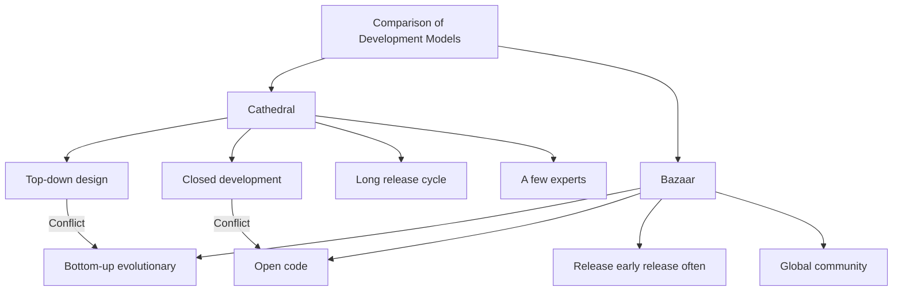
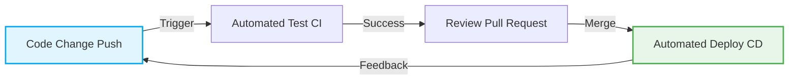

# The Open Source Revolution and "The Cathedral and the Bazaar": A Paradigm Shift That Changed the History of Software Development

The software world has undergone dramatic evolution over the past few decades. One of the most important and fundamental changes is the birth and popularization of the concept of "open source." Today, much of the foundation for the internet infrastructure, smartphones, cloud computing, and even AI that we use is supported by open source software (OSS).

In this article, we delve deep into the core of this open source revolution and explore how Eric S. Raymond's monumental essay "The Cathedral and the Bazaar" completely overturned the software development paradigm from multiple perspectives: historical background, technological evolution, and its impact on modern software engineering.

## 1. The Dawn of Software and the Age of the "Cathedral"

### The Rise of Proprietary Software

In the early days of computing, software and hardware were integrated, and the concept of software as an independent commercial transaction was weak. However, from the 1970s to the 1980s, tech giants like IBM established a "proprietary" business model where software was protected by copyright, and the source code was kept closed and sold.

The software development model of this era was highly organized and managed top-down. A select few elite programmers would design, implement, and test in a closed environment following strict plans.

### Characteristics of the "Cathedral" Model

Eric S. Raymond likened this traditional style of software development to building a "cathedral."

*   **Centralized Design**: A few brilliant designers called architects draw the big picture, and laborers work according to it.
*   **Closed Development Environment**: The source code is a company secret, and outsiders cannot participate in the development process.
*   **Long Release Cycles**: It takes a long time, from months to years, before a release because the goal is a perfect product.
*   **Bug Discovery and Fixing**: Since only a limited number of internal testers look for bugs, discovery tends to be delayed.

This cathedral model was rational in the resource-constrained environment of the time and was the driving force behind creating huge and complex systems like Microsoft Windows and commercial UNIX. At the same time, however, it slowed the pace of innovation and built a high wall between developers and users.

## 2. A Thirst for Freedom: The Birth of the Free Software Movement

One programmer felt a strong sense of crisis regarding the rise of proprietary software. It was Richard Stallman, who belonged to the Artificial Intelligence Laboratory at the Massachusetts Institute of Technology (MIT).

### The GNU Project and the GPL

Stallman argued that software should be based on the universal human value of sharing knowledge, and that everyone should be able to freely use, study, modify, and redistribute it. In 1983, he launched the "GNU Project" and began developing a completely free UNIX-compatible operating system.

Furthermore, to legally support his philosophy, he drafted the "GNU General Public License (GPL)." The greatest feature of the GPL is the concept known as "Copyleft." This is a strong constraint that when software published under the GPL is modified and redistributed, its derivatives must also be published under the same GPL license, creating a mechanism to permanently preserve software freedom.

### The Limits of Free Software

Stallman's ideas resonated with many hackers and gave birth to excellent tools such as GCC (a C compiler) and Emacs (a text editor). However, the development of the kernel (GNU Hurd), which is the core of a complete OS, ran into difficulties, and the free software camp found itself in a situation where the "body" was nearing completion but it lacked a "heart."

## 3. The Shock of the "Bazaar": The Birth of Linux

In 1991, Linus Torvalds, a student at the University of Helsinki in Finland, published "Linux," a small OS kernel he had developed as a hobby, on a Usenet newsgroup.

### A Chaotic Development Style

Linus made his source code public and called out to hackers around the world, "Would anyone like to help?" Surprisingly, many developers responded to this call over the internet and began sending patches (correction codes).

Linus frantically incorporated the submitted patches and released new versions almost daily. There was no strict blueprint beforehand, nor was there any clear assignment of who was responsible for what. It was an extremely disorganized and chaotic development style where anyone could freely tinker with and improve the parts they were interested in.

### Why Did Linux Succeed?

According to the common sense of traditional software engineering (the cathedral model), such an unplanned and distributed development method should have led to the system's collapse. However, far from collapsing, Linux grew at a speed surpassing commercial UNIX and acquired astonishing stability.

It was Eric S. Raymond's "The Cathedral and the Bazaar" that unraveled this mystery.

## 4. Eric S. Raymond and "The Cathedral and the Bazaar"

In 1997, Raymond put the "bazaar" model of Linux into practice himself through a software project he developed called "Fetchmail," and summarized his experiences and analysis in an essay titled "The Cathedral and the Bazaar."

This essay brilliantly articulated the dynamics of open source development and had a massive impact on the industry. Let's look at some of its core laws.

### Basic Principles of the Bazaar Model

Raymond likened the bazaar model to a Middle Eastern market (bazaar) where a diverse crowd of people come and go, and various transactions happen simultaneously.

### Linus's Law

The most famous maxim in "The Cathedral and the Bazaar" is "Linus's Law," which states: "**Given enough eyeballs, all bugs are shallow**."

In the cathedral model, discovering and fixing bugs rests on the shoulders of a small number of developers and testers. On the other hand, in the bazaar model, because the source code is open, thousands or tens of thousands of users around the world read the code, execute it, and report problems. The insight is that by turning countless "eyes" with different knowledge and backgrounds toward the code, no matter how complex a bug is, it becomes an easy problem for someone to solve.

### Release Early, Release Often

In the bazaar model, instead of waiting for a perfect state, you quickly release something that works, even if incomplete, and loop the feedback from users. This prevents the direction of development from deviating from the true needs of the users and allows you to maintain the community's enthusiasm.

### Treating Users as Co-developers

"Treating your users as co-developers is your least-hassle route to rapid code improvement and effective debugging."
In the bazaar model, users are not merely "consumers." They are "co-developers" who report bugs, sometimes write patches, and propose new features. How well you can draw out and manage the power of this community determines the success or failure of a project.

## 5. The Birth of the Term "Open Source"

After "The Cathedral and the Bazaar" was published, its ideas began to impact the business world beyond some hacker communities.

In 1998, Netscape Communications, which was losing to Microsoft's Internet Explorer in the web browser market, made a dramatic decision to open source its browser (Netscape Communicator) as a desperate measure. Behind this decision was the influence on management who had read "The Cathedral and the Bazaar."

Triggered by this event, a new, more pragmatic and business-friendly term was proposed to dispel the political and ideological nuances (especially the rejection from the business world) of the word "Free" in the free software movement. That term was "**Open Source**."

With the establishment of the Open Source Initiative (OSI) and the definition of the Open Source Definition (OSD), open source quickly became an indispensable element of corporate IT strategies.

## 6. The Paradigm Shift Brought About by the Open Source Revolution

The open source revolution and the bazaar model brought an irreversible paradigm shift to software engineering as a whole, going beyond the mere fact that "source code is public."

### The Advent of Distributed Version Control Systems (Git)

The bazaar model, where developers around the world make changes to code asynchronously and distributedly, reached its limits with traditional centralized version control systems (like CVS and Subversion). To solve this, Linus Torvalds himself developed "Git." The appearance of Git and GitHub, which hosts it, dramatically lowered the hurdle for open source development and gave birth to a new culture of "social coding."

### Agile Development and CI/CD

The bazaar model's philosophy of "release early, release often" is deeply connected to the ideas of modern agile software development and DevOps. The method of continuously improving software in short iterations and automatically testing and deploying it through CI/CD (Continuous Integration / Continuous Delivery) pipelines can be said to be an evolution of the bazaar model.

### Standing on the Shoulders of Giants

Today, no developer builds a new web service or application entirely from scratch. By standing on the "shoulders of giants" of open source—such as operating systems (Linux), web servers (Apache, Nginx), databases (MySQL, PostgreSQL), programming languages, and a vast number of libraries and frameworks (React, TensorFlow, etc.)—developers can focus on creating their core business value.

## 7. The Modern Bazaar: Corporate Entry and Ecosystem Formation

Even Microsoft, which once stated that "Linux is a cancer," has now acquired GitHub and become one of the largest corporate contributors to open source. Tech giants like Google, Meta (Facebook), and Amazon also employ strategies of publishing their foundational technologies (such as Kubernetes, React, and PyTorch) as open source to seize industry standards (de facto standards).

The modern bazaar is no longer just a place for pure volunteer hackers. It has evolved into a massive and complex ecosystem where professional engineers paid by companies commit full-time, and powerful foundations (like the Linux Foundation and the Apache Software Foundation) manage project governance and funding.

## 8. Challenges and Future Prospects

However, the open source bazaar model is not perfect either. In recent years, several serious challenges have come to light.

*   **Maintainer Burnout**: Even widely used and important OSS is often minimally maintained by a small number of unpaid maintainers, and the mental and financial burden on them is reaching its limit.
*   **Supply Chain Attacks**: As software dependencies become more complex, the risk of attacks exploiting OSS vulnerabilities (such as the Log4j vulnerability) causing massive impact on social infrastructure is increasing.
*   **Funding Imbalance**: While some companies make massive profits using open source, the "free rider problem" remains unsolved, where profits are not returned to the developers who build its foundation.

In response to these challenges, new sustainability models are being explored, such as funding mechanisms like GitHub Sponsors, direct employment of OSS developers by companies, and support for security audits by government agencies.

## Conclusion

The worldview proposed by "The Cathedral and the Bazaar" has spread beyond the confines of software code into a wide range of fields, such as knowledge sharing like Wikipedia, open data, and even open hardware and open science.

From the top-down "Cathedral" to the autonomous and distributed "Bazaar." This open source revolution can be called one of the most successful social experiments in how humanity collaborates to create knowledge and technology. We are still standing right in the middle of this massive, ever-evolving bazaar.
