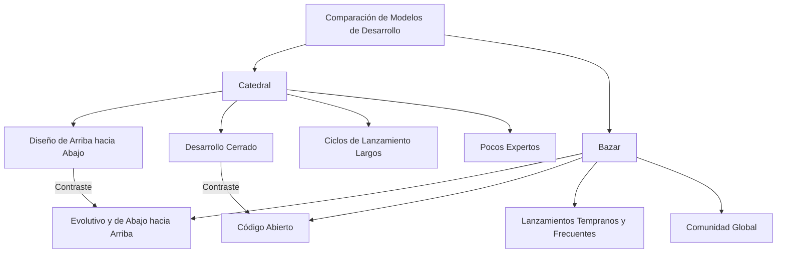
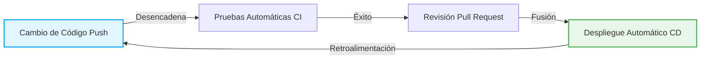

# La Revolución del Código Abierto y "La Catedral y el Bazar": Un Cambio de Paradigma en la Historia del Desarrollo de Software

El mundo del software ha experimentado una evolución dramática en las últimas décadas. Uno de los cambios más importantes y fundamentales ha sido el nacimiento y la popularización del concepto de "código abierto". Gran parte de la infraestructura de Internet, los teléfonos inteligentes, la computación en la nube e incluso la inteligencia artificial que utilizamos hoy en día se basan en software de código abierto (OSS).

Este artículo profundiza en el núcleo de esta revolución del código abierto, explorando cómo el monumental ensayo de Eric S. Raymond, "La Catedral y el Bazar", alteró fundamentalmente el paradigma del desarrollo de software. Analizaremos esto desde múltiples perspectivas: contexto histórico, evolución tecnológica y su impacto en la ingeniería de software moderna.

## 1. Los Albores del Software y la Era de la "Catedral"

### El Ascenso del Software Privativo

En los primeros días de la informática, el software y el hardware eran una sola entidad, y el concepto de vender software de forma independiente era débil. Sin embargo, en las décadas de 1970 y 1980, gigantes tecnológicos como IBM establecieron un modelo de negocio "privativo" en el que el software estaba protegido por derechos de autor y se vendía con su código fuente cerrado.

El modelo de desarrollo de software en esta época era altamente organizado y se gestionaba de arriba hacia abajo. Era un estilo en el que unos pocos programadores de élite seleccionados diseñaban, implementaban y probaban en un entorno cerrado, siguiendo planes estrictos.

### Características del Modelo "Catedral"

Eric S. Raymond comparó este estilo tradicional de desarrollo de software con la construcción de una "catedral".

*   **Diseño centralizado**: Unos pocos diseñadores brillantes, llamados arquitectos, elaboran el plan general, y los trabajadores lo siguen.
*   **Entorno de desarrollo cerrado**: El código fuente es un secreto de la empresa, y los forasteros no pueden participar en el proceso de desarrollo.
*   **Ciclos de lanzamiento largos**: Buscando un producto perfecto, los lanzamientos toman mucho tiempo, de meses a años.
*   **Descubrimiento y corrección de errores**: Solo los probadores internos limitados buscan errores, lo que a menudo retrasa su descubrimiento.

Este modelo de catedral era lógico dado los recursos limitados de la época y fue el motor para crear sistemas enormes y complejos como Microsoft Windows y UNIX comercial. Sin embargo, también ralentizó la innovación y creó altas barreras entre los desarrolladores y los usuarios.

## 2. Sed de Libertad: El Nacimiento del Movimiento del Software Libre

Richard Stallman, un programador del Laboratorio de Inteligencia Artificial del Instituto Tecnológico de Massachusetts (MIT), sintió un fuerte sentido de urgencia ante el ascenso del software privativo.

### El Proyecto GNU y la GPL

Stallman argumentaba que el software debía basarse en el valor universal humano de compartir conocimientos, y que todos debían poder usarlo, estudiarlo, modificarlo y redistribuirlo libremente. En 1983, lanzó el "Proyecto GNU" para desarrollar un sistema operativo compatible con UNIX que fuera completamente libre.

Además, para dar respaldo legal a su filosofía, redactó la "Licencia Pública General de GNU" (GPL). La característica más importante de la GPL es el concepto llamado "Copyleft". Esta es una fuerte restricción de que si modificas o redistribuyes software publicado bajo la GPL, debes publicar sus derivados bajo la misma licencia GPL. Esto creó un mecanismo para garantizar que la libertad del software se mantuviera a perpetuidad.

### Los Límites del Software Libre

La filosofía de Stallman resonó con muchos hackers y produjo herramientas excelentes como GCC (compilador de C) y Emacs (editor de texto). Sin embargo, el desarrollo del núcleo del sistema operativo (GNU Hurd) encontró dificultades, dejando al bando del software libre en una situación en la que el "cuerpo" estaba casi completo, pero faltaba el "corazón".

## 3. El Impacto del "Bazar": El Nacimiento de Linux

En 1991, Linus Torvalds, un estudiante de la Universidad de Helsinki en Finlandia, publicó en un grupo de noticias de Internet un pequeño núcleo de sistema operativo llamado "Linux" que había desarrollado como pasatiempo.

### Un Estilo de Desarrollo Caótico

Linus publicó su código fuente y pidió ayuda a hackers de todo el mundo: "¿Alguien me puede ayudar?". Sorprendentemente, muchos desarrolladores de Internet respondieron a su llamado y comenzaron a enviar parches (código corregido).

Linus incorporó agresivamente los parches recibidos y lanzó nuevas versiones casi a diario. No había un plano estricto por adelantado, ni asignaciones claras de quién haría qué. Fue un estilo de desarrollo extremadamente desordenado y caótico donde cualquiera podía jugar y mejorar la parte que le interesara.

### ¿Por Qué Tuvo Éxito Linux?

Según el sentido común de la ingeniería de software tradicional (el modelo de la catedral), un método de desarrollo tan disperso y no planificado debería haber llevado al colapso del sistema. Sin embargo, en lugar de colapsar, Linux creció a un ritmo que superó al UNIX comercial y logró una estabilidad asombrosa.

Eric S. Raymond resolvió este misterio en "La Catedral y el Bazar".

## 4. Eric S. Raymond y "La Catedral y el Bazar"

En 1997, a través de su proyecto de software llamado "Fetchmail", Raymond aplicó el modelo de "Bazar" de Linux él mismo, y resumió su experiencia y análisis en un ensayo titulado "La Catedral y el Bazar".

Este ensayo articuló brillantemente la dinámica del desarrollo de código abierto y causó un gran impacto en la industria. Veamos algunos de sus principios fundamentales.

### Principios Básicos del Modelo Bazar

Raymond comparó este modelo de desarrollo con un bazar del Medio Oriente, lleno de una diversa gama de personas con diversas transacciones ocurriendo simultáneamente.

### La Ley de Linus

El aforismo más famoso de "La Catedral y el Bazar" es la "Ley de Linus": "**Dado un número suficiente de ojos, todos los errores son superficiales**" (Given enough eyeballs, all bugs are shallow).

En el modelo de la catedral, descubrir y corregir errores recae sobre un pequeño número de desarrolladores y probadores. Por el contrario, en el modelo de bazar, dado que el código fuente está abierto, miles o decenas de miles de usuarios de todo el mundo leen, ejecutan e informan de problemas en el código. La idea es que al exponer el código a innumerables "ojos" con diferentes conocimientos y antecedentes, cualquier error complejo se convierte en un problema fácil de resolver para alguien.

### Lanzar Rápido, Lanzar a Menudo (Release early. Release often.)

En el modelo de bazar, en lugar de esperar hasta que esté perfecto, lanzas algo que funcione, aunque sea imperfecto, e iteras con la retroalimentación de los usuarios. Esto evita que la dirección del desarrollo se desvíe de las verdaderas necesidades de los usuarios y mantiene el entusiasmo de la comunidad.

### Tratar a los Usuarios como Co-desarrolladores

"Tratar a tus usuarios como co-desarrolladores es tu ruta menos complicada hacia la mejora rápida del código y la depuración efectiva."
En el modelo de bazar, los usuarios no son simples "consumidores". Son "co-desarrolladores" que informan de errores, a veces escriben parches y sugieren nuevas características. El éxito o fracaso del proyecto depende de cómo se aproveche y gestione el poder de esta comunidad.

## 5. El Nacimiento del Término "Código Abierto"

Después de la publicación de "La Catedral y el Bazar", su filosofía comenzó a influir en el mundo de los negocios más allá de la comunidad de hackers.

En 1998, Netscape Communications, que estaba perdiendo ante Internet Explorer de Microsoft en el mercado de navegadores web, tomó la dramática decisión de liberar el código fuente de su navegador (Netscape Communicator) como un movimiento desesperado. Detrás de esta decisión estaba la influencia del ensayo "La Catedral y el Bazar" en la dirección de la empresa.

Tras este evento, para disipar los matices políticos e ideológicos de la palabra "Libre" (Free) en el movimiento del software libre (especialmente el rechazo del mundo empresarial), se propuso un nuevo término más pragmático y amigable para los negocios. Así nació el "**Código Abierto**" (Open Source).

Con el establecimiento de la Open Source Initiative (OSI) y la definición del Código Abierto (OSD), el código abierto se extendió rápidamente como un elemento indispensable en las estrategias de TI corporativas.

## 6. El Cambio de Paradigma Traído por la Revolución del Código Abierto

La revolución del código abierto y el modelo de bazar no solo significaron que "el código fuente está disponible públicamente", sino que provocaron un cambio de paradigma irreversible en toda la ingeniería de software.

### La Aparición de los Sistemas de Control de Versiones Distribuidos (Git)

El modelo de bazar, donde desarrolladores de todo el mundo modifican el código de forma asíncrona y distribuida, encontró limitaciones con los sistemas de control de versiones centralizados tradicionales (como CVS o Subversion). Para resolver esto, el propio Linus Torvalds desarrolló "Git". La llegada de Git y de GitHub, que lo aloja, redujo drásticamente las barreras para el desarrollo de código abierto y creó una nueva cultura de "codificación social".

### Desarrollo Ágil y CI/CD

La filosofía de "lanzar rápido, lanzar a menudo" del modelo de bazar está profundamente conectada con el desarrollo ágil de software moderno y la cultura DevOps. El método de mejorar continuamente el software en iteraciones cortas y probar/desplegar automáticamente a través de tuberías de CI/CD (Integración Continua / Entrega Continua) puede verse como una evolución del modelo de bazar.

### A Hombros de Gigantes

Hoy en día, ningún desarrollador crea un nuevo servicio web o aplicación completamente desde cero. Al apoyarse en los "hombros de gigantes" del código abierto, como los sistemas operativos (Linux), los servidores web (Apache, Nginx), las bases de datos (MySQL, PostgreSQL), los lengripción y una innumerable cantidad de bibliotecas y marcos de trabajo (React, TensorFlow, etc.), los desarrolladores pueden centrarse en la creación de valor central de sus negocios.

## 7. El Bazar Moderno: La Entrada de las Empresas y la Formación de Ecosistemas

Incluso Microsoft, que una vez llegó a decir que "el código abierto es un cáncer", ahora ha adquirido GitHub y es uno de los mayores contribuyentes al código abierto. Gigantes tecnológicos como Google, Meta (Facebook) y Amazon también publican sus tecnologías base (Kubernetes, React, PyTorch, etc.) como código abierto, adoptando una estrategia para establecer estándares de facto en la industria.

El bazar moderno ya no es un lugar exclusivo de hackers voluntarios puros. Se ha convertido en un ecosistema enorme y complejo donde ingenieros profesionales remunerados por empresas contribuyen a tiempo completo, y poderosas fundaciones (como la Linux Foundation o la Apache Software Foundation) gestionan la gobernanza y los fondos de los proyectos.

## 8. Desafíos y Perspectivas de Futuro

Sin embargo, el modelo de bazar de código abierto tampoco es perfecto. En los últimos años, han salido a la luz varios desafíos graves.

*   **Agotamiento de los Mantenedores (Burnout)**: A menudo, incluso el OSS crítico y ampliamente utilizado se mantiene por un pequeño número de mantenedores no remunerados, y su carga mental y financiera está llegando a su límite.
*   **Ataques a la Cadena de Suministro**: A medida que las dependencias de software se vuelven más complejas, aumenta el riesgo de que los ataques que explotan vulnerabilidades en el OSS (como la vulnerabilidad Log4j) tengan un impacto masivo en la infraestructura social.
*   **Desequilibrio en la Financiación**: El "problema del polizón" (free-rider problem) sigue sin resolverse, donde hay empresas que obtienen enormes beneficios utilizando código abierto, pero esos beneficios no revierten a los desarrolladores que construyen esa base.

Para abordar estos desafíos, se están explorando nuevos modelos de sostenibilidad, como mecanismos de apoyo financiero como GitHub Sponsors, la contratación directa de desarrolladores de OSS por parte de las empresas, y el apoyo a las auditorías de seguridad por parte de agencias gubernamentales.

## Conclusión

La visión del mundo propuesta por "La Catedral y el Bazar" ha trascendido el ámbito del código de software para abarcar una amplia gama de campos, como el intercambio de conocimientos como Wikipedia, los datos abiertos, e incluso el hardware abierto y la ciencia abierta.

Desde la "catedral" de arriba hacia abajo hasta el "bazar" distribuido y autónomo. Esta revolución del código abierto es quizás uno de los experimentos sociales más exitosos de la humanidad para crear colaborativamente conocimiento y tecnología. Todavía estamos parados justo en el medio de un bazar gigante que continúa evolucionando.
