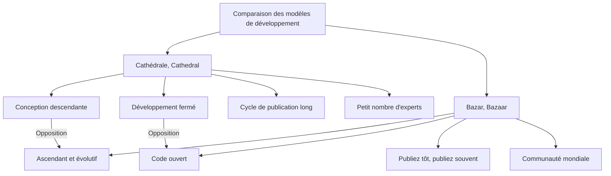
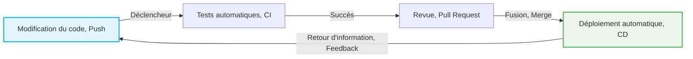

# La révolution open source et "La Cathédrale et le Bazar" : un changement de paradigme qui a transformé l'histoire du développement logiciel

Le monde du logiciel a connu une évolution spectaculaire au cours des dernières décennies. L'un des changements les plus importants et fondamentaux est la naissance et la popularisation du concept "open source". Aujourd'hui, une grande partie des fondations de l'infrastructure Internet que nous utilisons, des smartphones, du cloud computing et même de l'IA, repose sur des logiciels open source (OSS).

Cet article plonge au cœur de cette révolution open source et explore en détail comment l'essai monumental d'Eric S. Raymond, "La Cathédrale et le Bazar" (The Cathedral and the Bazaar), a fondamentalement bouleversé le paradigme du développement logiciel. Nous aborderons ce sujet sous de multiples angles : contexte historique, évolution technique et impact sur le génie logiciel moderne.

## 1. Les débuts du logiciel et l'ère de la "Cathédrale"

### L'essor des logiciels propriétaires

Aux premiers jours de l'informatique, le logiciel et le matériel ne faisaient qu'un, et le concept de commercialiser des logiciels de manière indépendante était rare. Cependant, des années 1970 aux années 1980, des géants de la technologie comme IBM ont établi un modèle commercial "propriétaire" (exclusif) en protégeant les logiciels par des droits d'auteur et en vendant du code source fermé (closed-source).

Le modèle de développement logiciel de cette époque était hautement organisé et géré de manière descendante (top-down). Une poignée de programmeurs d'élite sélectionnés travaillaient dans un environnement clos, suivant des plans stricts de la conception à la mise en œuvre, puis aux tests.

### Caractéristiques du modèle de la "Cathédrale"

Eric S. Raymond a comparé ce style traditionnel de développement logiciel à la construction d'une "Cathédrale" (Cathedral).

*   **Conception centralisée** : Quelques concepteurs géniaux, appelés architectes, dessinent la vue d'ensemble, et les travailleurs exécutent les tâches en conséquence.
*   **Environnement de développement fermé** : Le code source est un secret d'entreprise, et il est impossible pour des personnes extérieures de participer au processus de développement.
*   **Cycle de publication long** : Pour atteindre un produit parfait, il faut de nombreux mois, voire des années, avant la sortie.
*   **Détection et correction des bugs** : Seul un nombre limité de testeurs internes recherche les bugs, ce qui retarde souvent leur détection.

Ce modèle de la Cathédrale était rationnel dans un environnement aux ressources limitées à l'époque et a été la force motrice derrière la création de systèmes énormes et complexes comme Microsoft Windows et UNIX commercial. Cependant, en même temps, il a ralenti le rythme de l'innovation et a dressé un mur élevé entre les développeurs et les utilisateurs.

## 2. Soif de liberté : la naissance du mouvement du logiciel libre

Face à l'essor des logiciels propriétaires, un programmeur a ressenti un fort sentiment de crise. Il s'agissait de Richard Stallman, qui travaillait au laboratoire d'intelligence artificielle du Massachusetts Institute of Technology (MIT).

### Le projet GNU et la GPL

Stallman soutenait que les logiciels devaient être basés sur la valeur universelle du partage des connaissances de l'humanité, et que tout le monde devrait être libre de les utiliser, de les étudier, de les modifier et de les redistribuer. En 1983, il lance le "projet GNU" et commence à développer un système d'exploitation entièrement libre et compatible UNIX.

De plus, pour donner un fondement juridique à sa philosophie, il a élaboré la "Licence Publique Générale GNU" (GPL: GNU General Public License). La plus grande caractéristique de la GPL est le concept appelé "Copyleft". Il s'agit d'une contrainte forte selon laquelle si un logiciel publié sous GPL est modifié et redistribué, ses dérivés doivent également être publiés sous la même licence GPL. Cela a créé un système garantissant que la liberté du logiciel soit préservée de façon permanente.

### Les limites du logiciel libre

Les idées de Stallman ont trouvé un écho chez de nombreux hackers, ce qui a conduit à la création d'excellents outils tels que GCC (un compilateur C) et Emacs (un éditeur de texte). Cependant, le développement du noyau (GNU Hurd), le cœur d'un système d'exploitation complet, a rencontré des difficultés, laissant le camp du logiciel libre dans une situation où le "corps" était presque achevé, mais sans "cœur".

## 3. Le choc du "Bazar" : la naissance de Linux

En 1991, Linus Torvalds, alors étudiant à l'Université d'Helsinki en Finlande, a publié sur un groupe de discussion Internet "Linux", un petit noyau de système d'exploitation qu'il avait développé pour le plaisir.

### Un style de développement chaotique

Linus a publié son code source et a fait appel aux hackers du monde entier : "Quelqu'un peut-il m'aider ?". Étonnamment, de nombreux développeurs ont répondu à cet appel via Internet et ont commencé à envoyer des correctifs (patchs).

Linus a intégré les correctifs envoyés à un rythme effréné, publiant de nouvelles versions presque quotidiennement. Il n'y avait pas de plan préalable strict ni de répartition claire des rôles. C'était un style de développement extrêmement désordonné et chaotique, où chacun bricolait et améliorait librement les parties qui l'intéressaient.

### Pourquoi Linux a-t-il réussi ?

Selon le bon sens du génie logiciel traditionnel (le modèle de la Cathédrale), une méthode de développement aussi dispersée et non planifiée aurait dû conduire à l'effondrement du système. Mais au lieu de s'effondrer, Linux a grandi à une vitesse surpassant celle d'UNIX commercial, atteignant une stabilité phénoménale.

C'est Eric S. Raymond qui a percé ce mystère dans "La Cathédrale et le Bazar".

## 4. Eric S. Raymond et "La Cathédrale et le Bazar"

En 1997, Raymond a mis en pratique le modèle "Bazar" (Bazaar) de Linux à travers son propre projet de logiciel appelé "Fetchmail", et a résumé son expérience et son analyse dans un essai intitulé "La Cathédrale et le Bazar".

Cet essai a brillamment formulé la dynamique du développement open source et a eu un impact majeur sur l'industrie. Examinons quelques-unes de ses lois fondamentales.

### Principes de base du modèle du Bazar

Raymond a comparé le modèle du Bazar à un marché du Moyen-Orient (un bazar) où des personnes diverses se croisent et où diverses transactions ont lieu simultanément.

### La loi de Linus (Linus's Law)

L'adage le plus célèbre de "La Cathédrale et le Bazar" est la "loi de Linus" : "**Avec suffisamment d'yeux, tous les bugs sont superficiels**" (Given enough eyeballs, all bugs are shallow).

Dans le modèle de la Cathédrale, la détection et la correction des bugs reposent sur les épaules d'un petit nombre de développeurs et de testeurs. En revanche, dans le modèle du Bazar, le code source étant ouvert, des milliers voire des dizaines de milliers d'utilisateurs à travers le monde lisent, exécutent le code et signalent les problèmes. L'idée est qu'avec une multitude d'"yeux" ayant des connaissances et des parcours différents tournés vers le code, même le bug le plus complexe devient un problème facile à résoudre pour quelqu'un.

### Publiez tôt, publiez souvent (Release early. Release often.)

Le modèle du Bazar n'attend pas que le produit soit parfait. Il publie rapidement ce qui fonctionne, même si c'est imparfait, et crée une boucle de retour d'information (feedback) avec les utilisateurs. Cela permet d'éviter que la direction du développement ne s'écarte des véritables besoins des utilisateurs et de maintenir la passion de la communauté.

### Traiter les utilisateurs comme des co-développeurs

"Traiter les utilisateurs comme des co-développeurs est la voie la plus sûre vers une amélioration rapide du code et un débogage efficace."
Dans le modèle du Bazar, les utilisateurs ne sont pas de simples "consommateurs". Ils signalent des bugs, écrivent parfois des correctifs et proposent de nouvelles fonctionnalités, devenant ainsi des "co-développeurs". La réussite ou l'échec d'un projet dépend de la manière de tirer parti et de gérer cette force communautaire.

## 5. La naissance du terme "Open Source"

Après la publication de "La Cathédrale et le Bazar", ses idées ont commencé à dépasser certaines communautés de hackers pour influencer le monde des affaires.

En 1998, Netscape Communications, qui perdait face à Internet Explorer de Microsoft sur le marché des navigateurs Web, a pris la décision radicale de publier le code source de son navigateur (Netscape Communicator) dans un geste désespéré. Derrière cette décision se trouvait l'influence de la direction qui avait lu "La Cathédrale et le Bazar".

Suite à cet événement, afin d'éliminer les nuances politiques et idéologiques (et particulièrement le rejet du monde des affaires) associées au mot "Libre" (Free) du mouvement du logiciel libre, un nouveau nom plus pragmatique et favorable aux entreprises a été proposé. Il s'agissait de l'"**Open Source**" (Open Source).

Avec la création de l'Open Source Initiative (OSI) et l'établissement de la définition de l'Open Source (OSD), l'open source s'est rapidement imposé comme un élément essentiel de la stratégie informatique des entreprises.

## 6. Le changement de paradigme apporté par la révolution open source

La révolution open source et le modèle du Bazar ne se sont pas limités au simple fait que "le code source est public", ils ont entraîné un changement de paradigme irréversible dans l'ensemble du génie logiciel.

### L'avènement des systèmes de contrôle de version décentralisés (Git)

Le modèle du Bazar, dans lequel des développeurs du monde entier modifient le code de manière asynchrone et distribuée, a atteint les limites des systèmes de contrôle de version centralisés traditionnels (tels que CVS ou Subversion). Pour résoudre ce problème, Linus Torvalds lui-même a développé "Git". L'apparition de Git et de la plateforme qui l'héberge, GitHub, a considérablement abaissé les barrières du développement open source et a donné naissance à une nouvelle culture appelée "Social Coding".

### Développement agile et CI/CD

La philosophie du modèle du Bazar de "publier tôt, publier souvent" est profondément liée aux concepts modernes de développement logiciel agile et de DevOps. La méthode consistant à améliorer continuellement les logiciels sur de courtes itérations et à automatiser les tests et le déploiement via un pipeline CI/CD (Intégration Continue / Déploiement Continu) peut être considérée comme une évolution du modèle du Bazar.

### Se tenir sur les épaules de géants

Aujourd'hui, plus aucun développeur ne crée un nouveau service Web ou une application entièrement à partir de zéro. En s'appuyant sur les "épaules de géants" de l'open source tels que les systèmes d'exploitation (Linux), les serveurs Web (Apache, Nginx), les bases de données (MySQL, PostgreSQL), les langages de programmation et d'innombrables bibliothèques et frameworks (React, TensorFlow, etc.), les développeurs peuvent se concentrer sur la création de la valeur fondamentale de leur entreprise.

## 7. Le Bazar moderne : l'entrée des entreprises et la formation d'un écosystème

Même Microsoft, qui a un jour déclaré que "l'open source est un cancer", a désormais acquis GitHub et est l'un des plus grands contributeurs à l'open source. Des géants de la technologie comme Google, Meta (Facebook) et Amazon adoptent également la stratégie de publier leurs technologies de base (Kubernetes, React, PyTorch, etc.) en tant qu'open source pour s'emparer des standards de l'industrie (standards de facto).

Le Bazar moderne n'est plus seulement un lieu pour de purs hackers bénévoles. Il a évolué vers un écosystème vaste et complexe où des ingénieurs professionnels rémunérés par des entreprises s'engagent à plein temps, et de puissantes fondations (telles que la Linux Foundation et l'Apache Software Foundation) gèrent la gouvernance et le financement des projets.

## 8. Défis et perspectives d'avenir

Cependant, le modèle du Bazar open source n'est pas parfait. Ces dernières années, plusieurs problèmes graves ont été mis en évidence.

*   **L'épuisement professionnel (burnout) des mainteneurs** : Même d'importants OSS largement utilisés sont souvent maintenus de justesse par un petit nombre de mainteneurs non rémunérés, et le fardeau mental et financier qui pèse sur eux atteint ses limites.
*   **Attaques de la chaîne d'approvisionnement** : Alors que les dépendances logicielles deviennent de plus en plus complexes, le risque que des attaques exploitant les vulnérabilités des OSS (comme la vulnérabilité Log4j) aient un impact dévastateur sur les infrastructures sociales augmente.
*   **Déséquilibre de financement** : Bien qu'il y ait des entreprises qui font des profits énormes en utilisant l'open source, le problème du "passager clandestin" (free rider), où les profits ne sont pas reversés aux développeurs qui ont construit cette fondation, reste non résolu.

Face à ces défis, de nouveaux modèles de durabilité sont explorés, tels que des mécanismes de financement comme GitHub Sponsors, l'emploi direct de développeurs OSS par des entreprises, et le soutien aux audits de sécurité par des agences gouvernementales.

## En conclusion

La vision du monde proposée par "La Cathédrale et le Bazar" a dépassé le cadre du code logiciel et s'est étendue à de nombreux domaines, tels que le partage des connaissances comme Wikipédia, l'open data, l'open hardware et l'open science.

De la "Cathédrale" descendante au "Bazar" autonome et décentralisé. Cette révolution open source peut être considérée comme l'une des expériences sociales les plus réussies de l'humanité pour créer collaborativement des connaissances et des technologies. Nous nous tenons toujours au milieu d'un immense Bazar en constante évolution.
