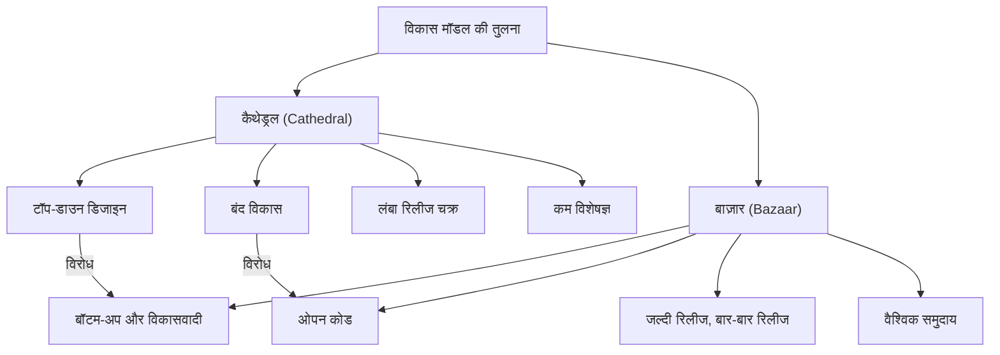
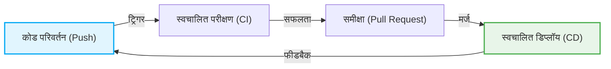

# ओपन सोर्स क्रांति और "द कैथेड्रल एंड द बाज़ार": सॉफ्टवेयर विकास के इतिहास को बदलने वाला पैराडाइम शिफ्ट

सॉफ्टवेयर की दुनिया में पिछले कुछ दशकों में नाटकीय विकास हुआ है। इनमें से सबसे महत्वपूर्ण और मौलिक बदलावों में से एक "ओपन सोर्स" की अवधारणा का जन्म और इसका प्रसार है। आज हम जिस इंटरनेट इंफ्रास्ट्रक्चर, स्मार्टफोन, क्लाउड कंप्यूटिंग और एआई (AI) का उपयोग करते हैं, उसका अधिकांश आधार ओपन सोर्स सॉफ्टवेयर (OSS) द्वारा समर्थित है।

इस लेख में, हम इस ओपन सोर्स क्रांति के मूल में जाएंगे और ऐतिहासिक पृष्ठभूमि, तकनीकी विकास, और आधुनिक सॉफ्टवेयर इंजीनियरिंग पर इसके प्रभाव के विविध दृष्टिकोणों से गहराई से पड़ताल करेंगे कि कैसे एरिक एस. रेमंड (Eric S. Raymond) के स्मारकीय निबंध "द कैथेड्रल एंड द बाज़ार (The Cathedral and the Bazaar)" ने सॉफ्टवेयर विकास के पैराडाइम को पूरी तरह से बदल दिया।

## 1. सॉफ्टवेयर का प्रारंभिक युग और "कैथेड्रल" का युग

### प्रोपराइटरी सॉफ्टवेयर का उदय

कंप्यूटर के शुरुआती दिनों में, सॉफ्टवेयर और हार्डवेयर एक साथ जुड़े हुए थे, और केवल सॉफ्टवेयर के व्यावसायिक लेनदेन की अवधारणा दुर्लभ थी। हालांकि, 1970 और 1980 के दशकों में, IBM और अन्य विशाल टेक कंपनियों ने सॉफ्टवेयर को कॉपीराइट से सुरक्षित किया और स्रोत कोड (सोर्स कोड) को अप्रकाशित (क्लोज्ड) रखकर बेचने का "प्रोपराइटरी (एकाधिकारवादी)" बिजनेस मॉडल स्थापित किया।

इस युग में सॉफ्टवेयर विकास मॉडल अत्यधिक संगठित और टॉप-डाउन प्रबंधित था। कुछ चुनिंदा एलीट प्रोग्रामर बंद वातावरण में कठोर योजना के अनुसार डिजाइन से लेकर कार्यान्वयन और परीक्षण तक का कार्य करते थे।

### "कैथेड्रल (Cathedral)" मॉडल की विशेषताएं

एरिक एस. रेमंड ने पारंपरिक सॉफ्टवेयर विकास की इस शैली की तुलना "कैथेड्रल (महागिरजाघर)" के निर्माण से की।

*   **केंद्रीकृत डिजाइन**: आर्किटेक्ट नामक कुछ प्रतिभाशाली डिजाइनर समग्र तस्वीर बनाते हैं, और उसी के अनुसार कार्यकर्ता काम करते हैं।
*   **बंद विकास वातावरण**: स्रोत कोड कंपनी का रहस्य होता है, और बाहरी लोगों का विकास प्रक्रिया में शामिल होना असंभव है।
*   **लंबा रिलीज चक्र**: एक आदर्श उत्पाद का लक्ष्य रखने के कारण, रिलीज होने में महीनों से लेकर वर्षों तक का लंबा समय लगता है।
*   **बग खोजना और ठीक करना**: क्योंकि केवल सीमित आंतरिक टेस्टर ही बग खोजते हैं, इसलिए उन्हें खोजने में अक्सर देरी होती है।

यह कैथेड्रल मॉडल उस समय के सीमित संसाधनों वाले वातावरण में तर्कसंगत था, और माइक्रोसॉफ्ट विंडोज (Microsoft Windows) और कमर्शियल यूनिक्स (UNIX) जैसी विशाल और जटिल प्रणालियों को बनाने का प्रेरक बल बना। लेकिन साथ ही, इसने नवाचार की गति को धीमा कर दिया और डेवलपर्स व उपयोगकर्ताओं के बीच एक ऊंची दीवार खड़ी कर दी।

## 2. स्वतंत्रता की लालसा: फ्री सॉफ्टवेयर आंदोलन का जन्म

प्रोपराइटरी सॉफ्टवेयर के उदय से एक प्रोग्रामर को बहुत चिंता हुई। वे थे मैसाचुसेट्स इंस्टीट्यूट ऑफ टेक्नोलॉजी (MIT) आर्टिफिशियल इंटेलिजेंस लेबोरेटरी के रिचर्ड स्टॉलमैन (Richard Stallman)।

### GNU प्रोजेक्ट और GPL

स्टॉलमैन ने तर्क दिया कि सॉफ्टवेयर को ज्ञान साझा करने के सार्वभौमिक मानवीय मूल्य पर आधारित होना चाहिए, और हर किसी को इसे स्वतंत्र रूप से उपयोग करने, अध्ययन करने, संशोधित करने और पुनर्वितरित करने में सक्षम होना चाहिए। उन्होंने 1983 में "GNU प्रोजेक्ट" शुरू किया और पूरी तरह से स्वतंत्र UNIX-संगत ऑपरेटिंग सिस्टम विकसित करना शुरू किया।

इसके अलावा, अपने आदर्शों को कानूनी समर्थन देने के लिए, उन्होंने "GNU जनरल पब्लिक लाइसेंस (GPL: GNU General Public License)" तैयार किया। GPL की सबसे बड़ी विशेषता "कॉपीलेफ्ट (Copyleft)" नामक अवधारणा है। यह एक मजबूत प्रतिबंध है कि यदि आप GPL के तहत जारी किए गए सॉफ्टवेयर को संशोधित और पुनर्वितरित करते हैं, तो उसके डेरिवेटिव (व्युत्पन्न) को भी उसी GPL लाइसेंस के तहत जारी किया जाना चाहिए। इससे एक ऐसा सिस्टम बना जिससे सॉफ्टवेयर की स्वतंत्रता स्थायी रूप से बनी रहे।

### फ्री सॉफ्टवेयर की सीमाएं

स्टॉलमैन के विचारों ने कई हैकरों की सहानुभूति प्राप्त की और GCC (C कंपाइलर) और Emacs (टेक्स्ट एडिटर) जैसे बेहतरीन उपकरण बनाए। हालांकि, पूर्ण OS के मूल - कर्नेल (GNU Hurd) - का विकास मुश्किलों में घिर गया, और फ्री सॉफ्टवेयर खेमा एक ऐसी स्थिति में आ गया जहां "शरीर" लगभग पूरा हो चुका था लेकिन उसमें "दिल" नहीं था।

## 3. "बाज़ार" का प्रभाव: लिनक्स (Linux) का जन्म

1991 में, फिनलैंड की हेलसिंकी यूनिवर्सिटी के एक छात्र लिनस टोरवाल्ड्स (Linus Torvalds) ने इंटरनेट पर एक न्यूज़ग्रुप में अपने शौक के रूप में विकसित किए गए एक छोटे OS कर्नेल "लिनक्स (Linux)" को प्रकाशित किया।

### अराजक विकास शैली

लिनस ने अपना स्रोत कोड प्रकाशित किया और दुनिया भर के हैकरों से अपील की, "क्या कोई मेरी मदद कर सकता है?" आश्चर्यजनक रूप से, इंटरनेट के माध्यम से कई डेवलपर्स ने इस आह्वान का जवाब दिया और पैच (सुधार कोड) भेजना शुरू कर दिया।

लिनस ने भेजे गए पैचों को बहुत तेज़ी से शामिल किया और लगभग हर दिन नए संस्करण जारी किए। इसके लिए पहले से कोई सख्त ब्लूप्रिंट नहीं था, और यह स्पष्ट नहीं था कि कौन क्या कार्य करेगा। यह एक अत्यंत अव्यवस्थित और अराजक विकास शैली थी जहां हर कोई स्वतंत्र रूप से अपनी रुचि के हिस्से में बदलाव कर रहा था और उसमें सुधार कर रहा था।

### लिनक्स सफल क्यों हुआ?

पारंपरिक सॉफ्टवेयर इंजीनियरिंग (कैथेड्रल मॉडल) के सामान्य ज्ञान के अनुसार, इस तरह की अनियोजित और विकेंद्रीकृत विकास पद्धति से सिस्टम का पतन होना चाहिए था। हालाँकि, लिनक्स ढहने के बजाय, कमर्शियल UNIX को पीछे छोड़ते हुए तेज़ गति से बढ़ा और आश्चर्यजनक स्थिरता प्राप्त की।

इस रहस्य को एरिक एस. रेमंड के "द कैथेड्रल एंड द बाज़ार" ने सुलझाया।

## 4. एरिक एस. रेमंड और "द कैथेड्रल एंड द बाज़ार"

1997 में, रेमंड ने अपने द्वारा विकसित "Fetchmail" नामक सॉफ्टवेयर प्रोजेक्ट के माध्यम से स्वयं लिनक्स के "बाज़ार (Bazaar)" मॉडल का अभ्यास किया, और उस अनुभव तथा विश्लेषण को "द कैथेड्रल एंड द बाज़ार" नामक एक निबंध में संकलित किया।

इस निबंध ने ओपन सोर्स विकास की गतिशीलता को शानदार ढंग से व्यक्त किया और उद्योग पर एक बड़ा प्रभाव डाला। आइए इसके कुछ प्रमुख सिद्धांतों पर नज़र डालें।

### बाज़ार मॉडल के मूल सिद्धांत

रेमंड ने बाज़ार मॉडल की तुलना मध्य पूर्व के एक बाज़ार से की, जहाँ विभिन्न प्रकार के लोग आते-जाते हैं और एक साथ कई लेनदेन होते हैं।

### लिनस का नियम (Linus's Law)

"द कैथेड्रल एंड द बाज़ार" की सबसे प्रसिद्ध कहावत "लिनस का नियम" है: "**यदि पर्याप्त आँखें हों, तो सभी बग उथले हो जाते हैं (Given enough eyeballs, all bugs are shallow)**"।

कैथेड्रल मॉडल में, बग खोजने और ठीक करने की जिम्मेदारी मुट्ठी भर डेवलपर्स और टेस्टर्स पर होती है। दूसरी ओर, बाज़ार मॉडल में, चूंकि स्रोत कोड सार्वजनिक होता है, दुनिया भर के हजारों और लाखों उपयोगकर्ता कोड पढ़ते हैं, इसे चलाते हैं और समस्याओं की रिपोर्ट करते हैं। यह अंतर्दृष्टि बताती है कि अलग-अलग ज्ञान और पृष्ठभूमि वाली अनगिनत "आँखें" कोड पर होने से, किसी के लिए भी कितना भी जटिल बग आसानी से हल करने योग्य समस्या बन जाता है।

### जल्दी रिलीज करें, बार-बार रिलीज करें (Release early. Release often.)

बाज़ार मॉडल में, चीजों के एकदम सही होने की प्रतीक्षा करने के बजाय, भले ही वे अपूर्ण हों, काम करने वाली चीजों को जल्दी जारी किया जाता है और उपयोगकर्ताओं से फीडबैक का लूप बनाया जाता है। यह विकास की दिशा को उपयोगकर्ताओं की वास्तविक जरूरतों से भटकने से रोकता है और समुदाय के उत्साह को बनाए रखता है।

### उपयोगकर्ताओं को सह-डेवलपर्स के रूप में मानें

"उपयोगकर्ताओं को सह-डेवलपर्स के रूप में मानना कोड के तेजी से सुधार और प्रभावी डिबगिंग का सबसे सुनिश्चित मार्ग है।"
बाज़ार मॉडल में, उपयोगकर्ता केवल "उपभोक्ता" नहीं होते हैं। वे "सह-डेवलपर (को-डेवलपर)" हैं जो बग की रिपोर्ट करते हैं, कभी-कभी सुधार पैच लिखते हैं, और नई सुविधाओं का प्रस्ताव देते हैं। इस समुदाय की शक्ति को आप कैसे सामने लाते हैं और प्रबंधित करते हैं, यह तय करता है कि कोई प्रोजेक्ट सफल होगा या नहीं।

## 5. "ओपन सोर्स" शब्द का जन्म

"द कैथेड्रल एंड द बाज़ार" के प्रकाशन के बाद, इसके विचारों ने कुछ हैकर समुदायों से परे जाकर व्यावसायिक दुनिया को भी प्रभावित करना शुरू कर दिया।

1998 में, वेब ब्राउज़र बाजार में Microsoft के Internet Explorer से हारने वाली Netscape Communications कंपनी ने अपने ब्राउज़र (Netscape Communicator) का स्रोत कोड प्रकाशित करने का एक नाटकीय निर्णय लिया, ताकि वापसी की जा सके। इस निर्णय के पीछे उन अधिकारियों की प्रेरणा थी जिन्होंने "द कैथेड्रल एंड द बाज़ार" पढ़ा था।

इस घटना के बाद, फ्री सॉफ्टवेयर आंदोलन के "फ्री (Free)" शब्द से जुड़े राजनीतिक और वैचारिक अर्थ (विशेषकर व्यापारिक दुनिया से होने वाली अस्वीकृति) को दूर करने के लिए एक अधिक व्यावहारिक और व्यवसाय-अनुकूल नया नाम प्रस्तावित किया गया। वह था "**ओपन सोर्स (Open Source)**"।

ओपन सोर्स इनिशिएटिव (OSI) की स्थापना और ओपन सोर्स डेफिनिशन (OSD) के निर्धारण के साथ, ओपन सोर्स तेजी से कॉर्पोरेट आईटी (IT) रणनीतियों का एक अनिवार्य हिस्सा बन गया।

## 6. ओपन सोर्स क्रांति द्वारा लाया गया पैराडाइम शिफ्ट

ओपन सोर्स क्रांति और बाज़ार मॉडल केवल इस तथ्य तक सीमित नहीं रहे कि "स्रोत कोड सार्वजनिक है", बल्कि इसने संपूर्ण सॉफ्टवेयर इंजीनियरिंग में एक अपरिवर्तनीय पैराडाइम शिफ्ट (प्रतिमान विस्थापन) ला दिया।

### डिस्ट्रिब्यूटेड वर्जन कंट्रोल सिस्टम (Git) का उदय

बाज़ार मॉडल, जहाँ दुनिया भर के डेवलपर एसिंक्रोनस रूप से और वितरित होकर कोड बदलते हैं, पारंपरिक केंद्रीकृत संस्करण नियंत्रण प्रणाली (CVS या Subversion) के साथ अपनी सीमाएँ रखता था। इसे हल करने के लिए, लिनस टोरवाल्ड्स ने स्वयं "Git" विकसित किया। Git और इसे होस्ट करने वाले GitHub के आगमन ने ओपन सोर्स विकास की बाधाओं को काफी कम कर दिया और "सोशल कोडिंग" की एक नई संस्कृति को जन्म दिया।

### एजाइल डेवलपमेंट और CI/CD

बाज़ार मॉडल का दर्शन "जल्दी रिलीज़, बार-बार रिलीज़" आधुनिक एजाइल सॉफ़्टवेयर डेवलपमेंट और DevOps के विचारों से गहराई से जुड़ा हुआ है। छोटे इटरेशन्स में सॉफ़्टवेयर को लगातार बेहतर बनाना और CI/CD (कंटीन्यूअस इंटीग्रेशन / कंटीन्यूअस डिलीवरी) पाइपलाइनों के माध्यम से स्वचालित रूप से टेस्ट और डिप्लॉय करने की पद्धति को बाज़ार मॉडल का एक विकसित रूप कहा जा सकता है।

### दिग्गजों के कंधों पर खड़ा होना

आज, कोई भी डेवलपर खरोंच (स्क्रैच) से पूरी तरह से नई वेब सेवाएं या एप्लिकेशन नहीं बनाता है। ऑपरेटिंग सिस्टम (Linux), वेब सर्वर (Apache, Nginx), डेटाबेस (MySQL, PostgreSQL), प्रोग्रामिंग लैंग्वेज और बड़ी संख्या में लाइब्रेरी और फ्रेमवर्क (React, TensorFlow, आदि) जैसे ओपन सोर्स "दिग्गजों के कंधों" पर खड़े होकर, डेवलपर्स अब अपने व्यवसाय के मुख्य मूल्यों (कोर वैल्यू) को बनाने पर ध्यान केंद्रित कर सकते हैं।

## 7. आधुनिक बाज़ार: कॉर्पोरेट प्रवेश और इकोसिस्टम का निर्माण

यहाँ तक कि माइक्रोसॉफ्ट (Microsoft), जिसने कभी कहा था कि "ओपन सोर्स कैंसर है", ने अब GitHub का अधिग्रहण कर लिया है और ओपन सोर्स में सबसे बड़े योगदानकर्ताओं में से एक बन गया है। Google, Meta (Facebook), और Amazon जैसी बड़ी तकनीकी कंपनियाँ भी अपनी मुख्य तकनीकों (Kubernetes, React, PyTorch, आदि) को ओपन सोर्स के रूप में जारी कर रही हैं और उद्योग मानक (डे-फैक्टो स्टैंडर्ड) को नियंत्रित करने की रणनीति अपना रही हैं।

आधुनिक बाज़ार अब केवल शुद्ध स्वयंसेवी हैकरों का स्थान नहीं रह गया है। यह एक विशाल और जटिल इकोसिस्टम में विकसित हुआ है जहां कंपनियों द्वारा भुगतान पाने वाले पेशेवर इंजीनियर फुल-टाइम काम करते हैं, और शक्तिशाली फाउंडेशन (जैसे Linux Foundation और Apache Software Foundation) परियोजनाओं के प्रशासन और धन का प्रबंधन करते हैं।

## 8. चुनौतियां और भविष्य की संभावनाएं

हालाँकि, ओपन सोर्स बाज़ार मॉडल भी सही नहीं है। हाल के वर्षों में कुछ गंभीर चुनौतियाँ सामने आई हैं।

*   **मेंटेनर्स का बर्नआउट (थकावट)**: व्यापक रूप से उपयोग किए जाने वाले महत्वपूर्ण OSS के मामले में भी, कई बार इन्हें मुट्ठी भर बिना वेतन वाले मेंटेनर्स द्वारा बनाए रखा जाता है, और उन पर मानसिक व आर्थिक बोझ अपनी सीमा तक पहुँच गया है।
*   **सप्लाई चेन अटैक**: जैसे-जैसे सॉफ्टवेयर निर्भरताएँ (डिपेंडेंसीज़) अधिक जटिल होती जा रही हैं, OSS कमजोरियों (जैसे Log4j की भेद्यता) का फायदा उठाने वाले हमलों का जोखिम बढ़ता जा रहा है, जिसका सामाजिक बुनियादी ढांचे पर भारी प्रभाव पड़ सकता है।
*   **फंडिंग असंतुलन**: "फ्री राइडर (मुफ्तखोर) समस्या" का समाधान नहीं हुआ है, जहाँ कुछ कंपनियाँ ओपन सोर्स का उपयोग करके भारी मुनाफा कमाती हैं, लेकिन उन डेवलपर्स को कोई लाभ नहीं मिलता है जिन्होंने इसका आधार बनाया है।

इन चुनौतियों का समाधान करने के लिए, GitHub Sponsors जैसे धन उगाहने वाले तंत्र, कंपनियों द्वारा OSS डेवलपर्स का सीधा रोजगार, और सरकारी एजेंसियों द्वारा सुरक्षा ऑडिट सहायता जैसे नए सस्टेनेबिलिटी (स्थिरता) मॉडल खोजे जा रहे हैं।

## निष्कर्ष

"द कैथेड्रल एंड द बाज़ार" द्वारा वकालत किया गया विश्वदृष्टिकोण सॉफ्टवेयर कोड की सीमाओं को पार कर गया है और ज्ञान साझा करने (जैसे विकिपीडिया - Wikipedia), ओपन डेटा, और यहां तक कि ओपन हार्डवेयर और ओपन साइंस जैसे कई क्षेत्रों में फैल गया है।

टॉप-डाउन "कैथेड्रल" से ऑटोनोमस और डिस्ट्रीब्यूटेड "बाज़ार" तक। यह ओपन सोर्स क्रांति मानवता के ज्ञान और प्रौद्योगिकी को सहयोगात्मक रूप से बनाने के लिए सबसे सफल सामाजिक प्रयोगों में से एक कही जा सकती है। हम आज भी एक विकसित हो रहे विशाल बाज़ार के बीचों-बीच खड़े हैं।
