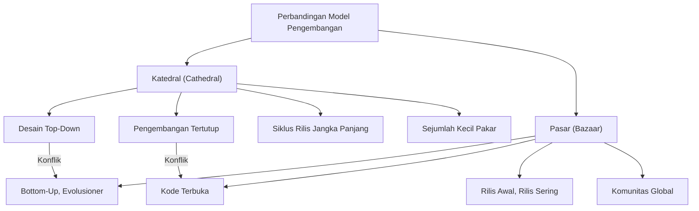
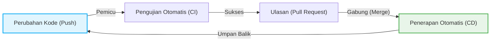

# Revolusi Sumber Terbuka dan "Katedral dan Pasar": Pergeseran Paradigma yang Mengubah Sejarah Pengembangan Perangkat Lunak

Dunia perangkat lunak telah mengalami evolusi dramatis dalam beberapa dekade terakhir. Salah satu perubahan paling penting dan mendasar adalah lahirnya dan populernya konsep "sumber terbuka" (open source). Saat ini, sebagian besar fondasi dari infrastruktur internet yang kita gunakan, ponsel cerdas, komputasi awan, hingga AI, didukung oleh perangkat lunak sumber terbuka (OSS).

Dalam artikel ini, kita akan menyelidiki inti dari revolusi sumber terbuka ini, dan mengeksplorasi secara mendalam dari berbagai perspektif—latar belakang sejarah, evolusi teknologi, dan dampaknya terhadap rekayasa perangkat lunak modern—tentang bagaimana esai monumental Eric S. Raymond, "The Cathedral and the Bazaar" (Katedral dan Pasar), secara radikal mengubah paradigma pengembangan perangkat lunak.

## 1. Fajar Perangkat Lunak dan Era "Katedral"

### Kebangkitan Perangkat Lunak Propietari

Pada masa-masa awal kelahiran komputer, perangkat lunak dan perangkat keras adalah satu kesatuan, dan konsep perdagangan komersial untuk perangkat lunak mandiri masih jarang. Namun, dari tahun 1970-an hingga 1980-an, raksasa teknologi seperti IBM membangun model bisnis "propietari" (eksklusif) di mana perangkat lunak dilindungi oleh hak cipta dan dijual dengan kode sumber yang dirahasiakan (sumber tertutup).

Model pengembangan perangkat lunak di era ini sangat terorganisir dan dikelola secara top-down. Sekelompok kecil pemrogram elit terpilih akan melakukan desain, implementasi, dan pengujian dalam lingkungan tertutup sesuai dengan rencana yang ketat.

### Karakteristik Model "Katedral"

Eric S. Raymond membandingkan gaya pengembangan perangkat lunak tradisional ini dengan pembangunan sebuah "Katedral".

*   **Desain Tersentralisasi**: Segelintir desainer jenius yang disebut arsitek menggambar gambaran besar, dan para pekerja melaksanakan tugas berdasarkan hal tersebut.
*   **Lingkungan Pengembangan Tertutup**: Kode sumber adalah rahasia perusahaan, dan pihak luar tidak mungkin terlibat dalam proses pengembangan.
*   **Siklus Rilis Jangka Panjang**: Bertujuan untuk produk yang sempurna, butuh waktu berbulan-bulan hingga bertahun-tahun untuk merilisnya.
*   **Penemuan dan Perbaikan Bug**: Karena hanya penguji internal terbatas yang mencari bug, penemuannya cenderung tertunda.

Model katedral ini rasional dalam lingkungan dengan sumber daya terbatas pada saat itu, dan menjadi kekuatan pendorong di balik sistem yang besar dan kompleks seperti Microsoft Windows dan UNIX komersial. Namun, pada saat yang sama, ini juga memperlambat laju inovasi dan menciptakan dinding tinggi antara pengembang dan pengguna.

## 2. Kehausan akan Kebebasan: Lahirnya Gerakan Perangkat Lunak Bebas

Ada seorang pemrogram yang merasakan krisis mendalam dalam menghadapi kebangkitan perangkat lunak propietari. Ia adalah Richard Stallman dari Laboratorium Kecerdasan Buatan Massachusetts Institute of Technology (MIT).

### Proyek GNU dan GPL

Stallman berargumen bahwa perangkat lunak harus didasarkan pada nilai universal kemanusiaan yaitu berbagi pengetahuan, dan setiap orang harus bebas untuk menggunakan, mempelajari, memodifikasi, dan mendistribusikannya kembali. Pada tahun 1983, ia meluncurkan "Proyek GNU" untuk mengembangkan sistem operasi yang sepenuhnya bebas dan kompatibel dengan UNIX.

Selanjutnya, untuk memberikan dukungan hukum pada filosofinya, ia merumuskan "GNU General Public License (GPL)". Fitur terbesar dari GPL adalah konsep yang disebut "Copyleft". Ini adalah batasan kuat yang mengharuskan perangkat lunak turunan yang dimodifikasi atau didistribusikan ulang dari perangkat lunak berlisensi GPL juga harus dirilis di bawah lisensi GPL yang sama, sehingga menciptakan mekanisme di mana kebebasan perangkat lunak dilestarikan secara permanen.

### Keterbatasan Perangkat Lunak Bebas

Ide-ide Stallman beresonansi dengan banyak peretas (hacker), menghasilkan alat-alat luar biasa seperti GCC (kompilator C) dan Emacs (editor teks). Namun, pengembangan kernel (GNU Hurd), yang merupakan inti dari sistem operasi lengkap, mengalami kesulitan, dan kamp perangkat lunak bebas jatuh ke dalam keadaan di mana "tubuh" hampir selesai, tetapi tidak memiliki "jantung".

## 3. Kejutan "Pasar": Kelahiran Linux

Pada tahun 1991, Linus Torvalds, seorang mahasiswa di Universitas Helsinki di Finlandia, merilis "Linux", sebuah kernel sistem operasi kecil yang ia kembangkan sebagai hobi, di newsgroup internet.

### Gaya Pengembangan yang Kacau

Linus mempublikasikan kode sumbernya dan meminta peretas di seluruh dunia, "Adakah yang bisa membantu?" Secara mengejutkan, banyak pengembang dari seluruh internet menanggapi panggilannya dan mulai mengirimkan tambalan (patch/kode perbaikan).

Linus memasukkan tambalan yang dikirimkan kepadanya dengan kecepatan tinggi dan merilis versi baru hampir setiap hari. Tidak ada desain awal yang ketat, dan tidak ada pembagian tugas yang jelas. Ini adalah gaya pengembangan yang sangat kacau dan tidak teratur di mana semua orang bebas memodifikasi dan meningkatkan bagian yang mereka minati.

### Mengapa Linux Sukses?

Menurut akal sehat rekayasa perangkat lunak tradisional (model Katedral), metode pengembangan yang tidak terencana dan terdistribusi seperti itu seharusnya menyebabkan kehancuran sistem. Namun, alih-alih runtuh, Linux tumbuh dengan kecepatan yang melampaui UNIX komersial dan mencapai stabilitas yang luar biasa.

Misteri ini dipecahkan oleh "The Cathedral and the Bazaar" karya Eric S. Raymond.

## 4. Eric S. Raymond dan "Katedral dan Pasar"

Pada tahun 1997, Raymond mempraktikkan model "Pasar" (Bazaar) Linux sendiri melalui proyek perangkat lunak bernama "Fetchmail" yang ia kembangkan, dan merangkum pengalaman dan analisisnya dalam sebuah esai berjudul "The Cathedral and the Bazaar".

Esai ini dengan sempurna mengartikulasikan dinamika pengembangan sumber terbuka dan memberikan dampak besar pada industri. Mari kita lihat beberapa hukum intinya.

### Prinsip Dasar Model Pasar

Raymond membandingkan model pasar dengan pasar Timur Tengah (bazaar), di mana beragam orang datang dan pergi serta berbagai transaksi terjadi secara bersamaan.

### Hukum Linus (Linus's Law)

Pepatah paling terkenal dalam "The Cathedral and the Bazaar" adalah "Hukum Linus": "**Given enough eyeballs, all bugs are shallow**" (Dengan mata yang cukup banyak, semua bug menjadi dangkal).

Dalam model Katedral, penemuan dan perbaikan bug berada di pundak sejumlah kecil pengembang dan penguji. Sebaliknya, dalam model Pasar, karena kode sumber bersifat publik, ribuan atau puluhan ribu pengguna di seluruh dunia membaca, menjalankan, dan melaporkan masalah pada kode tersebut. Wawasannya adalah bahwa dengan mengarahkan "mata" yang tak terhitung jumlahnya dengan pengetahuan dan latar belakang yang berbeda pada kode, bug serumit apa pun akan menjadi masalah yang mudah dipecahkan oleh seseorang.

### Rilis Awal, Rilis Sering (Release early. Release often.)

Dalam model Pasar, Anda tidak menunggu sampai semuanya sempurna; Anda merilis versi yang berfungsi meskipun tidak sempurna secara dini, dan memutar umpan balik dari pengguna. Ini mencegah arah pengembangan menyimpang dari kebutuhan pengguna yang sebenarnya dan mempertahankan semangat komunitas.

### Memperlakukan Pengguna sebagai Rekan Pengembang

"Memperlakukan pengguna Anda sebagai rekan pengembang adalah rute paling pasti menuju perbaikan kode yang cepat dan debugging yang efektif."
Dalam model Pasar, pengguna bukan sekadar "konsumen". Mereka adalah "rekan pengembang" yang melaporkan bug, terkadang menulis tambalan (patch), dan mengusulkan fitur baru. Seberapa baik Anda dapat mengeluarkan dan mengelola kekuatan komunitas ini akan menentukan keberhasilan atau kegagalan proyek.

## 5. Lahirnya Istilah "Sumber Terbuka" (Open Source)

Setelah publikasi "The Cathedral and the Bazaar", filosofinya mulai mempengaruhi dunia bisnis di luar komunitas peretas (hacker).

Pada tahun 1998, Netscape Communications, yang kalah dari Internet Explorer milik Microsoft di pasar browser web, membuat keputusan dramatis untuk merilis kode sumber browsernya (Netscape Communicator) sebagai upaya penyelamatan. Di balik keputusan ini adalah pengaruh dewan direksi yang telah membaca "The Cathedral and the Bazaar".

Dipicu oleh peristiwa ini, untuk menghilangkan nuansa politik dan ideologis (terutama penolakan dari dunia bisnis) yang melekat pada kata "Bebas" (Free) dari gerakan perangkat lunak bebas, sebuah nama baru yang lebih pragmatis dan ramah bisnis diusulkan. Yaitu "**Sumber Terbuka**" (Open Source).

Dengan didirikannya Open Source Initiative (OSI) dan ditetapkannya Definisi Sumber Terbuka (OSD), sumber terbuka mulai menyebar dengan cepat sebagai elemen penting dalam strategi TI perusahaan.

## 6. Pergeseran Paradigma yang Dibawa oleh Revolusi Sumber Terbuka

Revolusi sumber terbuka dan model pasar tidak hanya terbatas pada fakta bahwa "kode sumber dipublikasikan", tetapi juga membawa pergeseran paradigma yang tidak dapat diubah ke seluruh rekayasa perangkat lunak.

### Munculnya Sistem Kontrol Versi Terdistribusi (Git)

Model pasar, di mana pengembang di seluruh dunia mengubah kode secara asinkron dan terdistribusi, memiliki batasan jika menggunakan sistem kontrol versi terpusat tradisional (seperti CVS dan Subversion). Untuk mengatasi hal ini, Linus Torvalds sendiri mengembangkan "Git". Munculnya Git dan GitHub, yang menghostingnya, secara dramatis menurunkan hambatan terhadap pengembangan sumber terbuka dan menciptakan budaya baru "social coding" (pengodean sosial).

### Pengembangan Agile dan CI/CD

Filosofi model pasar "Rilis awal, Rilis sering" sangat terkait dengan pengembangan perangkat lunak Agile modern dan konsep DevOps. Memperbaiki perangkat lunak secara terus-menerus dalam iterasi singkat dan mengotomatiskan pengujian dan penerapan (deployment) melalui pipeline CI/CD (Continuous Integration/Continuous Delivery) dapat dilihat sebagai evolusi dari model pasar.

### Berdiri di Atas Bahu Raksasa

Saat ini, tidak ada pengembang yang membuat layanan atau aplikasi web baru sepenuhnya dari nol. Dengan berdiri di atas "bahu raksasa" sumber terbuka—seperti sistem operasi (Linux), server web (Apache, Nginx), database (MySQL, PostgreSQL), bahasa pemrograman, dan perpustakaan serta kerangka kerja dalam jumlah besar (React, TensorFlow, dll.)—pengembang kini dapat fokus pada penciptaan nilai inti bisnis mereka.

## 7. Pasar Modern: Masuknya Perusahaan dan Pembentukan Ekosistem

Bahkan Microsoft, yang pernah mengatakan "Sumber Terbuka adalah kanker," kini telah mengakuisisi GitHub dan menjadi salah satu penyumbang terbesar pada sumber terbuka. Raksasa teknologi besar seperti Google, Meta (Facebook), dan Amazon juga mengadopsi strategi merilis teknologi inti mereka (Kubernetes, React, PyTorch, dll.) sebagai sumber terbuka untuk memegang standar industri (standar de facto).

Pasar modern bukan lagi sekadar tempat bagi peretas sukarela murni. Ini telah berevolusi menjadi ekosistem yang besar dan kompleks, di mana insinyur profesional yang dibayar oleh perusahaan berkomitmen penuh waktu, dan yayasan yang kuat (seperti Linux Foundation dan Apache Software Foundation) mengelola tata kelola dan pendanaan proyek.

## 8. Tantangan dan Prospek Masa Depan

Namun, model pasar sumber terbuka juga tidak sempurna. Dalam beberapa tahun terakhir, beberapa tantangan serius telah muncul ke permukaan.

*   **Keletihan Pemelihara (Burnout)**: Banyak OSS penting dan banyak digunakan dipelihara oleh sekelompok kecil pemelihara yang tidak dibayar, dan beban mental serta ekonomi yang mereka tanggung telah mencapai batasnya.
*   **Serangan Rantai Pasokan (Supply Chain Attack)**: Seiring semakin kompleksnya dependensi perangkat lunak, risiko serangan yang mengeksploitasi kerentanan OSS (seperti kerentanan Log4j) yang menyebabkan dampak besar pada infrastruktur sosial semakin meningkat.
*   **Ketidakseimbangan Pendanaan**: Sementara ada perusahaan yang menghasilkan keuntungan besar menggunakan sumber terbuka, masalah "penumpang gratis" (free rider) di mana keuntungan tidak didistribusikan kembali ke pengembang yang membangun fondasinya masih belum terpecahkan.

Untuk mengatasi tantangan ini, model keberlanjutan baru sedang dieksplorasi, seperti mekanisme dukungan finansial seperti GitHub Sponsors, mempekerjakan pengembang OSS secara langsung oleh perusahaan, dan mendukung audit keamanan oleh lembaga pemerintah.

## Kesimpulan

Pandangan dunia yang diajukan oleh "The Cathedral and the Bazaar" melampaui batas-batas kode perangkat lunak dan telah menyebar ke berbagai bidang, seperti berbagi pengetahuan seperti Wikipedia, data terbuka, dan bahkan perangkat keras terbuka serta sains terbuka.

Dari "Katedral" yang top-down menuju "Pasar" yang terdistribusi dan otonom. Revolusi sumber terbuka ini dapat dikatakan sebagai salah satu eksperimen sosial paling sukses bagi umat manusia dalam menciptakan pengetahuan dan teknologi secara kolaboratif. Kita masih berdiri di tengah-tengah pasar raksasa yang terus berevolusi hingga saat ini.
