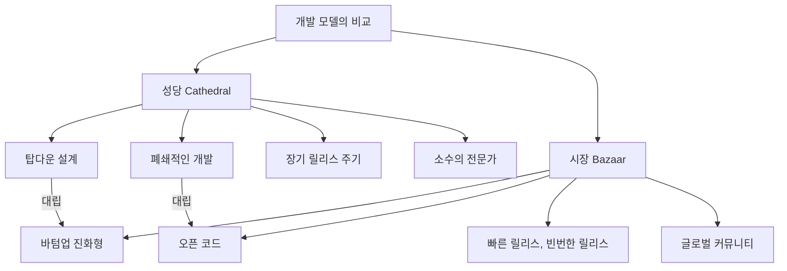
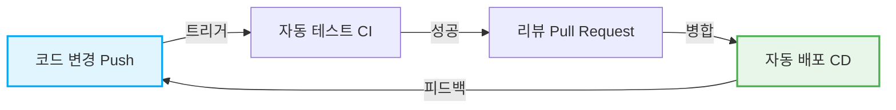

# 오픈소스 혁명과 "성당과 시장": 소프트웨어 개발의 역사를 바꾼 패러다임 전환

소프트웨어의 세계는 지난 수십 년 동안 극적인 진화를 이룩했습니다. 그 중에서도 가장 중요하고 근본적인 변화 중 하나가 '오픈소스'라는 개념의 탄생과 그 보급입니다. 오늘날 우리가 이용하고 있는 인터넷의 인프라, 스마트폰, 클라우드 컴퓨팅, 그리고 AI에 이르기까지 그 기반의 대부분은 오픈소스 소프트웨어(OSS)에 의해 지탱되고 있습니다.

본 기사에서는 이 오픈소스 혁명의 핵심에 다가가, 에릭 S. 레이먼드(Eric S. Raymond)의 기념비적 에세이 『성당과 시장(The Cathedral and the Bazaar)』이 어떻게 소프트웨어 개발의 패러다임을 근본적으로 뒤집었는지를 역사적 배경, 기술적 진화, 그리고 현대 소프트웨어 엔지니어링에 미친 영향이라는 다각적인 시점에서 깊이 파헤쳐 봅니다.

## 1. 소프트웨어 여명기와 '성당'의 시대

### 독점 소프트웨어의 대두

컴퓨터가 탄생한 초기에는 소프트웨어와 하드웨어가 일체형이었으며, 소프트웨어 단독으로 상거래를 한다는 개념은 희박했습니다. 그러나 1970년대부터 1980년대에 걸쳐 IBM을 비롯한 거대 기술 기업들이 소프트웨어를 저작권으로 보호하고 소스 코드를 비공개(클로즈드)로 판매하는 '독점적(프로프라이어터리)'인 비즈니스 모델을 확립했습니다.

이 시대의 소프트웨어 개발 모델은 고도로 조직화되어 탑다운으로 관리되는 것이었습니다. 소수의 선택받은 엘리트 프로그래머들이 닫힌 환경에서 설계부터 구현, 테스트까지 엄격한 계획에 따라 진행하는 스타일입니다.

### '성당(Cathedral)' 모델의 특징

에릭 S. 레이먼드는 이 전통적인 소프트웨어 개발 스타일을 '성당' 건설에 비유했습니다.

*   **중앙집권적인 설계**: 아키텍트라 불리는 일부 천재적인 설계자가 전체 그림을 그리고, 그에 따라 노동자가 작업을 진행한다.
*   **폐쇄적인 개발 환경**: 소스 코드는 사외 기밀이며, 외부인이 개발 프로세스에 관여하는 것은 불가능하다.
*   **장기적인 릴리스 주기**: 완벽한 제품을 목표로 하기 때문에 릴리스까지 수개월에서 수년이라는 긴 시간이 소요된다.
*   **버그 발견과 수정**: 내부의 제한된 테스터만이 버그를 찾기 때문에 발견이 늦어지기 쉽다.

이 성당 모델은 당시 자원이 제한된 환경 하에서는 합리적이었으며, Microsoft Windows나 상용 UNIX 등의 거대하고 복잡한 시스템을 만들어내는 원동력이 되었습니다. 그러나 동시에 혁신의 속도를 둔화시키고, 개발자와 사용자 사이에 높은 벽을 만드는 결과도 초래했습니다.

## 2. 자유에 대한 갈망: 자유 소프트웨어 운동의 탄생

독점 소프트웨어의 대두에 대해 강한 위기감을 느낀 한 프로그래머가 있었습니다. 매사추세츠 공과대학교(MIT) 인공지능 연구소에 소속되어 있던 리처드 스톨만(Richard Stallman)입니다.

### GNU 프로젝트와 GPL

스톨만은 소프트웨어가 지식의 공유라는 인류의 보편적인 가치에 기반해야 하며, 누구나 자유롭게 사용하고, 연구하고, 수정하고, 재배포할 수 있어야 한다고 주장했습니다. 그는 1983년에 'GNU 프로젝트'를 출범시키고, 완전히 자유로운 UNIX 호환 운영 체제의 개발에 착수했습니다.

나아가 그의 이념을 법적으로 뒷받침하기 위해 'GNU 일반 공중 사용 허가서(GPL: GNU General Public License)'를 제정했습니다. GPL의 가장 큰 특징은 '카피레프트(Copyleft)'라고 불리는 개념입니다. 이는 GPL로 공개된 소프트웨어를 수정·재배포할 경우 그 파생물도 동일한 GPL 라이선스로 공개해야 한다는 강력한 제약으로, 소프트웨어의 자유가 영구적으로 유지되는 구조를 만들어냈습니다.

### 자유 소프트웨어의 한계

스톨만의 사상은 많은 해커들의 공감을 불러일으켜 GCC(C 컴파일러)나 Emacs(텍스트 편집기)와 같은 뛰어난 도구를 탄생시켰습니다. 그러나 완전한 OS의 핵심이 되는 커널(GNU Hurd)의 개발은 난항을 겪었고, 자유 소프트웨어 진영은 '몸'은 완성되어 가는데 '심장'이 없는 상태에 빠져 있었습니다.

## 3. '시장'의 충격: Linux의 탄생

1991년, 핀란드 헬싱키 대학교의 학생이었던 리누스 토발즈(Linus Torvalds)가 취미로 개발한 작은 OS 커널 'Linux'를 인터넷 뉴스그룹에 공개했습니다.

### 혼돈스러운 개발 스타일

리누스는 자신의 소스 코드를 공개하고, "누가 도와주지 않겠는가?"라며 전 세계 해커들에게 호소했습니다. 놀랍게도 인터넷을 통해 수많은 개발자들이 이 호소에 응답하여 패치(수정 코드)를 보내기 시작했습니다.

리누스는 보내온 패치를 맹렬한 기세로 도입하여 매일같이 새로운 버전을 릴리스했습니다. 사전의 엄밀한 설계도도 없었고, 누가 무엇을 담당할지에 대한 명확한 할당도 없었습니다. 누구나 자신이 관심 있는 부분을 멋대로 수정하고 개선해 나가는 극히 무질서하고 혼돈스러운 개발 스타일이었습니다.

### 왜 Linux는 성공했는가?

기존 소프트웨어 공학의 상식(성당 모델)에 따르면, 이처럼 무계획적이고 분산된 개발 방식은 시스템의 붕괴를 초래할 터였습니다. 그러나 Linux는 붕괴하기는커녕 상용 UNIX를 능가할 정도의 속도로 성장하며 경이로운 안정성을 획득해 나갔습니다.

이 수수께끼를 풀어낸 것이 에릭 S. 레이먼드의 『성당과 시장』입니다.

## 4. 에릭 S. 레이먼드와 『성당과 시장』

1997년, 레이먼드는 자신이 개발한 'Fetchmail'이라는 소프트웨어 프로젝트를 통해 Linux의 '시장(Bazaar)' 모델을 직접 실천하고, 그 경험과 분석을 『성당과 시장』이라는 에세이로 정리했습니다.

이 에세이는 오픈소스 개발의 역학을 훌륭하게 언어화하여 업계에 지대한 충격을 주었습니다. 그 핵심이 되는 몇 가지 법칙을 살펴보겠습니다.

### 시장 모델의 기본 원칙

레이먼드는 시장 모델을 잡다한 사람들이 오가며 다양한 거래가 동시다발적으로 이루어지는 중동의 시장(Bazaar)에 비유했습니다.

### 리누스의 법칙(Linus's Law)

『성당과 시장』에서 가장 유명한 격언이 "**눈알이 충분히 많으면 모든 버그는 얕다(Given enough eyeballs, all bugs are shallow)**"라는 '리누스의 법칙'입니다.

성당 모델에서는 버그 발견과 수정이 소수의 개발자와 테스터의 어깨에 달려 있습니다. 반면 시장 모델에서는 소스 코드가 공개되어 있기 때문에 전 세계 수천, 수만의 사용자가 코드를 읽고, 실행하고, 문제를 보고합니다. 서로 다른 지식이나 배경을 가진 무수한 '눈알'이 코드를 향하게 됨으로써, 아무리 복잡한 버그라도 누군가에게는 쉽게 해결할 수 있는 문제가 된다는 통찰입니다.

### 빠른 릴리스, 빈번한 릴리스(Release early. Release often.)

시장 모델에서는 완벽한 상태가 될 때까지 기다리는 것이 아니라, 불완전하더라도 동작하는 것을 빨리 릴리스하여 사용자로부터 피드백 루프를 돌립니다. 이를 통해 개발 방향성이 사용자의 진정한 니즈에서 벗어나는 것을 막고, 커뮤니티의 열기를 계속 유지할 수 있습니다.

### 사용자를 공동 개발자로 대우하라

"사용자를 공동 개발자로 대우하는 것은 코드의 빠른 개선과 효과적인 디버깅으로 가는 가장 확실한 길이다."
시장 모델에서 사용자는 단순한 '소비자'가 아닙니다. 그들은 버그를 보고하고, 때로는 수정 패치를 작성하며, 새로운 기능을 제안하는 '공동 개발자'입니다. 이 커뮤니티의 힘을 어떻게 끌어내고 매니지먼트하느냐가 프로젝트의 성패를 가릅니다.

## 5. '오픈소스'라는 단어의 탄생

『성당과 시장』이 발표된 후, 그 사상은 일부 해커 커뮤니티를 넘어 비즈니스 세계에도 영향을 미치기 시작했습니다.

1998년, 웹 브라우저 시장에서 Microsoft의 Internet Explorer에 패배해 가던 Netscape Communications사는 기사회생의 한 수로 자사 브라우저(Netscape Communicator)의 소스 코드를 공개한다는 극적인 결단을 내립니다. 이 결단의 배경에는 『성당과 시장』을 읽은 경영진의 감화가 있었습니다.

이 사건을 계기로 자유 소프트웨어 운동의 '자유(Free)'라는 단어가 가지는 정치적·이데올로기적 뉘앙스(특히 비즈니스계로부터의 거부 반응)를 불식시키기 위해, 보다 실용주의적이고 비즈니스 친화적인 새로운 명칭이 제안되었습니다. 그것이 바로 '**오픈소스(Open Source)**'입니다.

오픈소스 이니셔티브(OSI)가 설립되고 오픈소스의 정의(OSD)가 제정되면서, 오픈소스는 기업의 IT 전략에 불가결한 요소로서 급속히 보급되어 가게 됩니다.

## 6. 오픈소스 혁명이 가져온 패러다임 전환

오픈소스 혁명과 시장 모델은 단순히 '소스 코드가 공개되어 있다'는 사실에 머물지 않고, 소프트웨어 엔지니어링 전체에 비가역적인 패러다임 전환을 가져왔습니다.

### 분산 버전 관리 시스템(Git)의 등장

전 세계 개발자가 비동기적이고 분산되어 코드를 변경하는 시장 모델은 기존의 중앙집중형 버전 관리 시스템(CVS나 Subversion)으로는 한계가 있었습니다. 이를 해결하기 위해 리누스 토발즈가 직접 개발한 것이 'Git'입니다. Git과 이를 호스팅하는 GitHub의 등장은 오픈소스 개발의 진입 장벽을 극적으로 낮추고, '소셜 코딩'이라는 새로운 문화를 낳았습니다.

### 애자일 개발과 CI/CD

"빠른 릴리스, 빈번한 릴리스"라는 시장 모델의 철학은 현대의 애자일 소프트웨어 개발이나 DevOps 사상과 깊이 연결되어 있습니다. 짧은 이터레이션으로 소프트웨어를 지속적으로 개선하고, CI/CD(지속적 통합/지속적 배포) 파이프라인을 통해 자동으로 테스트하고 배포하는 방식은 시장 모델의 진화형이라고 할 수 있습니다.

### 거인의 어깨 위에 서다

오늘날 새로운 웹 서비스나 애플리케이션을 처음부터 모두 직접 만드는 개발자는 없습니다. 운영 체제(Linux), 웹 서버(Apache, Nginx), 데이터베이스(MySQL, PostgreSQL), 프로그래밍 언어, 그리고 방대한 수의 라이브러리나 프레임워크(React, TensorFlow 등)와 같은 오픈소스라는 '거인의 어깨' 위에 섬으로써, 개발자는 비즈니스의 핵심 가치 창출에 집중할 수 있게 되었습니다.

## 7. 현대의 시장: 기업의 참여와 생태계의 형성

한때 "오픈소스는 암이다"라고까지 발언했던 Microsoft조차 현재는 GitHub를 인수하고 오픈소스에 가장 크게 기여하는 기업 중 하나가 되었습니다. Google, Meta(Facebook), Amazon 등의 거대 기술 기업들도 자사의 기반 기술(Kubernetes, React, PyTorch 등)을 오픈소스로 공개하여 업계 표준(디팩토 스탠더드)을 쥐는 전략을 취하고 있습니다.

현대의 시장은 더 이상 순수한 자원봉사 해커들만의 장소가 아닙니다. 기업으로부터 보수를 받는 프로 엔지니어들이 풀타임으로 커밋하고, 강력한 재단(Linux Foundation이나 Apache Software Foundation 등)이 프로젝트의 거버넌스와 자금을 관리하는 거대하고 복잡한 생태계로 진화하고 있습니다.

## 8. 과제와 미래 전망

그러나 오픈소스의 시장 모델도 완벽하지는 않습니다. 최근 몇 가지 심각한 과제가 부각되고 있습니다.

*   **메인테이너의 번아웃 증후군**: 널리 사용되는 중요한 OSS라 하더라도 소수의 무급 메인테이너에 의해 근근이 유지되는 경우가 많으며, 이들에 대한 정신적·경제적 부담이 한계에 달하고 있습니다.
*   **공급망 공격**: 소프트웨어의 의존 관계가 복잡해지는 가운데, OSS의 취약점을 노린 공격(Log4j 취약점 등)이 사회 인프라에 막대한 영향을 미칠 위험이 높아지고 있습니다.
*   **자금 지원의 불균형**: 오픈소스를 이용해 막대한 이익을 올리는 기업이 있는 반면, 그 기반을 만드는 개발자에게 이익이 환원되지 않는다는 '무임승차 문제'가 해결되지 않고 있습니다.

이러한 과제에 대해 GitHub Sponsors와 같은 자금 지원 시스템이나 기업의 OSS 개발자 직접 고용, 정부 기관의 보안 감사 지원 등 새로운 지속 가능성 모델이 모색되고 있습니다.

## 맺음말

『성당과 시장』이 제창한 세계관은 소프트웨어 코드라는 틀을 넘어, 위키백과(Wikipedia)와 같은 지식의 공유, 오픈 데이터, 나아가 오픈 하드웨어나 오픈 사이언스와 같은 폭넓은 분야로 파급되고 있습니다.

탑다운의 '성당'에서 자율 분산형의 '시장'으로. 이 오픈소스 혁명은 인류가 지식과 기술을 협조하여 만들어내기 위한 가장 성공적인 사회 실험 중 하나라고 할 수 있을 것입니다. 우리는 지금도 끊임없이 진화하는 거대한 시장의 한가운데 서 있는 것입니다.
