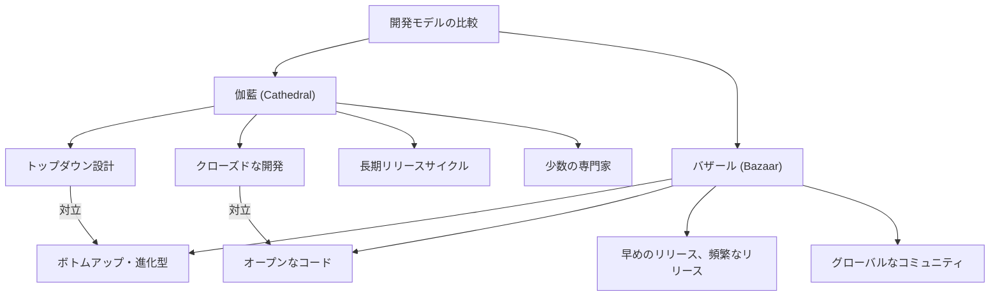
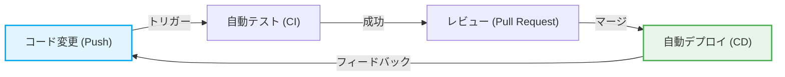

# オープンソース革命と「伽藍とバザール」：ソフトウェア開発の歴史を変えたパラダイムシフト

ソフトウェアの世界は、過去数十年で劇的な進化を遂げました。その中でも最も重要かつ根本的な変化の一つが「オープンソース」という概念の誕生とその普及です。今日、私たちが利用しているインターネットのインフラストラクチャ、スマートフォン、クラウドコンピューティング、そしてAIに至るまで、その基盤の大部分はオープンソースソフトウェア（OSS）によって支えられています。

本記事では、このオープンソース革命の核心に迫り、エリック・S・レイモンド（Eric S. Raymond）による記念碑的エッセイ『伽藍とバザール（The Cathedral and the Bazaar）』がどのようにしてソフトウェア開発のパラダイムを根底から覆したのかを、歴史的背景、技術的進化、そして現代のソフトウェアエンジニアリングへの影響という多角的な視点から深く掘り下げていきます。

## 1. ソフトウェア黎明期と「伽藍」の時代

### プロプライエタリ・ソフトウェアの台頭

コンピュータが誕生した初期の頃、ソフトウェアとハードウェアは一体のものであり、ソフトウェア単体での商取引という概念は希薄でした。しかし、1970年代から1980年代にかけて、IBMをはじめとする巨大テック企業がソフトウェアを著作権で保護し、ソースコードを非公開（クローズド）にして販売する「プロプライエタリ（独占的）」なビジネスモデルを確立しました。

この時代のソフトウェア開発モデルは、高度に組織化され、トップダウンで管理されるものでした。少数の選ばれたエリートプログラマーたちが、閉ざされた環境で設計から実装、テストまでを厳格な計画に従って行うスタイルです。

### 「伽藍（Cathedral）」モデルの特徴

エリック・S・レイモンドは、この伝統的なソフトウェア開発のスタイルを「伽藍（大聖堂）」の建設に例えました。

*   **中央集権的な設計**: アーキテクトと呼ばれる一部の天才的な設計者が全体像を描き、それに従って労働者が作業を進める。
*   **閉鎖的な開発環境**: ソースコードは社外秘であり、部外者が開発プロセスに関与することは不可能。
*   **長期的なリリースサイクル**: 完璧な製品を目指すため、リリースまでに数ヶ月から数年という長い期間を要する。
*   **バグの発見と修正**: 内部の限られたテスターのみがバグを探すため、発見が遅れがちになる。

この伽藍モデルは、当時のリソースが限られた環境下では合理的であり、Microsoft Windowsや商用UNIXなどの巨大で複雑なシステムを生み出す原動力となりました。しかし同時に、イノベーションの速度を鈍化させ、開発者とユーザーの間に高い壁を作る結果にもなりました。

## 2. 自由への渇望：フリーソフトウェア運動の誕生

プロプライエタリ・ソフトウェアの台頭に対し、強い危機感を抱いた一人のプログラマーがいました。マサチューセッツ工科大学（MIT）人工知能研究所に所属していたリチャード・ストールマン（Richard Stallman）です。

### GNUプロジェクトとGPL

ストールマンは、ソフトウェアは知識の共有という人類の普遍的な価値に基づくべきであり、誰もが自由に使い、研究し、改変し、再配布できるべきだと主張しました。彼は1983年に「GNUプロジェクト」を立ち上げ、完全に自由なUNIX互換オペレーティングシステムの開発に着手しました。

さらに、彼の理念を法的に裏付けるため、「GNU一般公衆利用許諾書（GPL: GNU General Public License）」を策定しました。GPLの最大の特徴は「コピーレフト（Copyleft）」と呼ばれる概念です。これは、GPLで公開されたソフトウェアを改変・再配布する場合、その派生物も同じGPLライセンスで公開しなければならないという強力な制約であり、ソフトウェアの自由が永続的に保たれる仕組みを作り出しました。

### フリーソフトウェアの限界

ストールマンの思想は多くのハッカーたちの共感を呼び、GCC（Cコンパイラ）やEmacs（テキストエディタ）といった優れたツールを生み出しました。しかし、完全なOSの中核となるカーネル（GNU Hurd）の開発は難航し、フリーソフトウェア陣営は「体」は完成しつつあるのに「心臓」がない状態に陥っていました。

## 3. 「バザール」の衝撃：Linuxの誕生

1991年、フィンランドのヘルシンキ大学の学生であったリーナス・トーバルズ（Linus Torvalds）が、趣味で開発した小さなOSカーネル「Linux」をインターネット上のニュースグループで公開しました。

### 混沌とした開発スタイル

リーナスは、自分のソースコードを公開し、「誰か手伝ってくれないか？」と世界中のハッカーに呼びかけました。驚くべきことに、インターネットを通じて多数の開発者がこの呼びかけに応じ、パッチ（修正コード）を送り始めました。

リーナスは、送られてきたパッチを猛烈な勢いで取り込み、毎日のように新しいバージョンをリリースしました。事前の厳密な設計図はなく、誰が何を担当するかの明確な割り当てもありません。誰もが自分の興味のある部分を勝手にいじり、改善していくという、極めて無秩序でカオスな開発スタイルでした。

### なぜLinuxは成功したのか？

従来のソフトウェア工学の常識（伽藍モデル）からすれば、このような無計画で分散した開発手法は、システムの崩壊を招くはずでした。しかし、Linuxは崩壊するどころか、商用UNIXを凌駕するほどのスピードで成長し、驚異的な安定性を獲得していきました。

この謎を解き明かしたのが、エリック・S・レイモンドの『伽藍とバザール』です。

## 4. エリック・S・レイモンドと『伽藍とバザール』

1997年、レイモンドは自身が開発した「Fetchmail」というソフトウェアのプロジェクトを通じて、Linuxの「バザール（Bazaar）」モデルを自ら実践し、その経験と分析を『伽藍とバザール』というエッセイにまとめました。

このエッセイは、オープンソース開発の力学を見事に言語化し、業界に多大な衝撃を与えました。その中核となるいくつかの法則を見ていきましょう。

### バザールモデルの基本原則

レイモンドはバザールモデルを、雑多な人々が行き交い、様々な取引が同時多発的に行われる中東の市場（バザール）に例えました。

### リーナスの法則（Linus's Law）

『伽藍とバザール』の中で最も有名な格言が「**目さえ十分にあれば、すべてのバグは浅い（Given enough eyeballs, all bugs are shallow）**」という「リーナスの法則」です。

伽藍モデルでは、バグの発見と修正は少数の開発者とテスターの肩にかかっています。一方バザールモデルでは、ソースコードが公開されているため、世界中の何千、何万というユーザーがコードを読み、実行し、問題を報告します。異なる知識や背景を持つ無数の「目」がコードに向けられることで、どんなに複雑なバグも誰かにとっては簡単に解決できる問題になる、という洞察です。

### 早めのリリース、頻繁なリリース（Release early. Release often.）

バザールモデルでは、完璧な状態になるまで待つのではなく、不完全でも動くものを早くリリースし、ユーザーからのフィードバックをループさせます。これにより、開発の方向性がユーザーの真のニーズから逸れるのを防ぎ、コミュニティの熱量を維持し続けることができます。

### ユーザーを共同開発者として扱う

「ユーザーを共同開発者として扱うことは、コードの高速な改良と効果的なデバッグへの最も確実な道である。」
バザールモデルにおいて、ユーザーは単なる「消費者」ではありません。彼らはバグを報告し、時には修正パッチを書き、新機能を提案する「共同開発者」です。このコミュニティの力をいかに引き出し、マネジメントするかが、プロジェクトの成否を分けます。

## 5. 「オープンソース」という言葉の誕生

『伽藍とバザール』が発表された後、その思想は一部のハッカーコミュニティを超えて、ビジネスの世界にも影響を与え始めました。

1998年、Webブラウザ市場でMicrosoftのInternet Explorerに敗れつつあったNetscape Communications社は、起死回生の一手として自社のブラウザ（Netscape Communicator）のソースコードを公開するという劇的な決断を下します。この決断の背後には、『伽藍とバザール』を読んだ経営陣の感化がありました。

この出来事を契機として、フリーソフトウェア運動の「自由（Free）」という言葉が持つ政治的・イデオロギー的なニュアンス（特にビジネス界からの拒絶反応）を払拭するため、より実用主義的でビジネスフレンドリーな新しい呼称が提案されました。それが「**オープンソース（Open Source）**」です。

オープンソース・イニシアティブ（OSI）が設立され、オープンソースの定義（OSD）が定められたことで、オープンソースは企業のIT戦略に不可欠な要素として急速に普及していくことになります。

## 6. オープンソース革命がもたらしたパラダイムシフト

オープンソース革命とバザールモデルは、単に「ソースコードが公開されている」という事実にとどまらず、ソフトウェアエンジニアリング全体に不可逆的なパラダイムシフトをもたらしました。

### 分散バージョン管理システム（Git）の登場

世界中の開発者が非同期かつ分散してコードを変更するバザールモデルは、従来の集中型バージョン管理システム（CVSやSubversion）では限界がありました。これを解決するためにリーナス・トーバルズ自らが開発したのが「Git」です。GitとそれをホスティングするGitHubの登場は、オープンソース開発のハードルを劇的に下げ、「ソーシャルコーディング」という新しい文化を生み出しました。

### アジャイル開発とCI/CD

「早めのリリース、頻繁なリリース」というバザールモデルの哲学は、現代のアジャイルソフトウェア開発やDevOpsの思想と深く結びついています。短いイテレーションでソフトウェアを継続的に改善し、[CI/CD](/p/cicd-pipeline-github-actions-best-practices/)（継続的インテグレーション／継続的デリバリー）パイプラインを通じて自動的にテスト・デプロイする手法は、バザールモデルの進化形と言えます。

### 巨人の肩の上に立つ

今日、新しいWebサービスやアプリケーションをゼロから全て自作する開発者はいません。オペレーティングシステム（Linux）、Webサーバー（Apache, Nginx）、データベース（MySQL, PostgreSQL）、プログラミング言語、そして膨大な数のライブラリやフレームワーク（React, TensorFlowなど）といったオープンソースの「巨人の肩」の上に立つことで、開発者はビジネスのコアバリューの創造に集中できるようになりました。

## 7. 現代のバザール：企業の参入とエコシステムの形成

かつて「オープンソースは癌である」とまで発言したMicrosoftでさえ、現在ではGitHubを買収し、オープンソースの最大の貢献企業の一つとなっています。Google、[Meta](/p/history-of-meta-facebook/)（Facebook）、Amazonなどの巨大テック企業も、自社の基盤技術（[Kubernetes](/p/kubernetes-k8s-architecture-pod-service-ingress/)、React、PyTorchなど）をオープンソースとして公開し、業界標準（デファクトスタンダード）を握る戦略をとっています。

現代のバザールは、もはや純粋なボランティアのハッカーたちだけの場所ではありません。企業から報酬を得ているプロのエンジニアたちがフルタイムでコミットし、強力な財団（Linux FoundationやApache Software Foundationなど）がプロジェクトのガバナンスと資金を管理する、巨大で複雑なエコシステムへと進化しています。

## 8. 課題と未来展望

しかし、オープンソースのバザールモデルも完璧ではありません。近年、いくつかの深刻な課題が浮き彫りになっています。

*   **メンテナの燃え尽き症候群（バーンアウト）**: 広く使われている重要なOSSであっても、少数の無給のメンテナによって細々と維持されているケースが多く、彼らへの精神的・経済的負担が限界に達しています。
*   **サプライチェーン攻撃**: ソフトウェアの依存関係が複雑化する中、OSSの脆弱性を突いた攻撃（Log4jの脆弱性など）が社会インフラに甚大な影響を与えるリスクが高まっています。
*   **資金提供の不均衡**: オープンソースを利用して莫大な利益を上げる企業がいる一方で、その基盤を作っている開発者に利益が還元されないという「フリーライダー問題」が解決されていません。

これらの課題に対し、GitHub Sponsorsのような資金援助の仕組みや、企業によるOSS開発者への直接雇用、政府機関によるセキュリティ監査の支援など、新しい持続可能性（サステナビリティ）のモデルが模索されています。

## おわりに

『伽藍とバザール』が提唱した世界観は、ソフトウェアのコードという枠を越え、ウィキペディア（Wikipedia）のような知識の共有、オープンデータ、さらにはオープンハードウェアやオープンサイエンスといった幅広い分野に波及しています。

トップダウンの「伽藍」から、自律分散型の「バザール」へ。このオープンソース革命は、人類が知識とテクノロジーを協調して生み出すための、最も成功した社会実験の一つと言えるでしょう。私たちは今も、進化し続ける巨大なバザールの真っ只中に立っているのです。
