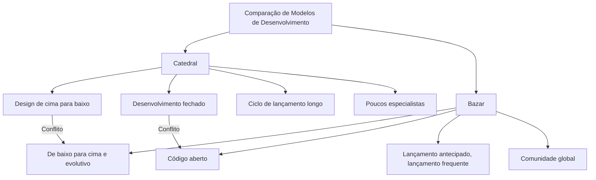
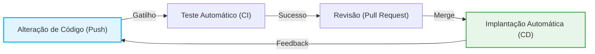

# A Revolução do Código Aberto e "A Catedral e o Bazar": Uma Mudança de Paradigma que Alterou a História do Desenvolvimento de Software

O mundo do software passou por uma evolução dramática nas últimas décadas. Uma das mudanças mais importantes e fundamentais entre elas é o nascimento e a popularização do conceito de "código aberto". Hoje, a infraestrutura da Internet, os smartphones, a computação em nuvem e até mesmo a IA que usamos baseiam-se em grande parte no software de código aberto (OSS).

Neste artigo, aprofundaremos no núcleo desta revolução do código aberto e em como o ensaio monumental de Eric S. Raymond, "A Catedral e o Bazar" (The Cathedral and the Bazaar), alterou fundamentalmente o paradigma do desenvolvimento de software, a partir de múltiplas perspectivas: contexto histórico, evolução tecnológica e impacto na engenharia de software moderna.

## 1. Os Primórdios do Software e a Era da "Catedral"

### A Ascensão do Software Proprietário

Nos primórdios dos computadores, hardware e software eram uma coisa só, e a ideia de comercializar apenas software era fraca. No entanto, entre as décadas de 1970 e 1980, as gigantes da tecnologia, incluindo a IBM, estabeleceram um modelo de negócios "proprietário" (exclusivo), protegendo o software com direitos autorais e vendendo-o com o código-fonte fechado (closed source).

O modelo de desenvolvimento de software dessa época era altamente organizado e gerido de cima para baixo. Um pequeno grupo de programadores de elite selecionados realizava desde o design até a implementação e testes em um ambiente fechado, seguindo um plano rigoroso.

### Características do Modelo da "Catedral"

Eric S. Raymond comparou esse estilo tradicional de desenvolvimento de software à construção de uma "catedral".

*   **Design centralizado**: Alguns designers geniais, chamados de arquitetos, desenham o quadro geral, e os trabalhadores executam a tarefa de acordo com isso.
*   **Ambiente de desenvolvimento fechado**: O código-fonte é um segredo da empresa, e é impossível para quem é de fora se envolver no processo de desenvolvimento.
*   **Ciclos de lançamento longos**: Leva muito tempo, de meses a anos, para lançar, a fim de buscar um produto perfeito.
*   **Descoberta e correção de bugs**: Como apenas um número limitado de testadores internos procura bugs, a descoberta tende a ser atrasada.

Esse modelo de catedral era racional no ambiente de recursos limitados da época e foi a força motriz para a criação de sistemas enormes e complexos, como o Microsoft Windows e o UNIX comercial. Mas, ao mesmo tempo, retardou o ritmo da inovação e criou uma barreira alta entre desenvolvedores e usuários.

## 2. A Sede por Liberdade: O Nascimento do Movimento de Software Livre

Havia um programador que sentia uma forte sensação de crise em relação à ascensão do software proprietário. Tratava-se de Richard Stallman, do Laboratório de Inteligência Artificial do Instituto de Tecnologia de Massachusetts (MIT).

### O Projeto GNU e a GPL

Stallman argumentava que o software deveria ser baseado no valor universal humano do compartilhamento de conhecimento e que qualquer pessoa deveria poder usá-lo, estudá-lo, modificá-lo e redistribuí-lo livremente. Em 1983, ele lançou o "Projeto GNU" e começou a desenvolver um sistema operacional totalmente livre e compatível com UNIX.

Além disso, para apoiar legalmente sua filosofia, ele criou a "Licença Pública Geral GNU" (GPL: GNU General Public License). A maior característica da GPL é o conceito chamado "Copyleft". É uma restrição poderosa de que, se você modificar e redistribuir software lançado sob a GPL, seus derivados também devem ser lançados sob a mesma licença GPL, criando um mecanismo para que a liberdade do software seja mantida permanentemente.

### Os Limites do Software Livre

As ideias de Stallman ressoaram com muitos hackers e produziram excelentes ferramentas como o GCC (compilador C) e o Emacs (editor de texto). No entanto, o desenvolvimento do kernel (GNU Hurd), que seria o núcleo de um SO completo, encontrou dificuldades, e o grupo do software livre se viu em uma situação em que o "corpo" estava sendo concluído, mas faltava o "coração".

## 3. O Impacto do "Bazar": O Nascimento do Linux

Em 1991, Linus Torvalds, um estudante da Universidade de Helsinque na Finlândia, publicou o "Linux", um pequeno kernel de SO que ele desenvolveu por hobby, em um grupo de notícias na Internet.

### Um Estilo de Desenvolvimento Caótico

Linus publicou seu código-fonte e perguntou a hackers de todo o mundo: "Alguém pode me ajudar?". Surpreendentemente, um grande número de desenvolvedores respondeu a esse chamado pela Internet e começou a enviar patches (códigos de correção).

Linus incorporou os patches enviados em um ritmo frenético, lançando novas versões quase todos os dias. Não havia nenhum plano prévio rigoroso, nem havia atribuições claras sobre quem seria responsável pelo quê. Era um estilo de desenvolvimento extremamente desordenado e caótico, no qual todos mexiam e melhoravam livremente as partes em que estavam interessados.

### Por que o Linux Teve Sucesso?

De acordo com o senso comum da engenharia de software tradicional (modelo da catedral), um método de desenvolvimento tão não planejado e distribuído deveria ter levado ao colapso do sistema. No entanto, em vez de entrar em colapso, o Linux cresceu a uma velocidade que superou o UNIX comercial, ganhando uma estabilidade surpreendente.

O que desvendou esse mistério foi "A Catedral e o Bazar", de Eric S. Raymond.

## 4. Eric S. Raymond e "A Catedral e o Bazar"

Em 1997, por meio de um projeto de software que ele mesmo desenvolveu chamado "Fetchmail", Raymond praticou pessoalmente o modelo "bazar" do Linux e resumiu sua experiência e análise no ensaio "A Catedral e o Bazar".

Este ensaio expressou de forma brilhante a dinâmica do desenvolvimento de código aberto e teve um impacto tremendo na indústria. Vejamos alguns de seus princípios fundamentais.

### Princípios Básicos do Modelo de Bazar

Raymond comparou o modelo de bazar a um mercado (bazar) no Oriente Médio, onde pessoas de todos os tipos vão e vêm, e várias transações ocorrem simultaneamente.

### A Lei de Linus (Linus's Law)

A citação mais famosa em "A Catedral e o Bazar" é a "Lei de Linus": "**Dados olhos suficientes, todos os bugs são superficiais**" (Given enough eyeballs, all bugs are shallow).

No modelo da catedral, encontrar e corrigir bugs é responsabilidade de poucos desenvolvedores e testadores. Por outro lado, no modelo de bazar, como o código-fonte é público, milhares ou dezenas de milhares de usuários em todo o mundo leem o código, executam-no e relatam problemas. A percepção é que, ao submeter o código a incontáveis "olhos" com diferentes conhecimentos e origens, qualquer bug, não importa quão complexo seja, torna-se um problema fácil de resolver para alguém.

### Lançamento Antecipado, Lançamento Frequente (Release early. Release often.)

No modelo de bazar, em vez de esperar que fique perfeito, você lança algo que funcione o mais rápido possível, mesmo que esteja incompleto, e cria um ciclo com o feedback dos usuários. Isso impede que a direção do desenvolvimento se desvie das verdadeiras necessidades dos usuários e mantém o entusiasmo da comunidade.

### Tratar os Usuários como Co-desenvolvedores

"Tratar seus usuários como co-desenvolvedores é o caminho com menos problemas para um aperfeiçoamento rápido do código e uma depuração (debugging) eficaz."
No modelo de bazar, os usuários não são meros "consumidores". Eles são "co-desenvolvedores" que relatam bugs, às vezes escrevem patches e sugerem novos recursos. A forma como o poder dessa comunidade é extraído e gerenciado determina o sucesso ou o fracasso do projeto.

## 5. O Nascimento do Termo "Código Aberto" (Open Source)

Após a publicação de "A Catedral e o Bazar", suas ideias começaram a ir além de parte da comunidade de hackers e a influenciar o mundo dos negócios.

Em 1998, a Netscape Communications, que estava perdendo para o Internet Explorer da Microsoft no mercado de navegadores da Web, tomou a decisão drástica de abrir o código-fonte do seu próprio navegador (Netscape Communicator) como uma medida desesperada. Por trás dessa decisão, estava a inspiração da diretoria após a leitura de "A Catedral e o Bazar".

Impulsionado por este evento, a fim de dissipar as nuances políticas e ideológicas da palavra "Livre" do movimento de software livre (particularmente a rejeição do mundo dos negócios), um novo nome mais pragmático e amigável aos negócios foi proposto. Era "**Código Aberto**" (Open Source).

Com a fundação da Open Source Initiative (OSI) e a criação da Definição de Código Aberto (OSD), o código aberto espalhou-se rapidamente como um elemento indispensável da estratégia de TI das empresas.

## 6. A Mudança de Paradigma Trazida pela Revolução do Código Aberto

A revolução do código aberto e o modelo de bazar não ficaram apenas no fato de que "o código-fonte é público", mas trouxeram uma mudança de paradigma irreversível para toda a engenharia de software.

### O Surgimento dos Sistemas de Controle de Versão Distribuídos (Git)

O modelo de bazar, no qual desenvolvedores de todo o mundo modificam o código de forma assíncrona e distribuída, tinha os seus limites com os sistemas de controle de versão centralizados tradicionais (CVS e Subversion). Para resolver isso, o próprio Linus Torvalds desenvolveu o "Git". O surgimento do Git e do GitHub, que o hospeda, reduziu drasticamente as barreiras ao desenvolvimento de código aberto e criou uma nova cultura chamada "Social Coding".

### Desenvolvimento Ágil e CI/CD

A filosofia do modelo de bazar de "lançamento antecipado, lançamento frequente" está profundamente ligada aos pensamentos de desenvolvimento ágil de software e DevOps de hoje. O método de melhorar continuamente o software em iterações curtas e testá-lo e implantá-lo automaticamente através de pipelines CI/CD (Integração Contínua / Entrega Contínua) pode ser considerado uma evolução do modelo de bazar.

### Apoiando-se em Ombros de Gigantes

Hoje em dia, nenhum desenvolvedor cria um novo serviço web ou aplicativo do zero. Ao nos apoiarmos nos "ombros de gigantes" do código aberto — sistemas operacionais (Linux), servidores web (Apache, Nginx), bancos de dados (MySQL, PostgreSQL), linguagens de programação e um grande número de bibliotecas e frameworks (React, TensorFlow, etc.) —, os desenvolvedores podem concentrar-se em criar o valor central dos seus negócios.

## 7. O Bazar Moderno: A Entrada de Empresas e a Formação de Ecossistemas

Até mesmo a Microsoft, que já declarou que "o código aberto é um câncer", adquiriu o GitHub e agora é uma das maiores colaboradoras do código aberto. Gigantes da tecnologia como Google, Meta (Facebook) e Amazon também adotam a estratégia de publicar suas próprias tecnologias básicas (Kubernetes, React, PyTorch, etc.) como código aberto para dominar o padrão da indústria (padrão de fato).

O bazar moderno não é mais um lugar apenas para hackers voluntários puros. Evoluiu para um ecossistema enorme e complexo, onde engenheiros profissionais pagos por empresas contribuem em tempo integral, e fundações poderosas (como a Linux Foundation e a Apache Software Foundation) gerem a governança e o financiamento dos projetos.

## 8. Desafios e Perspectivas Futuras

No entanto, o modelo de bazar de código aberto também não é perfeito. Nos últimos anos, vários desafios sérios vieram à tona.

*   **Síndrome de burnout dos mantenedores**: Mesmo OSS importantes e amplamente utilizados são frequentemente mantidos com dificuldade por um pequeno número de mantenedores não remunerados, e seu fardo mental e financeiro atingiu o limite.
*   **Ataques à cadeia de suprimentos**: À medida que as dependências de software se tornam mais complexas, o risco de ataques que exploram vulnerabilidades de OSS (como a vulnerabilidade do Log4j) com impactos devastadores na infraestrutura social está aumentando.
*   **Desequilíbrio de financiamento**: Enquanto algumas empresas obtêm enormes lucros utilizando código aberto, o "problema do carona" (free rider problem), onde os lucros não retornam aos desenvolvedores que criam essa base, não foi resolvido.

Para enfrentar esses desafios, novos modelos de sustentabilidade estão sendo explorados, como mecanismos de apoio financeiro como o GitHub Sponsors, contratação direta de desenvolvedores de OSS por empresas e apoio governamental para auditorias de segurança.

## Conclusão

A visão de mundo proposta por "A Catedral e o Bazar" transcendeu os limites do código de software e espalhou-se por uma ampla gama de campos, como o compartilhamento de conhecimento como a Wikipédia, dados abertos, além de hardware aberto e ciência aberta.

Da "catedral" de cima para baixo para o "bazar" autônomo e descentralizado. Esta revolução do código aberto pode ser considerada uma das experiências sociais mais bem-sucedidas para a humanidade criar conhecimento e tecnologia de forma colaborativa. Ainda estamos no meio de um enorme bazar em constante evolução.
