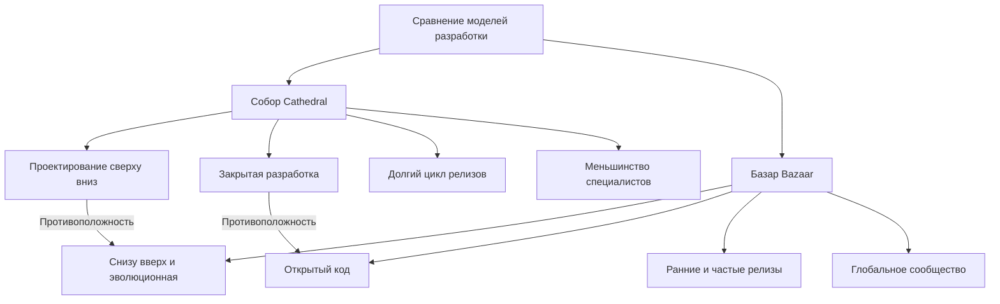
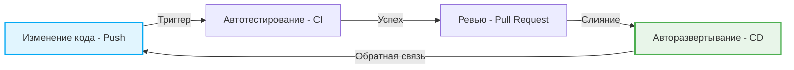

# Революция открытого исходного кода и «Собор и Базар»: Смена парадигмы, изменившая историю разработки программного обеспечения

Мир программного обеспечения претерпел радикальную эволюцию за последние несколько десятилетий. Одним из самых важных и фундаментальных изменений стало зарождение и популяризация концепции «открытого исходного кода» (open source). Сегодня большая часть основы инфраструктуры интернета, смартфонов, облачных вычислений и даже искусственного интеллекта, которые мы используем, опирается на программное обеспечение с открытым исходным кодом (OSS).

В этой статье мы подробно рассмотрим суть этой революции открытого исходного кода и то, как монументальное эссе Эрика С. Рэймонда (Eric S. Raymond) «Собор и Базар» (The Cathedral and the Bazaar) в корне изменило парадигму разработки программного обеспечения. Мы изучим это с разных точек зрения: исторического контекста, технологической эволюции и влияния на современную программную инженерию.

## 1. Зарождение программного обеспечения и эпоха «Собора»

### Подъем проприетарного программного обеспечения

На заре зарождения компьютеров программное и аппаратное обеспечение были единым целым, а концепция коммерческой торговли исключительно программным обеспечением была слабо развита. Однако с 1970-х по 1980-е годы технологические гиганты, в частности IBM, установили бизнес-модель, защищающую программное обеспечение авторским правом и продающую его с закрытым исходным кодом — «проприетарную» (монопольную) модель.

Модель разработки программного обеспечения в ту эпоху была высокоорганизованной и управлялась сверху вниз. Это был стиль, при котором небольшая группа избранных элитных программистов выполняла всё, от проектирования до реализации и тестирования, в закрытой среде и в строгом соответствии с планом.

### Особенности модели «Собор» (Cathedral)

Эрик С. Рэймонд сравнил этот традиционный стиль разработки программного обеспечения со строительством «Собора» (Cathedral).

*   **Централизованное проектирование**: Несколько гениальных проектировщиков, называемых архитекторами, рисуют общую картину, в соответствии с которой работают рабочие.
*   **Закрытая среда разработки**: Исходный код является коммерческой тайной компании, и участие посторонних в процессе разработки невозможно.
*   **Долгий цикл релизов**: В стремлении к идеальному продукту от начала разработки до релиза требуются долгие периоды — от нескольких месяцев до нескольких лет.
*   **Поиск и исправление ошибок**: Поскольку ошибки ищут только ограниченные внутренние тестировщики, их обнаружение часто затягивается.

Эта модель Собора была рациональной в условиях ограниченных ресурсов того времени и стала движущей силой для создания огромных и сложных систем, таких как Microsoft Windows и коммерческий UNIX. Однако в то же время это замедлило скорость инноваций и привело к возведению высокой стены между разработчиками и пользователями.

## 2. Жажда свободы: Зарождение движения за свободное программное обеспечение

Был один программист, который испытывал сильное чувство тревоги по поводу подъема проприетарного программного обеспечения. Это Ричард Столлман (Richard Stallman) из Лаборатории искусственного интеллекта Массачусетского технологического института (MIT).

### Проект GNU и GPL

Столлман утверждал, что программное обеспечение должно основываться на универсальной человеческой ценности обмена знаниями, и каждый должен иметь возможность свободно его использовать, изучать, изменять и распространять. В 1983 году он запустил «Проект GNU» и приступил к разработке полностью свободной UNIX-совместимой операционной системы.

Кроме того, чтобы юридически подкрепить свои идеи, он разработал «Стандартную общественную лицензию GNU» (GPL: GNU General Public License). Самой большой особенностью GPL является концепция, называемая «Копилефт» (Copyleft). Это мощное ограничение, согласно которому при модификации и распространении программного обеспечения, выпущенного под GPL, его производные также должны быть выпущены под той же лицензией GPL, что создало механизм для постоянного сохранения свободы программного обеспечения.

### Ограничения свободного программного обеспечения

Идеи Столлмана нашли отклик у многих хакеров, в результате чего были созданы отличные инструменты, такие как GCC (компилятор C) и Emacs (текстовый редактор). Однако разработка ядра (GNU Hurd), составляющего сердцевину полноценной ОС, столкнулась с трудностями, и лагерь свободного ПО оказался в состоянии, когда «тело» было почти готово, но не было «сердца».

## 3. Шок от «Базара»: Рождение Linux

В 1991 году Линус Торвальдс (Linus Torvalds), студент Хельсинкского университета в Финляндии, опубликовал в группах новостей в Интернете небольшое ядро ОС «Linux», которое он разработал в качестве хобби.

### Хаотичный стиль разработки

Линус опубликовал свой исходный код и обратился к хакерам по всему миру: «Кто-нибудь может мне помочь?». Удивительно, но множество разработчиков в Интернете откликнулись на этот призыв и начали присылать патчи (код с исправлениями).

Линус интегрировал присланные патчи с огромной скоростью и выпускал новые версии чуть ли не каждый день. Не было ни строгих предварительных планов, ни четкого распределения того, кто за что отвечает. Это был крайне неорганизованный и хаотичный стиль разработки, при котором любой мог свободно изменять и улучшать ту часть, которая его интересовала.

### Почему Linux добился успеха?

С точки зрения здравого смысла традиционной программной инженерии (модель Собора), такой незапланированный и распределенный метод разработки должен был привести к краху системы. Однако Linux не только не рухнул, но и рос со скоростью, превосходящей коммерческий UNIX, и приобрел невероятную стабильность.

Именно Эрик С. Рэймонд раскрыл эту тайну в своем эссе «Собор и Базар».

## 4. Эрик С. Рэймонд и «Собор и Базар»

В 1997 году Рэймонд сам применил модель «Базар» (Bazaar) в своем проекте программного обеспечения «Fetchmail» и обобщил свой опыт и анализ в эссе под названием «Собор и Базар».

Это эссе блестяще описало динамику разработки с открытым исходным кодом и оказало огромное влияние на индустрию. Давайте рассмотрим некоторые из его основных законов.

### Базовые принципы модели Базара

Рэймонд сравнил модель Базара с ближневосточным рынком (базаром), где ходят разные люди и одновременно происходит множество сделок.

### Закон Линуса (Linus's Law)

Самое известное высказывание в «Соборе и Базаре» — это «Закон Линуса»: «**При достаточном количестве глаз все ошибки лежат на поверхности**» (Given enough eyeballs, all bugs are shallow).

В модели Собора поиск и исправление ошибок ложатся на плечи небольшого числа разработчиков и тестировщиков. С другой стороны, в модели Базара, поскольку исходный код открыт, тысячи и десятки тысяч пользователей по всему миру читают код, запускают его и сообщают о проблемах. Это понимание того, что когда на код направлено бесчисленное множество «глаз» с разными знаниями и опытом, любая, даже самая сложная ошибка, становится для кого-то легко решаемой проблемой.

### Выпускайте рано, выпускайте часто (Release early. Release often.)

В модели Базара не ждут идеального состояния, а быстро выпускают работающий, пусть и несовершенный, продукт, чтобы зациклить обратную связь от пользователей. Это позволяет избежать отклонения направления разработки от истинных потребностей пользователей и поддерживать энтузиазм сообщества.

### Относитесь к пользователям как к соразработчикам

«Отношение к своим пользователям как к соразработчикам — наименее хлопотный путь к быстрому улучшению кода и эффективной отладке».
В модели Базара пользователи — это не просто «потребители». Они «соразработчики», которые сообщают об ошибках, иногда пишут патчи для их исправления и предлагают новые функции. Успех или провал проекта зависит от того, как извлечь из этого сообщества силу и управлять ею.

## 5. Рождение термина «Открытый исходный код»

После публикации «Собора и Базара» эти идеи начали выходить за рамки хакерского сообщества и влиять на деловой мир.

В 1998 году компания Netscape Communications, проигрывающая Internet Explorer от Microsoft на рынке веб-браузеров, приняла кардинальное решение открыть исходный код своего браузера (Netscape Communicator) в качестве шага для спасения. За этим решением стояло влияние эссе «Собор и Базар» на руководство компании.

В связи с этим событием, чтобы избавиться от политического и идеологического оттенка слова «свободный» (Free) из движения за свободное программное обеспечение (особенно отторжения со стороны бизнеса), было предложено новое, более прагматичное и удобное для бизнеса название. Это «**Открытый исходный код**» (Open Source).

С созданием Инициативы открытого исходного кода (OSI) и определением Open Source Definition (OSD), открытый исходный код быстро стал неотъемлемым элементом ИТ-стратегий компаний.

## 6. Смена парадигмы, вызванная революцией открытого исходного кода

Революция открытого исходного кода и модель Базара не просто ограничились фактом «открытия исходного кода», но и привели к необратимому изменению парадигмы во всей программной инженерии.

### Появление распределенных систем управления версиями (Git)

Модель Базара, в которой разработчики по всему миру асинхронно и децентрализованно изменяют код, имела ограничения при использовании традиционных централизованных систем управления версиями (CVS и Subversion). Для решения этой проблемы Линус Торвальдс сам разработал «Git». Появление Git и хостинга GitHub радикально снизило барьер для разработки с открытым исходным кодом и породило новую культуру — «социальное программирование» (social coding).

### Гибкая методология разработки (Agile) и CI/CD

Философия модели Базара «Выпускайте рано, выпускайте часто» глубоко связана с современными идеями гибкой разработки программного обеспечения и DevOps. Метод непрерывного улучшения программного обеспечения короткими итерациями с автоматическим тестированием и развертыванием через конвейеры CI/CD (непрерывная интеграция/непрерывная доставка) можно назвать эволюционной формой модели Базара.

### Стоя на плечах гигантов

Сегодня ни один разработчик не создает новые веб-сервисы или приложения полностью с нуля. Опираясь на «плечи гигантов» открытого исходного кода, таких как операционные системы (Linux), веб-серверы (Apache, Nginx), базы данных (MySQL, PostgreSQL), языки программирования и огромное количество библиотек и фреймворков (React, TensorFlow и т.д.), разработчики теперь могут сосредоточиться на создании основной бизнес-ценности.

## 7. Современный Базар: Участие компаний и формирование экосистем

Даже Microsoft, которая когда-то заявляла, что «открытый исходный код — это рак», теперь приобрела GitHub и стала одним из крупнейших контрибьюторов открытого исходного кода. Технологические гиганты, такие как Google, Meta (Facebook) и Amazon, также применяют стратегию открытия своих базовых технологий (Kubernetes, React, PyTorch и т.д.) в качестве исходного кода для захвата отраслевых стандартов (стандартов де-факто).

Современный Базар — это уже не место только для хакеров-волонтеров. Он превратился в огромную и сложную экосистему, где профессиональные инженеры, получающие зарплату от компаний, работают над проектами полный рабочий день, а мощные фонды (такие как Linux Foundation и Apache Software Foundation) управляют проектами и финансированием.

## 8. Проблемы и перспективы на будущее

Однако модель Базара с открытым исходным кодом тоже не идеальна. В последние годы на первый план вышли несколько серьезных проблем.

*   **Выгорание мейнтейнеров (burnout)**: Даже важные проекты OSS, которые широко используются, часто поддерживаются небольшой группой неоплачиваемых мейнтейнеров, и их психологическая и финансовая нагрузка достигла предела.
*   **Атаки на цепочку поставок (supply chain attacks)**: По мере усложнения зависимостей программного обеспечения возрастает риск того, что атаки, использующие уязвимости в OSS (например, уязвимость Log4j), окажут разрушительное воздействие на социальную инфраструктуру.
*   **Неравенство в финансировании**: Хотя некоторые компании получают огромную прибыль от использования открытого исходного кода, проблема «безбилетника», когда разработчики, создающие эту основу, не получают от этого прибыли, остается нерешенной.

В ответ на эти проблемы изучаются новые модели устойчивости (sustainability), такие как механизмы финансовой поддержки вроде GitHub Sponsors, прямой найм разработчиков OSS компаниями и поддержка аудита безопасности со стороны правительственных учреждений.

## Заключение

Мировоззрение, предложенное в «Соборе и Базаре», вышло за рамки программного кода и распространилось на широкий спектр областей, таких как обмен знаниями, подобный Википедии (Wikipedia), открытые данные, а также открытое аппаратное обеспечение (open hardware) и открытая наука (open science).

От «Собора», управляемого сверху вниз, к децентрализованному и автономному «Базару». Эту революцию открытого исходного кода можно назвать одним из самых успешных социальных экспериментов по совместному созданию человечеством знаний и технологий. И сегодня мы всё еще находимся в самом центре этого гигантского, постоянно развивающегося Базара.
