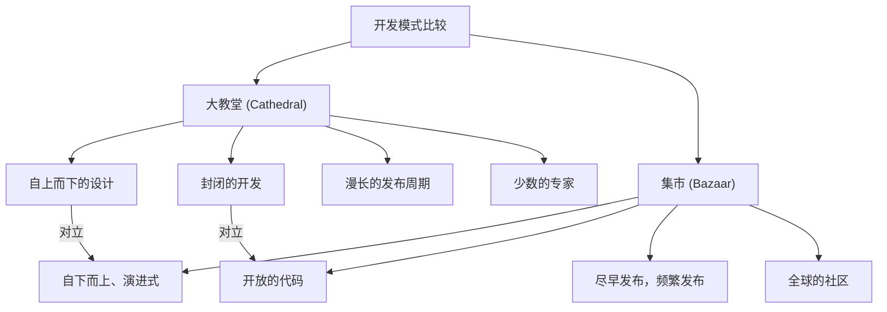

# 开源革命与《大教堂与集市》：改变软件开发历史的范式转换

软件世界在过去几十年里经历了戏剧性的演变。其中最重要且根本的变化之一是“开源”概念的诞生及其普及。今天，我们所使用的互联网基础设施、智能手机、云计算，乃至AI，其底层基础在很大程度上都是由开源软件（OSS）支撑的。

本文将深入探讨这场开源革命的核心，从历史背景、技术演变以及对现代软件工程的影响等多个视角，深入剖析埃里克·S·雷蒙德（Eric S. Raymond）的里程碑式散文《大教堂与集市》（The Cathedral and the Bazaar）是如何从根本上颠覆软件开发范式的。

## 1. 软件黎明期与“大教堂”时代

### 专有软件的崛起

在计算机诞生的早期，软件与硬件是一体的，软件单独作为商品交易的概念很淡薄。然而，从20世纪70年代到80年代，以IBM为首的科技巨头们确立了“专有（Proprietary）”的商业模式，即通过版权保护软件，闭源销售。

这一时期的软件开发模式是高度组织化、自上而下管理的。少数被选中的精英程序员在封闭的环境中，严格按照计划进行从设计到实现再到测试的全过程。

### “大教堂（Cathedral）”模式的特征

埃里克·S·雷蒙德将这种传统的软件开发模式比作建造“大教堂”。

*   **集中式的设计**: 少数被称为架构师的天才设计者描绘全局，工人们按图纸施工。
*   **封闭的开发环境**: 源代码是公司机密，外部人员不可能参与开发过程。
*   **漫长的发布周期**: 为了追求完美的应用程序，发布往往需要几个月甚至几年的时间。
*   **Bug的发现与修复**: 由于只有内部有限的测试人员寻找bug，发现往往会被推迟。

这种大教堂模式在当时资源有限的环境下是合理的，并成为了创造诸如Microsoft Windows和商业UNIX等庞大且复杂系统的动力。但同时，它也减缓了创新的速度，在开发者和用户之间筑起了一道高墙。

## 2. 对自由的渴望：自由软件运动的诞生

有一位程序员对专有软件的崛起抱有强烈的危机感。他就是当时属于麻省理工学院（MIT）人工智能实验室的理查德·斯托曼（Richard Stallman）。

### GNU项目与GPL

斯托曼主张，软件应该基于知识共享这一人类普遍价值，任何人都有权自由地使用、研究、修改和重新分发。1983年，他启动了“GNU项目”，着手开发一个完全自由的类UNIX操作系统。

此外，为了从法律上支持他的理念，他制定了“GNU通用公共许可证（GPL: GNU General Public License）”。GPL最大的特征是被称为“Copyleft（著佐权）”的概念。这是一种强有力的约束，即如果修改和重新分发基于GPL发布的软件，其衍生作品也必须以相同的GPL许可证发布，从而创造了一种永久保持软件自由的机制。

### 自由软件的局限性

斯托曼的思想引起了许多黑客的共鸣，并催生了诸如GCC（C编译器）和Emacs（文本编辑器）等优秀工具。然而，作为完整操作系统核心的内核（GNU Hurd）的开发却举步维艰，自由软件阵营陷入了“身体”即将完成却没有“心脏”的窘境。

## 3. “集市”的冲击：Linux的诞生

1991年，芬兰赫尔辛基大学的学生林纳斯·托瓦兹（Linus Torvalds）将他出于兴趣开发的小型操作系统内核“Linux”发布在了互联网的新闻组上。

### 混沌的开发风格

林纳斯公开了他的源代码，并向全世界的黑客呼吁：“谁能来帮帮我？”令人惊讶的是，通过互联网，许多开发者响应了这一呼吁，开始提交补丁（修改代码）。

林纳斯以惊人的速度合并收到的补丁，几乎每天都会发布新版本。既没有事先严密的设计图，也没有明确分配谁负责什么。每个人都可以随意摆弄自己感兴趣的部分并加以改进，这是一种极其无序和混沌的开发风格。

### 为什么Linux成功了？

按照传统软件工程的常识（大教堂模式），这种无计划且分散的开发方法本应导致系统的崩溃。然而，Linux不仅没有崩溃，反而以超越商业UNIX的速度成长，并获得了惊人的稳定性。

解开这个谜团的交叉点，正是埃里克·S·雷蒙德的《大教堂与集市》。

## 4. 埃里克·S·雷蒙德与《大教堂与集市》

1997年，雷蒙德通过自己开发的“Fetchmail”软件项目，亲自实践了Linux的“集市（Bazaar）”模式，并将他的经验和分析总结成了散文《大教堂与集市》。

这篇散文出色地将开源开发的动力学语言化，给业界带来了巨大的冲击。让我们来看看其中的几个核心法则。

### 集市模式的基本原则

雷蒙德将集市模式比作中东的市场（集市），那里形形色色的人来来往往，各种交易同时发生。

### 林纳斯定律（Linus's Law）

《大教堂与集市》中最著名的格言是“林纳斯定律”：“**只要眼球足够多，所有bug都好捉（Given enough eyeballs, all bugs are shallow）**”。

在大教堂模式中，寻找和修复bug的任务落在少数开发者和测试人员的肩上。而在集市模式中，由于源代码是公开的，全世界成千上万的用户都在阅读代码、运行它并报告问题。这种洞察指出，当无数具有不同知识和背景的“眼睛”盯着代码时，再复杂的bug对某个人来说都会变成容易解决的问题。

### 尽早发布，频繁发布（Release early. Release often.）

在集市模式中，人们不会等到一切完美再发布，而是尽早发布哪怕不完美但能运行的东西，并让用户的反馈循环起来。这可以防止开发方向偏离用户的真正需求，并能持续保持社区的热情。

### 将用户视为共同开发者

“将用户视为共同开发者是代码快速改进和有效调试的最可靠途径。”
在集市模式中，用户不仅仅是“消费者”。他们是报告bug、有时编写修复补丁、提出新功能的“共同开发者”。如何激发和管理这个社区的力量，决定了项目的成败。

## 5. “开源”一词的诞生

在《大教堂与集市》发表后，其思想开始超越部分黑客社区，对商业世界产生影响。

1998年，在Web浏览器市场逐渐败给微软Internet Explorer的网景通信公司（Netscape Communications），做出了一个戏剧性的决定——公开其浏览器（Netscape Communicator）的源代码，作为起死回生的最后一搏。这个决定的背后，是受到了阅读过《大教堂与集市》的管理层的启发。

以此为契机，为了消除自由软件运动中“自由（Free）”一词所带有的政治和意识形态色彩（特别是来自商业界的抵触情绪），人们提出了一个更加实用主义且对商业友好的新称呼，那就是“**开源（Open Source）**”。

随着开源促进会（OSI）的成立和开源定义（OSD）的制定，开源作为企业IT战略不可或缺的要素开始迅速普及。

## 6. 开源革命带来的范式转换

开源革命和集市模式不仅仅是“公开源代码”这一事实，它给整个软件工程带来了不可逆转的范式转换。

### 分布式版本控制系统（Git）的出现

全世界的开发者异步且分散地修改代码的集市模式，在使用传统的集中式版本控制系统（CVS或Subversion）时遇到了瓶颈。为了解决这个问题，林纳斯·托瓦兹亲自开发了“Git”。Git以及托管它的GitHub的出现，极大地降低了开源开发的门槛，并催生了“社交编程（Social Coding）”这一新文化。

### 敏捷开发与CI/CD

“尽早发布，频繁发布”的集市模式哲学，与现代敏捷软件开发和DevOps的思想紧密相连。在短迭代中持续改进软件，并通过[CI/CD](/zh-cn/p/cicd-pipeline-github-actions-best-practices/)（持续集成/持续交付）流水线自动进行测试和部署的方法，可以说是集市模式的进化版。

### 站在巨人的肩膀上

今天，没有哪个开发者会从零开始完全自己编写一个新的Web服务或应用程序。通过站在操作系统（Linux）、Web服务器（Apache, Nginx）、数据库（MySQL, PostgreSQL）、编程语言以及海量库和框架（React, TensorFlow等）这些开源的“巨人肩膀”上，开发者能够专注于创造业务的核心价值。

## 7. 现代的集市：企业的参与和生态系统的形成

甚至连曾经声称“开源是毒瘤”的微软，现在也收购了GitHub，成为了开源最大的贡献企业之一。谷歌、[Meta](/zh-cn/p/history-of-meta-facebook/)（Facebook）、亚马逊等科技巨头也将自家的基础技术（[Kubernetes](/zh-cn/p/kubernetes-k8s-architecture-pod-service-ingress/)、React、PyTorch等）作为开源发布，采取了掌握行业标准（事实标准）的战略。

现代的集市早已不再仅仅是纯粹志愿黑客们的专属阵地。它已经演变成一个庞大而复杂的生态系统，有拿着企业薪水、全职提交代码的专业工程师，也有管理项目治理和资金的强大基金会（如Linux基金会和Apache软件基金会）。

## 8. 挑战与未来展望

然而，开源的集市模式也并非完美无缺。近年来，几个严重的问题逐渐显现。

*   **维护者的倦怠综合征（Burnout）**: 即使是广泛使用的关键OSS，很多也只能靠少数无薪维护者勉强维持，他们在精神和经济上的负担已经达到了极限。
*   **供应链攻击**: 随着软件依赖关系的复杂化，利用OSS漏洞进行的攻击（如Log4j漏洞等）对社会基础设施造成巨大影响的风险正在上升。
*   **资金提供的不平衡**: 一方面有企业利用开源赚取巨额利润，另一方面为其奠定基础的开发者却没有得到利益回馈，这种“搭便车问题”尚未得到解决。

面对这些挑战，人们正在探索新的可持续性模型，例如GitHub Sponsors等资金援助机制、企业直接雇佣OSS开发者，以及政府机构支持的安全审计等。

## 结语

《大教堂与集市》所倡导的世界观已经超越了软件代码的范畴，波及了维基百科（Wikipedia）等知识共享、开放数据，甚至开放硬件和开放科学等广泛领域。

从自上而下的“大教堂”到自主分布式的“集市”。这场开源革命，可以说是人类协作创造知识和技术最成功的社会实验之一。我们至今仍站在这个不断进化的巨大集市的中心。
