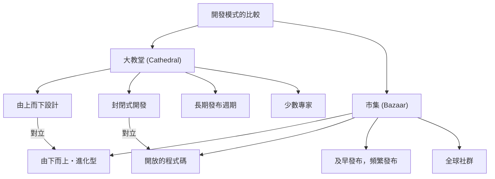

# 開源革命與「大教堂與市集」：改變軟體開發歷史的典範轉移

軟體世界在過去幾十年經歷了戲劇性的進化。其中最重要且根本的變化之一，就是「開源」概念的誕生與普及。今日，我們所使用的網際網路基礎設施、智慧型手機、雲端運算，甚至是人工智慧，其基礎大部分都由開源軟體（OSS）所支撐。

本文將深入探討這場開源革命的核心，從歷史背景、技術進化，以及對現代軟體工程的影響等多個視角，深入解析埃里克·斯蒂芬·雷蒙（Eric S. Raymond）的紀念碑式散文《大教堂與市集》（The Cathedral and the Bazaar）是如何從根本上顛覆軟體開發的典範。

## 1. 軟體黎明期與「大教堂」時代

### 專有軟體的崛起

在電腦誕生的初期，軟體與硬體是一體的，單純進行軟體商業交易的概念很薄弱。然而，從 1970 年代到 1980 年代，以 IBM 為首的巨大科技企業將軟體以版權保護，確立了將原始碼不公開（封閉）並進行銷售的「專有（Proprietary）」商業模式。

這個時代的軟體開發模式高度組織化，並由上而下進行管理。少數被選中的菁英程式設計師在封閉的環境中，嚴格按照計畫進行從設計、實作到測試的工作。

### 「大教堂（Cathedral）」模式的特徵

埃里克·斯蒂芬·雷蒙將這種傳統的軟體開發風格比喻為「大教堂」的建造。

*   **中央集權的設計**：被稱為架構師的少數天才設計者描繪出整體藍圖，勞動者則依照藍圖進行作業。
*   **封閉的開發環境**：原始碼是公司機密，外部人員不可能參與開發過程。
*   **長期的發布週期**：為了追求完美的產品，從開發到發布需要幾個月甚至幾年的漫長時間。
*   **錯誤的發現與修正**：由於只有內部有限的測試人員尋找錯誤，因此發現往往會延遲。

這種大教堂模式在當時資源有限的環境下是合理的，成為創造出 Microsoft Windows 和商業 UNIX 等巨大且複雜系統的動力。但同時，這也減緩了創新的速度，並在開發者與使用者之間築起了高牆。

## 2. 渴望自由：自由軟體運動的誕生

對於專有軟體的崛起，有一位程式設計師抱持著強烈的危機感。他就是當時隸屬於麻省理工學院（MIT）人工智慧實驗室的理查·斯托曼（Richard Stallman）。

### GNU 計畫與 GPL

斯托曼主張，軟體應該基於知識共享這一全人類的普遍價值，任何人都能夠自由地使用、研究、修改和重新散布。他在 1983 年發起了「GNU 計畫」，著手開發完全自由的 UNIX 相容作業系統。

此外，為了在法律上支持他的理念，他制定了「GNU 通用公眾授權條款（GPL: GNU General Public License）」。GPL 最大的特徵是被稱為「Copyleft」的概念。這是一種強制的約束，規定如果修改或重新散布以 GPL 公開的軟體，其衍生作品也必須以相同的 GPL 授權條款公開，從而創造出永久保持軟體自由的機制。

### 自由軟體的局限

斯托曼的思想引起了許多駭客的共鳴，並催生了 GCC（C 編譯器）和 Emacs（文字編輯器）等優秀的工具。然而，作為完整 OS 核心的 Kernel（GNU Hurd）的開發卻陷入了困境，自由軟體陣營陷入了「身體」逐漸完成，卻沒有「心臟」的狀態。

## 3. 「市集」的衝擊：Linux 的誕生

1991 年，芬蘭赫爾辛基大學的學生林納斯·托瓦茲（Linus Torvalds）將他基於興趣開發的小型 OS 核心「Linux」，在網際網路上的新聞群組中公開發布。

### 混亂的開發風格

林納斯公開了自己的原始碼，並向全世界的駭客呼籲：「有沒有人願意幫忙？」令人驚訝的是，許多開發者透過網際網路響應了這個呼籲，開始發送修補程式（修改的程式碼）。

林納斯以極快的速度將送來的修補程式整合進去，幾乎每天都會發布新版本。沒有事先嚴密的設計圖，也沒有明確分配誰負責什麼。每個人都可以隨意修改和改善自己感興趣的部分，這是一種極度無序且混亂的開發風格。

### 為什麼 Linux 成功了？

從傳統軟體工程的常識（大教堂模式）來看，這種無計畫且分散的開發手法應該會導致系統崩潰。然而，Linux 不僅沒有崩潰，反而以超越商業 UNIX 的速度成長，並獲得了驚人的穩定性。

解開這個謎團的，正是埃里克·斯蒂芬·雷蒙的《大教堂與市集》。

## 4. 埃里克·斯蒂芬·雷蒙與《大教堂與市集》

1997 年，雷蒙透過他自己開發的「Fetchmail」軟體專案，親自實踐了 Linux 的「市集（Bazaar）」模式，並將他的經驗和分析整理成了《大教堂與市集》這篇散文。

這篇散文出色地將開源開發的動力學具象化，對業界帶來了巨大的衝擊。讓我們來看看其中的幾個核心法則。

### 市集模式的基本原則

雷蒙將市集模式比喻為中東的市場（市集），那裡有形形色色的人來往，各種交易同時且多發地進行著。

### 林納斯定律（Linus's Law）

《大教堂與市集》中最著名的格言就是「**只要有足夠的眼球，所有的錯誤都將無所遁形（Given enough eyeballs, all bugs are shallow）**」，也就是「林納斯定律」。

在大教堂模式中，發現和修正錯誤的責任落在少數開發人員和測試人員的肩上。另一方面，在市集模式中，由於原始碼是公開的，世界上成千上萬的使用者會閱讀、執行程式碼並回報問題。無數具有不同知識和背景的「眼睛」注視著程式碼，這意味著無論多麼複雜的錯誤，對某個人來說都會成為容易解決的問題。

### 及早發布，頻繁發布（Release early. Release often.）

在市集模式中，與其等到完美狀態才發布，不如盡早發布即使不完美但能運作的版本，並讓使用者的回饋形成循環。這可以防止開發方向偏離使用者的真正需求，並維持社群的熱度。

### 將使用者視為共同開發者

「將使用者視為共同開發者，是快速改善程式碼與有效除錯的最可靠途徑。」
在市集模式中，使用者不再僅僅是「消費者」。他們是回報錯誤、有時編寫修補程式、提出新功能的「共同開發者」。如何引導並管理這股社群力量，決定了專案的成敗。

## 5. 「開源」一詞的誕生

在《大教堂與市集》發表後，其思想超越了部分的駭客社群，開始影響商業世界。

1998 年，在網頁瀏覽器市場中逐漸敗給 Microsoft Internet Explorer 的 Netscape Communications 公司，作為起死回生的一步，做出了公開其瀏覽器（Netscape Communicator）原始碼的戲劇性決定。這個決定的背後，正是受到了閱讀過《大教堂與市集》的管理層的啟發。

以此事件為契機，為了消除自由軟體運動中「自由（Free）」一詞所帶有的政治與意識形態色彩（尤其是來自商界的排斥反應），人們提出了一個更具實用主義和對商業友好的新稱呼。那就是「**開源（Open Source）**」。

隨著開源促進會（OSI）的成立和開源定義（OSD）的制定，開源迅速普及，成為企業 IT 策略中不可或缺的要素。

## 6. 開源革命帶來的典範轉移

開源革命與市集模式不僅僅停留在「原始碼被公開」這個事實上，更為整個軟體工程帶來了不可逆的典範轉移。

### 分散式版本控制系統（Git）的出現

世界各地的開發者非同步且分散地修改程式碼的市集模式，在傳統的集中式版本控制系統（如 CVS 或 Subversion）中達到了極限。為了解決這個問題，林納斯·托瓦茲親自開發了「Git」。Git 以及託管它的 GitHub 的出現，大幅降低了開源開發的門檻，催生了名為「社交編程（Social Coding）」的新文化。

### 敏捷開發與 CI/CD

「及早發布，頻繁發布」的市集模式哲學，與現代敏捷軟體開發和 DevOps 的思想緊密相連。透過短暫的迭代持續改善軟體，並透過 CI/CD（持續整合／持續交付）管線自動進行測試和部署的手法，可以說是市集模式的進化型態。

### 站在巨人的肩膀上

今日，已經沒有開發者會從零開始完全自己打造新的 Web 服務或應用程式了。藉由站在作業系統（Linux）、網頁伺服器（Apache, Nginx）、資料庫（MySQL, PostgreSQL）、程式語言，以及龐大數量的函式庫和框架（如 React, TensorFlow）等開源的「巨人肩膀」上，開發者可以專注於創造商業的核心價值。

## 7. 現代市集：企業的參與與生態系統的形成

就連曾經說過「開源是癌症」的 Microsoft，現在也收購了 GitHub，成為開源最大的貢獻企業之一。Google、Meta（Facebook）、Amazon 等大型科技企業也將自家的基礎技術（如 Kubernetes、React、PyTorch）以開源形式公開，採取掌握業界標準（事實標準）的策略。

現代的市集已經不再只是純粹志願駭客們的場所。從企業獲得報酬的專業工程師全職投入，而強大的基金會（如 Linux Foundation 和 Apache Software Foundation）管理著專案的治理和資金，已經演變成一個巨大且複雜的生態系統。

## 8. 挑戰與未來展望

然而，開源的市集模式也並非完美無缺。近年來，幾個嚴重的挑戰逐漸浮出水面。

*   **維護者的過勞（倦怠）**：即使是被廣泛使用的重要 OSS，很多時候也是由少數無薪的維護者勉強維持，他們在精神和經濟上的負擔已經達到了極限。
*   **軟體供應鏈攻擊**：隨著軟體依賴關係變得複雜，利用 OSS 漏洞的攻擊（如 Log4j 漏洞）對社會基礎設施造成巨大影響的風險正在增加。
*   **資金提供的不平衡**：儘管有企業利用開源獲取龐大利益，但創造這些基礎的開發者卻未能獲得利潤回饋，這種「搭便車問題」尚未得到解決。

針對這些挑戰，人們正在探索新的永續發展模式，例如 GitHub Sponsors 這樣的資金援助機制、企業直接僱用 OSS 開發者，以及政府機構支援安全性稽核等。

## 結語

《大教堂與市集》所提倡的世界觀已經超越了軟體程式碼的範疇，波及到了如維基百科（Wikipedia）等知識共享、開放資料，甚至是開放硬體和開放科學等廣泛領域。

從由上而下的「大教堂」，到自治分散型的「市集」。這場開源革命可以說是人類為了協同創造知識和技術，所進行的最成功的社會實驗之一。而我們現在，依然身處於這個不斷進化的巨大市集之中。
