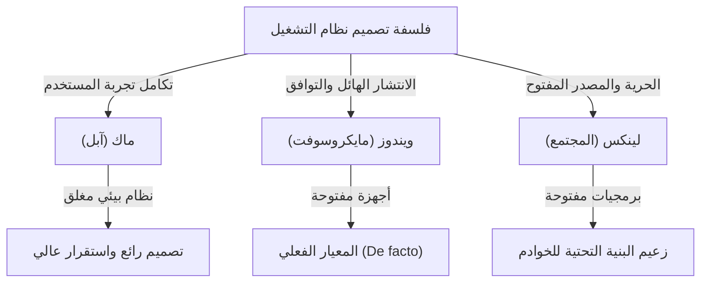
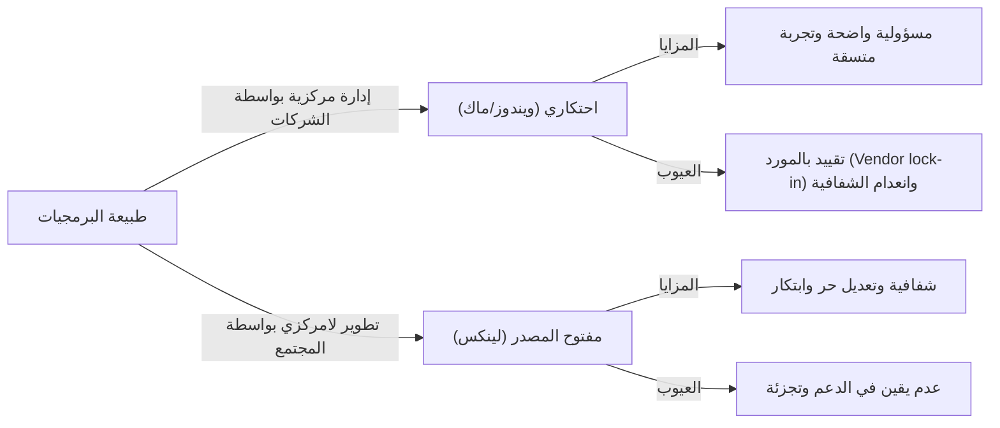

# مقدمة: لماذا أصبحت أنظمة التشغيل "ديانة"؟

في رحلة تطور أجهزة الكمبيوتر من آلات ضخمة مخصصة لبعض الخبراء إلى أجهزة شخصية تتسع في جيوبنا، كان هناك دائمًا وجود لـ "نظام التشغيل (OS)". يتجاوز نظام التشغيل، الذي يربط الأجهزة بالبرمجيات ويحدد أساس تجربة المستخدم، كونه مجرد أداة ليرتقي إلى رمز يعبر عن هويات الناس وفلسفتهم التكنولوجية.

أصبحت هذه الظاهرة تُعرف في النهاية باسم "حروب أنظمة التشغيل الدينية (OS Holy Wars)". الانتشار الساحق والبراغماتية لنظام ويندوز، والتصميم الأنيق وفلسفة التصميم المتمحورة حول المستخدم لنظام ماك، ومبدأ الحرية والمصادر المفتوحة لنظام لينكس. هذه تتجاوز مجرد التفوق الوظيفي لتطرح سؤالًا أساسيًا حول "كيف يجب أن نتعامل مع التكنولوجيا".

في هذا المقال، سنقوم بفك رموز تاريخ هذا الصراع اللامتناهي، ونتعمق بشكل شامل في كيفية ظهور كل نظام تشغيل، وتطوره، وتأثيره المتبادل على الأنظمة الأخرى.

## الفصل الأول: بداية الصراع الثلاثي وفلسفة كل نظام

بدأ تاريخ أنظمة التشغيل من أواخر السبعينيات إلى الثمانينيات عندما تحولت أجهزة الكمبيوتر إلى أجهزة شخصية. وُلد كل نظام تشغيل بخلفية وفلسفة مختلفة تمامًا.

### 1.1 ماك: تقاطع التكنولوجيا والفن
في عام 1984، أعلنت شركة آبل عن أول جهاز ماكنتوش. كانت الفلسفة التي تبناها ستيف جوبز هي "وضع جهاز كمبيوتر في أيدي الجميع". في ذلك الوقت، كانت واجهة سطر الأوامر المعقدة هي السائدة، لكن نظام ماك نشر واجهة المستخدم الرسومية (GUI) والماوس للجمهور.

يستند أساس آبل إلى "التحكم" و "التكامل المثالي لتجربة المستخدم". من خلال تصميم الأجهزة والبرامج بشكل متسق داخليًا، توفر الشركة تجربة سلسة وبديهية للمستخدمين. على الرغم من أن هذا النهج قد يُنتقد أحيانًا باعتباره "مغلقًا (Closed)"، إلا أنه في الوقت نفسه يخلق جمالًا واستقرارًا لا مثيل لهما.

### 1.2 ويندوز: جهاز كمبيوتر على كل مكتب
في حين أظهرت آبل إمكانات واجهة المستخدم الرسومية، اتبع بيل جيتس من مايكروسوفت نهجًا مختلفًا. وتحت رؤية "جهاز كمبيوتر على كل مكتب وفي كل منزل"، اختارت مايكروسوفت مسار ترخيص نظام التشغيل الخاص بها لشركات تصنيع الأجهزة.

فلسفة ويندوز هي "التوافق" و "الانتشار". لقد قامت ببناء نظام بيئي يعمل على أي أجهزة ويسمح لأي مطور برامج بإنشاء التطبيقات بحرية. أدى ذلك إلى حصول ويندوز على حصة سوقية هائلة، ليصبح المعيار الفعلي (De facto standard) عالميًا من الشركات إلى المنازل.

### 1.3 لينكس: بلورة الحرية وثقافة الهاكرز
في عام 1991، ابتكر لينوس تورفالدس، الذي كان طالبًا فنلنديًا، نظام لينكس في سياق مختلف تمامًا. يجسد لينكس، الذي يعود أصله إلى نظام يونكس (Unix)، فلسفة "المصدر المفتوح" حيث يكون الكود المصدري متاحًا للجميع، ويمكن تعديله وإعادة توزيعه بحرية.

فلسفة لينكس هي "الحرية" و "الإبداع المشترك من قبل المجتمع". بدلاً من سيطرة شركة واحدة، يتعاون الآلاف من المطورين حول العالم لبناء النظام. في البداية، كان يُنظر إلى هذا النهج على أنه موجه للهاكرز والمهووسين بالتقنية (Geeks)، ولكنه في النهاية غطى العالم كأساس للبنية التحتية للخوادم التي تدعم الإنترنت، وأجهزة الكمبيوتر العملاقة، ونظام أندرويد.

## الفصل الثاني: تاريخ الصدامات (التسعينيات إلى العقد الأول من القرن الحادي والعشرين)

من التسعينيات إلى العقد الأول من القرن الحادي والعشرين، كانت المنافسة على حصة أنظمة التشغيل شرسة للغاية. أصبحت الأحداث في هذه الفترة نقطة تحول حاسمة حددت خريطة القوى في صناعة التكنولوجيا الحديثة.

### 2.1 تأثير ويندوز 95 والسيطرة الساحقة
في عام 1995، أحدث نظام التشغيل ويندوز 95 ضجة اجتماعية كبيرة. مع واجهة مستخدم رسومية متكاملة، وقدرات الاتصال بالإنترنت (لاحقًا Internet Explorer)، وميزة التوصيل والتشغيل (Plug and Play)، اكتمل هنا أساس أجهزة الكمبيوتر الشخصية الحديثة. وبفضل نجاح ويندوز 95، رسخت مايكروسوفت احتكارًا مطلقًا في سوق أجهزة الكمبيوتر.

في مواجهة هذه السيطرة الساحقة، واجهت آبل أزمة مالية حادة لفترة من الوقت. ومع ذلك، مع عودة ستيف جوبز في عام 1997 ونجاح جهاز "iMac" اللاحق، استعادت آبل مكانتها في سوق متخصص فريد يركز على التصميم وأسلوب الحياة.

### 2.2 حرب المتصفحات وظهور الويب
انتقلت ساحة المعركة الرئيسية لحرب أنظمة التشغيل في النهاية إلى فضاء الإنترنت. أعادت حرب المتصفحات الأولى بين Netscape و Internet Explorer تعريف قيمة نظام التشغيل كمنصة. اكتسبت مايكروسوفت الأفضلية من خلال دمج IE في ويندوز، ولكن هذا أدى أيضًا إلى دعوى قضائية تتعلق بانتهاك قوانين مكافحة الاحتكار.

### 2.3 الثورة الهادئة في سوق الخوادم
خلف الكواليس حيث يتنافس ويندوز وماك في سوق الحواسيب المكتبية، كان لينكس يكتسب زخمًا مطردًا في عالم الواجهة الخلفية (الخوادم) التي تدعم الإنترنت. شكل دمجه مع البرمجيات مفتوحة المصدر مثل خادم الويب أباتشي (LAMP stack) بنية تحتية رخيصة وموثوقة دعمت الشركات الناشئة خلال فترة فقاعة الإنترنت (Dot-com bubble).

## الفصل الثالث: صراع الأيديولوجيات (المغلق مقابل المفتوح)

لا يكمن جوهر حرب أنظمة التشغيل الدينية في مجرد مقارنة المواصفات والميزات، بل في صراع الأيديولوجيات حول كيف يجب أن تكون التكنولوجيا.

### 3.1 النور والظلام في التركيز على المستخدم (ماك)
يتمثل نهج نظام ماك (و iOS) في إدارة النظام بشكل صارم لضمان أفضل النتائج للمستخدم. يتم تحقيق واجهة جميلة، وتجربة متسقة، وأمان عالٍ من خلال قيام آبل بـ "تطويق" نظامها البيئي (الحديقة المسورة - Walled Garden). ومع ذلك، فإن هذا يعني أيضًا سلب المستخدمين حرية التخصيص العميق.

### 3.2 معضلة مهيمن المنصات (ويندوز)
لطالما ركز ويندوز على التوافق مع الإصدارات الأقدم (Backward compatibility). حقيقة أن البرامج التي تعود إلى 20 عامًا لا تزال تعمل على أحدث أنظمة التشغيل تعد ميزة مطلقة للاستخدام التجاري. ومع ذلك، أدى هذا التراكم الهائل للأكواد القديمة (Legacy code) إلى تضخم النظام، وظهور ثغرات أمنية، وفقدان الاتساق في واجهة المستخدم.

### 3.3 مثالية وواقع المصدر المفتوح (لينكس)
تستند البرمجيات مفتوحة المصدر، مثل لينكس، إلى أخلاقيات الهاكرز التي تفيد بأن "المعلومات يجب أن تكون حرة". يمكن لأي شخص تدقيق الكود، وتعديله، وإنشاء توزيعه الخاص. هناك خيارات متنوعة مثل Ubuntu، و Fedora، و Arch Linux. ومع ذلك، فقد أدى هذا "التنوع" في الوقت نفسه إلى "تجزئة (Fragmentation)"، مما جعل استخدامه صعبًا على المستخدم العادي.

## الفصل الرابع: نهاية المعركة ونموذج جديد (بعد 2010)

تغيرت طبيعة حرب أنظمة التشغيل التي طال أمدها بشكل كبير بعد عام 2010. مع ثورة الهواتف المحمولة وظهور الحوسبة السحابية، فقد السؤال "أي نظام تشغيل مكتبي تستخدم؟" أهميته.

### 4.1 الانتقال إلى الأجهزة المحمولة ونظام القطبين الجديد
مع ظهور أجهزة آيفون (iOS) وأندرويد، انتقل مركز الحوسبة من أجهزة الكمبيوتر إلى الهواتف الذكية. ومن المفارقات، أنه في عالم الأجهزة المحمولة، نشأ هيكل يعيد التاريخ السابق: النهج المغلق لشركة آبل (iOS) والنهج المفتوح بقيادة جوجل (أندرويد المبني على لينكس).

### 4.2 السحابة وانتشار تطبيقات الويب
بفضل تحسين أداء المتصفحات وتطور الحوسبة السحابية، أصبح من الممكن إنجاز الكثير من المهام على متصفح الويب دون الاعتماد على نظام التشغيل. تم استبدال Microsoft Office بـ Google Workspace، وتعمل الأدوات الحديثة مثل Slack و Figma بنفس الطريقة على أي نظام تشغيل. وصلنا إلى عصر يُقال فيه إن "نظام التشغيل ليس سوى أداة إقلاع (Bootloader) لتشغيل المتصفح".

### 4.3 تحول مايكروسوفت: "مايكروسوفت ❤️ لينكس"
لعل الحدث الأبرز الذي يرمز إلى نهاية حرب أنظمة التشغيل هو تحول مايكروسوفت. بعد أن صرح الرئيس التنفيذي السابق ستيف بالمر يومًا ما بأن "لينكس هو سرطان"، تبنت مايكروسوفت تحت قيادة ساتيا ناديلا المصادر المفتوحة بشكل كبير. مع نظام ويندوز الفرعي للينكس (WSL)، أصبح بالإمكان تشغيل بيئات لينكس مباشرة على ويندوز، وأصبحت أكثر من نصف أنظمة التشغيل التي تعمل على سحابة Azure هي لينكس. تعد مايكروسوفت الآن واحدة من أكبر المساهمين في البرمجيات مفتوحة المصدر في العالم.

## الفصل الخامس: دور أنظمة التشغيل في مستقبل الحوسبة

في يومنا هذا، لم تعد أنظمة ويندوز وماك ولينكس محاور لـ "صراع ديني"، بل أصبحت أدوات تختار بناءً على "المكان المناسب" حسب الغرض والتفضيل.

- **ويندوز**: بيئة ألعاب لا مثيل لها، وتوافق مع أجهزة الواقع الافتراضي والمعزز (VR/AR)، وتعدد استخدامات يستمر في دعم المكاتب الخلفية للشركات. ومع تقديم WSL، أصبح منصة جذابة للمطورين أيضًا.
- **ماك (macOS)**: مع ظهور شرائح آبل (Apple Silicon M1/M2/M3)، وصل التكامل بين الأجهزة والبرامج إلى مستوى غير مسبوق. يجمع بين كفاءة الطاقة المذهلة والأداء العالي، وحظي بدعم هائل من المبدعين والمهندسين.
- **لينكس**: يسيطر على العالم من وراء الكواليس. كبنية تحتية سحابية، وحواسيب عملاقة، وأجهزة إنترنت الأشياء (IoT)، وفي قلب الهواتف الذكية، فإنه لا يزال يدعم الأساس الرقمي للمجتمع الحديث.

### الخلاصة: التنوع هو المحرك الأساسي للتطور
غالبًا ما ولدت "حرب أنظمة التشغيل" جدالات غير مثمرة. ومع ذلك، لأن الأنظمة ذات الفلسفات المختلفة تنافست مع بعضها البعض واستوعبت أفضل ميزاتها، تمكنت التكنولوجيا من التطور بسرعة.

أثرت الخطوط الجميلة وواجهة المستخدم الرسومية لنظام ماك على ويندوز، وعلّم توافق ويندوز ونظامه البيئي الضخم شركة آبل أهمية استراتيجية المنصات، وأصبح نموذج المصدر المفتوح الخاص بلينكس أساسًا لتطوير البرمجيات في جميع شركات تكنولوجيا المعلومات الضخمة اليوم.

بغض النظر عن نظام التشغيل الذي نختاره، يقف وراءه شغف وفلسفة عدد لا يحصى من المهندسين. إن معرفة تاريخ أنظمة التشغيل هو بمثابة معرفة تطور الفكر البشري تجاه التكنولوجيا نفسها.
