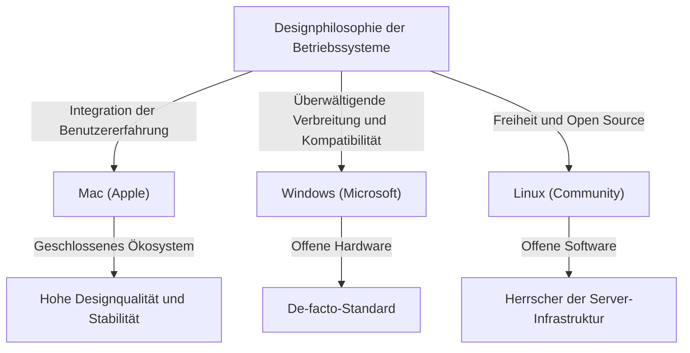
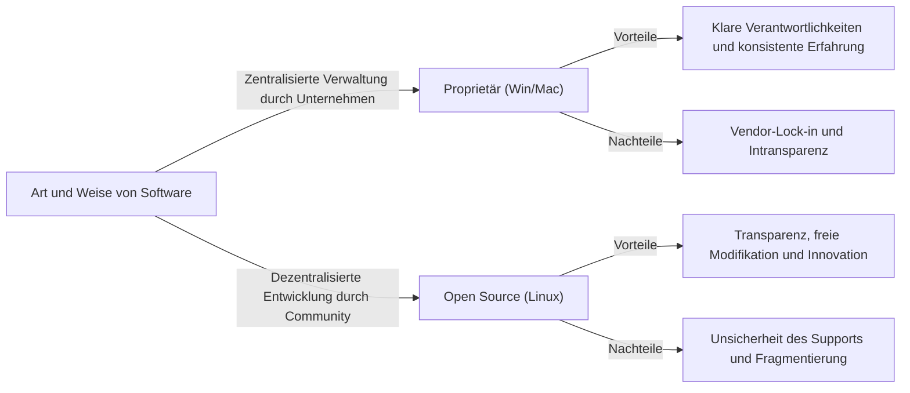

# Einführung: Warum Betriebssysteme zur "Religion" wurden

Während sich Computer von riesigen Maschinen für eine Handvoll Experten zu persönlichen Geräten entwickelten, die in unsere Taschen passen, war immer das "Betriebssystem (OS)" präsent. Das OS, das die Brücke zwischen Hardware und Software schlägt und den Kern der Benutzererfahrung definiert, hat sich über ein bloßes Werkzeug hinaus zu einem Symbol der menschlichen Identität und technologischen Philosophie entwickelt.

Dieses Phänomen wurde bald als "OS-Religionskriege (OS Holy Wars)" bekannt. Die überwältigende Verbreitung und der Pragmatismus von Windows, das raffinierte Design und die nutzerzentrierte Designphilosophie von Mac sowie das Ideal der Freiheit und Open Source von Linux. Diese gehen über bloße funktionale Überlegenheit hinaus und werfen die grundlegende Frage auf: "Wie sollten wir mit Technologie umgehen?"

In diesem Artikel werden wir die Geschichte dieses endlosen Kampfes enträtseln und tiefgehend untersuchen, wie jedes OS geboren wurde, sich entwickelt hat und sich gegenseitig beeinflusst hat.

## Kapitel 1: Der dreigeteilte Beginn und ihre jeweiligen Philosophien

Die Geschichte der Betriebssysteme begann in den späten 1970er und 1980er Jahren, als sich Computer in etwas Persönliches verwandelten. Jedes OS wurde mit völlig unterschiedlichen Hintergründen und Philosophien geboren.

### 1.1 Mac: Der Knotenpunkt von Technologie und Kunst
1984 stellte Apple den ersten Macintosh vor. Die von Steve Jobs vertretene Philosophie lautete: "Computer in die Hände aller Menschen". Während Computer damals üblicherweise über komplexe Befehlszeilen bedient wurden, machte der Mac die grafische Benutzeroberfläche (GUI) und die Maus populär.

Das Fundament von Apple ist "Kontrolle" und "perfekte Integration der Benutzererfahrung". Durch die konsequente Entwicklung von Hardware und Software im eigenen Haus wird den Benutzern ein nahtloses und intuitives Erlebnis geboten. Dies wird oft als "geschlossen (closed)" kritisiert, bringt aber gleichzeitig eine unübertroffene Schönheit und Stabilität hervor.

### 1.2 Windows: Ein PC auf jedem Schreibtisch
Während Apple das Potenzial der GUI aufzeigte, verfolgte Bill Gates von Microsoft einen anderen Ansatz. Unter der Vision "Ein Computer auf jedem Schreibtisch und in jedem Zuhause" entschied sich Microsoft dafür, sein OS an Hardwarehersteller zu lizenzieren.

Die Philosophie von Windows ist "Kompatibilität" und "Verbreitung". Sie bauten ein Ökosystem auf, das auf beliebiger Hardware lief und es jedem Softwareentwickler ermöglichte, frei Anwendungen zu erstellen. Dadurch erlangte Windows einen überwältigenden Marktanteil und wurde zum De-facto-Standard der Welt, von Unternehmen bis hin zu Haushalten.

### 1.3 Linux: Die Kristallisation von Freiheit und Hacker-Kultur
Linux, 1991 von dem finnischen Studenten Linus Torvalds entwickelt, entstand in einem völlig anderen Kontext. Linux, das aus der Unix-Linie stammt, verkörpert das Ideal von "Open Source", bei dem der Quellcode für jedermann zugänglich ist und frei geändert und weitergegeben werden kann.

Die Philosophie von Linux ist "Freiheit" und "Ko-Kreation durch die Community". Anstatt von einem einzigen Unternehmen kontrolliert zu werden, arbeiten Tausende von Entwicklern weltweit zusammen, um das System aufzubauen. Dieser Ansatz wurde anfangs als etwas für Hacker und Geeks angesehen, doch schließlich eroberte er die Welt als Serverinfrastruktur, die das Internet unterstützt, als Supercomputer und als Grundlage von Android.

## Kapitel 2: Die Geschichte des Zusammenstoßes (1990er bis 2000er Jahre)

In den 1990er und 2000er Jahren war der Kampf um Marktanteile bei Betriebssystemen äußerst erbittert. Die Ereignisse dieser Zeit wurden zu einem wichtigen Wendepunkt, der die Machtverhältnisse in der heutigen Technologiebranche bestimmte.

### 2.1 Der Schock und die überwältigende Dominanz von Windows 95
Das 1995 veröffentlichte Windows 95 löste ein gesellschaftliches Phänomen aus. Eine vollwertige GUI, Internetkonnektivität (später Internet Explorer) und Plug-and-Play vollendeten hier die Grundlage für moderne PCs. Der Erfolg von Windows 95 verschaffte Microsoft ein absolutes Monopol auf dem PC-Markt.

Angesichts dieser überwältigenden Dominanz geriet Apple vorübergehend in eine schwere Finanzkrise. Mit der Rückkehr von Steve Jobs im Jahr 1997 und dem anschließenden Erfolg des "iMac" erlebte Apple jedoch ein Comeback in seinem eigenen Nischenmarkt, der Wert auf Design und Lifestyle legt.

### 2.2 Der Browserkrieg und der Aufstieg des Webs
Das Hauptschlachtfeld des OS-Krieges verlagerte sich schließlich in den Internetraum. Der erste Browserkrieg zwischen Netscape und dem Internet Explorer definierte den Wert des OS als Plattform neu. Microsoft erlangte durch die Bündelung des IE mit Windows einen Vorteil, was jedoch auch zu Kartellrechtsklagen führte.

### 2.3 Die stille Revolution auf dem Servermarkt
Während Windows und Mac auf dem Desktop-Markt konkurrierten, gewann Linux in der Backend-Welt (Server), die das Internet unterstützt, stetig an Boden. In Kombination mit Open-Source-Software wie dem Apache HTTP Server (der LAMP-Stack) unterstützte es Start-ups während der Dotcom-Blase als kostengünstige und zuverlässige Infrastruktur.

## Kapitel 3: Der Konflikt der Ideen (Closed vs. Open)

Der Kern des OS-Religionskrieges ist kein bloßer Vergleich von Spezifikationen und Funktionen, sondern ein Konflikt der Ideen darüber, wie Technologie sein sollte.

### 3.1 Licht und Schatten der Nutzerzentrierung (Mac)
Der Ansatz des Mac (und von iOS) besteht darin, das System streng zu verwalten, um den Benutzern die besten Ergebnisse zu garantieren. Schöne Schnittstellen, konsistente Bedienbarkeit und hohe Sicherheit werden durch die "Einschließung (Walled Garden)" des Ökosystems durch Apple erreicht. Dies nimmt den Benutzern jedoch auch ein hohes Maß an Anpassbarkeit und Freiheit.

### 3.2 Das Dilemma des Plattform-Herrschers (Windows)
Windows legt seit langem Wert auf Abwärtskompatibilität. Die Tatsache, dass 20 Jahre alte Software auch auf dem neuesten OS läuft, ist ein absoluter Vorteil im geschäftlichen Einsatz. Diese massive Anhäufung von altem Code (Legacy Code) hat jedoch auch Systemaufblähung und Sicherheitslücken verursacht und zu einem Verlust an UI-Konsistenz geführt.

### 3.3 Ideal und Realität von Open Source (Linux)
Open-Source-Software, einschließlich Linux, basiert auf der Hacker-Ethik, dass "Informationen frei sein sollten". Jeder kann den Code überprüfen, ändern und seine eigene Distribution erstellen. Es gibt eine Vielzahl von Optionen wie Ubuntu, Fedora und Arch Linux. Diese "Vielfalt" hat jedoch gleichzeitig zu "Fragmentierung" geführt und die Einstiegshürde für normale Benutzer erhöht.

## Kapitel 4: Das Ende des Krieges und ein neues Paradigma (2010er Jahre und danach)

Die OS-Religionskriege, die lange angedauert hatten, haben sich ab den 2010er Jahren drastisch verändert. Mit der mobilen Revolution und dem Aufstieg der Cloud verlor die Frage "Welches Desktop-OS nutzen Sie?" selbst an Bedeutung.

### 4.1 Der Übergang zu Mobile und das neue Zweipol-System
Mit dem Aufkommen des iPhone (iOS) und Android verlagerte sich das Zentrum des Computings von PCs auf Smartphones. Paradoxerweise entstand auch in der mobilen Welt ein Szenario, das die Geschichte wiederholte: Apples geschlossener Ansatz (iOS) und Googles offener Ansatz (Linux-basiertes Android).

### 4.2 Die Verbreitung von Cloud- und Webanwendungen
Dank verbesserter Browserleistung und der Entwicklung von Cloud Computing können viele Aufgaben heute direkt im Webbrowser erledigt werden, unabhängig vom Betriebssystem. Microsoft Office wurde durch Google Workspace ersetzt, und moderne Tools wie Slack und Figma funktionieren auf jedem OS auf die gleiche Weise. Wir leben in einer Ära, in der sogar gesagt wird: "Das OS ist nur noch ein Bootloader, um den Browser auszuführen."

### 4.3 Die Transformation von Microsoft: "Microsoft ❤️ Linux"
Das größte Ereignis, das das Ende des OS-Krieges symbolisiert, ist wohl die Transformation von Microsoft. Microsoft, dessen ehemaliger CEO Steve Ballmer einst sagte: "Linux ist ein Krebsgeschwür", hat unter der Führung von Satya Nadella Open Source in großem Stil akzeptiert. Durch das Windows Subsystem for Linux (WSL) können Linux-Umgebungen nun direkt auf Windows ausgeführt werden, und mehr als die Hälfte der Betriebssysteme, die in der Azure-Cloud ausgeführt werden, sind Linux. Microsoft ist heute einer der weltweit größten Mitwirkenden an Open Source.

## Kapitel 5: Die Rolle des OS in der Zukunft des Computings

In der heutigen Zeit sind Windows, Mac und Linux keine "religiösen" Konfliktachsen mehr, sondern "Werkzeuge für den richtigen Zweck", die je nach Bedarf und Vorliebe ausgewählt werden.

- **Windows**: Eine überwältigende Spielumgebung, Affinität zu VR/AR-Hardware und eine Vielseitigkeit, die weiterhin das Backoffice von Unternehmen unterstützt. Durch die Einführung von WSL hat es sich auch zu einer attraktiven Plattform für Entwickler entwickelt.
- **Mac (macOS)**: Mit dem Aufkommen von Apple Silicon (M1/M2/M3-Chips) hat die Integration von Hard- und Software ein völlig neues Level erreicht. Es kombiniert erstaunliche Energieeffizienz mit Leistung und genießt immense Unterstützung von Kreativen und Ingenieuren.
- **Linux**: Es beherrscht die Welt im Verborgenen. Es unterstützt weiterhin die digitale Infrastruktur der modernen Gesellschaft als Basis für Cloud-Infrastruktur, Supercomputer, IoT-Geräte und Smartphones.

### Fazit: Vielfalt ist die treibende Kraft der Evolution
Die "OS-Religionskriege" haben oft zu fruchtlosen Streitigkeiten geführt. Da jedoch Systeme mit unterschiedlichen Philosophien miteinander konkurrierten und das Gute des anderen aufnahmen, konnte sich die Technologie so schnell entwickeln.

Die schönen Schriftarten und die GUI des Mac haben Windows beeinflusst, die Kompatibilität und das riesige Ökosystem von Windows haben Apple die Bedeutung einer Plattformstrategie gelehrt, und das Open-Source-Modell von Linux ist zur Grundlage der Softwareentwicklung für alle heutigen großen IT-Unternehmen geworden.

Egal für welches OS wir uns entscheiden, dahinter stehen die Leidenschaft und die Philosophie unzähliger Ingenieure. Die Geschichte des OS zu kennen, bedeutet, die Evolution des menschlichen Denkens über Technologie selbst zu kennen.
