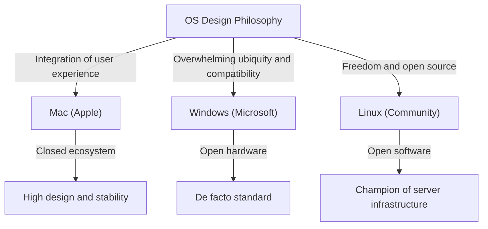
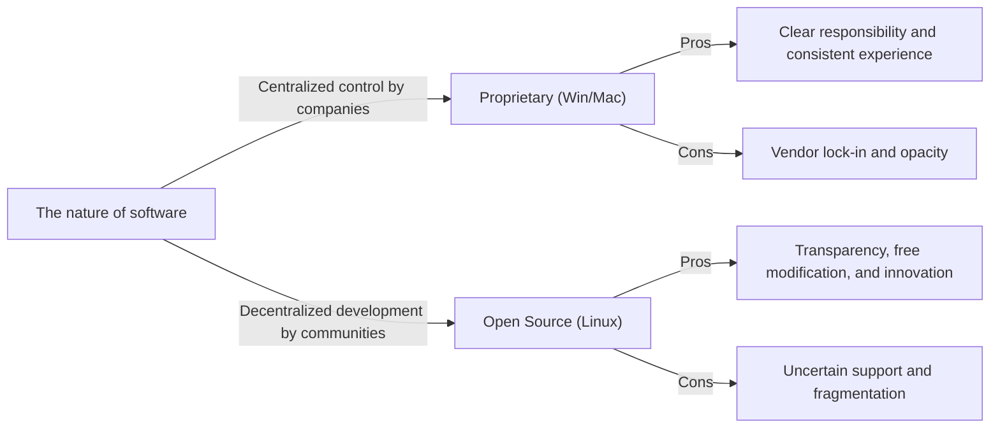

# Introduction: Why Did OS Become a "Religion"?

During the process in which computers evolved from massive machines for a few experts to personal devices that fit in our pockets, there has always been an "Operating System (OS)". Bridging hardware and software and defining the foundation of the user experience, the OS has transcended being a mere tool to become a symbol of people's identities and technological philosophies.

This phenomenon eventually came to be known as the "OS Holy Wars". The overwhelming popularization and pragmatism of Windows, the sophisticated design and user-centric design philosophy of Mac, and the ideals of freedom and open source of Linux. These transcend mere functional superiority and pose a fundamental question: "How should we interact with technology?"

In this article, we unravel the history of this endless struggle, thoroughly delving into how each OS was born, evolved, and influenced each other.

## Chapter 1: The Three-Way Beginning and Their Respective Philosophies

The history of the OS began in the late 1970s and 1980s when computers transformed into personal devices. Each OS was born with entirely different backgrounds and philosophies.

### 1.1 Mac: The Intersection of Technology and Art
In 1984, Apple announced the first Macintosh. The philosophy championed by Steve Jobs was "putting computers in the hands of everyone." While difficult operations via command line were the norm for computers at the time, the Mac popularized the Graphical User Interface (GUI) and the mouse.

At Apple's core is "control" and "perfect integration of the user experience." By consistently designing hardware and software in-house, they provide a seamless and intuitive experience for users. This is sometimes criticized as being "closed," but at the same time, it creates unparalleled beauty and stability.

### 1.2 Windows: A PC on Every Desk
While Apple demonstrated the potential of the GUI, Microsoft's Bill Gates took a different approach. Under the vision of "a computer on every desk and in every home," Microsoft chose the path of licensing its OS to hardware manufacturers.

The philosophy of Windows is "compatibility" and "ubiquity." They built an ecosystem that operates on any hardware, allowing any software developer to freely create applications. This allowed Windows to gain overwhelming market share, becoming the global de facto standard from businesses to homes.

### 1.3 Linux: The Crystallization of Freedom and Hacker Culture
Born in 1991 by Linus Torvalds, a Finnish student, Linux emerged from an entirely different context. Drawing from the lineage of Unix, Linux embodies the "open source" ideal, where the source code is publicly available to anyone and can be freely modified and redistributed.

The philosophy of Linux is "freedom" and "co-creation by the community." Instead of being controlled by a single company, thousands of developers worldwide collaborate to build the system. This approach was initially viewed as something for hackers and geeks, but eventually, it covered the world as the server infrastructure supporting the Internet, supercomputers, and the foundation of Android.

## Chapter 2: The History of Clashes (1990s - 2000s)

From the 1990s through the 2000s, the battle for OS market share was extremely fierce. The events of this period became a crucial turning point that determined the balance of power in the modern technology industry.

### 2.1 The Impact of Windows 95 and Overwhelming Dominance
Released in 1995, Windows 95 became a social phenomenon. A full-fledged GUI, Internet connectivity (which later became Internet Explorer), and Plug and Play—the foundation of modern PCs was completed here. With the success of Windows 95, Microsoft established an absolute monopoly in the PC market.

Faced with this overwhelming dominance, Apple temporarily fell into a severe management crisis. However, with the return of Steve Jobs in 1997 and the subsequent success of the "iMac", Apple staged a comeback in a unique niche market emphasizing design and lifestyle.

### 2.2 The Browser Wars and the Rise of the Web
The main battlefield of the OS wars eventually shifted to the Internet space. The First Browser War between Netscape and Internet Explorer redefined the value of the OS as a platform. Microsoft gained an advantage by bundling IE with Windows, but this also led to an antitrust lawsuit.

### 2.3 The Quiet Revolution in the Server Market
Behind the scenes of the desktop market battle between Windows and Mac, Linux was steadily expanding its power in the backend (server) world supporting the Internet. The combination with open source software like the Apache HTTP Server (the LAMP stack) supported startup companies during the dot-com bubble as an inexpensive and highly reliable infrastructure.

## Chapter 3: Ideological Conflicts (Closed vs. Open)

The core of the OS religious wars is not merely a comparison of specs and features, but an ideological conflict over how technology should be.

### 3.1 The Light and Shadow of User-Centricity (Mac)
The approach of the Mac (and iOS) is to strictly control the system to guarantee the best results for users. A beautiful interface, consistent operational feel, and high security are achieved by Apple "enclosing" the ecosystem (a walled garden). However, this also deprives users of deep-level customizability and freedom.

### 3.2 The Dilemma of the Platform Champion (Windows)
For a long time, Windows has prioritized backward compatibility. The fact that 20-year-old software can run on the latest OS is an absolute strength in business use. However, the accumulation of this massive legacy code has led to system bloat and security vulnerabilities, and it has also been a cause of undermining UI consistency.

### 3.3 The Ideals and Reality of Open Source (Linux)
Open-source software, including Linux, is based on the hacker ethic that "information should be free." Anyone can audit the code, modify it, and create their own distribution. Diverse options exist, such as Ubuntu, Fedora, and Arch Linux. However, this "diversity" simultaneously caused "fragmentation," raising the barrier to entry for general users.

## Chapter 4: The End of the Battle and a New Paradigm (2010s Onward)

The long-lasting OS religious wars underwent a major shift in the 2010s. With the mobile revolution and the rise of the cloud, the very question of "which desktop OS are you using?" became less meaningful.

### 4.1 The Shift to Mobile and a New Bipolar System
With the advent of the iPhone (iOS) and Android, the center of people's computing shifted from PCs to smartphones. Curiously, even in the mobile world, a structure resembling past history emerged: Apple's closed approach (iOS) versus the open approach led by Google (Linux-based Android).

### 4.2 The Spread of Cloud and Web Applications
Due to improvements in browser performance and the development of cloud computing, many tasks can now be completed on a web browser without depending on an OS. Microsoft Office has been substituted by Google Workspace, and modern tools like Slack and Figma work the same way on any OS. We have entered an era where it is even said that "an OS is merely a bootloader to run a browser."

### 4.3 Microsoft's Transformation: "Microsoft ❤️ Linux"
The biggest event symbolizing the end of the OS wars is likely Microsoft's transformation. Once, CEO Steve Ballmer called Linux "a cancer," but under Satya Nadella's leadership, Microsoft has massively embraced open source. With the Windows Subsystem for Linux (WSL), Linux environments now run directly on Windows, and over half of the operating systems running on the Azure cloud are Linux. Microsoft is now one of the world's largest open-source contributors.

## Chapter 5: The Role of the OS in the Future of Computing

In modern times, Windows, Mac, and Linux are no longer "religious" axes of conflict, but rather "right-tool-for-the-right-job" options chosen according to purpose and preference.

- **Windows**: An overwhelming gaming environment, affinity with VR/AR hardware, and the versatility that continues to support corporate back offices. With the introduction of WSL, it has evolved into an attractive platform for developers as well.
- **Mac (macOS)**: With the advent of Apple Silicon (M1/M2/M3 chips), the integration of hardware and software has reached a different dimension. It balances phenomenal power efficiency and performance, gaining massive support from creators and engineers.
- **Linux**: Dominating the world behind the scenes. It continues to support the digital foundation of modern society at the roots of cloud infrastructure, supercomputers, IoT devices, and smartphones.

### Conclusion: Diversity is the Driving Force of Evolution
The "OS Religious Wars" often bred fruitless arguments. However, because systems with different philosophies competed with and absorbed the good parts of each other, technology was able to develop so rapidly.

The beautiful fonts and GUI of the Mac influenced Windows, the compatibility and massive ecosystem of Windows taught Apple the importance of platform strategy, and the open-source model of Linux became the foundation of software development for all tech giants today.

No matter which OS we choose, the passion and philosophy of countless engineers breathe behind it. Knowing the history of the OS is knowing the very evolution of human thought toward technology.
