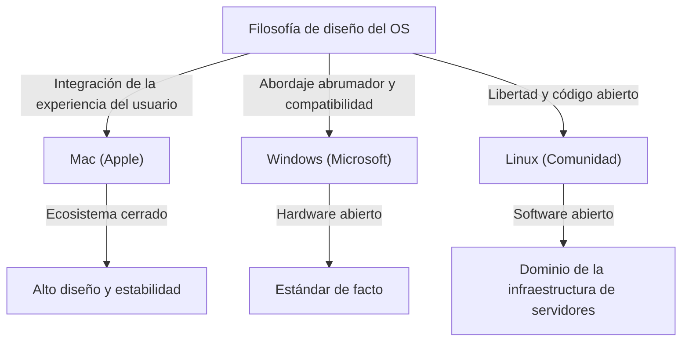
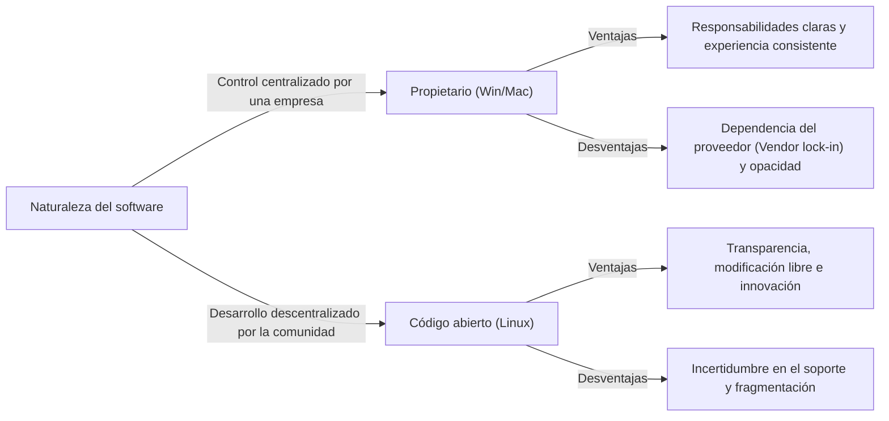

# Introducción: ¿Por qué los sistemas operativos se convirtieron en una "religión"?

En el proceso de evolución de las computadoras, pasando de ser máquinas gigantes para un grupo selecto de expertos a dispositivos personales que caben en nuestros bolsillos, siempre ha existido un "Sistema Operativo (OS)". Como puente entre el hardware y el software, y definiendo la base de la experiencia del usuario, el sistema operativo ha trascendido de ser una simple herramienta para convertirse en un símbolo de la identidad de las personas y de la filosofía tecnológica.

Con el tiempo, este fenómeno llegó a conocerse como la "Guerra Religiosa de los Sistemas Operativos (OS Holy Wars)". La abrumadora adopción y pragmatismo de Windows, el diseño sofisticado y la filosofía centrada en el usuario de Mac, y los ideales de libertad y código abierto de Linux. Estos aspectos van más allá de una simple superioridad de características y nos plantean una pregunta fundamental: "¿Cómo debemos interactuar con la tecnología?".

En este artículo, desentrañaremos la historia de esta lucha interminable, profundizando exhaustivamente en cómo cada sistema operativo nació, evolucionó y se ha influenciado mutuamente.

## Capítulo 1: El comienzo del triunvirato y sus respectivas filosofías

La historia de los sistemas operativos comenzó a finales de la década de 1970 y durante la de 1980, cuando las computadoras se transformaron en dispositivos personales. Cada sistema operativo nació con antecedentes y filosofías completamente diferentes.

### 1.1 Mac: La intersección entre tecnología y arte
En 1984, Apple presentó la primera Macintosh. La filosofía promovida por Steve Jobs era "computadoras en manos de todos". Si bien las operaciones complejas mediante líneas de comandos eran la norma en las computadoras de esa época, Mac popularizó la Interfaz Gráfica de Usuario (GUI) y el uso del ratón entre el público en general.

La base de Apple es el "control" y la "integración perfecta de la experiencia del usuario". Al diseñar consistentemente tanto el hardware como el software internamente, proporcionan a los usuarios una experiencia fluida e intuitiva. Aunque esto a veces es criticado como "cerrado", al mismo tiempo crea una belleza y estabilidad inigualables por otros.

### 1.2 Windows: Una PC en cada escritorio
Mientras Apple mostraba el potencial de la GUI, Bill Gates de Microsoft adoptó un enfoque diferente. Bajo la visión de "una computadora en cada escritorio y en cada hogar", Microsoft eligió licenciar su sistema operativo a los fabricantes de hardware.

La filosofía de Windows es "compatibilidad" y "popularización". Construyeron un ecosistema que funcionaba en cualquier hardware y permitía a cualquier desarrollador de software crear aplicaciones libremente. Como resultado, Windows capturó una cuota de mercado abrumadora, convirtiéndose en el estándar de facto mundial, desde los negocios hasta los hogares.

### 1.3 Linux: La cristalización de la libertad y la cultura hacker
Creado en 1991 por un estudiante finlandés, Linus Torvalds, Linux nació en un contexto completamente diferente. Con raíces en Unix, Linux encarna el concepto de "código abierto", donde el código fuente está disponible públicamente y cualquiera puede modificarlo y redistribuirlo libremente.

La filosofía de Linux es la "libertad" y la "cocreación por parte de la comunidad". En lugar de ser controlado por una sola empresa, miles de desarrolladores de todo el mundo colaboran para construir el sistema. Este enfoque, que inicialmente se consideraba exclusivo para hackers y geeks, finalmente cubriría el mundo como la infraestructura de servidores que sustenta Internet, las supercomputadoras y la base de Android.

## Capítulo 2: La historia del enfrentamiento (décadas de 1990 - 2000)

Desde la década de 1990 hasta la de 2000, la batalla por la cuota de mercado de los sistemas operativos fue feroz. Los eventos de este período marcaron puntos de inflexión importantes que determinaron el panorama de la industria tecnológica moderna.

### 2.1 El impacto y el dominio abrumador de Windows 95
Windows 95, lanzado en 1995, provocó un fenómeno social. Aquí se completaron los fundamentos de las PC modernas, incluyendo una GUI completa, capacidades de conexión a Internet (más tarde Internet Explorer) y Plug and Play. Con el éxito de Windows 95, Microsoft estableció un monopolio absoluto en el mercado de las PC.

Ante este dominio abrumador, Apple cayó temporalmente en una grave crisis financiera. Sin embargo, con el regreso de [Steve Jobs](/es/p/biography-steve-jobs/) en 1997 y el posterior éxito del "iMac", Apple experimentó un resurgimiento en su propio mercado de nicho centrado en el diseño y el estilo de vida.

### 2.2 La guerra de los navegadores y el auge de la Web
El principal campo de batalla de la guerra de los sistemas operativos finalmente se trasladó al espacio de Internet. La primera guerra de navegadores entre Netscape e Internet Explorer redefinió el valor del sistema operativo como plataforma. Microsoft obtuvo ventaja al incluir IE con Windows, pero esto también llevó a juicios antimonopolio.

### 2.3 La revolución silenciosa en el mercado de servidores
Mientras Windows y Mac competían en el mercado de escritorio, Linux expandía constantemente su influencia en el mundo backend (servidores) que sustenta Internet. La combinación con software de código abierto como Apache HTTP Server (la pila LAMP) apoyó a las startups durante la burbuja de las puntocom como una infraestructura barata y confiable.

## Capítulo 3: El choque de ideologías (Cerrado vs Abierto)

El núcleo de la guerra religiosa de los sistemas operativos no es solo una comparación de especificaciones y características, sino un choque ideológico sobre cómo debería ser la tecnología.

### 3.1 Luces y sombras del centrismo en el usuario (Mac)
El enfoque de Mac (y de iOS) es controlar estrictamente el sistema para garantizar el mejor resultado para el usuario. Una interfaz hermosa, una experiencia de usuario consistente y una alta seguridad se logran a través de que Apple "encierre" el ecosistema (jardín amurallado). Sin embargo, esto también priva a los usuarios de la personalización profunda y la libertad.

### 3.2 El dilema del campeón de la plataforma (Windows)
Windows ha priorizado durante mucho tiempo la compatibilidad con versiones anteriores. Que un software de hace 20 años aún se ejecute en el último sistema operativo es una ventaja absoluta en el uso comercial. Sin embargo, esta acumulación masiva de código heredado ha causado la hinchazón del sistema, vulnerabilidades de seguridad y la pérdida de coherencia de la interfaz de usuario.

### 3.3 Ideales y realidades del código abierto (Linux)
El software de código abierto, incluido Linux, se basa en la ética hacker de que "la información debe ser libre". Cualquiera puede auditar y modificar el código y crear sus propias distribuciones. Existen diversas opciones como Ubuntu, Fedora y Arch Linux. Sin embargo, esta "diversidad" ha causado simultáneamente una "fragmentación", elevando la barrera de entrada para el usuario promedio.

## Capítulo 4: El fin de la guerra y un nuevo paradigma (Desde 2010 en adelante)

La larga guerra religiosa de los sistemas operativos cambió drásticamente en la década de 2010. Con la [revolución móvil](/es/p/history-of-iphone/) y el auge de la nube, la pregunta de "¿Qué sistema operativo de escritorio estás usando?" perdió su significado en sí misma.

### 4.1 La transición al móvil y el nuevo sistema bipolar
Con la llegada del iPhone (iOS) y Android, el centro de la computación de las personas se trasladó de las PC a los teléfonos inteligentes. Curiosamente, en el mundo móvil, emergió un panorama similar al de la historia pasada, con el enfoque cerrado de Apple (iOS) y el enfoque abierto impulsado por Google (Android basado en Linux).

### 4.2 La nube y la adopción de aplicaciones web
Debido a las mejoras en el rendimiento de los navegadores y al desarrollo de la computación en la nube, muchas tareas ahora se pueden completar dentro de un navegador web, independientemente del sistema operativo. Microsoft Office también está siendo reemplazado por Google Workspace, y herramientas modernas como Slack o Figma funcionan igual en cualquier OS. Hemos llegado a una era donde se dice que "el OS es solo un gestor de arranque (bootloader) para ejecutar un navegador".

### 4.3 La transformación de Microsoft: "Microsoft ❤️ Linux"
El mayor evento que simboliza el final de las guerras de los sistemas operativos es, sin duda, la transformación de Microsoft. Microsoft, cuyo ex CEO Steve Ballmer declaró una vez que "Linux es un cáncer", ha abrazado el código abierto a gran escala bajo el liderazgo de Satya Nadella. El Windows Subsystem for Linux (WSL) permite que los entornos de Linux se ejecuten directamente en Windows, y más de la mitad de los sistemas operativos que se ejecutan en la nube de Azure son Linux. Microsoft es ahora uno de los mayores contribuyentes de código abierto del mundo.

## Capítulo 5: El papel del OS en el futuro de la computación

En el mundo actual, Windows, Mac y Linux ya no son ejes de conflictos "religiosos", sino herramientas para la "persona adecuada en el lugar adecuado", que se eligen según el propósito y las preferencias.

- **Windows**: Entorno de juego abrumador, afinidad con hardware de realidad virtual y aumentada (VR/AR), y la versatilidad para seguir apoyando los back office corporativos. Con la introducción de WSL, también ha evolucionado hasta convertirse en una plataforma atractiva para los desarrolladores.
- **Mac (macOS)**: Con la llegada de Apple Silicon (chips M1/M2/M3), la integración de hardware y software ha alcanzado otra dimensión. Al lograr una eficiencia energética y un rendimiento asombrosos, ha obtenido un inmenso apoyo de creadores e ingenieros.
- **Linux**: Domina el mundo detrás de escena. Continúa apoyando la base digital de la sociedad moderna en el núcleo de la infraestructura de la nube, las supercomputadoras, los dispositivos IoT y los teléfonos inteligentes.

### Conclusión: La diversidad es la fuerza impulsora de la evolución
La "guerra religiosa de los sistemas operativos" a menudo generaba discusiones estériles. Sin embargo, debido a que los sistemas con diferentes filosofías compitieron entre sí y absorbieron las mejores partes de los demás, la tecnología ha podido desarrollarse tan rápidamente.

Las hermosas fuentes y la GUI de Mac influyeron en Windows, la compatibilidad y el enorme ecosistema de Windows le enseñaron a Apple la importancia de una estrategia de plataforma, y el modelo de código abierto de Linux se ha convertido en la base del desarrollo de software para todas las grandes empresas de TI actuales.

Independientemente del sistema operativo que elijamos, detrás de él viven la pasión y la filosofía de innumerables ingenieros. Conocer la historia de los sistemas operativos es en sí mismo conocer la evolución del pensamiento humano hacia la tecnología.
