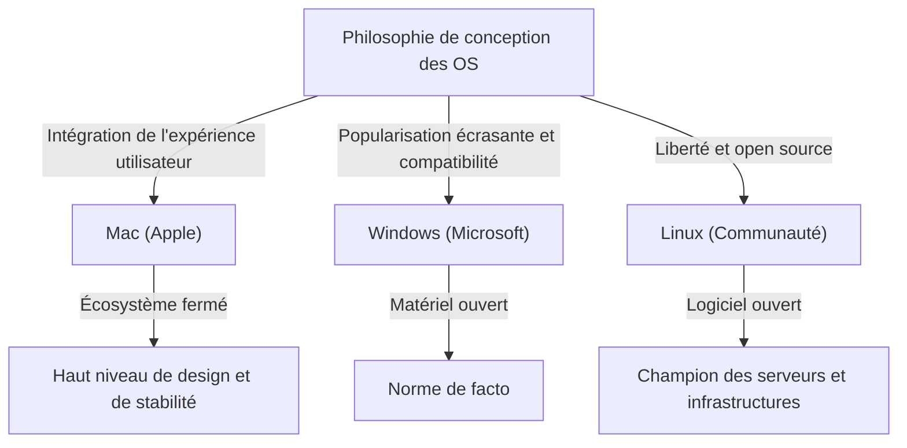
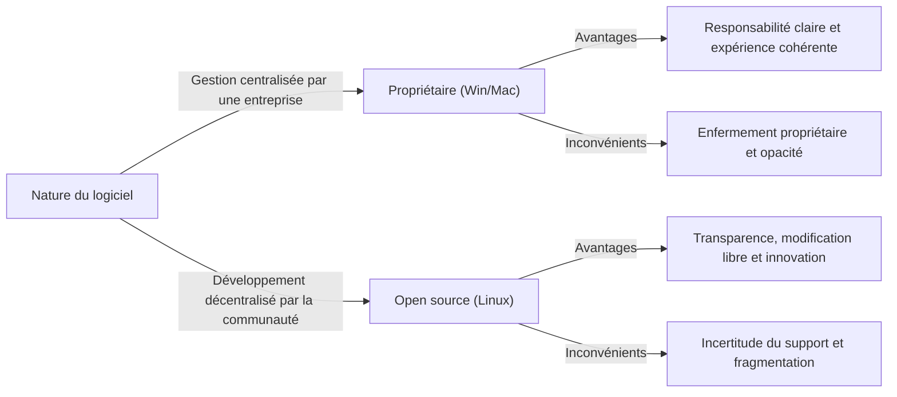

# Introduction : Pourquoi les OS sont-ils devenus une « religion » ?

Au cours du processus d'évolution de l'informatique, passant d'énormes machines réservées à quelques experts à des appareils personnels tenant dans nos poches, le « système d'exploitation (OS) » a toujours été présent. En faisant le pont entre le matériel et le logiciel et en définissant le cœur de l'expérience utilisateur, l'OS a transcendé le simple statut d'outil pour devenir le symbole de l'identité des personnes et de leur philosophie technologique.

Ce phénomène a fini par être appelé les « guerres de religion des OS » (OS Holy Wars). Le pragmatisme et l'adoption écrasante de Windows, le design raffiné et la philosophie de conception centrée sur l'utilisateur de Mac, ainsi que l'idéal de liberté et de l'open source de Linux. Ces éléments dépassent la simple supériorité ou infériorité fonctionnelle et soulèvent une question fondamentale : « Comment devons-nous aborder la technologie ? »

Dans cet article, nous allons dérouler l'histoire de cette lutte sans fin et analyser en profondeur comment chaque OS est né, a évolué et a mutuellement influencé les autres.

## Chapitre 1 : Le début du conflit à trois et leurs philosophies respectives

[L'histoire des OS](/fr/p/history-of-macos/) a commencé de la fin des années 1970 aux années 1980, époque à laquelle les ordinateurs se sont transformés en appareils personnels. Chaque OS est né avec un contexte et une philosophie totalement différents.

### 1.1 Mac : Le carrefour de la technologie et de l'art
En 1984, Apple a lancé le premier Macintosh. La philosophie prônée par Steve Jobs était : « L'ordinateur entre les mains de tous ». À l'époque, il était courant que les ordinateurs soient commandés par des lignes de commande complexes, mais le Mac a popularisé l'interface graphique (GUI) et la souris auprès du grand public.

À la base d'Apple, on trouve le « contrôle » et « l'intégration parfaite de l'expérience utilisateur ». En concevant de manière cohérente le matériel et le logiciel en interne, ils offrent aux utilisateurs une expérience fluide et intuitive. Bien que cela soit parfois critiqué comme étant « fermé (closed) », cela génère simultanément une beauté et une stabilité inégalées.

### 1.2 Windows : Un PC sur chaque bureau
Tandis qu'Apple démontrait le potentiel de l'interface graphique, Bill Gates de Microsoft a adopté une approche différente. Avec la vision d'« un ordinateur sur chaque bureau et dans chaque foyer », Microsoft a choisi d'accorder des licences de son OS aux fabricants de matériel.

La philosophie de Windows est « la compatibilité » et « la popularisation ». Ils ont construit un écosystème fonctionnant sur n'importe quel matériel, où tout développeur de logiciels peut créer librement des applications. Grâce à cela, Windows a acquis une part de marché écrasante, devenant la norme de facto mondiale, des entreprises aux foyers.

### 1.3 Linux : La liberté et la cristallisation de la culture hacker
En 1991, Linux, créé par un étudiant finlandais du nom de Linus Torvalds, est né dans un contexte totalement différent. Dans la lignée d'Unix, Linux incarne la philosophie de l'« open source », où le code source est ouvert à tous, et peut être librement modifié et redistribué.

La philosophie de Linux est « la liberté » et « la co-création par la communauté ». Le système n'est pas contrôlé par une seule entreprise, mais construit en collaboration par des milliers de développeurs à travers le monde. Cette approche, initialement perçue comme réservée aux hackers et aux geeks, finira par dominer le monde en tant qu'infrastructure de serveurs soutenant Internet, superordinateurs et base d'Android.

## Chapitre 2 : L'histoire des affrontements (Années 1990 - 2000)

De la décennie 1990 à celle des années 2000, la bataille pour les parts de marché des OS a été extrêmement féroce. Les événements de cette période ont été des tournants majeurs qui ont déterminé le paysage de l'industrie technologique moderne.

### 2.1 Le choc de Windows 95 et la domination écrasante
Windows 95, sorti en 1995, a provoqué un véritable phénomène de société. L'interface graphique complète, la fonctionnalité de connexion à Internet (qui deviendra Internet Explorer) et le Plug and Play ; les bases du PC moderne y ont été achevées. Grâce au succès de Windows 95, Microsoft a bâti un monopole absolu sur le marché des PC.

Face à cette domination écrasante, Apple a temporairement traversé une grave crise financière. Cependant, avec le retour de [Steve Jobs](/fr/p/biography-steve-jobs/) en 1997 et le succès ultérieur de l'« iMac », Apple a réussi à renaître sur son propre marché de niche privilégiant le design et le style de vie.

### 2.2 La guerre des navigateurs et l'essor du Web
Le champ de bataille principal des guerres d'OS s'est finalement déplacé vers l'espace Internet. La première guerre des navigateurs entre Netscape et Internet Explorer a redéfini la valeur de l'OS en tant que plateforme. Microsoft a pris l'avantage en intégrant IE à Windows, mais cela a également déclenché un procès pour violation de la loi antitrust.

### 2.3 Une révolution silencieuse sur le marché des serveurs
Dans l'ombre de la lutte entre Windows et Mac sur le marché des ordinateurs de bureau, Linux étendait régulièrement son influence dans le monde du back-end (serveurs) qui soutient Internet. En combinaison avec des logiciels open source comme Apache HTTP Server (la pile LAMP), il a soutenu les startups de l'ère de la bulle Internet en tant qu'infrastructure abordable et hautement fiable.

## Chapitre 3 : Conflit idéologique (Fermé vs Ouvert)

Le cœur des guerres de religion des OS ne réside pas dans une simple comparaison de spécifications ou de fonctionnalités, mais dans un conflit idéologique sur ce que devrait être la technologie.

### 3.1 La lumière et l'ombre de l'orientation utilisateur (Mac)
L'approche de Mac (et d'iOS) consiste à gérer rigoureusement le système pour garantir le meilleur résultat aux utilisateurs. Une interface magnifique, une expérience d'utilisation cohérente et une sécurité élevée sont rendues possibles par le fait qu'Apple « enclot » son écosystème (le Walled Garden). Cependant, cela prive également les utilisateurs d'un niveau profond de personnalisation et de liberté.

### 3.2 Le dilemme du champion des plateformes (Windows)
Pendant de nombreuses années, Windows a mis l'accent sur la rétrocompatibilité. Le fait qu'un logiciel vieux de 20 ans fonctionne même sur le dernier OS est un avantage absolu pour un usage professionnel. Cependant, cette accumulation d'un énorme code hérité a causé le gonflement du système, créé des vulnérabilités de sécurité et nui à la cohérence de l'interface utilisateur.

### 3.3 L'idéal et la réalité de l'open source (Linux)
Les logiciels open source, dont Linux est le chef de file, reposent sur l'éthique des hackers selon laquelle « l'information doit être libre ». N'importe qui peut auditer, modifier le code et créer sa propre distribution. Il existe diverses options comme Ubuntu, Fedora, Arch Linux, etc. Cependant, cette « diversité » a simultanément provoqué une « fragmentation », élevant la barrière d'entrée pour les utilisateurs ordinaires.

## Chapitre 4 : La fin de la bataille et le nouveau paradigme (Depuis les années 2010)

La guerre de religion des OS, qui a duré si longtemps, a vu son aspect radicalement changer au cours des années 2010. Avec [la révolution mobile](/fr/p/history-of-iphone/) et l'essor du cloud, la question « Quel OS de bureau utilisez-vous ? » a perdu de son sens.

### 4.1 La transition vers le mobile et le nouveau système bipolaire
Avec l'apparition de l'iPhone (iOS) et d'Android, le centre de l'informatique pour les gens est passé du PC au smartphone. Paradoxalement, dans le monde mobile, une configuration rappelant l'histoire s'est répétée : l'approche fermée d'Apple (iOS) contre l'approche ouverte dirigée par Google (Android basé sur Linux).

### 4.2 La démocratisation du cloud et des applications Web
Grâce à l'amélioration des performances des navigateurs et au développement du cloud computing, de nombreuses tâches sont désormais accomplies sur des navigateurs Web sans dépendre d'un OS. Microsoft Office a également été remplacé par Google Workspace, et des outils modernes comme Slack ou Figma fonctionnent de la même manière sur n'importe quel OS. Nous sommes entrés dans une époque où l'on dit même que « l'OS n'est plus qu'un chargeur d'amorçage pour exécuter un navigateur ».

### 4.3 La transformation de Microsoft : « Microsoft ❤️ Linux »
Le plus grand événement symbolisant la fin de la guerre des OS est sans doute la transformation de Microsoft. Alors que l'ancien PDG Steve Ballmer avait déclaré « Linux est un cancer », Microsoft, sous la direction de Satya Nadella, a massivement adopté l'open source. Le Windows Subsystem for Linux (WSL) permet aux environnements Linux de fonctionner directement sur Windows, et plus de la moitié des OS tournant sur le cloud Azure sont des Linux. Microsoft est désormais l'un des plus grands contributeurs open source au monde.

## Chapitre 5 : Le rôle de l'OS dans l'informatique de demain

À l'heure actuelle, Windows, Mac et Linux ne sont plus des axes d'opposition « religieuse », mais des outils choisis selon le principe du « bon outil pour le bon travail », en fonction des objectifs et des préférences.

- **Windows** : Un environnement de jeu écrasant, une affinité avec le matériel VR/AR, et une polyvalence qui continue de soutenir le back-office des entreprises. Avec l'introduction du WSL, il a également évolué vers une plateforme attrayante pour les développeurs.
- **Mac (macOS)** : Avec l'arrivée du silicium Apple (puces M1/M2/M3), l'intégration du matériel et du logiciel a atteint un niveau d'une autre dimension. Alliant une efficacité énergétique et des performances incroyables, il bénéficie d'un soutien inébranlable de la part des créateurs et des ingénieurs.
- **Linux** : Il domine le monde dans l'ombre. À la base de l'infrastructure cloud, des superordinateurs, des appareils IoT et des smartphones, il continue de soutenir les fondations numériques de la société moderne.

### Conclusion : La diversité est le moteur de l'évolution
Les « guerres de religion des OS » ont souvent engendré des disputes stériles. Cependant, c'est précisément parce que des systèmes aux philosophies différentes ont rivalisé et absorbé les points forts des autres que la technologie a pu se développer si rapidement.

Les superbes polices et l'interface graphique de Mac ont influencé Windows, la compatibilité et l'énorme écosystème de Windows ont enseigné à Apple l'importance de la stratégie de plateforme, et le modèle open source de Linux est devenu le fondement du développement logiciel de toutes les grandes entreprises informatiques actuelles.

Peu importe l'OS que nous choisissons, la passion et la philosophie d'innombrables ingénieurs vivent derrière lui. Connaître [l'histoire des OS](/fr/p/history-of-macos/) revient à comprendre l'évolution de la pensée de l'humanité vis-à-vis de la technologie.
