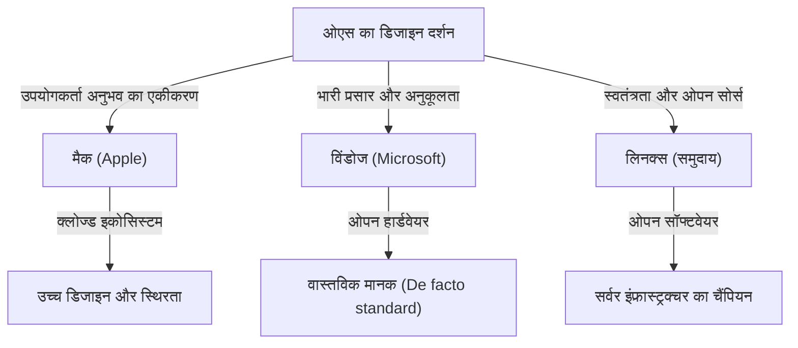
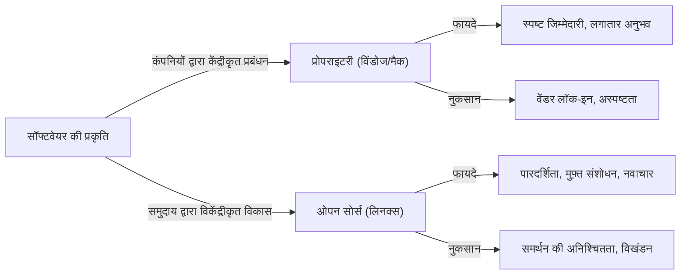

# प्रस्तावना: ओएस एक "धर्म" क्यों बन गया

जैसे-जैसे कंप्यूटर कुछ विशेषज्ञों के लिए एक विशाल मशीन से हमारी जेब में फिट होने वाले व्यक्तिगत डिवाइस में विकसित हुए, "ऑपरेटिंग सिस्टम (OS)" हमेशा वहां मौजूद रहा है। हार्डवेयर और सॉफ्टवेयर को जोड़ने और उपयोगकर्ता अनुभव की नींव को परिभाषित करने वाला ओएस, एक साधारण टूल से कहीं आगे बढ़कर लोगों की पहचान और तकनीकी दर्शन का प्रतीक बन गया है।

इस घटना को अंततः "ओएस धर्म युद्ध (OS Holy Wars)" के रूप में जाना जाने लगा। विंडोज का भारी प्रसार और व्यावहारिकता, मैक का परिष्कृत डिज़ाइन और उपयोगकर्ता-केंद्रित डिज़ाइन दर्शन, और लिनक्स के स्वतंत्रता और ओपन सोर्स के आदर्श। ये केवल कार्यों की श्रेष्ठता से परे जाते हैं और एक मौलिक प्रश्न उठाते हैं: "हमें प्रौद्योगिकी के साथ कैसे जुड़ना चाहिए?"

इस लेख में, हम संघर्ष के इस अंतहीन इतिहास को उजागर करेंगे और गहराई से जानेंगे कि प्रत्येक ओएस कैसे पैदा हुआ, विकसित हुआ और एक-दूसरे को कैसे प्रभावित किया।

## अध्याय 1: तीन-तरफा शुरुआत और उनके संबंधित दर्शन

ओएस का इतिहास 1970 के दशक के अंत और 1980 के दशक के बीच शुरू हुआ, जब कंप्यूटर व्यक्तिगत चीजों में बदल रहे थे। प्रत्येक ओएस बिल्कुल अलग पृष्ठभूमि और दर्शन के साथ पैदा हुआ था।

### 1.1 मैक: प्रौद्योगिकी और कला का चौराहा
1984 में, Apple ने पहला Macintosh जारी किया। स्टीव जॉब्स का दर्शन था "कंप्यूटर सभी के हाथों में।" उस समय के कंप्यूटरों को कमांड लाइन का उपयोग करके संचालित करना मुश्किल था, लेकिन मैक ने ग्राफिकल यूज़र इंटरफेस (GUI) और माउस को लोकप्रिय बना दिया।

Apple की नींव में "नियंत्रण" और "उपयोगकर्ता अनुभव का सही एकीकरण" है। हार्डवेयर और सॉफ्टवेयर को घर में लगातार डिजाइन करके, हम उपयोगकर्ताओं को एक सहज और सहज अनुभव प्रदान करते हैं। हालाँकि इसे कभी-कभी "बंद (क्लोज्ड)" के रूप में आलोचित किया जाता है, यह एक बेजोड़ सुंदरता और स्थिरता भी बनाता है।

### 1.2 विंडोज: हर डेस्क पर एक पीसी
जबकि Apple ने GUI की क्षमता दिखाई, Microsoft के बिल गेट्स ने एक अलग दृष्टिकोण अपनाया। "हर डेस्क और हर घर में एक कंप्यूटर" की दृष्टि के साथ, Microsoft ने अपने स्वयं के ओएस को हार्डवेयर निर्माताओं को लाइसेंस देने का विकल्प चुना।

विंडोज का दर्शन "अनुकूलता" और "प्रसार" है। हमने एक ऐसा इकोसिस्टम बनाया है जो किसी भी हार्डवेयर पर काम करता है और किसी भी सॉफ्टवेयर डेवलपर को स्वतंत्र रूप से एप्लिकेशन बनाने की अनुमति देता है। नतीजतन, विंडोज ने एक भारी बाजार हिस्सेदारी हासिल कर ली है और व्यवसाय से लेकर घर तक दुनिया में वास्तविक मानक (de facto standard) बन गया है।

### 1.3 लिनक्स: स्वतंत्रता और हैकर संस्कृति का क्रिस्टलीकरण
1991 में, एक फिनिश छात्र लिनुस टोरवाल्ड्स द्वारा निर्मित लिनक्स, पूरी तरह से अलग संदर्भ में पैदा हुआ था। लिनक्स, जो यूनिक्स के वंश से आता है, "ओपन सोर्स" के दर्शन का प्रतीक है, जहां स्रोत कोड किसी के लिए भी उपलब्ध है और इसे स्वतंत्र रूप से संशोधित और पुनर्वितरित किया जा सकता है।

लिनक्स का दर्शन "स्वतंत्रता" और "समुदाय द्वारा सह-निर्माण" है। किसी एक कंपनी के हावी होने के बजाय, दुनिया भर के हजारों डेवलपर्स एक सिस्टम बनाने के लिए एक साथ काम करते हैं। इस दृष्टिकोण को शुरू में हैकर्स और गीक्स के लिए माना जाता था, लेकिन अंततः यह दुनिया भर में सर्वर इंफ्रास्ट्रक्चर, सुपर कंप्यूटर और एंड्रॉइड की नींव के रूप में हावी हो जाएगा जो इंटरनेट का समर्थन करता है।

## अध्याय 2: संघर्ष का इतिहास (1990 से 2000 का दशक)

1990 के दशक और 2000 के दशक में, ओएस बाजार हिस्सेदारी की लड़ाई भयंकर थी। इस अवधि की घटनाएँ आधुनिक प्रौद्योगिकी उद्योग के शक्ति मानचित्र को निर्धारित करने वाले एक महत्वपूर्ण मोड़ बन गईं।

### 2.1 विंडोज 95 का प्रभाव और भारी प्रभुत्व
1995 में जारी विंडोज 95 एक सामाजिक घटना बन गया। आधुनिक पीसी की नींव यहां पूरी हुई, जिसमें एक पूर्ण GUI, इंटरनेट कनेक्शन क्षमताएं (बाद में इंटरनेट एक्सप्लोरर) और प्लग एंड प्ले शामिल हैं। विंडोज 95 की सफलता के साथ, Microsoft ने पीसी बाजार में पूर्ण एकाधिकार स्थापित किया।

इस भारी प्रभुत्व के सामने Apple कुछ समय के लिए एक गंभीर प्रबंधन संकट में पड़ गया। हालांकि, 1997 में स्टीव जॉब्स की वापसी और उसके बाद "iMac" की सफलता के साथ, Apple ने डिजाइन और जीवन शैली पर केंद्रित अपने स्वयं के विशिष्ट बाजार में वापसी की।

### 2.2 ब्राउज़र युद्ध और वेब का उदय
ओएस युद्धों का मुख्य युद्धक्षेत्र अंततः इंटरनेट स्पेस में स्थानांतरित हो गया। नेटस्केप और इंटरनेट एक्सप्लोरर के बीच पहले ब्राउज़र युद्ध ने एक मंच के रूप में ओएस के मूल्य को फिर से परिभाषित किया। Microsoft ने विंडोज के साथ IE को बंडल करके बढ़त हासिल की, लेकिन इससे अविश्वास (Antitrust) मुकदमों का भी सामना करना पड़ा।

### 2.3 सर्वर बाजार में एक शांत क्रांति
डेस्कटॉप बाजार में विंडोज और मैक के बीच लड़ाई के पीछे, लिनक्स इंटरनेट का समर्थन करने वाले बैकएंड (सर्वर) की दुनिया में लगातार अपनी शक्ति का विस्तार कर रहा था। अपाचे HTTP सर्वर जैसे ओपन सोर्स सॉफ्टवेयर के साथ संयुक्त (LAMP स्टैक), इसने डॉट-कॉम बबल के दौरान स्टार्टअप कंपनियों को एक सस्ते और विश्वसनीय बुनियादी ढांचे के रूप में समर्थन दिया।

## अध्याय 3: विचारधाराओं का संघर्ष (क्लोज्ड बनाम ओपन)

ओएस धर्म युद्धों का मूल केवल चश्मे और कार्यों की तुलना नहीं है, बल्कि प्रौद्योगिकी कैसी होनी चाहिए, इस पर विचारधाराओं का टकराव है।

### 3.1 उपयोगकर्ता-केंद्रितता (मैक) का प्रकाश और छाया
मैक (और iOS) का दृष्टिकोण उपयोगकर्ताओं को सर्वोत्तम परिणामों की गारंटी देने के लिए सिस्टम को सख्ती से प्रबंधित करना है। सुंदर इंटरफेस, लगातार संचालन की भावना और उच्च सुरक्षा Apple के इकोसिस्टम ("वॉल्ड गार्डन") को घेरकर महसूस की जाती है। हालाँकि, यह उपयोगकर्ताओं को अनुकूलन और स्वतंत्रता के गहरे स्तर से भी वंचित करता है।

### 3.2 प्लेटफॉर्म चैंपियन (विंडोज) की दुविधा
विंडोज ने लंबे समय से बैकवर्ड कम्पैटिबिलिटी (पिछली अनुकूलता) पर जोर दिया है। तथ्य यह है कि 20 साल पुराना सॉफ़्टवेयर नवीनतम ओएस पर चलता है, व्यावसायिक उपयोग में एक पूर्ण लाभ है। हालाँकि, इस भारी विरासत कोड के संचय ने सिस्टम की सूजन और सुरक्षा कमजोरियों को पैदा किया है, और UI की स्थिरता को भी खराब किया है।

### 3.3 ओपन सोर्स (लिनक्स) के आदर्श और वास्तविकता
लिनक्स सहित ओपन सोर्स सॉफ्टवेयर हैकर की नैतिकता पर आधारित है कि "जानकारी मुफ्त होनी चाहिए।" कोई भी कोड का ऑडिट कर सकता है, उसे संशोधित कर सकता है और अपना खुद का वितरण बना सकता है। उबंटू, फेडोरा, और आर्च लिनक्स जैसे कई विकल्प हैं। हालांकि, इस "विविधता" ने "विखंडन (Fragmentation)" भी पैदा किया है, जिससे आम उपयोगकर्ताओं के लिए सीमा अधिक हो गई है।

## अध्याय 4: लड़ाई का अंत और नया प्रतिमान (2010 के दशक और उसके बाद)

लंबे समय तक चलने वाले ओएस धर्म युद्ध 2010 के दशक में काफी बदल गए। मोबाइल क्रांति और क्लाउड के उदय के साथ, "आप किस डेस्कटॉप ओएस का उपयोग कर रहे हैं?" सवाल का अर्थ ही फीका पड़ गया।

### 4.1 मोबाइल और नई द्विध्रुवीय प्रणाली में संक्रमण
आईफोन (आईओएस) और एंड्रॉइड के आगमन के साथ, लोगों की कंप्यूटिंग का केंद्र पीसी से स्मार्टफोन में स्थानांतरित हो गया। अजीब बात है, मोबाइल की दुनिया में भी, Apple के क्लोज्ड दृष्टिकोण (iOS) और Google के नेतृत्व वाले ओपन दृष्टिकोण (लिनक्स-आधारित एंड्रॉइड) ने अतीत के इतिहास को दोहराते हुए एक ऐसी ही स्थिति बनाई।

### 4.2 क्लाउड और वेब अनुप्रयोगों का प्रसार
बेहतर ब्राउज़र प्रदर्शन और क्लाउड कंप्यूटिंग के विकास के साथ, ओएस पर भरोसा किए बिना कई कार्य अब वेब ब्राउज़र में पूरे हो गए हैं। Microsoft Office को भी Google Workspace से बदल दिया गया है, और Slack और Figma जैसे आधुनिक उपकरण किसी भी OS पर समान रूप से काम करते हैं। हम एक ऐसे युग में हैं जहाँ यह कहा जाता है कि "OS ब्राउज़र को चलाने के लिए बस एक बूटलोडर है।"

### 4.3 Microsoft का परिवर्तन: "Microsoft ❤️ Linux"
ओएस युद्धों के अंत का प्रतीक सबसे बड़ी घटना शायद Microsoft का परिवर्तन है। स्टीव बाल्मर, पूर्व सीईओ जिन्होंने एक बार कहा था कि "लिनक्स एक कैंसर है," की कंपनी ने सत्य नडेला के नेतृत्व में ओपन सोर्स को बड़े पैमाने पर अपनाया। विंडोज सबसिस्टम फॉर लिनक्स (WSL) लिनक्स वातावरण को सीधे विंडोज पर चलाने की अनुमति देता है, और Azure क्लाउड पर चलने वाले ओएस का बहुमत अब लिनक्स है। Microsoft अब दुनिया के सबसे बड़े ओपन सोर्स योगदानकर्ताओं में से एक है।

## अध्याय 5: कंप्यूटिंग के भविष्य में OS की भूमिका

आधुनिक समय में, विंडोज, मैक और लिनक्स अब "धार्मिक" संघर्ष नहीं हैं, बल्कि "सही जगह पर सही व्यक्ति" वाले उपकरण हैं जिन्हें उद्देश्य या वरीयता के आधार पर चुना जाता है।

- **Windows**: भारी गेमिंग वातावरण, VR/AR हार्डवेयर के साथ आत्मीयता, और बहुमुखी प्रतिभा जो कॉर्पोरेट बैक ऑफिस का समर्थन करना जारी रखती है। WSL के पेश होने के साथ, यह डेवलपर्स के लिए एक आकर्षक प्लेटफॉर्म में विकसित हुआ है।
- **Mac (macOS)**: Apple सिलिकॉन (M1/M2/M3 चिप्स) के आगमन के साथ, हार्डवेयर और सॉफ्टवेयर का एकीकरण एक अलग स्तर पर पहुंच गया है। यह अविश्वसनीय शक्ति दक्षता और प्रदर्शन को जोड़ती है, और रचनाकारों और इंजीनियरों से अपार समर्थन प्राप्त किया है।
- **Linux**: दुनिया पर अदृश्य रूप से राज करता है। यह क्लाउड इंफ्रास्ट्रक्चर, सुपरकंप्यूटर, IoT डिवाइस और स्मार्टफोन के मूल में आधुनिक समाज की डिजिटल नींव का समर्थन करना जारी रखता है।

### निष्कर्ष: विविधता विकास की प्रेरक शक्ति है
"ओएस धर्म युद्ध" ने अक्सर निरर्थक तर्क उत्पन्न किए। हालांकि, प्रौद्योगिकी इतनी तेजी से विकसित होने में सक्षम थी क्योंकि विभिन्न दर्शन वाली प्रणालियों ने एक-दूसरे के साथ प्रतिस्पर्धा की और अच्छे भागों को अवशोषित किया।

मैक के सुंदर फोंट और GUI ने विंडोज को प्रभावित किया, विंडोज की अनुकूलता और विशाल पारिस्थितिकी तंत्र ने Apple को प्लेटफॉर्म रणनीति का महत्व सिखाया, और लिनक्स का ओपन सोर्स मॉडल आज की सभी दिग्गज आईटी कंपनियों के सॉफ्टवेयर विकास की नींव बन गया।

हम जो भी ओएस चुनते हैं, उसके पीछे अनगिनत इंजीनियरों का जुनून और दर्शन होता है। ओएस के इतिहास को जानना प्रौद्योगिकी के प्रति मानव सोच के विकास को जानना है।
