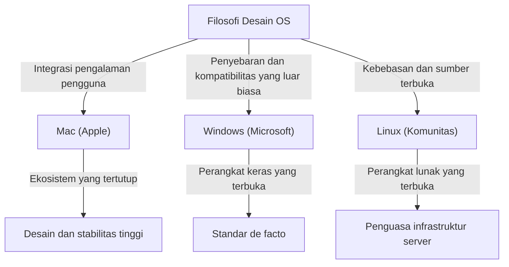
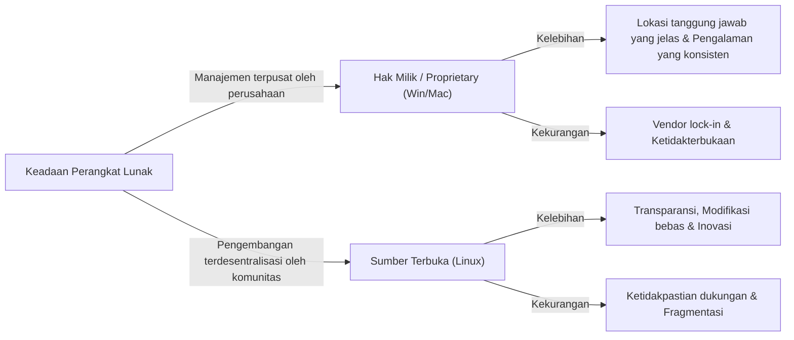

# Pendahuluan: Mengapa OS Menjadi Sebuah "Agama"

Dalam proses evolusi komputer dari mesin raksasa untuk sebagian ahli menjadi perangkat personal yang muat di saku kita, selalu ada keberadaan "Sistem Operasi (OS)". Menjembatani perangkat keras dan perangkat lunak, serta mendefinisikan dasar pengalaman pengguna, OS telah melampaui sekadar alat dan bertransformasi menjadi simbol yang mewakili identitas dan filosofi teknologi manusia.

Fenomena ini pada akhirnya disebut sebagai "Perang Agama OS (OS Holy Wars)". Penyebaran dan pragmatisme Windows yang luar biasa, filosofi desain Mac yang elegan dan berpusat pada pengguna, serta idealisme kebebasan dan sumber terbuka dari Linux. Semua ini melampaui sekadar keunggulan dan kelemahan fitur, serta mengajukan pertanyaan mendasar tentang "bagaimana kita seharusnya berhadapan dengan teknologi".

Dalam artikel ini, kita akan menelusuri sejarah pertarungan yang tiada akhir ini, dan menggali secara mendalam bagaimana setiap OS lahir, berevolusi, dan saling memengaruhi satu sama lain.

## Bab 1: Awal dari Persaingan Tiga Pihak dan Filosofi Masing-masing

Sejarah OS dimulai pada akhir 1970-an hingga 1980-an, ketika komputer bertransformasi menjadi sesuatu yang personal. Setiap OS lahir dengan latar belakang dan filosofi yang sama sekali berbeda.

### 1.1 Mac: Persimpangan Antara Teknologi dan Seni
Pada tahun 1984, Apple merilis Macintosh generasi pertama. Filosofi yang diusung oleh Steve Jobs adalah "menempatkan komputer di tangan semua orang". Pada masa itu, pengoperasian komputer yang rumit melalui baris perintah adalah hal yang lumrah, tetapi Mac mempopulerkan Antarmuka Pengguna Grafis (GUI) dan mouse kepada masyarakat umum.

Dasar dari Apple adalah "kendali" dan "integrasi sempurna pengalaman pengguna". Dengan merancang perangkat keras dan perangkat lunak secara konsisten di dalam perusahaan, mereka memberikan pengalaman yang mulus dan intuitif kepada pengguna. Hal ini terkadang dikritik sebagai sesuatu yang "tertutup (closed)", tetapi pada saat yang sama menghasilkan keindahan dan stabilitas yang tidak dapat ditandingi oleh yang lain.

### 1.2 Windows: PC di Setiap Meja
Sementara Apple menunjukkan potensi GUI, Bill Gates dari Microsoft mengambil pendekatan yang berbeda. Di bawah visi "sebuah komputer di setiap meja dan di setiap rumah", Microsoft memilih jalan untuk melisensikan OS mereka sendiri kepada produsen perangkat keras.

Filosofi Windows adalah "kompatibilitas" dan "penyebaran". Mereka membangun ekosistem yang dapat berjalan pada perangkat keras apa pun, dan di mana setiap pengembang perangkat lunak dapat dengan bebas membuat aplikasi. Hal ini memungkinkan Windows untuk memperoleh pangsa pasar yang sangat besar dan menjadi standar de facto dunia, mulai dari bisnis hingga rumah tangga.

### 1.3 Linux: Kristalisasi Budaya Kebebasan dan Peretas
Linux, yang diciptakan pada tahun 1991 oleh Linus Torvalds, seorang mahasiswa Finlandia, lahir dari konteks yang sama sekali berbeda. Linux, yang mewarisi aliran Unix, mewujudkan idealisme "sumber terbuka (open source)" di mana kode sumbernya terbuka untuk siapa saja dan dapat diubah serta didistribusikan kembali secara bebas.

Filosofi Linux adalah "kebebasan" dan "penciptaan bersama oleh komunitas". Daripada dikendalikan oleh satu perusahaan, ribuan pengembang dari seluruh dunia bekerja sama untuk membangun sistem. Pendekatan ini awalnya dianggap hanya untuk peretas (hacker) dan kutu buku (geek), tetapi pada akhirnya menyelimuti dunia sebagai infrastruktur server yang mendukung internet, superkomputer, dan fondasi Android.

## Bab 2: Sejarah Bentrokan (Era 1990-an hingga 2000-an)

Dari tahun 1990-an hingga 2000-an, pertarungan pangsa pasar OS menjadi sangat sengit. Peristiwa pada periode ini menjadi titik balik penting yang menentukan peta kekuatan industri teknologi modern.

### 2.1 Dampak dan Dominasi Mutlak Windows 95
Windows 95, yang dirilis pada tahun 1995, memicu fenomena sosial. Dasar-dasar PC modern, seperti GUI berskala penuh, fitur koneksi internet (yang kemudian menjadi Internet Explorer), dan plug-and-play, disempurnakan di sini. Melalui kesuksesan Windows 95, Microsoft membangun monopoli absolut di pasar PC.

Menghadapi dominasi yang luar biasa ini, Apple sempat jatuh ke dalam krisis manajemen yang parah. Namun, dengan kembalinya Steve Jobs pada tahun 1997 dan kesuksesan "iMac" setelahnya, Apple berhasil bangkit kembali di pasar khusus (niche) unik mereka yang menekankan desain dan gaya hidup.

### 2.2 Perang Peramban (Browser) dan Kebangkitan Web
Medan pertempuran utama dalam perang OS pada akhirnya bergeser ke ruang internet. Perang peramban pertama antara Netscape dan Internet Explorer mendefinisikan ulang nilai OS sebagai sebuah platform. Microsoft mendapatkan keunggulan dengan membundel IE ke dalam Windows, tetapi hal ini juga memicu persidangan pelanggaran undang-undang antimonopoli.

### 2.3 Revolusi Senyap di Pasar Server
Di balik persaingan Windows dan Mac di pasar desktop, Linux terus memperluas kekuasaannya di dunia back-end (server) yang mendukung internet. Kombinasinya dengan perangkat lunak sumber terbuka seperti Apache HTTP Server (LAMP stack) mendukung perusahaan rintisan (startup) selama era gelembung dot-com sebagai infrastruktur yang murah dan dapat diandalkan.

## Bab 3: Konflik Ideologi (Tertutup vs Terbuka)

Inti dari Perang Agama OS bukanlah sekadar perbandingan spesifikasi atau fitur, melainkan konflik ideologis mengenai bagaimana teknologi seharusnya.

### 3.1 Cahaya dan Bayangan dari Sentrisme Pengguna (Mac)
Pendekatan Mac (dan iOS) adalah mengelola sistem secara ketat untuk menjamin hasil terbaik bagi pengguna. Antarmuka yang indah, pengalaman pengoperasian yang konsisten, dan keamanan tinggi dicapai melalui Apple yang "memagari" ekosistemnya (walled garden). Namun, ini juga berarti merampas kebebasan dan tingkat kustomisasi yang mendalam dari pengguna.

### 3.2 Dilema Sang Penguasa Platform (Windows)
Selama bertahun-tahun, Windows sangat menekankan kompatibilitas ke belakang (backward compatibility). Fakta bahwa perangkat lunak dari 20 tahun yang lalu masih dapat berjalan di OS terbaru adalah keunggulan mutlak dalam penggunaan bisnis. Namun, akumulasi kode warisan (legacy) yang masif ini telah menyebabkan pembengkakan sistem, kerentanan keamanan, serta hilangnya konsistensi UI.

### 3.3 Idealisme dan Realitas Sumber Terbuka (Linux)
Perangkat lunak sumber terbuka, termasuk Linux, didasarkan pada etika peretas bahwa "informasi harus bebas". Siapa pun dapat mengaudit, memodifikasi kode, dan membuat distribusi mereka sendiri. Terdapat berbagai pilihan yang tersedia, seperti Ubuntu, Fedora, dan Arch Linux. Namun, "keragaman" ini pada saat yang sama juga menyebabkan "fragmentasi", yang telah menaikkan standar dan menyulitkan pengguna umum.

## Bab 4: Akhir dari Pertempuran dan Paradigma Baru (Sejak 2010-an)

Perang agama OS yang telah berlangsung lama ini mengalami perubahan besar dalam lanskapnya memasuki tahun 2010-an. Dengan revolusi seluler dan kebangkitan cloud, pertanyaan mengenai "OS desktop mana yang Anda gunakan" telah kehilangan maknanya.

### 4.1 Transisi ke Seluler dan Sistem Bipolar Baru
Dengan munculnya iPhone (iOS) dan Android, pusat komputasi orang-orang bergeser dari PC ke ponsel pintar (smartphone). Menariknya, di dunia seluler pun tercipta struktur yang tampaknya mengulang sejarah masa lalu, yaitu pendekatan tertutup dari Apple (iOS) dan pendekatan terbuka yang dipimpin oleh Google (Android berbasis Linux).

### 4.2 Penyebaran Cloud dan Aplikasi Web
Seiring dengan peningkatan kinerja peramban dan perkembangan komputasi awan (cloud computing), banyak tugas yang kini dapat diselesaikan di peramban web tanpa bergantung pada OS. Microsoft Office telah digantikan oleh Google Workspace, dan alat modern seperti Slack atau Figma berfungsi sama baiknya di OS mana pun. Kita telah memasuki era di mana orang bahkan mengatakan bahwa "OS hanyalah sebuah bootloader untuk menjalankan peramban".

### 4.3 Transformasi Microsoft: "Microsoft ❤️ Linux"
Peristiwa terbesar yang melambangkan akhir dari perang OS mungkin adalah transformasi dari Microsoft. Microsoft, yang CEO-nya, Steve Ballmer, pernah menyatakan bahwa "Linux adalah kanker", kini telah secara besar-besaran merangkul sumber terbuka di bawah kepemimpinan Satya Nadella. Melalui Windows Subsystem for Linux (WSL), lingkungan Linux kini dapat berjalan langsung di atas Windows, dan lebih dari separuh OS yang berjalan di cloud Azure adalah Linux. Microsoft kini merupakan salah satu kontributor sumber terbuka terbesar di dunia.

## Bab 5: Peran OS dalam Komputasi Masa Depan

Di era modern, Windows, Mac, dan Linux bukan lagi poros konflik "agama", melainkan alat untuk "orang yang tepat di tempat yang tepat" yang dipilih berdasarkan tujuan dan preferensi.

- **Windows**: Lingkungan bermain game (gaming) yang luar biasa, afinitas dengan perangkat keras VR/AR, serta keserbagunaan yang terus mendukung administrasi bisnis (back-office) perusahaan. Melalui pengenalan WSL, Windows juga telah berevolusi menjadi platform yang menarik bagi para pengembang.
- **Mac (macOS)**: Dengan kemunculan Apple Silicon (chip M1/M2/M3), integrasi antara perangkat keras dan perangkat lunak telah mencapai tingkatan yang sama sekali baru. Menggabungkan efisiensi daya dan kinerja yang luar biasa, Mac telah mendapatkan dukungan luar biasa dari para pembuat konten (creator) dan insinyur.
- **Linux**: Menguasai dunia di balik layar. Linux terus mendukung fondasi digital masyarakat modern di tingkat dasar pada infrastruktur cloud, superkomputer, perangkat IoT, dan ponsel pintar.

### Kesimpulan: Keragaman adalah Kekuatan Pendorong Evolusi
"Perang Agama OS" sering kali melahirkan perdebatan yang sia-sia. Namun, justru karena sistem-sistem dengan filosofi berbeda ini saling bersaing dan menyerap hal-hal baik dari satu sama lain, teknologi dapat berkembang dengan sangat pesat hingga saat ini.

Font dan GUI yang indah dari Mac telah memengaruhi Windows, kompatibilitas dan ekosistem Windows yang masif telah mengajarkan Apple tentang pentingnya strategi platform, dan model sumber terbuka Linux telah menjadi fondasi pengembangan perangkat lunak untuk semua raksasa IT saat ini.

Apa pun OS yang kita pilih, ada semangat dan filosofi dari banyak insinyur yang tak terhitung jumlahnya yang hidup di baliknya. Mengetahui sejarah OS berarti mengetahui evolusi pemikiran umat manusia terhadap teknologi itu sendiri.
