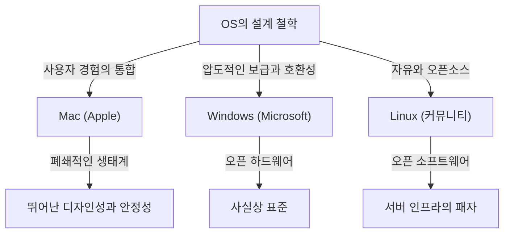
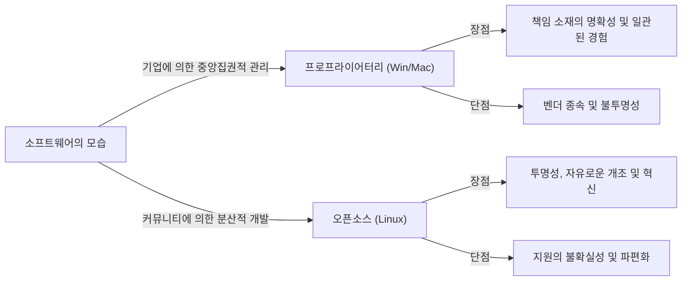

# 들어가며: 왜 OS는 "종교"가 되었는가

컴퓨터가 일부 전문가를 위한 거대한 기계에서 우리 주머니에 들어가는 개인용 기기로 진화하는 과정에서 항상 그곳에는 "운영체제(OS)"가 존재했습니다. 하드웨어와 소프트웨어를 연결하고 사용자 경험의 근간을 정의하는 OS는 단순한 도구를 넘어 사람들의 정체성과 기술 철학을 상징하는 것으로 승화되었습니다.

이 현상은 어느덧 "OS 종교 전쟁(OS Holy Wars)"이라고 불리게 되었습니다. Windows의 압도적인 보급과 실용주의, Mac의 세련된 디자인과 사용자 중심의 설계 철학, 그리고 Linux의 자유와 오픈소스라는 이념. 이들은 단순한 기능의 우열을 넘어 우리가 "기술을 어떻게 마주해야 하는가"라는 근본적인 질문을 던지고 있습니다.

이 글에서는 이 끝없는 투쟁의 역사를 풀고, 각 OS가 어떻게 탄생하고 진화하며 서로에게 영향을 미쳐왔는지 철저하게 깊이 파헤쳐봅니다.

## 제1장: 삼파전의 서막과 각각의 철학

OS의 역사는 컴퓨터가 개인적인 것으로 변모하기 시작한 1970년대 후반부터 1980년대에 걸쳐 막을 올렸습니다. 각각의 OS는 전혀 다른 배경과 철학을 가지고 탄생했습니다.

### 1.1 Mac: 기술과 예술의 교차점
1984년, Apple은 초대 Macintosh를 발표했습니다. 스티브 잡스가 내건 철학은 "컴퓨터를 모든 사람의 손에"라는 것이었습니다. 당시 컴퓨터는 명령줄을 통한 난해한 조작이 당연했지만, Mac은 그래픽 사용자 인터페이스(GUI)와 마우스를 널리 대중화했습니다.

Apple의 근저에 있는 것은 "제어"와 "사용자 경험의 완벽한 통합"입니다. 하드웨어와 소프트웨어를 자사에서 일관되게 설계함으로써 사용자에게 원활하고 직관적인 경험을 제공합니다. 이는 "폐쇄적(closed)"이라고 비판받기도 하지만, 동시에 다른 것들이 추종을 불허하는 아름다움과 안정성을 만들어냅니다.

### 1.2 Windows: 모든 책상에 PC를
Apple이 GUI의 가능성을 보여준 한편, Microsoft의 빌 게이츠는 다른 접근 방식을 취했습니다. "모든 책상과 모든 가정에 컴퓨터를"이라는 비전 아래, Microsoft는 하드웨어 제조업체에 자사의 OS를 라이선스 제공하는 길을 택했습니다.

Windows의 철학은 "호환성"과 "보급"입니다. 어떤 하드웨어에서도 동작하고 모든 소프트웨어 개발자가 자유롭게 애플리케이션을 만들 수 있는 생태계를 구축했습니다. 이로 인해 Windows는 압도적인 점유율을 획득하고 비즈니스부터 가정까지 세계의 사실상 표준(de facto standard)이 되었습니다.

### 1.3 Linux: 자유와 해커 문화의 결정체
1991년, 핀란드 학생이었던 리누스 토발즈에 의해 탄생한 Linux는 전혀 다른 맥락에서 탄생했습니다. Unix의 흐름을 이어받은 Linux는 소스 코드가 누구에게나 공개되고 자유롭게 변경 및 재배포할 수 있는 "오픈소스" 이념을 구현하고 있습니다.

Linux의 철학은 "자유"와 "커뮤니티를 통한 공동 창조"입니다. 한 기업이 지배하는 것이 아니라 전 세계 수천 명의 개발자가 협력하여 시스템을 만들어냅니다. 이 접근 방식은 초기에는 해커나 긱(geek)을 위한 것으로 여겨졌지만, 이내 인터넷을 지탱하는 서버 인프라나 슈퍼컴퓨터, 그리고 Android의 기반으로서 세상을 뒤덮게 됩니다.

## 제2장: 격돌의 역사 (1990년대~2000년대)

1990년대부터 2000년대에 걸쳐 OS의 점유율 경쟁은 치열함을 극에 달했습니다. 이 시기의 사건들은 현대 기술 업계의 세력 구도를 결정짓는 중요한 전환점이 되었습니다.

### 2.1 Windows 95의 충격과 압도적 지배
1995년에 발매된 Windows 95는 사회 현상을 불러일으켰습니다. 본격적인 GUI, 인터넷 접속 기능(이후의 Internet Explorer), 그리고 플러그 앤 플레이 등 현대 PC의 기초가 여기서 완성되었습니다. Windows 95의 성공으로 Microsoft는 PC 시장에서 절대적인 독점 상태를 구축했습니다.

이 압도적인 지배에 맞서 Apple은 한때 심각한 경영 위기에 빠졌습니다. 그러나 1997년 [스티브 잡스](/ko/p/biography-steve-jobs/)의 복귀와 그 후 "iMac"의 성공으로, Apple은 디자인과 라이프스타일을 중시하는 독자적인 틈새시장에서 부활을 이뤄냅니다.

### 2.2 브라우저 전쟁과 Web의 대두
OS 전쟁의 주전장은 이내 인터넷 공간으로 이동했습니다. Netscape와 Internet Explorer가 벌인 제1차 브라우저 전쟁은 플랫폼으로서 OS의 가치를 재정의했습니다. Microsoft는 Windows에 IE를 번들로 제공함으로써 우위를 점했지만, 이것이 독점금지법 위반 재판을 유발하기도 했습니다.

### 2.3 서버 시장에서의 조용한 혁명
데스크톱 시장에서 Windows와 Mac이 다투고 있는 이면에, 인터넷을 지탱하는 백엔드(서버) 세계에서는 Linux가 착실하게 세력을 확장하고 있었습니다. Apache HTTP Server 등의 오픈소스 소프트웨어와의 조합(LAMP 스택)은 저렴하고 신뢰성 높은 인프라로서 닷컴 버블 시대의 스타트업 기업을 지탱했습니다.

## 제3장: 사상의 대립 (폐쇄형 vs 개방형)

OS 종교 전쟁의 핵심은 단순한 사양이나 기능의 비교가 아니라, 기술이 어떠해야 하는가 하는 사상의 대립에 있습니다.

### 3.1 사용자 중심주의(Mac)의 빛과 그림자
Mac(그리고 iOS)의 접근 방식은 사용자에게 최상의 결과를 보장하기 위해 시스템을 엄격하게 관리하는 것입니다. 아름다운 인터페이스, 일관된 조작감, 높은 보안은 Apple이 생태계를 "둘러싸는(Walled Garden)" 것으로 실현하고 있습니다. 그러나 이는 사용자로부터 깊은 수준의 커스터마이징이나 자유를 빼앗는 것이기도 합니다.

### 3.2 플랫폼 패자(Windows)의 딜레마
Windows는 오랜 세월 후위 호환성을 중시해 왔습니다. 20년 전 소프트웨어가 최신 OS에서도 작동한다는 것은 비즈니스 용도에 있어 절대적인 강점입니다. 그러나 이 거대한 레거시 코드의 축적은 시스템의 비대화나 보안 취약성을 낳고, 또한 UI의 일관성을 훼손하는 원인이 되기도 했습니다.

### 3.3 오픈소스(Linux)의 이상과 현실
Linux를 비롯한 오픈소스 소프트웨어는 "정보는 자유로워야 한다"는 해커의 윤리에 기반을 두고 있습니다. 누구나 코드를 감사하고 수정하며 독자적인 배포판을 만들 수 있습니다. Ubuntu, Fedora, Arch Linux 등 다양한 선택지가 존재합니다. 그러나 이 "다양성"은 동시에 "파편화(Fragmentation)"를 일으켜 일반 사용자에게는 진입 장벽을 높이고 말았습니다.

## 제4장: 전쟁의 종언과 새로운 패러다임 (2010년대 이후)

오랫동안 지속된 OS 종교 전쟁이지만, 2010년대에 들어서자 그 양상은 크게 변화했습니다. [모바일 혁명](/ko/p/history-of-iphone/)과 클라우드의 대두로 인해 "어떤 데스크톱 OS를 사용하고 있는가"라는 질문 자체의 의미가 옅어진 것입니다.

### 4.1 모바일로의 전환과 새로운 양극 체제
iPhone(iOS)과 Android의 등장으로 사람들의 컴퓨팅 중심은 PC에서 스마트폰으로 이동했습니다. 공교롭게도 모바일 세계에서도 Apple의 폐쇄적인 접근 방식(iOS)과 Google이 주도하는 개방적인 접근 방식(Linux 기반의 Android)이라는, 과거의 역사를 반복하는 듯한 구도가 생겨났습니다.

### 4.2 클라우드와 Web 애플리케이션의 보급
브라우저의 성능 향상과 클라우드 컴퓨팅의 발전으로 많은 작업이 OS에 의존하지 않고 Web 브라우저 상에서 완결되게 되었습니다. Microsoft Office도 Google Workspace로 대체되고, Slack이나 Figma 같은 현대적인 도구는 어떤 OS에서든 똑같이 동작합니다. "OS는 브라우저를 구동하기 위한 부트로더에 불과하다"고까지 말하는 시대가 된 것입니다.

### 4.3 Microsoft의 변혁: "Microsoft ❤️ Linux"
OS 전쟁의 종결을 상징하는 가장 큰 사건은 Microsoft의 변모일 것입니다. 과거 스티브 발머 CEO가 "Linux는 암이다"라고 발언했던 Microsoft는, 사티아 나델라 체제 하에서 오픈소스를 대대적으로 받아들였습니다. Windows Subsystem for Linux (WSL)를 통해 Windows 상에서 직접 Linux 환경이 구동되게 되었고, Azure 클라우드에서 가동되는 OS의 과반수는 Linux가 되었습니다. Microsoft는 이제 세계 최대의 오픈소스 기여자 중 하나입니다.

## 제5장: 미래 컴퓨팅에서의 OS의 역할

현대에서 Windows, Mac, Linux는 더 이상 "종교적"인 대립축이 아니라, 목적이나 취향에 따라 선택하는 "적재적소"의 도구가 되었습니다.

- **Windows**: 압도적인 게임 환경, VR/AR 하드웨어와의 친화성, 그리고 기업의 백오피스를 계속해서 지탱하는 범용성. WSL의 도입으로 개발자에게도 매력적인 플랫폼으로 진화하고 있습니다.
- **Mac (macOS)**: Apple Silicon(M1/M2/M3 칩)의 등장으로 하드웨어와 소프트웨어의 통합은 이차원의 수준에 도달했습니다. 경이로운 전력 효율과 성능을 양립시켜 크리에이터나 엔지니어로부터 절대적인 지지를 얻고 있습니다.
- **Linux**: 보이지 않는 곳에서 세상을 지배하고 있습니다. 클라우드 인프라, 슈퍼컴퓨터, IoT 디바이스, 그리고 스마트폰의 근간에서 현대 사회의 디지털 기반을 계속해서 지탱하고 있습니다.

### 요약: 다양성야말로 진화의 원동력
"OS 종교 전쟁"은 종종 소모적인 말다툼을 낳았습니다. 그러나 다른 철학을 가진 시스템들이 서로 경쟁하고 좋은 부분을 흡수했기에, 기술은 이토록 빠르게 발전할 수 있었습니다.

Mac의 아름다운 글꼴과 GUI는 Windows에 영향을 주었고, Windows의 호환성과 거대한 생태계는 Apple에 플랫폼 전략의 중요성을 가르쳐 주었으며, Linux의 오픈소스 모델은 현재의 모든 거대 IT 기업의 소프트웨어 개발의 기반이 되었습니다.

우리가 어떤 OS를 선택하든, 그 이면에는 셀 수 없이 많은 엔지니어들의 열정과 철학이 살아 숨쉬고 있습니다. OS의 역사를 아는 것은 인류의 기술에 대한 사고의 진화를 아는 것 그 자체입니다.
