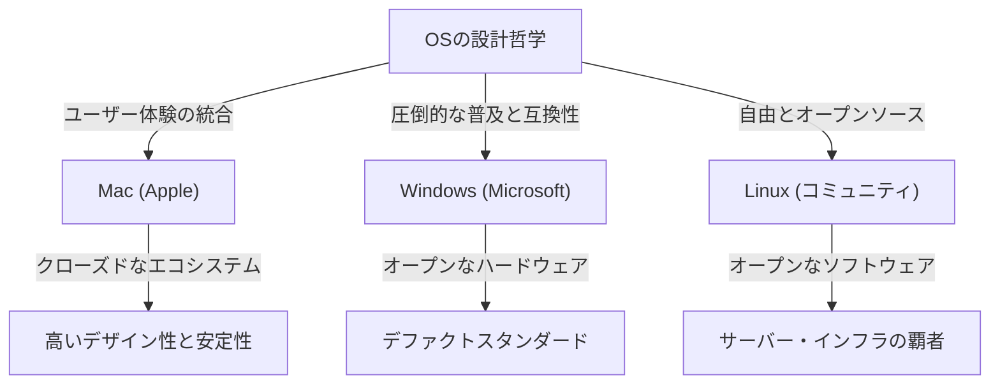
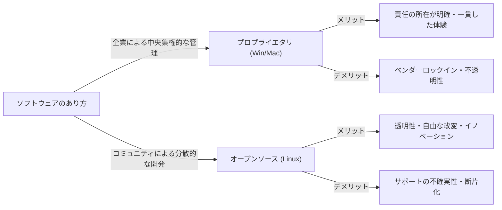

# はじめに：なぜOSは「宗教」となったのか

コンピューターが一部の専門家のための巨大な機械から、私たちのポケットに収まるパーソナルなデバイスへと進化する過程で、常にそこには「オペレーティングシステム（OS）」の存在がありました。ハードウェアとソフトウェアを橋渡しし、ユーザー体験の根幹を定義するOSは、単なるツールを超えて、人々のアイデンティティや技術哲学を象徴するものへと昇華しました。

この現象はいつしか「OS宗教戦争（OS Holy Wars）」と呼ばれるようになりました。Windowsの圧倒的な普及と実用主義、Macの洗練されたデザインとユーザー中心の設計哲学、そしてLinuxの自由とオープンソースという理念。これらは単なる機能の優劣を超え、私たちが「テクノロジーとどう向き合うべきか」という根本的な問いを投げかけています。

本記事では、この果てしない闘争の歴史を紐解き、各OSがどのように誕生し、進化し、そして互いに影響を与え合ってきたのかを徹底的に深掘りします。

## 第1章：三つ巴の幕開けとそれぞれの哲学

OSの歴史は、コンピューターがパーソナルなものへと変貌を遂げる1970年代後半から1980年代にかけて幕を開けました。それぞれのOSは全く異なる背景と哲学を持って誕生しました。

### 1.1 Mac：技術と芸術の交差点
1984年、Appleは初代Macintoshを発表しました。スティーブ・ジョブズが掲げた哲学は、「コンピューターをすべての人々の手に」というものでした。当時のコンピューターはコマンドラインによる難解な操作が当たり前でしたが、Macはグラフィカル・ユーザー・インターフェース（GUI）とマウスを一般に普及させました。

Appleの根底にあるのは「コントロール」と「ユーザー体験の完璧な統合」です。ハードウェアとソフトウェアを自社で一貫して設計することで、ユーザーにシームレスで直感的な体験を提供します。これは「閉鎖的（クローズド）」と批判されることもありますが、同時に他の追随を許さない美しさと安定性を生み出しています。

### 1.2 Windows：あらゆる机にPCを
AppleがGUIの可能性を示した一方で、Microsoftのビル・ゲイツは異なるアプローチをとりました。「すべての机と、すべての家庭にコンピューターを」というビジョンのもと、Microsoftはハードウェアメーカーに自社のOSをライセンス提供する道を選びました。

Windowsの哲学は「互換性」と「普及」です。どのようなハードウェアでも動作し、あらゆるソフトウェア開発者が自由にアプリケーションを作れるエコシステムを構築しました。これによりWindowsは圧倒的なシェアを獲得し、ビジネスから家庭まで、世界のデファクトスタンダードとなりました。

### 1.3 Linux：自由とハッカー文化の結晶
1991年、フィンランドの学生だったリーナス・トーバルズによって生み出されたLinuxは、全く異なる文脈から誕生しました。Unixの流れを汲むLinuxは、ソースコードが誰にでも公開され、自由に変更・再配布できる「オープンソース」の理念を体現しています。

Linuxの哲学は「自由」と「コミュニティによる共創」です。一社の企業が支配するのではなく、世界中の何千人もの開発者が協力してシステムを作り上げる。このアプローチは、初期はハッカーやギークのためのものと見なされていましたが、やがてインターネットを支えるサーバーインフラや、スーパーコンピューター、そしてAndroidの基盤として世界を覆い尽くすことになります。

## 第2章：激突の歴史（1990年代〜2000年代）

1990年代から2000年代にかけて、OSのシェア争いは熾烈を極めました。この時期の出来事は、現代のテクノロジー業界の勢力図を決定づける重要な転換点となりました。

### 2.1 Windows 95の衝撃と圧倒的支配
1995年に発売されたWindows 95は、社会現象を巻き起こしました。本格的なGUI、インターネットへの接続機能（のちのInternet Explorer）、そしてプラグアンドプレイなど、現代のPCの基礎がここで完成しました。Windows 95の成功により、MicrosoftはPC市場において絶対的な独占状態を築き上げました。

この圧倒的な支配に対して、Appleは一時深刻な経営危機に陥りました。しかし、1997年の[スティーブ・ジョブズ](/p/biography-steve-jobs/)の復帰と、その後の「iMac」の成功により、Appleはデザインとライフスタイルを重視する独自のニッチ市場で復活を果たします。

### 2.2 ブラウザ戦争とWebの台頭
OS戦争の主戦場は、やがてインターネット空間へと移行しました。NetscapeとInternet Explorerによる第一次ブラウザ戦争は、OSのプラットフォームとしての価値を再定義しました。MicrosoftはWindowsにIEをバンドルすることで優位に立ちましたが、これが独占禁止法違反の裁判を引き起こすことにもなりました。

### 2.3 サーバー市場での静かなる革命
デスクトップ市場でWindowsとMacが争っている裏で、インターネットを支えるバックエンド（サーバー）の世界ではLinuxが着実に勢力を拡大していました。Apache HTTP Serverなどのオープンソースソフトウェアとの組み合わせ（LAMPスタック）は、安価で信頼性の高いインフラとして、ドットコムバブル期のスタートアップ企業を支えました。

## 第3章：思想の対立（クローズド vs オープン）

OS宗教戦争の核心は、単なるスペックや機能の比較ではなく、テクノロジーはどうあるべきかという思想の対立にあります。

### 3.1 ユーザー中心主義（Mac）の光と影
Mac（およびiOS）のアプローチは、ユーザーに最高の結果を保証するために、システムを厳格に管理することです。美しいインターフェース、一貫した操作感、高いセキュリティは、Appleがエコシステムを「囲い込む（ウォールド・ガーデン）」ことで実現されています。しかし、これはユーザーから深いレベルのカスタマイズ性や自由を奪うことでもあります。

### 3.2 プラットフォームの覇者（Windows）のジレンマ
Windowsは長年、後方互換性を重視してきました。20年前のソフトウェアが最新のOSでも動作するというのは、ビジネス用途においては絶対的な強みです。しかし、この巨大なレガシーコードの蓄積は、システムの肥大化やセキュリティの脆弱性を生み出し、またUIの一貫性を損なう原因ともなりました。

### 3.3 オープンソース（Linux）の理想と現実
Linuxをはじめとするオープンソース・ソフトウェアは、「情報は自由であるべき」というハッカーの倫理に基づいています。誰でもコードを監査し、修正し、独自のディストリビューションを作ることができます。Ubuntu、Fedora、Arch Linuxなど、多様な選択肢が存在します。しかし、この「多様性」は同時に「断片化（フラグメンテーション）」を引き起こし、一般ユーザーにとっての敷居を高くしてしまいました。

## 第4章：戦いの終焉と新たなパラダイム（2010年代以降）

長らく続いたOS宗教戦争ですが、2010年代に入るとその様相は大きく変化しました。[モバイル革命](/p/history-of-iphone/)とクラウドの台頭により、「どのデスクトップOSを使っているか」という問い自体の意味が薄れていったのです。

### 4.1 モバイルへの移行と新たな二極体制
iPhone（iOS）とAndroidの登場により、人々のコンピューティングの中心はPCからスマートフォンへと移行しました。奇しくもモバイルの世界でも、Appleのクローズドなアプローチ（iOS）と、Googleが主導するオープンなアプローチ（LinuxベースのAndroid）という、かつての歴史を繰り返すような構図が生まれました。

### 4.2 クラウドとWebアプリケーションの普及
ブラウザの性能向上とクラウドコンピューティングの発展により、多くの作業がOSに依存せずにWebブラウザ上で完結するようになりました。Microsoft OfficeもGoogle Workspaceに代替され、SlackやFigmaなどの現代的なツールはどのOSでも同じように動作します。「OSはブラウザを動かすためのブートローダーに過ぎない」とすら言われる時代になったのです。

### 4.3 Microsoftの変革：「Microsoft ❤️ Linux」
OS戦争の終結を象徴する最大の出来事は、Microsoftの変貌でしょう。かつてスティーブ・バルマーCEOが「Linuxはガンだ」と発言したMicrosoftは、サティア・ナデラ体制のもとでオープンソースを大々的に受け入れました。Windows Subsystem for Linux (WSL) によりWindows上で直接Linux環境が動くようになり、Azureクラウド上で稼働するOSの過半数はLinuxとなりました。Microsoftは今や世界最大のオープンソース貢献者の一つです。

## 第5章：未来のコンピューティングにおけるOSの役割

現代において、Windows、Mac、Linuxはもはや「宗教的」な対立軸ではなく、目的や好みに応じて選ぶ「適材適所」のツールとなりました。

- **Windows**: 圧倒的なゲーム環境、VR/ARハードウェアとの親和性、そして企業のバックオフィスを支え続ける汎用性。WSLの導入により、開発者にとっても魅力的なプラットフォームに進化しています。
- **Mac (macOS)**: Apple Silicon（M1/M2/M3チップ）の登場により、ハードとソフトの統合は異次元のレベルに到達しました。驚異的な電力効率とパフォーマンスを両立させ、クリエイターやエンジニアから絶大な支持を得ています。
- **Linux**: 見えないところで世界を支配しています。クラウドインフラ、スーパーコンピューター、IoTデバイス、そしてスマートフォンの根底で、現代社会のデジタル基盤を支え続けています。

### まとめ：多様性こそが進化の原動力
「OS宗教戦争」は、しばしば不毛な言い争いを生み出しました。しかし、異なる哲学を持つシステムが互いに競い合い、良い部分を吸収し合ったからこそ、テクノロジーはここまで急速に発展することができました。

Macの美しいフォントとGUIはWindowsに影響を与え、Windowsの互換性と巨大なエコシステムはAppleにプラットフォーム戦略の重要性を教え、Linuxのオープンソースモデルは現在のすべての巨大IT企業のソフトウェア開発の基盤となりました。

私たちがどのOSを選ぶにせよ、その背後には数え切れないほどのエンジニアたちの情熱と哲学が息づいています。OSの歴史を知ることは、人類のテクノロジーに対する思考の進化を知ることそのものなのです。
