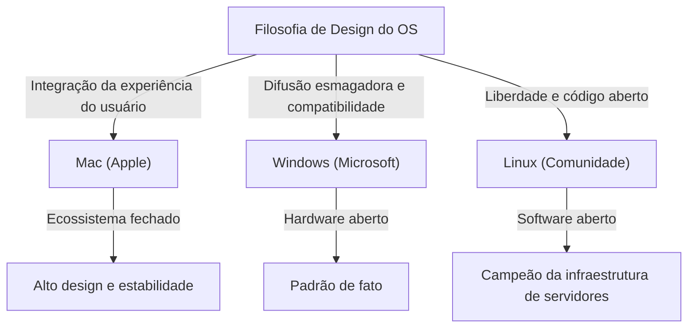
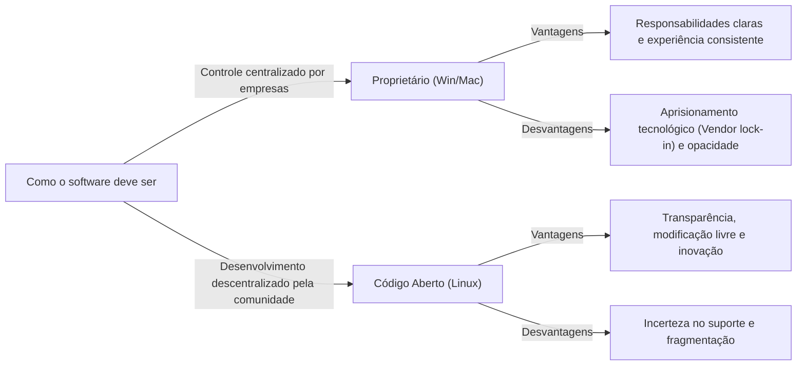

# Introdução: Por que os Sistemas Operacionais se tornaram uma "Religião"?

À medida que os computadores evoluíram de máquinas gigantes para especialistas em dispositivos pessoais que cabem em nossos bolsos, sempre houve a presença de um "Sistema Operacional" (OS). Como a ponte entre o hardware e o software que define o núcleo da experiência do usuário, o sistema operacional transcendeu ser uma mera ferramenta para se tornar um símbolo de identidade e filosofia tecnológica.

Esse fenômeno eventualmente ficou conhecido como as "Guerras Religiosas dos Sistemas Operacionais" (OS Holy Wars). O domínio e pragmatismo esmagadores do Windows, o design elegante e a filosofia centrada no usuário do Mac, e os ideais de liberdade e código aberto do Linux. Estas vão além dos simples méritos funcionais, colocando a questão fundamental de "como devemos interagir com a tecnologia".

Neste artigo, desvendaremos a história dessa luta sem fim, mergulhando fundo em como cada sistema operacional nasceu, evoluiu e influenciou uns aos outros.

## Capítulo 1: O Início do Impasse a Três e Suas Respectivas Filosofias

A história dos sistemas operacionais começou no final dos anos 1970 e na década de 1980, quando os computadores se transformaram em dispositivos pessoais. Cada sistema operacional nasceu com um contexto e filosofia completamente diferentes.

### 1.1 Mac: A Interseção da Tecnologia e da Arte
Em 1984, a Apple anunciou o primeiro Macintosh. A filosofia apresentada por Steve Jobs era "computadores nas mãos de todos". Naquela época, os computadores eram normalmente operados através de linhas de comando complexas, mas o Mac popularizou a Interface Gráfica do Usuário (GUI) e o mouse para o público em geral.

No centro da Apple está o "controle" e a "integração perfeita da experiência do usuário". Ao projetar internamente o hardware e o software de forma consistente, eles fornecem aos usuários uma experiência contínua e intuitiva. Embora isso seja às vezes criticado como "fechado" (closed), ao mesmo tempo cria uma beleza e estabilidade inigualáveis.

### 1.2 Windows: Um PC em Cada Mesa
Enquanto a Apple demonstrava o potencial da GUI, Bill Gates da Microsoft adotou uma abordagem diferente. Sob a visão de "um computador em cada mesa e em cada casa", a Microsoft optou por licenciar seu próprio sistema operacional para fabricantes de hardware.

A filosofia do Windows é "compatibilidade" e "difusão". Eles construíram um ecossistema que poderia rodar em qualquer hardware, permitindo que qualquer desenvolvedor de software criasse aplicativos livremente. Isso permitiu ao Windows ganhar uma participação de mercado esmagadora e se tornar o padrão de fato global, dos negócios aos lares.

### 1.3 Linux: A Cristalização da Liberdade e Cultura Hacker
Nascido em 1991 por Linus Torvalds, um estudante na Finlândia, o Linux emergiu de um contexto totalmente diferente. O Linux, que segue a linhagem do Unix, incorpora a filosofia de "código aberto", onde o código-fonte está disponível para qualquer pessoa modificar e redistribuir livremente.

A filosofia do Linux é "liberdade" e "cocriação pela comunidade". Em vez de ser controlado por uma única empresa, milhares de desenvolvedores em todo o mundo colaboram para construir o sistema. Inicialmente vista como algo para hackers e geeks, essa abordagem eventualmente cobriria o mundo como a infraestrutura de servidores que suporta a internet, supercomputadores e a base do Android.

## Capítulo 2: A História dos Confrontos (Décadas de 1990 - 2000)

Entre os anos 1990 e 2000, a batalha pela participação no mercado de sistemas operacionais foi acirrada. Os eventos desse período tornaram-se pontos de virada cruciais que determinaram o mapa de poder da indústria de tecnologia moderna.

### 2.1 O Impacto do Windows 95 e Seu Domínio Esmagador
Lançado em 1995, o Windows 95 causou um fenômeno social. Com uma GUI completa, recursos de conectividade com a Internet (posteriormente Internet Explorer) e plug-and-play, as bases dos PCs modernos foram estabelecidas aqui. O sucesso do Windows 95 permitiu à Microsoft construir um monopólio absoluto no mercado de PCs.

Em resposta a esse domínio esmagador, a Apple mergulhou temporariamente em uma grave crise financeira. No entanto, com o retorno de Steve Jobs em 1997 e o subsequente sucesso do "iMac", a Apple encenou um renascimento em seu próprio nicho de mercado, que enfatiza design e estilo de vida.

### 2.2 A Guerra dos Navegadores e a Ascensão da Web
O principal campo de batalha da guerra dos sistemas operacionais logo mudou para o espaço da Internet. A primeira guerra de navegadores entre o Netscape e o Internet Explorer redefiniu o valor do sistema operacional como plataforma. A Microsoft ganhou vantagem ao agrupar o IE com o Windows, mas isso também levou a processos judiciais por violação antitruste.

### 2.3 A Revolução Silenciosa no Mercado de Servidores
Enquanto Windows e Mac batalhavam no mercado de desktops, o Linux expandia constantemente sua influência no mundo back-end (servidores) que suporta a Internet. Combinado com software de código aberto como o Apache HTTP Server (a stack LAMP), ele suportou as startups da era da bolha das pontocom como uma infraestrutura barata e altamente confiável.

## Capítulo 3: O Choque de Ideologias (Fechado vs Aberto)

O cerne das guerras religiosas dos sistemas operacionais não é apenas uma comparação de especificações e recursos, mas um conflito de ideias sobre como a tecnologia deve ser.

### 3.1 A Luz e a Sombra do Centrismo no Usuário (Mac)
A abordagem do Mac (e do iOS) é gerenciar o sistema de forma rigorosa para garantir os melhores resultados para os usuários. Interfaces belas, experiência consistente e alta segurança são alcançadas porque a Apple "cerca" seu ecossistema (walled garden). No entanto, isso também significa privar os usuários de um nível profundo de personalização e liberdade.

### 3.2 O Dilema do Campeão da Plataforma (Windows)
Por muito tempo, o Windows colocou grande ênfase na compatibilidade com versões anteriores. O fato de que softwares de 20 anos atrás ainda podem rodar no sistema operacional mais recente é uma força absoluta nos negócios. No entanto, esse enorme acúmulo de código legado tem causado o inchaço do sistema e vulnerabilidades de segurança, além de comprometer a consistência da interface do usuário.

### 3.3 Os Ideais e a Realidade do Código Aberto (Linux)
O Linux e outros softwares de código aberto baseiam-se na ética hacker de que "a informação deve ser livre". Qualquer um pode auditar e modificar o código, ou criar suas próprias distribuições. Há diversas opções, como Ubuntu, Fedora, Arch Linux, etc. No entanto, essa "diversidade" ao mesmo tempo causou "fragmentação" e elevou a barreira de entrada para os usuários em geral.

## Capítulo 4: O Fim da Batalha e o Novo Paradigma (Década de 2010 em diante)

Embora as guerras religiosas dos sistemas operacionais tenham durado muito tempo, seu panorama mudou drasticamente na década de 2010. Com a revolução móvel e a ascensão da nuvem, a própria questão de "qual sistema operacional de desktop você usa" perdeu seu significado.

### 4.1 A Mudança para o Dispositivo Móvel e o Novo Sistema Bipolar
Com o surgimento do iPhone (iOS) e do Android, o centro da computação para as pessoas mudou dos PCs para os smartphones. Ironicamente, o mundo móvel viu uma repetição da história com a abordagem fechada da Apple (iOS) e a abordagem aberta liderada pelo Google (Android baseado em Linux).

### 4.2 A Propagação da Nuvem e das Aplicações Web
Com os aprimoramentos no desempenho dos navegadores e o desenvolvimento da computação em nuvem, muitas tarefas agora podem ser concluídas dentro dos navegadores da web, independentemente do sistema operacional. O Microsoft Office foi substituído pelo Google Workspace, e ferramentas modernas como Slack e Figma operam de forma idêntica em qualquer sistema operacional. Entramos em uma era onde se diz até que "o sistema operacional nada mais é do que um bootloader para rodar um navegador".

### 4.3 A Transformação da Microsoft: "Microsoft ❤️ Linux"
O maior evento que simboliza o fim da guerra dos sistemas operacionais provavelmente seria a transformação da Microsoft. A Microsoft, onde o ex-CEO Steve Ballmer disse uma vez que "o Linux é um câncer", abraçou o código aberto de forma massiva sob a liderança de Satya Nadella. O Windows Subsystem for Linux (WSL) permite que os ambientes Linux rodem diretamente no Windows, e a maioria dos sistemas operacionais rodando na nuvem Azure agora são Linux. A Microsoft é atualmente uma das maiores contribuidoras de código aberto do mundo.

## Capítulo 5: O Papel dos Sistemas Operacionais no Futuro da Computação

Na era moderna, Windows, Mac e Linux não são mais eixos de oposição "religiosa", mas ferramentas de "a pessoa certa no lugar certo", escolhidas com base nos propósitos e preferências.

- **Windows**: Possui um ambiente esmagador de jogos, afinidade com o hardware de VR/AR e versatilidade que continua a suportar o back office corporativo. A introdução do WSL também o transformou em uma plataforma atraente para desenvolvedores.
- **Mac (macOS)**: Com o advento do Apple Silicon (chips M1/M2/M3), a integração entre hardware e software atingiu uma dimensão diferente. Ele alcançou uma eficiência de energia incrível juntamente com o desempenho e obteve apoio irrestrito de criadores e engenheiros.
- **Linux**: Domina o mundo nos bastidores. Continua a suportar a base digital da sociedade moderna na infraestrutura em nuvem, supercomputadores, dispositivos IoT e no núcleo dos smartphones.

### Conclusão: A Diversidade é a Força Motriz da Evolução
As "Guerras Religiosas dos Sistemas Operacionais" frequentemente produziam discussões infrutíferas. No entanto, é precisamente porque sistemas com filosofias diferentes competiram entre si, absorvendo as partes boas, que a tecnologia conseguiu se desenvolver de forma tão rápida.

A bela tipografia e a GUI do Mac influenciaram o Windows, a compatibilidade e o enorme ecossistema do Windows ensinaram à Apple a importância da estratégia de plataforma, e o modelo de código aberto do Linux tornou-se a base para o desenvolvimento de software em todas as gigantes empresas de TI da atualidade.

Independentemente de qual sistema operacional escolhamos, existe a paixão e a filosofia de inúmeros engenheiros respirando por trás dele. Conhecer a história dos sistemas operacionais nada mais é do que entender a evolução de como a humanidade pensa sobre a tecnologia.
